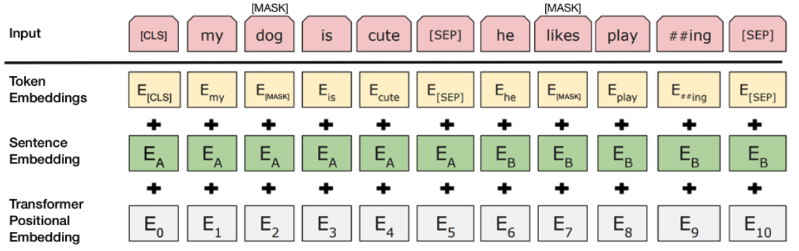
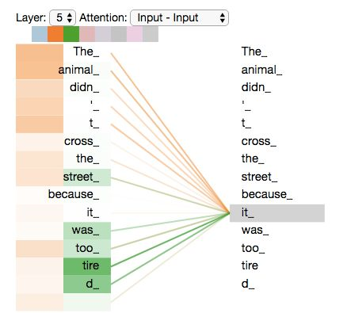
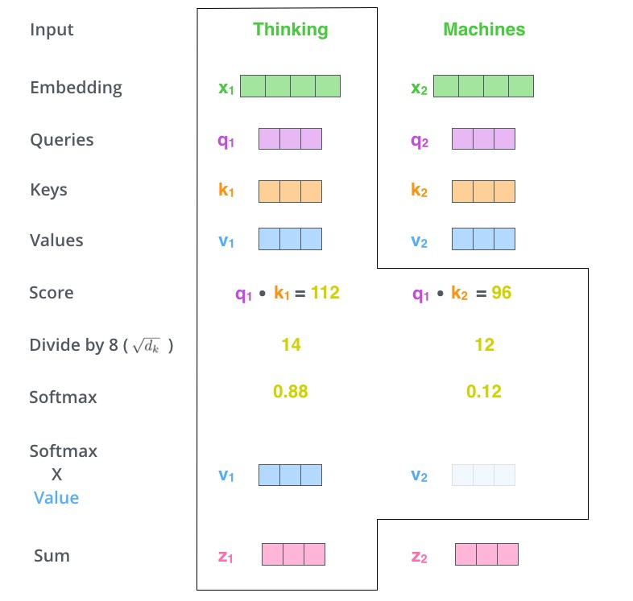

# 自然语言处理应用—BERT

## 实验介绍

本实验主要介绍使用MindSpore开发和训练[BERT](https://arxiv.org/pdf/1810.04805.pdf)模型。本实验使用MindSpore进行BERT模型定义、BERT模型微调训练、模型测试。共包含两个实验，分别为：

- 短文本分类：数据集为：今日头条中文新闻（TNEWS），评价指标为正确率。
- 细粒度命名实体识别：数据集为CLUENER，评价指标为F值和识别结果，实验设定了CRF开关，可以选择是否使用CRF处理后再识别。

### 任务介绍

#### 短文本分类

短文本通常是指长度比较短，一般不超过160个字符的文本形式，如微博、聊天信息、新闻主题、观点评论、问题文本、手机短信、文献摘要等。短文本分类为通过寻找短文本的特征确定其属于哪种类型的文本。本实验通过构建BERT神经网络模型，进行语言理解，寻找文本特征进行分类。文本长度不超过128，共分为15个类别，具体数据集请参照数据集准备。

#### 细粒度命名实体识别

命名实体(named entity)就是人名、机构名、地名以及其他所有以名称为标识的实体。更广泛的实体还包括数字、日期、货币、地址等等。命名实体识别是指在文档集合中识别出特定类型的事物名称或符号的过程。命名实体识别由2个问题组成：

1. 识别出文本中的命名实体。
2. 确定该实体的类型。

对于一个已识别出的命名实体，可能属于多个不同粒度的类别，比如“高加索牧羊犬”可能属于的类别包括“狗”、“犬科动物”、“动物”等。命名实体的上位词（Hypernym）指示了其类别，上述的“狗”、“犬科动物”、“动物”都是“高加索牧羊犬”的上位词。按照上位词范围的不同，分为不同粒度，上面的例子中“狗”属于细粒度，“犬科动物”、“动物”属于粗粒度。

### 预训练模型

现在有很多利用预训练的语言表征来完成下游NLP任务的研究。BERT模型就是一种预训练模型。预训练模型的应用通常分为两步：

1. 在计算性能满足的情况下用某个较大的数据集训练出一个较好的模型；
2. 根据不同的任务，改造预训练模型，用新任务的数据集在预训练模型上进行微调。

**注意：** 预训练模型是为了构建语言模型，进行语言理解，找语言特征。并不针对具体的任务。利用预训练模型完成下游NLP任务（具体的任务，例如前面提到的短文本分类、细粒度命名实体识别等）本质是利用其提取到的语言特征进行模型改造（预训练模型基础上添加层）使其适应特定的任务。

预训练模型的好处是训练代价较小，配合下游任务可以实现更快的收敛速度，并且能够有效地提高模型性能，尤其是对一些训练数据比较稀缺的任务。换句话说，预训练方法可以认为是让模型基于一个更好的初始状态进行学习，从而能够达到更好的性能。

目前有两种预训练语言模型用于下游任务的方法：feature-based（ELMo）和fine-tuning（BERT）。Feature-based一般指使用预训练语言模型训练出的词向量作为特征，输入到下游目标任务中。Fine-tuning方式是指在已经训练好的语言模型的基础上，加入少量的task-specific parameters，然后在新的语料上重新训练来进行微调。

### BERT原理

[BERT](https://github.com/google-research/bert)在11个NLP任务中刷新了成绩，效果惊人。BERT的全称是Bidirectional Encoder Representation from Transformers，即基于Transformer的双向编码表征。其贡献主要有：

- Transformer是一种注意力（Attention）机制，用来学习文本中单词上下文之间的关系。（参考实验步骤Transformer）
- 双向是指通过Masked Language Model（MLM）方法，随机的掩盖掉句子中的某些单词，然后利用前后未掩盖的信息来预测掩盖的单词。（参考实验步骤MLM）
- 针对句子预测任务Next Sentence Prediction (NSP)，为训练一个可以理解句子间关系的模型，BERT针对下一个句子预测（二分类）任务进行了预训练。

使用BERT有2个步骤：pre-training 和 fine-tuning。在预训练期间，BERT模型在不同任务的未标记数据上进行训练。微调的时候，BERT模型用预训练好的参数进行初始化，并且是基于下游任务的有标签的数据来训练的。尽管最初的时候都是用的预训练好的BERT模型参数，每个下游任务有自己的微调模型。BERT的pre-training和fine-tuning运行过程，除了output层、Dense层，这两个阶段的架构是一样的。预训练模型的参数会做为不同下游任务的模型的初始化参数。在fine-tuning时，所有参数参与微调。

BERT的一个与众不同的特性是它的跨任务的统一架构，即在预训练架构和下游的架构之间的差异最小。

BERT有两种，分别为：BERT BASE和BERT LARGE。两种BERT模型都包含了多层encoder结构（论文中称其为transformer blocks），其中base版本：L=12, H=768, A=12，large版本：L=24, H=1024, A=16（L表示层数，H表示每个隐层的维数大小，A表示self-attention头数）。本实验采用base版本。

### 评价指标

文本分类、命名实体识别中常用的性能评估指标有：正确率（Precision）、查全率（Recall)和F值（F-measure），设a-实际和预测都为A，预测正确；b-实际非A预测为A，预测错误；c-实际是A预测非A，预测错误。

- 正确率（Precision）  $Precision＝\frac{a}{a+b}$
正确率是所有判断的文本中与人工分类结果吻合的文本所占的比率，p描述了分类结果中的准确程度，即分类结果中有多少是正确的。
- 召回率（Recall） $Recall＝\frac{a}{a+c}$ 
召回率又称查全率，是人工分类结果应有的文本中与分类系统吻合的文本所占的比率，r描述了正确分类的能力，即已知的文本中，有多少被正确分类。
- F值（F-measure）
对于一次测试，准确率和召回率一般是成反比的。一般而言，准确率会随着查全率的升高而降低，多数情况下需要将两者综合考虑，得到一种新的平均指标—F测试值。计算为：$F＝\frac{Precision * Recall}{Precision + Recall}$ 
F值越大，表示分类器的性能越好，文本分类的效果越理想。

本文采用正确率来评估文本分类结果。采用正确率、召回率、F值来评估命名实体识别结果。

## 实验目的

- 掌握BERT模型的基本结构和编程方法。
- 掌握使用BERT模型进行短文本分类、细粒度命名实体识别的方法和流程。
- 了解如何使用MindSpore加载常用的NLP数据集。
- 了解MindSpore的model_zoo模块，以及如何使用model_zoo中的模型。

## 预备知识

- 熟练使用Python，了解Shell及Linux操作系统基本知识。
- 具备一定的深度学习和机器学习理论知识，如CRF、Embedding、Encoder、Decoder、损失函数、优化器，训练策略、Checkpoint等。
- 了解华为云的基本使用方法，包括[OBS（对象存储）](https://www.huaweicloud.com/product/obs.html)、[ModelArts（AI开发平台）](https://www.huaweicloud.com/product/modelarts.html)、[训练作业](https://support.huaweicloud.com/engineers-modelarts/modelarts_23_0238.html)等功能。华为云官网：https://www.huaweicloud.com
- 了解并熟悉MindSpore AI计算框架，MindSpore官网：https://www.mindspore.cn

## 实验环境

- MindSpore 1.0.0（MindSpore版本会定期更新，本指导也会定期刷新，与版本配套）；
- 华为云ModelArts（控制台左上角选择“华北-北京四”）：ModelArts是华为云提供的面向开发者的一站式AI开发平台，集成了昇腾AI处理器资源池，用户可以在该平台下体验MindSpore。

## 实验准备

### 数据集准备

从[**中文语言理解基准测评(CLUE)**](https://www.cluebenchmarks.com/introduce.html)了解各种自然语言处理任务及其原始数据集。从华为云OBS中下载[预处理完的数据集](https://share-course.obs.cn-north-4.myhuaweicloud.com/dataset/bert_data.zip)，包括TNEWS数据集和CLUENER数据集。

其中，dev.json文件为原始文件，测试时需要。label2id.json为标签编码文件，vocab.txt为词表，这两个文件为dev.json文件编码提供映射。

**注意：** 文本数据集预处理过程较为繁琐、耗时，可以参考BERT官方仓库中的数据集处理脚本。本实验采用预处理完的数据集，可以直接使用。

#### TNEWS数据集

今日头条中文新闻（短文本）分类（Short Text Classificaiton for News）数据集。该数据集来自今日头条的新闻版块，共提取了15个类别的新闻，包括旅游，教育，金融，军事等。数据量：训练集(53,360)，验证集(10,000)，测试集(10,000)。例子如下所示。

```
{"label": "102", "label_des": "news_entertainment", "sentence": "江疏影甜甜圈自拍，迷之角度竟这么好看，美吸引一切事物"}
```

每一条数据有三个属性，从前往后分别是分类ID，分类名称，新闻字符串。十五个类别分别为："news_story"、 "news_culture"、 "news_entertainment"、"news_sports"、"news_finance"、"news_house"、 "news_car"、 "news_edu"、 "news_tech"、 "news_military"、 "news_travel"、 "news_world"、 "news_stock"、 "news_agriculture"、 "news_game"。

#### CLUENER数据集

本数据是在清华大学开源的文本分类数据集THUCTC基础上，选出部分数据进行细粒度命名实体标注，原数据来源于Sina News RSS。

其中训练集：10748 ，验证集：1343。数据分为10个标签类别，分别为: 地址（address），书名（book），公司（company），游戏（game），政府（goverment），电影（movie），姓名（name），组织机构（organization），职位（position），景点（scene）。

按照不同标签类别统计，数据集中命名实体类别分布如下（注：一条数据中出现的所有实体都进行标注，例如一条数据出现两个地址（address）实体，那么统计地址（address）类别数据的时候，算两条数据）。

【训练集】标签数据分布如下：

    地址（address）:2829
    书名（book）:1131
    公司（company）:2897
    游戏（game）:2325
    政府（government）:1797
    电影（movie）:1109
    姓名（name）:3661
    组织机构（organization）:3075
    职位（position）:3052
    景点（scene）:1462

【验证集】标签数据分布如下：

    地址（address）:364
    书名（book）:152
    公司（company）:366
    游戏（game）:287
    政府（government）:244
    电影（movie）:150
    姓名（name）:451
    组织机构（organization）:344
    职位（position）:425
    景点（scene）:199

数据分为两列：text & label，其中text列代表文本，label列代表文本中出现的所有包含在10个类别中的实体。例子如下所示。

```
{"text": "浙商银行企业信贷部叶老桂博士则从另一个角度对五道门槛进行了解读。叶老桂认为，对目前国内商业银行而言，", "label": {"name": {"叶老桂": [[9, 11]]}, "company": {"浙商银行": [[0, 3]]}}}
{"text": "5年前的CPL天机杯DotA挑战赛可谓是国内第一个具有广泛影响的线下DotA赛事。", "label": {"game": {"DotA": [[10, 13], [34, 37]]}, "organization": {"CPL天机杯": [[4, 9]]}}}
{"text": "目前，除农行已经公布细则之外，工、中、建、交等银行均未公布细则。", "label": {"company": {"农行": [[4, 5]], "工": [[15, 15]], "中": [[17, 17]], "建": [[19, 19]], "交": [[21, 21]]}}}
```

解析如下表所示：

例子|实体|实体类型|位置|Single_index|Begin_index|middle_index|End_index
:--:|:--:|:--:|:--:|:--:|:--:|:--:|:--
"name": {"叶老桂": [[9, 11]]}|叶老桂|name|[9,11]||9|10|11
"company": {"浙商银行": [[0, 3]]}|浙商银行|company|[0,3]||0|1,2|3
"game": {"DotA": [[10, 13], [34, 37]]}|DotA|game|[10, 13], [34, 37]||10/34|11,12/35,36|13/37
"company": {"工": [[15, 15]]，...}|工|company|[15, 15]|15|||

Bert实验数据预处理将数据中的每个字进行了标注，用标注好的数据进行训练。标注方式如下表所示。仍然以上面的例子为例，(text1,15)等代表字的位置，例如(text1,15)表示上面第一个text的第15个字（从0开始）。

字类型|标注|例子
:--:|:--:|:--:
非实体字|O|从(text1,15)：O
实体单字|S_实体类型|工(text3,15)：S_company
实体多字开头|B_实体类型|叶（text1,9）:B_name
实体多字中间|M_实体类型|商（text1,1）：M_company
实体多字结束|E_实体类型|A(text2,13)：E_game
句子开始|`<START>`|
句子结束|`<STOP>`|

为了容易表达，我们对标注进行了编号（0-42），其编号参考`bert/code/src/finetune_config.py`中的tag_to_index。

例如，句子`目前，除农行已经公布细则之外，工、中、建、交等银行均未公布细则。`标注结果如下：

字/input|`<START>`|目|前|，|除|农|行|已|经|公|布|细|则|之|外|，|工|、|中|、|建|、|交|等|银|行|均|未|公|布|细|则|。|`<STOP>`
:--:|:--:|:--:|:--:|:--:|:--:|:--:|:--:|:--:|:--:|:--:|:--:|:--:|:--:|:--:|:--:|:--:|:--:|:--:|:--:|:--:|:--:|:--:|:--:|:--:|:--:|:--:|:--:|:--:|:--:|:--:|:--:|:--:|:--:|:--:
标记|`<START>`|O|O|O|O|B_company|E_company|O|O|O|O|O|O|O|O|O|S_company|O|S_company|O|B_company|O|S_company|O|O|O|O|O|O|O|O|O|O|`<STOP>`
编号/label_ids|无crf:0 crf:41|0|0|0|0|10|12|0|0|0|0|0|0|0|0|0|9|0|9|0|9|0|9|0|0|0|0|0|0|0|0|0|0|无crf:0 crf:42

无crf模型：标注编号（0-40）（编号和标记对应查看/clue_ner/label2id.json），进行命名实体识别`num_labels`=41
有crf模型：标注编号（0-42）（编号和标记对应参考/clue_ner/label2id.json），进行命名实体识别`num_labels`=43

### 输入文件说明

输入文件说明：

- train.tf_record：训练数据集
- dev.tf_record：测试数据集
- schema.json：参与训练/测试的数据配置文件
- label2id.json：标签以及标签编号
- vocab.txt：中文词表
- dev.json：原始测试文件，需要使用label2id.json、vocab.txt文件解析。

### 预训练模型准备

从MindSpore Hub中下载[1.0.0版本的预训练模型](https://download.mindspore.cn/model_zoo/official/nlp/bert/bert_base_ascend_0.5.0_cn-wiki_official_nlp_20200720/bert_base.ckpt)到目录：`bert/pre_model/[pretrain_checkpoint_file]` 

### 脚本准备

从[课程gitee仓库](https://gitee.com/mindspore/course)上下载本实验相关脚本。

将脚本和数据集组织为如下形式：

```
bert
└── data
│   ├── clue_ner
│   |   ├── dev.json
│   |   ├── dev.tf_record
│   |   ├── label2id.json
│   |   ├── schema.json
│   |   └── train.tf_record
│   ├── tnews
|   |   ├── dev.json
|   |   ├── dev.tf_record
│   |   ├── label2id.json
|   |   ├── schema.json
|   |   └── train.tf_record
│   └──vocab.txt
├── code
│   └── 脚本等文件
└── pre_model
        └── bert_base.ckpt
```

### 创建OBS桶

使用ModelArts训练作业/Notebook时，需要使用华为云OBS存储实验脚本和数据集，可以参考[快速通过OBS控制台上传下载文件](https://support.huaweicloud.com/qs-obs/obs_qs_0001.html)了解使用OBS创建桶、上传文件、下载文件的使用方法（下文给出了操作步骤）。

> **提示：** 华为云新用户使用OBS时通常需要创建和配置“访问密钥”，可以在使用OBS时根据提示完成创建和配置。也可以参考[获取访问密钥并完成ModelArts全局配置](https://support.huaweicloud.com/prepare-modelarts/modelarts_08_0002.html)获取并配置访问密钥。

打开[OBS控制台](https://storage.huaweicloud.com/obs/?region=cn-north-4&locale=zh-cn#/obs/manager/buckets)，点击右上角的“创建桶”按钮进入桶配置页面，创建OBS桶的参考配置如下：

- 区域：华北-北京四
- 数据冗余存储策略：单AZ存储
- 桶名称：全局唯一的字符串
- 存储类别：标准存储
- 桶策略：公共读
- 归档数据直读：关闭
- 企业项目、标签等配置：免

### 上传文件

点击新建的OBS桶名，再打开“对象”标签页，通过“上传对象”、“新建文件夹”等功能，将脚本和数据集上传到OBS桶中。上传文件后，查看页面底部的“任务管理”状态栏（正在运行、已完成、失败），确保文件均上传完成。若失败请：

- 参考[上传对象大小限制/切换上传方式](https://support.huaweicloud.com/qs-obs/obs_qs_0008.html)；
- 参考[上传对象失败常见原因](https://support.huaweicloud.com/obs_faq/obs_faq_0134.html)；
- 若无法解决请[新建工单](https://console.huaweicloud.com/ticket/?region=cn-north-4&locale=zh-cn#/ticketindex/createIndex)，产品类为“对象存储服务”，问题类型为“桶和对象相关”，会有技术人员协助解决。

## 实验步骤

推荐使用ModelArts训练作业进行实验，适合大规模并发使用。若使用ModelArts Notebook，请参考[LeNet5](../lenet5)及[Checkpoint](../checkpoint)实验案例，了解Notebook的使用方法和注意事项。

可以通过修改配置文件完成以下实验：

- 短文本分类微调训练
- 短文本分类测试，测试指标正确率
- 短文本分类测试，测试指标分类结果
- 细粒度命名实体识别无CRF微调训练
- 细粒度命名实体识别无CRF测试，测试指标F值
- 细粒度命名实体识别无CRF测试，测试指标识别结果
- 细粒度命名实体识别有CRF微调训练
- 细粒度命名实体识别有CRF测试，测试指标F值
- 细粒度命名实体识别有CRF测试，测试指标识别结果

### 代码梳理

代码文件说明：

- main.py：微调训练和验证推理代码入口脚本；
- config.py：配置文件；
- bert_model.py：bert预训练模型脚本；
- bert_for_finetune.py:  下游任务微调模型脚本；
- fused_layer_norm.py：归一化文件，bert模型中使用；
- CRF.py：在命名实体识别实验中，可以使用CRF对结果进行序列标注；
- util.py：构建网络（微调网络）必要的工具类；
- cluener_evaluation.py：进行输出分类结果/识别结果实验时，读取dev.json文件代码；

#### bert_model.py代码梳理

`bert_model.py`中`BertModel`接收数据输入，经过`EmbeddingLookup`, `EmbeddingPostprocessor`, `CreateAttentionMaskFromInputMask`和`BertTransformer`计算后得到输出（用于下游任务）。

首先，模型需要对输入的数据进行一个embedding操作，enmbedding结束之后，输入到encoder层，self-attention处理完数据后把数据送给前馈神经网络，得到的输出会输入到下一个encoder。

bert模型代码结果如下所示，可参考 bert_model.py。

```
Class BertModel                             # Bert模型
- Class EmbeddingLookup                     # 对词进行Embedding编码
- Class EmbeddingPostprocessor              # 对句子和位置进行Embedding编码
- Class CreateAttentionMaskFromInputMask    # 创建mask
- Class BertTransformer                     # Transformer模块
    - Class BertEncoderCell                 # Encoder模块
           - Class BertSelfAttention        # 自注意力机制SelfAttention
                - Class BertAttention       # 注意力机制
                - Class BertOutput          # 残差连接
           - nn.Dense        # 注意力机制SelfAttention
           - Class BertOutput          # 残差连接
    - 共循环12次Encoder模块[Class BertEncoderCell]
```

##### Embedding

bert的输入部分是个线性序列，两个句子通过3个分隔符分割。其中[CLS]时一个特别设置的符号，添加在每个输入样本的前面，表示这是一个输入样本的开始，[SEP]是特别设置的一个分隔标记。每个单词有三个embedding：

- 位置信息embedding，这是因为NLP中单词顺序是很重要的特征，需要在这里对位置信息进行编码；
- 单词embedding（token）；
- 句子embedding，因为前面提到训练数据都是由两个句子构成的，那么每个句子有个句子整体的embedding项对应给每个单词。

把单词对应的三个embedding叠加，就形成了Bert的输入。Embedding如下图所示：



[1] 图片来源于https://arxiv.org/pdf/1810.04805.pdf

`EmbeddingLookup`和`EmbeddingPostprocessor`用于将输入转换成Embedding张量。其中`EmbeddingLookup`获取单词embedding；`EmbeddingPostprocessor`获取句子embedding和位置信息embedding。

##### Mask 语言模型（MLM）

BERT模型的MLM请参考`bert_model.py`中的`CreateAttentionMaskFromInputMask`类.

为了训练深度双向表征，BERT随机mask一定百分比的输入tokens，然后预测那些被mask掉的tokens（这一步称为Mask LM）。本实验每个序列随机mask掉15%的token。BERT只预测被mask掉的词，而不是重建完整的输入。

##### Transformer

BERT模型的Transformer请参考`bert_model.py`中的`BertTransformer`类。

标准的Transformer模型采用了 encoer-decoder 架构。BERT将多个transformer编码器（encoder）堆叠在一起。每一个encoder由一个Self-Attention模块（参考Self-Attention）和一个全连接层组成。

**Self-Attention**

BERT模型的Self-Attention请参考`bert_model.py`中的`BertSelfAttention`类。
BERT模型的Attention请参考`bert_model.py`中的`BertAttention`类。

self-attention，思想和attention类似，但是self-attention是Transformer用来将其他相关单词的“理解”转换成我们正常理解的单词的一种思路，能帮助当前节点不仅仅只关注当前的词，从而能获取到上下文的语义。我们看个例子：
The animal didn't cross the street because it was too tired
这里的it到底代表的是animal还是street呢，对于我们来说能很简单的判断出来，但是对于机器来说，是很难判断的，self-attention就能够让机器把it和animal联系起来。



[2]图片来源https://blog.csdn.net/longxinchen_ml/article/details/86533005

当我们编码“it”一词时，一个注意力头集中在“animal”上，而另一个则集中在“tired”上，从某种意义上说，模型对“it”一词的表达在某种程度上是“animal”和“tired”的代表。

self-attention详细的处理过程如下所示：（详细代码参考`bert_model.py`中的`BertAttention`类。）

1. 首先，self-attention会计算出三个新的向量：Query、Key、Value，这三个向量是用embedding向量与一个矩阵P相乘得到的结果，这个矩阵P是随机初始化的，其值在BP的过程中会一直进行更新。（矩阵P的维度=隐含层数/attention头数=768/12=64）
2. 计算self-attention的分数值，该分数值决定了当我们在某个位置encode一个词时，对输入句子的其他部分的关注程度。这个分数值的计算方法是Query与Key做点乘，以下图为例，首先我们需要针对Thinking这个词，计算出其他词对于该词的一个分数值，首先是针对于自己本身即q1·k1，然后是针对于第二个词即q1·k2。
3. 接下来，把点成的结果除以一个常数，本实验除以8，这个值一般是采用上文提到的矩阵P的第一个维度的开方即64的开方8，当然也可以选择其他的值，然后把得到的结果做一个softmax的计算。得到的结果即是每个词对于当前位置的词的相关性大小，当然，当前位置的词与自身的相关性会很大。
4. 下一步就是把Value和softmax得到的值进行相乘，并相加，得到的结果即是self-attetion在当前节点的值。

**注意：** 上面所有的计算过程都是分成多头来计算的。本例中的self-attention输入输出如下表所示。

名称|维度
:--:|:--:
输入矩阵:embedding向量|[batch_size,seq_length,hidden_size] (16,128,768)
矩阵P(单头)|[batch_size,seq_length,hidden_size/num_attention_heads] (16,768,64)
Query（单头）|[batch_size,seq_length,hidden_size/num_attention_heads] (16,128,64)
Key（单头）|[batch_size,seq_length,hidden_size/num_attention_heads] (16,128,64)
Value（单头）|[batch_size,seq_length,hidden_size/num_attention_heads] (16,128,64)
Source（单头）|[batch_size,seq_length,hidden_size/num_attention_heads] (16,128,64)
输出矩阵(单头)|[batch_size,seq_length,hidden_size/num_attention_heads] (16,128,64）
输出矩阵(多头合并)|[batch_size,seq_length,hidden_size]  (16,128,768）

计算公式如下所示：

$$ Query = INPUT_{embedding} \cdot P_1 $$
$$ Key = INPUT_{embedding} \cdot P_2 $$
$$ Value = INPUT_{embedding} \cdot P_3 $$
$$ OUT = softmax(\frac{Query \cdot Key^T}{\sqrt{\frac{HiddenSize}{NumAttentionHeads}}}) * Value $$



[3]图片来源https://zhuanlan.zhihu.com/p/47282410

#### bert_for_finetune.py代码梳理

bert_for_finetune.py文件提供了下游任务构建网络类。类介绍如下。（参考bert/src/bert_for_finetune.py）

```
- class BertCLS                      # 下游子任务分类网络带损失
    - class BertCLSModel             # 分类网络无损失
        - class BertModel            # BERT网络
        - nn.Dropout                 # 针对下游任务，添加Dropout层
        - nn.Dense                   # 针对下游任务，添加Dense层
        - P.LogSoftmax               # 针对下游任务，添加LogSoftmax层
    - class CrossEntropyCalculation  # 损失函数 

- class BertNER                      # 下游子任务命名实体识别带损失
    - class BertNERModel             # 命名实体识别无损失
        - class BertModel            # BERT网络
        - nn.Dropout                 # 针对下游任务，添加Dropout层
        - nn.Dense                   # 针对下游任务，添加Dense层
        - None or P.LogSoftmax       # 针对下游任务，添加LogSoftmax层，如果使用CRF则不需要LogSoftmax层
    - class CRF or class CrossEntropyCalculation     # 损失函数，如果使用CRF则使用CRF计算得到的分数为loss

- class BertFinetuneCell             # 将优化器封装的网络，得到带损失函数、优化器的网络。
```

命名实体识别是序列标注问题，序列标注问题可以使用CRF以得到全局最优结果。单纯的神经网络训练得到结果为局部最优。

#### 其他文件代码梳理

##### 数据处理

参考main.py中的get_dataset函数，输入数据包含四个字段，字段说明如下所示：

名称|说明|维度
:--:|:--:|:--:
input_ids|输入数据|[batch_size, seq_length] (16, 128)
label_ids|输入标签|[batch_size, seq_length] (16, 128)
segment_ids|输入句子id|[batch_size, seq_length] (16, 128)
input_mask|输入mask|[batch_size, seq_length] (16, 128)

##### 训练数据样例分析

命名实体识别实验训练数据样例：

输入text：`得经验升级，拿一把钓竿，在《梦幻红楼Flash》中站着也能升级！`

input_ids样例

input_ids长度为seq_length，代表一个句子，非0值部分为句子，0值为补齐。非0值部分是对句子中的字进行编号。其中第一个非0值为句子开头标记编号，最后一个非0值为句子结束标记编号。

原始句子可通过查寻vocab.txt得到。查表方法：编号和词表vocab.txt的行对应，编号从0开始。例如数字101，对应vocab.txt文件102行的`[CLS]`，数字2533对应vocab.txt文件2534行的`得`，数字8013对应vocab.txt文件8014行的`！`，数字102对应vocab.txt文件103行的`[SEP]`。

```
[101 2533 5307 7741 1285 5277 8024 2897 671 2828 7157 5004 8024 1762 517 3457 2404 5273 3517 148 154 143 161 150 518 704 4991 4708 738 5543 1285 5277 8013  102 0 0 0 0 0 0 0 0 0 0 0 0 0 0 0 0 0 0 0 0 0 0 0 0 0 0 0 0 0 0 0 0 0 0 0 0 0 0 0 0 0 0 0 0 0 0 0 0 0 0 0 0 0 0 0 0 0 0 0 0 0 0 0 0 0 0 0 0 0 0 0 0 0 0 0 0 0 0 0 0 0 0 0 0 0 0 0 0 0 0 0 0 0 0]
```

label_ids样例

label_ids长度为seq_length，代表一个句子的标签，非0值部分为实体，0值为非实体。有数字部分[14 15 15 15 15 15 15 15 15 15 16]代表一个11个字组成的game实体。实体类型可通过查询config.py中tag_to_index或data/clue_ner/label2id.json文件。

```
[0 0 0 0 0 0 0 0 0 0 0 0 0 0 14 15 15 15 15 15 15 15 15 15 16 0 0 0 0 0 0 0 0 0 0 0 0 0 0 0 0 0 0 0 0 0 0 0 0 0 0 0 0 0 0 0 0 0 0 0 0 0 0 0 0 0 0 0 0 0 0 0 0 0 0 0 0 0 0 0 0 0 0 0 0 0 0 0 0 0 0 0 0 0 0 0 0 0 0 0 0 0 0 0 0 0 0 0 0 0 0 0 0 0 0 0 0 0 0 0 0 0 0 0 0 0 0 0]
```

segment_ids样例

segment_ids长度为seq_length，代表一个sample的标签，用不同数字代码不同的句子，对于命名实体识别实验，输入为一个句子，所以全为0。对于句子预测句子实验才会出现非0值。

```
[0 0 0 0 0 0 0 0 0 0 0 0 0 0 0 0 0 0 0 0 0 0 0 0 0 0 0 0 0 0 0 0 0 0 0 0 0 0 0 0 0 0 0 0 0 0 0 0 0 0 0 0 0 0 0 0 0 0 0 0 0 0 0 0 0 0 0 0 0 0 0 0 0 0 0 0 0 0 0 0 0 0 0 0 0 0 0 0 0 0 0 0 0 0 0 0 0 0 0 0 0 0 0 0 0 0 0 0 0 0 0 0 0 0 0 0 0 0 0 0 0 0 0 0 0 0 0 0]
```

input_mask样例

input_mask长度为seq_length，代表一个句子的mask，0值部分为非句子部分，1值为实际句子。1值个数和input_ids的非0值个数相同。

```
[1 1 1 1 1 1 1 1 1 1 1 1 1 1 1 1 1 1 1 1 1 1 1 1 1 1 1 1 1 1 1 1 1 1 0 0 0 0 0 0 0 0 0 0 0 0 0 0 0 0 0 0 0 0 0 0 0 0 0 0 0 0 0 0 0 0 0 0 0 0 0 0 0 0 0 0 0 0 0 0 0 0 0 0 0 0 0 0 0 0 0 0 0 0 0 0 0 0 0 0 0 0 0 0 0 0 0 0 0 0 0 0 0 0 0 0 0 0 0 0 0 0 0 0 0 0 0 0]
```

短文本分类实验训练数据样例：

短文本分类训练数据也包含四个字段，其中input_ids、segment_ids、input_mask字段格式与命名实体相同。

label_ids样例

label_ids长度为1，代表一个文本的类别，0-14共15类。查询data/tnews/label2id.json文件得到编号13对应news_agriculture类型。

[13]

### 参数设定

config.py / cfg

```python
cfg = edict({
    'is_train':True,
    'task': 'Classification',         # 'Classification','NER'
    'num_labels': 15,                  # 15   41 
    'schema_file': r'./data/tnews/schema.json',   # {r'./data/{task_file}/schema.json',None} task_file{tnews,clue_ner}
    'ckpt_prefix': 'bert-Classification',      # 'bert-classification' 'bert-ner' 'bert-ner-crf'  
    'data_file': r'./data/tnews/train.tf_record',    # { r'./data/{task_file}/train.tf_record', r'./data/{task_file}/dev.tf_record', r'./data/{task_file}/dev.json'}   task_file{tnews,clue_ner}
    
    'use_crf': True,         # only NER task is used
    'assessment_method': 'Accuracy',      # only Classification task is used   choices=["Mcc", "Spearman_correlation", "Accuracy", "F1"]
    
    'epoch_num': 5,
    'batch_size': 16,
    'ckpt_dir': 'model_finetune',
    'pre_training_ckpt': './ckpt/bert_base.ckpt',
    
    'finetune_ckpt': './ckpt/bert-Classification-5_3335.ckpt',    # bert-ner-crf-5_671.ckpt  bert-ner-5_671.ckpt   bert-classification-5_3335.ckpt
    'label2id_file': './data/tnews/label2id.json',         # './data/{task_file}/label2id.json' task_file{tnews,clue_ner}
    'vocab_file': './data/vocab.txt',
    'eval_out_file': 'Classification_result.txt',    #tnews_result.txt ner_result.txt  ner_crf_result.txt
    'optimizer': 'Lamb'
})
```

>**说明：** 
>
>1. 微调训练时参数is_train为True，当测试时参数is_train为False。
>2. 参数use_crf仅对于命名实体识别任务有效。对于短文本分类不起作用。
>3. 参数assessment_method仅对于短文本分类有效，对命名实体识别无效。
>4. 细粒度命名实体识别实验，验证时，use_crf值必须与输入模型finetune_ckpt训练时的参数一致。即，模型训练使用crf，则测试use_crf为True；模型训练不使用crf，则测试use_crf为False。
>5. 如果不需要全部数据参与训练/测试，则需要修改schema.json文件的`numRows`值。

`schema_file` 文件时控制输入样本个数的。为.json格式，如下所示。其中input_ids、segment_ids、input_mask、label_ids代表四个输入字段。type、rank、shape代表各个字段的类型、开始rank、数据维度。

对于命名实体识别四个字段的shape都是[128]。对于短文本分类，input_ids、segment_ids、input_mask的shape为[128] ，label_ids的shape为[1]。

修改`numRows`的值可以控制输入输入样本数。下面展示了短文本分类实验，当训练/测试数据集为100时的schema.json文件。

```
{
    "datasetType": "TF",
    "numRows": 100,
    "columns": {
        "input_ids": {
	    "type": "int64",
	    "rank": 1,
	    "shape": [128]
	},
	"input_mask": {
            "type": "int64",
            "rank": 1,
            "shape": [128]
        },
	"segment_ids": {
            "type": "int64",
            "rank": 1,
            "shape": [128]
        },
	"label_ids": {
            "type": "int64",
            "rank": 1,
            "shape": [1]
        }
    }
}
```

### 适配训练作业

创建训练作业时，运行参数会通过脚本传参的方式输入给脚本代码，脚本必须解析传参才能在代码中使用相应参数。如data_url和train_url，分别对应数据存储路径(OBS路径)和训练输出路径(OBS路径)。脚本对传参进行解析后赋值到args变量里，在后续代码里可以使用。

```python
parser = argparse.ArgumentParser(description='Bert finetune')
parser.add_argument('--device_target', type=str, default='Ascend', help='Device target')
parser.add_argument('--data_url', required=True, default=None, help='Location of data.')   
parser.add_argument('--ckpt_url', required=True, default=None, help='Location of data.') 
parser.add_argument('--train_url', required=True, default=None, help='Location of training outputs.')
args_opt = parser.parse_args()
```

MindSpore暂时没有提供直接访问OBS数据的接口，需要通过ModelArts自带的moxing框架与OBS交互。将OBS桶中的数据拷贝至执行容器中，供MindSpore使用：

```python
import moxing as mox
# src_url形如's3://OBS/PATH'，为OBS桶中数据集的路径，dst_url为执行容器中的路径
mox.file.copy_parallel(src_url=args_opt.data_url, dst_url='./data/')
mox.file.copy_parallel(src_url=args_opt.ckpt_url, dst_url='./ckpt/')
```

如需将训练输出（如模型Checkpoint）从执行容器拷贝至OBS，请参考：

```python
# src_url形如's3://OBS/PATH'，为OBS桶中数据集的路径，dst_url为执行容器中的路径
import moxing as mox
# src_url为执行容器中的路径，dst_url形如's3://OBS/PATH'，目录若不存在则会新建
mox.file.copy_parallel(src_url=cfg.ckpt_dir, dst_url=args_opt.train_url)
```

### 创建训练作业

可以参考[使用常用框架训练模型](https://support.huaweicloud.com/engineers-modelarts/modelarts_23_0238.html)来创建并启动训练作业（下文给出了操作步骤）。

打开[ModelArts控制台-训练管理-训练作业](https://console.huaweicloud.com/modelarts/?region=cn-north-4#/trainingJobs)，点击“创建”按钮进入训练作业配置页面，创建训练作业的参考配置：

- 算法来源：常用框架->Ascend-Powered-Engine->MindSpore；
- 代码目录：选择上述新建的OBS桶中的bert/code目录；
- 启动文件：选择上述新建的OBS桶中的bert/code目录下的`main.py`；
- 数据来源：数据存储位置->选择上述新建的OBS桶中的bert目录下的data目录；
- 训练输出位置：选择上述新建的OBS桶中的bert目录并在其中创建model_finetune目录（微调）或eval_out目录（测试）；
- 添加运行参数ckpt_url，微调训练设值为`s3://{user-obs}/bert/pre_model`，测试推理设值为`s3://{user-obs}/bert/model_finetune`。
- 作业日志路径：同训练输出位置；
- 规格：Ascend:1*Ascend 910；
- 其他均为默认；

启动并查看训练过程：

1. 点击提交以开始训练；
2. 在训练作业列表里可以看到刚创建的训练作业，在训练作业页面可以看到版本管理；
3. 点击运行中的训练作业，在展开的窗口中可以查看作业配置信息，以及训练过程中的日志，日志会不断刷新，等训练作业完成后也可以下载日志到本地进行查看；
4. 参考上述代码梳理，在日志中找到对应的打印信息，检查实验是否成功；
5. 日志无错误并输出结果，即运行成功。

**注意：** 不同的任务配套的参考前面提到的参数设定修改config.py / cfg 

## 实验结果

按照实验步骤，修改`config.py`文件，分别完成以下实验。

- 短文本分类微调训练
- 短文本分类测试，测试指标正确率
- 短文本分类测试，测试指标分类结果
- 细粒度命名实体识别无CRF微调训练
- 细粒度命名实体识别无CRF测试，测试指标F值
- 细粒度命名实体识别无CRF测试，测试指标识别结果
- 细粒度命名实体识别有CRF微调训练
- 细粒度命名实体识别有CRF测试，测试指标F值
- 细粒度命名实体识别有CRF测试，测试指标识别结果

实验结果如下所示，只展示测试结果。

短文本分类测试，测试指标正确率如下所示。（学员可以修改config中assessment_method得到短文本分类的其他指标结果。）

```
==============================================================
acc_num 5670 , total_num 10000, accuracy 0.567000
==============================================================
```

细粒度命名实体识别无CRF测试，测试指标F值

```
==============================================================
Precision 0.919397 
Recall 0.953008 
F1 0.935901 
==============================================================
```

细粒度命名实体识别有CRF测试，测试指标F值

```
==============================================================
Precision 0.916947 
Recall 0.949382 
F1 0.932882 
==============================================================
```

为了便于理解分析，我们将原始句子text、句子编号input_ids、segment_ids、input_mask，预测结果pre_labels、result写入文件log.txt中，默认保存到eval_out目录下。

短文本分类结果如下所示：

```
text: 江疏影甜甜圈自拍，迷之角度竟这么好看，美吸引一切事物
input_ids:  [101, 3736, 4541, 2512, 4494, 4494, 1750, 5632, 2864, 8024, 6837, 722, 6235, 2428, 4994, 6821, 720, 1962, 4692, 8024, 5401, 1429, 2471, 671, 1147, 752, 4289, 102, 0, 0, 0, 0, 0, 0, 0, 0, 0, 0, 0, 0, 0, 0, 0, 0, 0, 0, 0, 0, 0, 0, 0, 0, 0, 0, 0, 0, 0, 0, 0, 0, 0, 0, 0, 0, 0, 0, 0, 0, 0, 0, 0, 0, 0, 0, 0, 0, 0, 0, 0, 0, 0, 0, 0, 0, 0, 0, 0, 0, 0, 0, 0, 0, 0, 0, 0, 0, 0, 0, 0, 0, 0, 0, 0, 0, 0, 0, 0, 0, 0, 0, 0, 0, 0, 0, 0, 0, 0, 0, 0, 0, 0, 0, 0, 0, 0, 0, 0, 0]
input_mask:  [1, 1, 1, 1, 1, 1, 1, 1, 1, 1, 1, 1, 1, 1, 1, 1, 1, 1, 1, 1, 1, 1, 1, 1, 1, 1, 1, 1, 0, 0, 0, 0, 0, 0, 0, 0, 0, 0, 0, 0, 0, 0, 0, 0, 0, 0, 0, 0, 0, 0, 0, 0, 0, 0, 0, 0, 0, 0, 0, 0, 0, 0, 0, 0, 0, 0, 0, 0, 0, 0, 0, 0, 0, 0, 0, 0, 0, 0, 0, 0, 0, 0, 0, 0, 0, 0, 0, 0, 0, 0, 0, 0, 0, 0, 0, 0, 0, 0, 0, 0, 0, 0, 0, 0, 0, 0, 0, 0, 0, 0, 0, 0, 0, 0, 0, 0, 0, 0, 0, 0, 0, 0, 0, 0, 0, 0, 0, 0]
segment_ids: [0, 0, 0, 0, 0, 0, 0, 0, 0, 0, 0, 0, 0, 0, 0, 0, 0, 0, 0, 0, 0, 0, 0, 0, 0, 0, 0, 0, 0, 0, 0, 0, 0, 0, 0, 0, 0, 0, 0, 0, 0, 0, 0, 0, 0, 0, 0, 0, 0, 0, 0, 0, 0, 0, 0, 0, 0, 0, 0, 0, 0, 0, 0, 0, 0, 0, 0, 0, 0, 0, 0, 0, 0, 0, 0, 0, 0, 0, 0, 0, 0, 0, 0, 0, 0, 0, 0, 0, 0, 0, 0, 0, 0, 0, 0, 0, 0, 0, 0, 0, 0, 0, 0, 0, 0, 0, 0, 0, 0, 0, 0, 0, 0, 0, 0, 0, 0, 0, 0, 0, 0, 0, 0, 0, 0, 0, 0, 0]
pre_labels: [2]
result: news_entertainment
text: 以色列大规模空袭开始！伊朗多个军事目标遭遇打击，誓言对等反击
input_ids:  [101, 809, 5682, 1154, 1920, 6226, 3563, 4958, 6159, 2458, 1993, 8013, 823, 3306, 1914, 702, 1092, 752, 4680, 3403, 6901, 6878, 2802, 1140, 8024, 6292, 6241, 2190, 5023, 1353, 1140, 102, 0, 0, 0, 0, 0, 0, 0, 0, 0, 0, 0, 0, 0, 0, 0, 0, 0, 0, 0, 0, 0, 0, 0, 0, 0, 0, 0, 0, 0, 0, 0, 0, 0, 0, 0, 0, 0, 0, 0, 0, 0, 0, 0, 0, 0, 0, 0, 0, 0, 0, 0, 0, 0, 0, 0, 0, 0, 0, 0, 0, 0, 0, 0, 0, 0, 0, 0, 0, 0, 0, 0, 0, 0, 0, 0, 0, 0, 0, 0, 0, 0, 0, 0, 0, 0, 0, 0, 0, 0, 0, 0, 0, 0, 0, 0, 0]
input_mask:  [1, 1, 1, 1, 1, 1, 1, 1, 1, 1, 1, 1, 1, 1, 1, 1, 1, 1, 1, 1, 1, 1, 1, 1, 1, 1, 1, 1, 1, 1, 1, 1, 0, 0, 0, 0, 0, 0, 0, 0, 0, 0, 0, 0, 0, 0, 0, 0, 0, 0, 0, 0, 0, 0, 0, 0, 0, 0, 0, 0, 0, 0, 0, 0, 0, 0, 0, 0, 0, 0, 0, 0, 0, 0, 0, 0, 0, 0, 0, 0, 0, 0, 0, 0, 0, 0, 0, 0, 0, 0, 0, 0, 0, 0, 0, 0, 0, 0, 0, 0, 0, 0, 0, 0, 0, 0, 0, 0, 0, 0, 0, 0, 0, 0, 0, 0, 0, 0, 0, 0, 0, 0, 0, 0, 0, 0, 0, 0]
segment_ids: [0, 0, 0, 0, 0, 0, 0, 0, 0, 0, 0, 0, 0, 0, 0, 0, 0, 0, 0, 0, 0, 0, 0, 0, 0, 0, 0, 0, 0, 0, 0, 0, 0, 0, 0, 0, 0, 0, 0, 0, 0, 0, 0, 0, 0, 0, 0, 0, 0, 0, 0, 0, 0, 0, 0, 0, 0, 0, 0, 0, 0, 0, 0, 0, 0, 0, 0, 0, 0, 0, 0, 0, 0, 0, 0, 0, 0, 0, 0, 0, 0, 0, 0, 0, 0, 0, 0, 0, 0, 0, 0, 0, 0, 0, 0, 0, 0, 0, 0, 0, 0, 0, 0, 0, 0, 0, 0, 0, 0, 0, 0, 0, 0, 0, 0, 0, 0, 0, 0, 0, 0, 0, 0, 0, 0, 0, 0, 0]
pre_labels: [11]
result: news_world
text: 出栏一头猪亏损300元，究竟谁能笑到最后！
input_ids:  [101, 1139, 3408, 671, 1928, 4343, 755, 2938, 124, 121, 121, 1039, 8024, 4955, 4994, 6443, 5543, 5010, 1168, 3297, 1400, 8013, 102, 0, 0, 0, 0, 0, 0, 0, 0, 0, 0, 0, 0, 0, 0, 0, 0, 0, 0, 0, 0, 0, 0, 0, 0, 0, 0, 0, 0, 0, 0, 0, 0, 0, 0, 0, 0, 0, 0, 0, 0, 0, 0, 0, 0, 0, 0, 0, 0, 0, 0, 0, 0, 0, 0, 0, 0, 0, 0, 0, 0, 0, 0, 0, 0, 0, 0, 0, 0, 0, 0, 0, 0, 0, 0, 0, 0, 0, 0, 0, 0, 0, 0, 0, 0, 0, 0, 0, 0, 0, 0, 0, 0, 0, 0, 0, 0, 0, 0, 0, 0, 0, 0, 0, 0, 0]
input_mask:  [1, 1, 1, 1, 1, 1, 1, 1, 1, 1, 1, 1, 1, 1, 1, 1, 1, 1, 1, 1, 1, 1, 1, 0, 0, 0, 0, 0, 0, 0, 0, 0, 0, 0, 0, 0, 0, 0, 0, 0, 0, 0, 0, 0, 0, 0, 0, 0, 0, 0, 0, 0, 0, 0, 0, 0, 0, 0, 0, 0, 0, 0, 0, 0, 0, 0, 0, 0, 0, 0, 0, 0, 0, 0, 0, 0, 0, 0, 0, 0, 0, 0, 0, 0, 0, 0, 0, 0, 0, 0, 0, 0, 0, 0, 0, 0, 0, 0, 0, 0, 0, 0, 0, 0, 0, 0, 0, 0, 0, 0, 0, 0, 0, 0, 0, 0, 0, 0, 0, 0, 0, 0, 0, 0, 0, 0, 0, 0]
segment_ids: [0, 0, 0, 0, 0, 0, 0, 0, 0, 0, 0, 0, 0, 0, 0, 0, 0, 0, 0, 0, 0, 0, 0, 0, 0, 0, 0, 0, 0, 0, 0, 0, 0, 0, 0, 0, 0, 0, 0, 0, 0, 0, 0, 0, 0, 0, 0, 0, 0, 0, 0, 0, 0, 0, 0, 0, 0, 0, 0, 0, 0, 0, 0, 0, 0, 0, 0, 0, 0, 0, 0, 0, 0, 0, 0, 0, 0, 0, 0, 0, 0, 0, 0, 0, 0, 0, 0, 0, 0, 0, 0, 0, 0, 0, 0, 0, 0, 0, 0, 0, 0, 0, 0, 0, 0, 0, 0, 0, 0, 0, 0, 0, 0, 0, 0, 0, 0, 0, 0, 0, 0, 0, 0, 0, 0, 0, 0, 0]
pre_labels: [13]
result: news_agriculture
text: 以前很火的巴铁为何现在只字不提？
input_ids:  [101, 809, 1184, 2523, 4125, 4638, 2349, 7188, 711, 862, 4385, 1762, 1372, 2099, 679, 2990, 8043, 102, 0, 0, 0, 0, 0, 0, 0, 0, 0, 0, 0, 0, 0, 0, 0, 0, 0, 0, 0, 0, 0, 0, 0, 0, 0, 0, 0, 0, 0, 0, 0, 0, 0, 0, 0, 0, 0, 0, 0, 0, 0, 0, 0, 0, 0, 0, 0, 0, 0, 0, 0, 0, 0, 0, 0, 0, 0, 0, 0, 0, 0, 0, 0, 0, 0, 0, 0, 0, 0, 0, 0, 0, 0, 0, 0, 0, 0, 0, 0, 0, 0, 0, 0, 0, 0, 0, 0, 0, 0, 0, 0, 0, 0, 0, 0, 0, 0, 0, 0, 0, 0, 0, 0, 0, 0, 0, 0, 0, 0, 0]
input_mask:  [1, 1, 1, 1, 1, 1, 1, 1, 1, 1, 1, 1, 1, 1, 1, 1, 1, 1, 0, 0, 0, 0, 0, 0, 0, 0, 0, 0, 0, 0, 0, 0, 0, 0, 0, 0, 0, 0, 0, 0, 0, 0, 0, 0, 0, 0, 0, 0, 0, 0, 0, 0, 0, 0, 0, 0, 0, 0, 0, 0, 0, 0, 0, 0, 0, 0, 0, 0, 0, 0, 0, 0, 0, 0, 0, 0, 0, 0, 0, 0, 0, 0, 0, 0, 0, 0, 0, 0, 0, 0, 0, 0, 0, 0, 0, 0, 0, 0, 0, 0, 0, 0, 0, 0, 0, 0, 0, 0, 0, 0, 0, 0, 0, 0, 0, 0, 0, 0, 0, 0, 0, 0, 0, 0, 0, 0, 0, 0]
segment_ids: [0, 0, 0, 0, 0, 0, 0, 0, 0, 0, 0, 0, 0, 0, 0, 0, 0, 0, 0, 0, 0, 0, 0, 0, 0, 0, 0, 0, 0, 0, 0, 0, 0, 0, 0, 0, 0, 0, 0, 0, 0, 0, 0, 0, 0, 0, 0, 0, 0, 0, 0, 0, 0, 0, 0, 0, 0, 0, 0, 0, 0, 0, 0, 0, 0, 0, 0, 0, 0, 0, 0, 0, 0, 0, 0, 0, 0, 0, 0, 0, 0, 0, 0, 0, 0, 0, 0, 0, 0, 0, 0, 0, 0, 0, 0, 0, 0, 0, 0, 0, 0, 0, 0, 0, 0, 0, 0, 0, 0, 0, 0, 0, 0, 0, 0, 0, 0, 0, 0, 0, 0, 0, 0, 0, 0, 0, 0, 0]
pre_labels: [3]
result: news_sports
text: 作为一名酒店从业人员，你经历过房客哪些特别没有素质的行为？
input_ids:  [101, 868, 711, 671, 1399, 6983, 2421, 794, 689, 782, 1447, 8024, 872, 5307, 1325, 6814, 2791, 2145, 1525, 763, 4294, 1166, 3766, 3300, 5162, 6574, 4638, 6121, 711, 8043, 102, 0, 0, 0, 0, 0, 0, 0, 0, 0, 0, 0, 0, 0, 0, 0, 0, 0, 0, 0, 0, 0, 0, 0, 0, 0, 0, 0, 0, 0, 0, 0, 0, 0, 0, 0, 0, 0, 0, 0, 0, 0, 0, 0, 0, 0, 0, 0, 0, 0, 0, 0, 0, 0, 0, 0, 0, 0, 0, 0, 0, 0, 0, 0, 0, 0, 0, 0, 0, 0, 0, 0, 0, 0, 0, 0, 0, 0, 0, 0, 0, 0, 0, 0, 0, 0, 0, 0, 0, 0, 0, 0, 0, 0, 0, 0, 0, 0]
input_mask:  [1, 1, 1, 1, 1, 1, 1, 1, 1, 1, 1, 1, 1, 1, 1, 1, 1, 1, 1, 1, 1, 1, 1, 1, 1, 1, 1, 1, 1, 1, 1, 0, 0, 0, 0, 0, 0, 0, 0, 0, 0, 0, 0, 0, 0, 0, 0, 0, 0, 0, 0, 0, 0, 0, 0, 0, 0, 0, 0, 0, 0, 0, 0, 0, 0, 0, 0, 0, 0, 0, 0, 0, 0, 0, 0, 0, 0, 0, 0, 0, 0, 0, 0, 0, 0, 0, 0, 0, 0, 0, 0, 0, 0, 0, 0, 0, 0, 0, 0, 0, 0, 0, 0, 0, 0, 0, 0, 0, 0, 0, 0, 0, 0, 0, 0, 0, 0, 0, 0, 0, 0, 0, 0, 0, 0, 0, 0, 0]
segment_ids: [0, 0, 0, 0, 0, 0, 0, 0, 0, 0, 0, 0, 0, 0, 0, 0, 0, 0, 0, 0, 0, 0, 0, 0, 0, 0, 0, 0, 0, 0, 0, 0, 0, 0, 0, 0, 0, 0, 0, 0, 0, 0, 0, 0, 0, 0, 0, 0, 0, 0, 0, 0, 0, 0, 0, 0, 0, 0, 0, 0, 0, 0, 0, 0, 0, 0, 0, 0, 0, 0, 0, 0, 0, 0, 0, 0, 0, 0, 0, 0, 0, 0, 0, 0, 0, 0, 0, 0, 0, 0, 0, 0, 0, 0, 0, 0, 0, 0, 0, 0, 0, 0, 0, 0, 0, 0, 0, 0, 0, 0, 0, 0, 0, 0, 0, 0, 0, 0, 0, 0, 0, 0, 0, 0, 0, 0, 0, 0]
pre_labels: [10]
result: news_travel
```

细粒度命名实体识别识别结果如下所示：

```
text: 彭小军认为，国内银行现在走的是台湾的发卡模式，先通过跑马圈地再在圈的地里面选择客户，
input_ids:  [101, 2510, 2207, 1092, 6371, 711, 8024, 1744, 1079, 7213, 6121, 4385, 1762, 6624, 4638, 3221, 1378, 3968, 4638, 1355, 1305, 3563, 2466, 8024, 1044, 6858, 6814, 6651, 7716, 1750, 1765, 1086, 1762, 1750, 4638, 1765, 7027, 7481, 6848, 2885, 2145, 2787, 8024, 102, 0, 0, 0, 0, 0, 0, 0, 0, 0, 0, 0, 0, 0, 0, 0, 0, 0, 0, 0, 0, 0, 0, 0, 0, 0, 0, 0, 0, 0, 0, 0, 0, 0, 0, 0, 0, 0, 0, 0, 0, 0, 0, 0, 0, 0, 0, 0, 0, 0, 0, 0, 0, 0, 0, 0, 0, 0, 0, 0, 0, 0, 0, 0, 0, 0, 0, 0, 0, 0, 0, 0, 0, 0, 0, 0, 0, 0, 0, 0, 0, 0, 0, 0, 0]
input_mask:  [1, 1, 1, 1, 1, 1, 1, 1, 1, 1, 1, 1, 1, 1, 1, 1, 1, 1, 1, 1, 1, 1, 1, 1, 1, 1, 1, 1, 1, 1, 1, 1, 1, 1, 1, 1, 1, 1, 1, 1, 1, 1, 1, 1, 0, 0, 0, 0, 0, 0, 0, 0, 0, 0, 0, 0, 0, 0, 0, 0, 0, 0, 0, 0, 0, 0, 0, 0, 0, 0, 0, 0, 0, 0, 0, 0, 0, 0, 0, 0, 0, 0, 0, 0, 0, 0, 0, 0, 0, 0, 0, 0, 0, 0, 0, 0, 0, 0, 0, 0, 0, 0, 0, 0, 0, 0, 0, 0, 0, 0, 0, 0, 0, 0, 0, 0, 0, 0, 0, 0, 0, 0, 0, 0, 0, 0, 0, 0]
segment_ids: [0, 0, 0, 0, 0, 0, 0, 0, 0, 0, 0, 0, 0, 0, 0, 0, 0, 0, 0, 0, 0, 0, 0, 0, 0, 0, 0, 0, 0, 0, 0, 0, 0, 0, 0, 0, 0, 0, 0, 0, 0, 0, 0, 0, 0, 0, 0, 0, 0, 0, 0, 0, 0, 0, 0, 0, 0, 0, 0, 0, 0, 0, 0, 0, 0, 0, 0, 0, 0, 0, 0, 0, 0, 0, 0, 0, 0, 0, 0, 0, 0, 0, 0, 0, 0, 0, 0, 0, 0, 0, 0, 0, 0, 0, 0, 0, 0, 0, 0, 0, 0, 0, 0, 0, 0, 0, 0, 0, 0, 0, 0, 0, 0, 0, 0, 0, 0, 0, 0, 0, 0, 0, 0, 0, 0, 0, 0, 0]
pre_labels: [0, 26, 27, 28, 0, 0, 0, 0, 0, 0, 0, 0, 0, 0, 0, 0, 2, 4, 0, 0, 0, 0, 0, 0, 0, 0, 0, 0, 0, 0, 0, 0, 0, 0, 0, 0, 0, 0, 0, 0, 0, 0, 0, 0, 0, 0, 0, 0, 0, 0, 0, 0, 0, 0, 0, 0, 0, 0, 0, 0, 0, 0, 0, 0, 0, 0, 0, 0, 0, 0, 0, 0, 0, 0, 0, 0, 0, 0, 0, 0, 0, 0, 0, 0, 0, 0, 0, 0, 0, 0, 0, 0, 0, 0, 0, 0, 0, 0, 0, 0, 0, 0, 0, 0, 0, 0, 0, 0, 0, 0, 0, 0, 0, 0, 0, 0, 0, 0, 0, 0, 0, 0, 0, 0, 0, 0, 0, 0]
result: {'name': {'彭小军': [[0, 2]]}, 'address': {'台湾': [[15, 16]]}}
text: 温格的球队终于又踢了一场经典的比赛，2比1战胜曼联之后枪手仍然留在了夺冠集团之内，
input_ids:  [101, 3946, 3419, 4638, 4413, 7339, 5303, 754, 1348, 6677, 749, 671, 1767, 5307, 1073, 4638, 3683, 6612, 8024, 123, 3683, 122, 2773, 5526, 3294, 5468, 722, 1400, 3366, 2797, 793, 4197, 4522, 1762, 749, 1932, 1094, 7415, 1730, 722, 1079, 8024, 102, 0, 0, 0, 0, 0, 0, 0, 0, 0, 0, 0, 0, 0, 0, 0, 0, 0, 0, 0, 0, 0, 0, 0, 0, 0, 0, 0, 0, 0, 0, 0, 0, 0, 0, 0, 0, 0, 0, 0, 0, 0, 0, 0, 0, 0, 0, 0, 0, 0, 0, 0, 0, 0, 0, 0, 0, 0, 0, 0, 0, 0, 0, 0, 0, 0, 0, 0, 0, 0, 0, 0, 0, 0, 0, 0, 0, 0, 0, 0, 0, 0, 0, 0, 0, 0]
input_mask:  [1, 1, 1, 1, 1, 1, 1, 1, 1, 1, 1, 1, 1, 1, 1, 1, 1, 1, 1, 1, 1, 1, 1, 1, 1, 1, 1, 1, 1, 1, 1, 1, 1, 1, 1, 1, 1, 1, 1, 1, 1, 1, 1, 0, 0, 0, 0, 0, 0, 0, 0, 0, 0, 0, 0, 0, 0, 0, 0, 0, 0, 0, 0, 0, 0, 0, 0, 0, 0, 0, 0, 0, 0, 0, 0, 0, 0, 0, 0, 0, 0, 0, 0, 0, 0, 0, 0, 0, 0, 0, 0, 0, 0, 0, 0, 0, 0, 0, 0, 0, 0, 0, 0, 0, 0, 0, 0, 0, 0, 0, 0, 0, 0, 0, 0, 0, 0, 0, 0, 0, 0, 0, 0, 0, 0, 0, 0, 0]
segment_ids: [0, 0, 0, 0, 0, 0, 0, 0, 0, 0, 0, 0, 0, 0, 0, 0, 0, 0, 0, 0, 0, 0, 0, 0, 0, 0, 0, 0, 0, 0, 0, 0, 0, 0, 0, 0, 0, 0, 0, 0, 0, 0, 0, 0, 0, 0, 0, 0, 0, 0, 0, 0, 0, 0, 0, 0, 0, 0, 0, 0, 0, 0, 0, 0, 0, 0, 0, 0, 0, 0, 0, 0, 0, 0, 0, 0, 0, 0, 0, 0, 0, 0, 0, 0, 0, 0, 0, 0, 0, 0, 0, 0, 0, 0, 0, 0, 0, 0, 0, 0, 0, 0, 0, 0, 0, 0, 0, 0, 0, 0, 0, 0, 0, 0, 0, 0, 0, 0, 0, 0, 0, 0, 0, 0, 0, 0, 0, 0]
pre_labels: [0, 26, 28, 0, 0, 0, 0, 0, 0, 0, 0, 0, 0, 0, 0, 0, 0, 0, 0, 0, 0, 0, 0, 0, 30, 32, 0, 0, 30, 32, 0, 0, 0, 0, 0, 0, 0, 0, 0, 0, 0, 0, 0, 0, 0, 0, 0, 0, 0, 0, 0, 0, 0, 0, 0, 0, 0, 0, 0, 0, 0, 0, 0, 0, 0, 0, 0, 0, 0, 0, 0, 0, 0, 0, 0, 0, 0, 0, 0, 0, 0, 0, 0, 0, 0, 0, 0, 0, 0, 0, 0, 0, 0, 0, 0, 0, 0, 0, 0, 0, 0, 0, 0, 0, 0, 0, 0, 0, 0, 0, 0, 0, 0, 0, 0, 0, 0, 0, 0, 0, 0, 0, 0, 0, 0, 0, 0, 0]
result: {'name': {'温格': [[0, 1]]}, 'organization': {'曼联': [[23, 24]], '枪手': [[27, 28]]}}
text: 突袭黑暗雅典娜》中Riddick发现之前抓住他的赏金猎人Johns，
input_ids:  [101, 4960, 6159, 7946, 3266, 7414, 1073, 2025, 518, 704, 160, 151, 146, 146, 151, 145, 153, 1355, 4385, 722, 1184, 2831, 857, 800, 4638, 6605, 7032, 4333, 782, 152, 157, 150, 156, 161, 8024, 102, 0, 0, 0, 0, 0, 0, 0, 0, 0, 0, 0, 0, 0, 0, 0, 0, 0, 0, 0, 0, 0, 0, 0, 0, 0, 0, 0, 0, 0, 0, 0, 0, 0, 0, 0, 0, 0, 0, 0, 0, 0, 0, 0, 0, 0, 0, 0, 0, 0, 0, 0, 0, 0, 0, 0, 0, 0, 0, 0, 0, 0, 0, 0, 0, 0, 0, 0, 0, 0, 0, 0, 0, 0, 0, 0, 0, 0, 0, 0, 0, 0, 0, 0, 0, 0, 0, 0, 0, 0, 0, 0, 0]
input_mask:  [1, 1, 1, 1, 1, 1, 1, 1, 1, 1, 1, 1, 1, 1, 1, 1, 1, 1, 1, 1, 1, 1, 1, 1, 1, 1, 1, 1, 1, 1, 1, 1, 1, 1, 1, 1, 0, 0, 0, 0, 0, 0, 0, 0, 0, 0, 0, 0, 0, 0, 0, 0, 0, 0, 0, 0, 0, 0, 0, 0, 0, 0, 0, 0, 0, 0, 0, 0, 0, 0, 0, 0, 0, 0, 0, 0, 0, 0, 0, 0, 0, 0, 0, 0, 0, 0, 0, 0, 0, 0, 0, 0, 0, 0, 0, 0, 0, 0, 0, 0, 0, 0, 0, 0, 0, 0, 0, 0, 0, 0, 0, 0, 0, 0, 0, 0, 0, 0, 0, 0, 0, 0, 0, 0, 0, 0, 0, 0]
segment_ids: [0, 0, 0, 0, 0, 0, 0, 0, 0, 0, 0, 0, 0, 0, 0, 0, 0, 0, 0, 0, 0, 0, 0, 0, 0, 0, 0, 0, 0, 0, 0, 0, 0, 0, 0, 0, 0, 0, 0, 0, 0, 0, 0, 0, 0, 0, 0, 0, 0, 0, 0, 0, 0, 0, 0, 0, 0, 0, 0, 0, 0, 0, 0, 0, 0, 0, 0, 0, 0, 0, 0, 0, 0, 0, 0, 0, 0, 0, 0, 0, 0, 0, 0, 0, 0, 0, 0, 0, 0, 0, 0, 0, 0, 0, 0, 0, 0, 0, 0, 0, 0, 0, 0, 0, 0, 0, 0, 0, 0, 0, 0, 0, 0, 0, 0, 0, 0, 0, 0, 0, 0, 0, 0, 0, 0, 0, 0, 0]
pre_labels: [0, 14, 15, 15, 15, 15, 15, 15, 16, 0, 26, 27, 27, 27, 27, 27, 28, 0, 0, 0, 0, 0, 0, 0, 0, 0, 0, 0, 0, 26, 27, 27, 27, 28, 0, 0, 0, 0, 0, 0, 0, 0, 0, 0, 0, 0, 0, 0, 0, 0, 0, 0, 0, 0, 0, 0, 0, 0, 0, 0, 0, 0, 0, 0, 0, 0, 0, 0, 0, 0, 0, 0, 0, 0, 0, 0, 0, 0, 0, 0, 0, 0, 0, 0, 0, 0, 0, 0, 0, 0, 0, 0, 0, 0, 0, 0, 0, 0, 0, 0, 0, 0, 0, 0, 0, 0, 0, 0, 0, 0, 0, 0, 0, 0, 0, 0, 0, 0, 0, 0, 0, 0, 0, 0, 0, 0, 0, 0]
result: {'game': {'突袭黑暗雅典娜》': [[0, 7]]}, 'name': {'Riddick': [[9, 15]], 'Johns': [[28, 32]]}}
text: 郑阿姨就赶到文汇路排队拿钱，希望能将缴纳的一万余元学费拿回来，顺便找校方或者教委要个说法。
input_ids:  [101, 6948, 7350, 2007, 2218, 6628, 1168, 3152, 3726, 6662, 2961, 7339, 2897, 7178, 8024, 2361, 3307, 5543, 2199, 5373, 5287, 4638, 671, 674, 865, 1039, 2110, 6589, 2897, 1726, 3341, 8024, 7556, 912, 2823, 3413, 3175, 2772, 5442, 3136, 1999, 6206, 702, 6432, 3791, 511, 102, 0, 0, 0, 0, 0, 0, 0, 0, 0, 0, 0, 0, 0, 0, 0, 0, 0, 0, 0, 0, 0, 0, 0, 0, 0, 0, 0, 0, 0, 0, 0, 0, 0, 0, 0, 0, 0, 0, 0, 0, 0, 0, 0, 0, 0, 0, 0, 0, 0, 0, 0, 0, 0, 0, 0, 0, 0, 0, 0, 0, 0, 0, 0, 0, 0, 0, 0, 0, 0, 0, 0, 0, 0, 0, 0, 0, 0, 0, 0, 0, 0]
input_mask:  [1, 1, 1, 1, 1, 1, 1, 1, 1, 1, 1, 1, 1, 1, 1, 1, 1, 1, 1, 1, 1, 1, 1, 1, 1, 1, 1, 1, 1, 1, 1, 1, 1, 1, 1, 1, 1, 1, 1, 1, 1, 1, 1, 1, 1, 1, 1, 0, 0, 0, 0, 0, 0, 0, 0, 0, 0, 0, 0, 0, 0, 0, 0, 0, 0, 0, 0, 0, 0, 0, 0, 0, 0, 0, 0, 0, 0, 0, 0, 0, 0, 0, 0, 0, 0, 0, 0, 0, 0, 0, 0, 0, 0, 0, 0, 0, 0, 0, 0, 0, 0, 0, 0, 0, 0, 0, 0, 0, 0, 0, 0, 0, 0, 0, 0, 0, 0, 0, 0, 0, 0, 0, 0, 0, 0, 0, 0, 0]
segment_ids: [0, 0, 0, 0, 0, 0, 0, 0, 0, 0, 0, 0, 0, 0, 0, 0, 0, 0, 0, 0, 0, 0, 0, 0, 0, 0, 0, 0, 0, 0, 0, 0, 0, 0, 0, 0, 0, 0, 0, 0, 0, 0, 0, 0, 0, 0, 0, 0, 0, 0, 0, 0, 0, 0, 0, 0, 0, 0, 0, 0, 0, 0, 0, 0, 0, 0, 0, 0, 0, 0, 0, 0, 0, 0, 0, 0, 0, 0, 0, 0, 0, 0, 0, 0, 0, 0, 0, 0, 0, 0, 0, 0, 0, 0, 0, 0, 0, 0, 0, 0, 0, 0, 0, 0, 0, 0, 0, 0, 0, 0, 0, 0, 0, 0, 0, 0, 0, 0, 0, 0, 0, 0, 0, 0, 0, 0, 0, 0]
pre_labels: [0, 0, 0, 0, 0, 0, 0, 2, 3, 4, 0, 0, 0, 0, 0, 0, 0, 0, 0, 0, 0, 0, 0, 0, 0, 0, 0, 0, 0, 0, 0, 0, 0, 0, 0, 0, 0, 0, 0, 18, 20, 0, 0, 0, 0, 0, 0, 0, 0, 0, 0, 0, 0, 0, 0, 0, 0, 0, 0, 0, 0, 0, 0, 0, 0, 0, 0, 0, 0, 0, 0, 0, 0, 0, 0, 0, 0, 0, 0, 0, 0, 0, 0, 0, 0, 0, 0, 0, 0, 0, 0, 0, 0, 0, 0, 0, 0, 0, 0, 0, 0, 0, 0, 0, 0, 0, 0, 0, 0, 0, 0, 0, 0, 0, 0, 0, 0, 0, 0, 0, 0, 0, 0, 0, 0, 0, 0, 0]
result: {'address': {'文汇路': [[6, 8]]}, 'government': {'教委': [[38, 39]]}}
...
...
...
```

## 实验结论

本实验主要介绍使用MindSpore对BERT预训练模型进行微调和测试，实现短文本分类（TNEWS数据集）、命名实体识别（CLUENER数据集）任务。分析原理和结果可得：

- BERT微调训练对短文本分类、命名实体识别任务有效。
- BERT微调训练只需5个epoch就可以达到不错的效果，说明其预训练模型提取的特征好。
- BERT微调模型只需要在BERT模型的基础上添加Dense等几层就可以适应不同的NLP任务。
- BERT模型学到了语言特征，可以很好的进行迁移学习。
