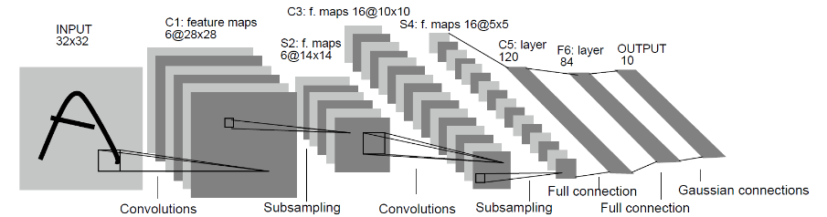

# Saving and Loading a Checkpoint

## Introduction

This experiment describes how to use MindSpore to save and load a model. It is suggested to read the documents about saving and loading model parameters on the MindSpore official website.

During model training, checkpoints can be used to save model parameters for inference and training after interruption. The application scenarios are as follows:

- Inference after training
    - After the model training, save the model parameters for inference.
    - During the training process, the accuracy is validated in real time, and the model parameters with the highest accuracy are saved for prediction.
- Retraining
    - When performing a long-time training task, save the generated checkpoint file to prevent the training from starting from the beginning after it exits abnormally.
    - Fine-tuning. In this scenario, a model is trained on a large dataset and parameters are saved. Based on this model, a new model for a similar and smaller task can be quikly trained.

## Objectives

- Learn how to use MindSpore to save models during training.
- Learn how to use MindSpore to load a saved model file and continue training.
- Learn how to use the callback function of MindSpore.

## Prerequisites

- Be proficient in Python and understand the basic knowledge of Shell and Linux operating systems.
- Have certain theoretical knowledge of deep learning, such as convolutional neural networks, loss functions, optimizers, and training strategies.

## Environment

MindSpore 1.0.0 CPU and third-party auxiliary modules:

- MindSpore: https://www.mindspore.cn/install/en
- Jupyter Notebook/JupyterLab: https://jupyter.org/install
- Matplotlib: https://matplotlib.org/users/installing.html

MindSpore supports running on local CPU/GPU/Ascend environments, such as Windows/Ubuntu x64 laptops, 
NVIDIA GPU servers, and Atlas Ascend servers. Before running the experiment in the local environment, 
you need to refer to [Installation Tutorial](https://www.mindspore.cn/install/en) to install and configure the environment.

## Preparation

### Dataset Preparation

MNIST is a handwritten digits dataset. The training set contains 60,000 handwritten digits, and the test set contains 10,000 handwritten digits. The dataset contains 10 categories in total. MNIST official website:
http://yann.lecun.com/exdb/mnist/

Download the following files from the MNIST official website to the local PC and decompress them:

    train-images-idx3-ubyte.gz:  training set images (9912422 bytes)
    train-labels-idx1-ubyte.gz:  training set labels (28881 bytes)
    t10k-images-idx3-ubyte.gz:  test set images (1648877 bytes)
    t10k-labels-idx1-ubyte.gz:  test set labels (4542 bytes)

### Script Preparation

Create a Jupyter Notebook and copy the code in the subsequent experiment steps to the Notebook for execution. 
Alternatively, download corresponding scripts from [mindspore/course](https://gitee.com/mindspore/course) and run the
 script in a Terminal. Organize the scripts and dataset as follows:

    checkpoint
    ├── MNIST
    │   ├── test
    │   │   ├── t10k-images-idx3-ubyte
    │   │   └── t10k-labels-idx1-ubyte
    │   └── train
    │       ├── train-images-idx3-ubyte
    │       └── train-labels-idx1-ubyte
    └── main.ipynb # Alternatively, main.py

## Procedures(Notebook)

You can launch a Jupyter Notebook on local environments or try 
[ModelArts Notebook](https://support.huaweicloud.com/en-us/engineers-modelarts/modelarts_23_0032.html) on 
[HuaweiCloud ModelArts](https://www.huaweicloud.com/en-us/product/modelarts.html).

### Import modules

Import the MindSpore module and auxiliary modules. Set MindSpore context, such as execution mode and device platform.

```python
import os
# os.environ['DEVICE_ID'] = '0'
# Log level includes 3(ERROR), 2(WARNING), 1(INFO), 0(DEBUG).
os.environ['GLOG_v'] = '2'

import matplotlib.pyplot as plt
import numpy as np

import mindspore as ms
import mindspore.context as context
import mindspore.dataset.transforms.c_transforms as C
import mindspore.dataset.vision.c_transforms as CV

from mindspore import nn, Tensor
from mindspore.train import Model
from mindspore.train.callback import ModelCheckpoint, CheckpointConfig, LossMonitor
from mindspore.train.serialization import load_checkpoint, load_param_into_net

import logging; logging.getLogger('matplotlib.font_manager').disabled = True

context.set_context(mode=context.GRAPH_MODE, device_target='Ascend') # Ascend, CPU, GPU
```

### Data Processing

Before using a dataset to train a network, process the data as follows:

```python
def create_dataset(data_dir, training=True, batch_size=32, resize=(32, 32),
                   rescale=1/(255*0.3081), shift=-0.1307/0.3081, buffer_size=64):
    data_train = os.path.join(data_dir, 'train') # train set
    data_test = os.path.join(data_dir, 'test') # test set
    ds = ms.dataset.MnistDataset(data_train if training else data_test)

    ds = ds.map(input_columns=["image"], operations=[CV.Resize(resize), CV.Rescale(rescale, shift), CV.HWC2CHW()])
    ds = ds.map(input_columns=["label"], operations=C.TypeCast(ms.int32))
    ds = ds.shuffle(buffer_size=buffer_size).batch(batch_size, drop_remainder=True)

    return ds
```

### Network Definition

Define the LeNet5 model. The structure of the LeNet5 model is shown below:



[1] The picture is from http://yann.lecun.com/exdb/publis/pdf/lecun-01a.pdf

```python
class LeNet5(nn.Cell):
    def __init__(self):
        super(LeNet5, self).__init__()
        self.conv1 = nn.Conv2d(1, 6, 5, stride=1, pad_mode='valid')
        self.conv2 = nn.Conv2d(6, 16, 5, stride=1, pad_mode='valid')
        self.relu = nn.ReLU()
        self.pool = nn.MaxPool2d(kernel_size=2, stride=2)
        self.flatten = nn.Flatten()
        self.fc1 = nn.Dense(400, 120)
        self.fc2 = nn.Dense(120, 84)
        self.fc3 = nn.Dense(84, 10)

    def construct(self, x):
        x = self.relu(self.conv1(x))
        x = self.pool(x)
        x = self.relu(self.conv2(x))
        x = self.pool(x)
        x = self.flatten(x)
        x = self.fc1(x)
        x = self.fc2(x)
        x = self.fc3(x)

        return x
```

### Saving the Model

MindSpore provides the callback capabilities to allow users to insert customized operations 
in a specific phase of training or inference, including:

- `ModelCheckpoint` can save model parameters for retraining or inference.
- `LossMonitor` can output loss information in logs for users to view. In addition, LossMonitor monitors 
the loss value change during training. When the loss value is Nan or Inf, the training terminates.
- `SummaryCollector` can save the training information to files for later use.


`ModelCheckpoint` will generate model(.meta) and checkpoint(.ckpt) files. For example, it saves a checkpoint every epoch.

```python
class CheckpointConfig:
    """
    The config for model checkpoint.

    Args:
        save_checkpoint_steps (int): Steps to save checkpoint. Default: 1.
        save_checkpoint_seconds (int): Seconds to save checkpoint. Default: 0.
            Can't be used with save_checkpoint_steps at the same time.
        keep_checkpoint_max (int): Maximum number of checkpoint files can be saved. Default: 5.
        keep_checkpoint_per_n_minutes (int): Keep one checkpoint every n minutes. Default: 0.
            Can't be used with keep_checkpoint_max at the same time.
        integrated_save (bool): Whether to perform integrated save function in automatic model parallel scene.
            Default: True. Integrated save function is only supported in automatic parallel scene, not supported
            in manual parallel.
        async_save (bool): Whether asynchronous execution saves the checkpoint to a file. Default: False

    Raises:
        ValueError: If the input_param is None or 0.
    """

class ModelCheckpoint(Callback):
    """
    The checkpoint callback class.

    It is called to combine with train process and save the model and network parameters after traning.

    Args:
        prefix (str): Checkpoint files names prefix. Default: "CKP".
        directory (str): Lolder path into which checkpoint files will be saved. Default: None.
        config (CheckpointConfig): Checkpoint strategy config. Default: None.

    Raises:
        ValueError: If the prefix is invalid.
        TypeError: If the config is not CheckpointConfig type.
    """
```

MindSpore also provides multiple metrics, such as accuracy, loss, precision, recall, and F1. 
Define a metrics dictionary or tuple that contains multiple metrics, pass the metrics to the model, 
and call the model.eval API to calculate the metrics. model.eval returns a dictionary containing each metric and its value.

```python
# Please remove stale checkpoint folder `ckpt`
def train(data_dir, lr=0.01, momentum=0.9, num_epochs=2, ckpt_name="lenet"):
    dataset_sink = context.get_context('device_target') == 'Ascend'
    repeat = num_epochs if dataset_sink else 1
    ds_train = create_dataset(data_dir)
    ds_eval = create_dataset(data_dir, training=False)
    steps_per_epoch = ds_train.get_dataset_size()

    net = LeNet5()
    loss = nn.loss.SoftmaxCrossEntropyWithLogits(sparse=True, reduction='mean')
    opt = nn.Momentum(net.trainable_params(), lr, momentum)

    ckpt_cfg = CheckpointConfig(save_checkpoint_steps=steps_per_epoch, keep_checkpoint_max=5)
    ckpt_cb = ModelCheckpoint(prefix=ckpt_name, directory='ckpt', config=ckpt_cfg)
    loss_cb = LossMonitor(steps_per_epoch)

    model = Model(net, loss, opt, metrics={'acc', 'loss'})
    model.train(num_epochs, ds_train, callbacks=[ckpt_cb, loss_cb], dataset_sink_mode=dataset_sink)
    metrics = model.eval(ds_eval, dataset_sink_mode=dataset_sink)
    print('Metrics:', metrics)

train('MNIST/')
print('Checkpoints after first training:')
print('\n'.join(sorted([x for x in os.listdir('ckpt') if x.startswith('lenet')])))
```

    epoch: 1 step 1875, loss is 0.23394052684307098
    epoch: 2 step 1875, loss is 0.4737345278263092
    Metrics: {'loss': 0.10531254443608654, 'acc': 0.9701522435897436}
    Checkpoints after first training:
    lenet-1_1875.ckpt
    lenet-2_1875.ckpt
    lenet-graph.meta

### Resuming training from Checkpoint

```python
def load_checkpoint(ckpoint_file_name, net=None):
    """
    Loads checkpoint info from a specified file.

    Args:
        ckpoint_file_name (str): Checkpoint file name.
        net (Cell): Cell network. Default: None

    Returns:
        Dict, key is parameter name, value is a Parameter.

    Raises:
        ValueError: Checkpoint file is incorrect.
    """

def load_param_into_net(net, parameter_dict):
    """
    Loads parameters into network.

    Args:
        net (Cell): Cell network.
        parameter_dict (dict): Parameter dict.

    Raises:
        TypeError: Argument is not a Cell, or parameter_dict is not a Parameter dict.
    """
```

> When loading data with the load_checkpoint API, pass parameter data to the original network 
> instead of the training network with the optimizer and loss function.

```python
CKPT_1 = 'ckpt/lenet-2_1875.ckpt'

def resume_train(data_dir, lr=0.001, momentum=0.9, num_epochs=2, ckpt_name="lenet"):
    dataset_sink = context.get_context('device_target') == 'Ascend'
    repeat = num_epochs if dataset_sink else 1
    ds_train = create_dataset(data_dir)
    ds_eval = create_dataset(data_dir, training=False)
    steps_per_epoch = ds_train.get_dataset_size()

    net = LeNet5()
    loss = nn.loss.SoftmaxCrossEntropyWithLogits(sparse=True, reduction='mean')
    opt = nn.Momentum(net.trainable_params(), lr, momentum)

    param_dict = load_checkpoint(CKPT_1)
    load_param_into_net(net, param_dict)
    load_param_into_net(opt, param_dict)

    ckpt_cfg = CheckpointConfig(save_checkpoint_steps=steps_per_epoch, keep_checkpoint_max=5)
    ckpt_cb = ModelCheckpoint(prefix=ckpt_name, directory='ckpt', config=ckpt_cfg)
    loss_cb = LossMonitor(steps_per_epoch)

    model = Model(net, loss, opt, metrics={'acc', 'loss'})
    model.train(num_epochs, ds_train, callbacks=[ckpt_cb, loss_cb], dataset_sink_mode=dataset_sink)

    metrics = model.eval(ds_eval, dataset_sink_mode=dataset_sink)
    print('Metrics:', metrics)

resume_train('MNIST/')
print('Checkpoints after resuming training:')
print('\n'.join(sorted([x for x in os.listdir('ckpt') if x.startswith('lenet')])))
```

    epoch: 1 step 1875, loss is 0.07734094560146332
    epoch: 2 step 1875, loss is 0.007969829253852367
    Metrics: {'loss': 0.07375562800846708, 'acc': 0.975761217948718}
    Checkpoints after resuming training:
    lenet-1_1875.ckpt
    lenet-2_1875.ckpt
    lenet-graph.meta
    lenet_1-1_1875.ckpt
    lenet_1-2_1875.ckpt
    lenet_1-graph.meta

### Loading Checkpoint for Inference

Use the trained LeNet5 model to recognize written digits and use matplotlib to visualize the inference result.
The recognition result is basically correct.

```python
CKPT_2 = 'ckpt/lenet_1-2_1875.ckpt'

def infer(data_dir):
    ds = create_dataset(data_dir, training=False).create_dict_iterator(output_numpy=True)
    data = ds.get_next()
    images = data['image']
    labels = data['label']
    net = LeNet5()
    load_checkpoint(CKPT_2, net=net)
    model = Model(net)
    output = model.predict(Tensor(data['image']))
    preds = np.argmax(output.asnumpy(), axis=1)

    for i in range(1, 5):
        plt.subplot(2, 2, i)
        plt.imshow(np.squeeze(images[i]))
        color = 'blue' if preds[i] == labels[i] else 'red'
        plt.title("prediction: {}, truth: {}".format(preds[i], labels[i]), color=color)
        plt.xticks([])
    plt.show()

infer('MNIST')
```


## Procedure(Terminal)

Experiment on a Windows/Ubuntu x64 PC/Laptop:

```sh
# Edit main.py, and set context to `device_target='CPU'` in line 23.
python main.py --data_url=D:\dataset\MNIST
```

Experiment on an Ascend Server：

```shell script
vim main.py # Set context to `device_target='CPU'` in line 23.
python main.py --data_url=/PATH/TO/MNIST
```

## Experiment Summary

This experiment demonstrates how to use MindSpore to save checkpoints, continue training at breakpoints, and load checkpoints for inference.

1. Use the ModelCheckpoint API of MindSpore to save a checkpoint for each epoch. Train two epochs, and terminate the training.
2. Use the load_checkpoint and load_param_into_net APIs of MindSpore to load the checkpoint saved in the previous step and continue to train two epochs.
3. Observe the Loss change during the training. After the checkpoint is loaded and the training continues, the Loss further decreases.
