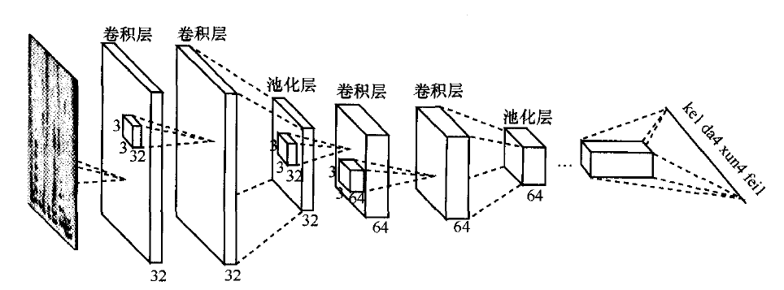
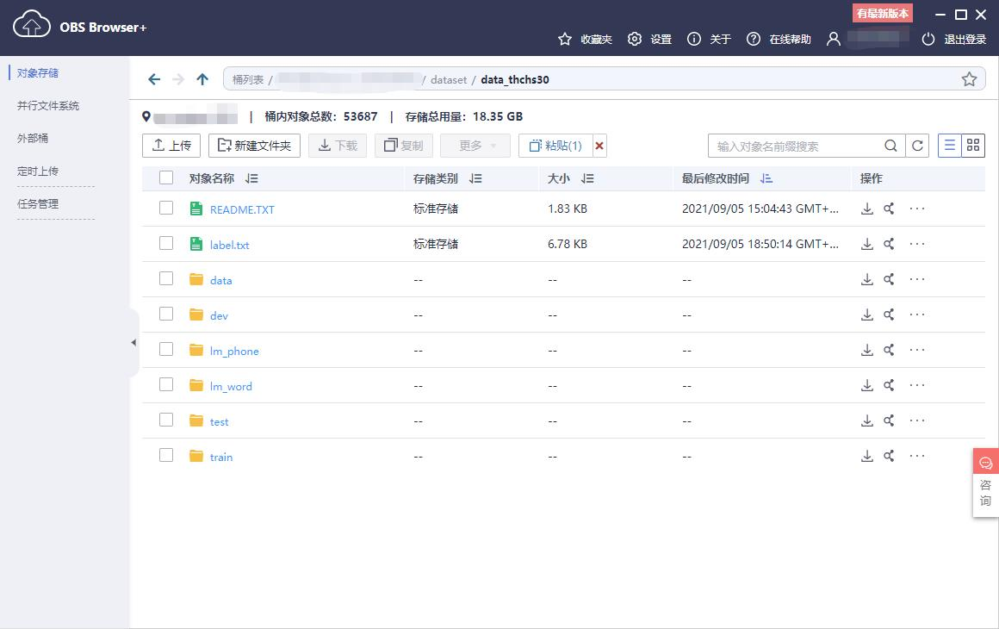

- [DFCNN+CTC 声学模型描述](#dfcnnctc-声学模型描述)
- [模型架构](#模型架构)
- [数据集](#数据集)
  - [数据集介绍](#数据集介绍)
  - [数据集处理步骤](#数据集处理步骤)
- [运行环境](#运行环境)
- [快速开始](#快速开始)
- [代码结构说明](#代码结构说明)
- [性能描述](#性能描述)
- [OBS服务使用相关](#obs服务使用相关)
- [相关参考](#相关参考)

# DFCNN+CTC 声学模型描述

 本项目的目标是使用MindSpore实现DFCNN+CTC的声学模型，将一句语音转化成一张特定模式的图像作为输入，然后通过DFCNN+CTC结构，对整句语音进行建模，实现输出单元直接与最终的识别结果（音节）相对应。

 参考论文：

- [王海坤,潘嘉,刘聪.语音识别技术的研究进展与展望[J].电信科学,2018(2):1-11.](http://www.cqvip.com/QK/90580X/20182/674630012.html)

- [W Zhang, M H Zhai, Z L Huang, et al. Towards End-to-End Speech Recognition with Deep Multipath Convolutional Neural Networks[C]](https://doi.org/10.1007/978-3-030-27529-7_29)

# 模型架构



# 数据集

## 数据集介绍

- **清华大学THCHS30中文语音数据集**

  - 数据规模：

    | dataset | 音频个数 |
    | ------- | -------- |
    | train   | 10,000   |
    | dev     | 893      |
    | test    | 2,495    |

  - 详细介绍：`data_thchs30`: [OpenSLR](http://www.openslr.org/18/)

## 数据集处理步骤

- **步骤1**
  下载并解压 [data_thchs30.tgz](https://www.openslr.org/resources/18/data_thchs30.tgz)

- **步骤2**
  按照如下文件目录结构将文件内容移动到`dataset/`目录下

  ```
  |--- dfcnn/
      |--- dataset/
          |--- data_thchs30/
          	|--- data/
          		.wav.scp
          		A2_0.wav
          		A2_0.wav.trn
  				... ...
  			|--- dev/
          		A2_33.wav
          		A2_33.wav.trn
  				... ...		
                ... ...
  ```

  若使用昇腾平台，请将数据`data_thchs30`的地址填入`config.yaml`的`obs_datapath`选项之中（例如：`obs://xxxx/xxxx/dataset/data_thchs30/`),文件结构目录如下:
  

# 运行环境

- 硬件
  - 准备GPU、昇腾处理器搭建硬件环境。

- 框架
  - [MindSpore](https://www.mindspore.cn/install)

- 如需查看详情，请参见如下资源：
  - [MindSpore教程](https://www.mindspore.cn/tutorials/zh-CN/master/index.html)
  - [MindSpore Python API](https://www.mindspore.cn/docs/api/zh-CN/master/index.html)

# 快速开始

- **安装依赖**

  - 安装 [Mindspore](https://www.mindspore.cn/install)
    根据实际运行环境需要安装，推荐使用1.2以上版本

  - 安装相关工具包

    ```
    pip install -r requirements.txt
    ```

  - 安装 [MindInsight](https://www.mindspore.cn/mindinsight) (非必须): 根据实际需求安装

- **相关配置**

  本项目训练与评估的相关配置都由`./config.yaml`所决定

  ```yaml
  # 训练设置
  resume: False # options: True / False 是否复训，若是则需要在resume_config_log中指明待复训模型的编号，可在./log下找到相应日志
  resume_config_log: 20210826042753 # 待复训模型的编号
  mode: GRAPH # options: PYNATIVE / GRAPH, mindspore运行的模式
  device: GPU # options: GPU / Ascend, 项目运行环境
  device_id: 0 # 当使用GPU时，指明的设备id
  dataset_sink_mode: False
  obs_datapath: obs://xxxx/dataset/data_thchs30/ # obs数据集地址，例如：obs://xxxx/dataset/data_thchs30/
  obs_saved_model: obs://xxxx/saved_model/ # obs保存模型的地址，例如：obs://xxxx/saved_model/
  obs_best_model: obs://xxxx/saved_model/best_model/ # obs最好模型的保存地址，例如:obs://xxxx/saved_model/best_model/
  obs_log: obs://xxxx/log/ # obs日志文件保存地址，例如：obs://xxxx/log/


  # 模型初始化设置
  pad_mode: pad # options: same / pad , CNN层的padding模式，默认为pad, 当为pad模式时，需要指明padding的值，same模式则按默认值处理
  padding: 1 # padding值，当为pad模式时，padding的值应当大于等于0
  has_bias: False # CNN层是否使用偏差
  use_dropout: True # 是否使用drop-out

  # 超参数
  batch_size : 16 # 训练时的batch大小
  test_dev_batch_size: 16 # 边训练边验证与测试时的 batch 大小
  learning_rate: 0.0005 # 学习率
  epochs: 100 # 迭代次数
  loss_scale: 8096 # loss scale
  use_dynamic_lr: True # 是否使用动态学习率
  warmup_step: 2000 # 动态学习率相关参数
  warmup_ratio: 0.0625 # 动态学习率相关参数

  # 优化器
  opt: rms # options: adam / rms, 优化器

  # 回调函数
  use_summary: False # 是否使用mindInsight
  save_checkpoint_steps: 200 # 多久保存一次模型 可选一个epoch的大小(设置为0)
  keep_checkpoint_max: 3 # 最多保存的模型个数
  prefix: dfcnn # 模型文件名前缀
  model_dir: ./saved_model # 模型保存路径
  loss_monitor_step: 10 # loss监测步长

  use_step_eval: True # 是否边训练边验证
  eval_step: -1 # 验证步长, 可选一个epoch的大小(0)，将eval_step设为-1时按照epoch数为步数进行验证，此时需要设置eval_epoch
  eval_epoch: 5 # 验证的epoch步数
  patience: 3 # 早停法耐心值

  # 评估
  log_to_eval: 20210910123618 # 待评估的模型编号，可在./log下找到相应日志
  test_dataset_size: -1 # 对测试集中的多少数据进行评估，小于0则意为评估完整的数据集
  ```

  

- **开始训练**

  运行：

    ```shell
    python train.py
    ```
  
  (非必要)若使用**昇腾平台**:
    - 可以执行`unset SOC_VERSION`命令来停止打印 **Warning** 相关日志输出。


- **日志记录**

  训练日志将按找日期生成编号，并保存到`./log`中，包括`config.yaml`中的配置、训练时间、边训练边评估的最好结果相关信息。

  若使用昇腾平台，请在`config.yaml`中的`obs_log`选项指定输出到的obs服务器地址，例如`obs://xxx/xxx/log/`。

- **评估**

  - **评估设置**

    - **指定待评估模型编号** 单次训练对应日志文件将被按照训练开始时间生成编号，比如：`20210827093309.log`，并保存于`./log`目录之下，若需要对该次训练模型进行评估，只需在`./config.yaml`中将`log_to_eval`设置为对应编号即可，比如：

      ```yaml
      # 评估
      log_to_eval: 20210827093309 # 待评估的模型编号，可在./log下找到相应日志
      ```

    - **指定欲使用测试集的大小** 在`./config.yaml`中`test_dataset_size`可设置使用多少数据进行评估，小于0则意为评估完整的数据集，比如：

      ```yaml
      test_dataset_size: 128 # 对测试集中的多少数据进行评估，小于0则意为评估完整的数据集
      ```
    - **特别注意** 若使用**昇腾平台**,请在`config.yaml`中的:
      - `obs_saved_model`选项中指定自动保存模型的路径(例: `obs://xxxx/xxxx/saved_model/`), 
      - `obs_best_model`选项中指定最佳模型的保存路径(例: `obs://xxxxx/xxxx/saved_model/best_model/`)
        

  - **开始评估**

    运行：

    ```shell
    python eval.py
    ```

    评估完成会打印在验证集的准确率和测试集上的准确率，如：

    ```shell
    * Best accuracy for the dev dataset is : 94.58%
    ...
    * [Test result] For 128 datas, the accuracy is: 80.19%
    ```

# 代码结构说明
```
├── dfcnn
    ├── config.yaml // 运行配置相关
    ├── eval.py // 评估脚本
    ├── log // 日志记录
    │   ├── 20210825131621.log // 运行时生成的日志
    │   ├── .......
    │   └── 20210827092611.log // 运行时生成的日志
    ├── model
    │   ├── CTC.py // CTC 损失函数
    │   ├── DFCNN.py // DFCNN 模型
    │   ├── __init__.py //init 文件
    │   └── training_cell.py // 训练网络
    ├── README.md // 说明
    ├── requirements.txt
    ├── saved_model // 保存的模型
    │   ├── best_model // 最佳模型保存处
    │   │   ├── 20210826042753.ckpt // 最佳模型
    │   │   ├── .......
    │   ├── dfcnn_20210826042753-90_575.ckpt // 运行时生成的模型
    │   ├── dfcnn_20210826042753-91_150.ckpt 
    │   ├── ....
    │   └── dfcnn_20210826042753-193_300.ckpt
    ├── train.py // 训练脚本
    └── utils // 相关工具
        ├── __init__.py // init 文件
        ├── callbacks.py // 回调函数
        ├── config.py // 配置读取工具
        ├── const.py // 相关常量
        ├── data.py // 数据处理类
        ├── log.py //日志工具
        ├── lr_schedule.py //动态学习率工具
        └── utils.py // 其他相关工具
```

# 性能描述

| 参数           | 值                                                           |
| -------------- | ------------------------------------------------------------ |
| 硬件环境       | Tesla V100 32G                                               |
| 运行环境       | python 3.7.5                                                 |
| Mindspore 版本 | r1.1, r1.2, r1.3                                                   |
| 数据集         | THCHS30                                                      |
| 训练参数       | pad_mode: pad<br />padding: 1<br />has_bias: False<br />use_dropout: True<br />batch_size: 16<br />test_dev_batch_size: 16<br />learning_rate: 0.0005<br />epochs: 100<br />loss_scale: 8096<br />use_dynamic_lr: True<br />warmup_step: 2000<br />warmup_ratio: 0.0625 |
| 优化器         | RMSProp                                                      |
| 损失函数       | CTCLoss                                                      |
| 训练用时       | 12小时38分                                           |
| 验证集准确率   | 94.71%                                                       |
| 测试集准确率   | 128个音频为80.55%，完整(2495个)音频为78.63%                  |

# OBS服务使用相关

- [OBS IO 参考](https://bbs.huaweicloud.com/forum/thread-64739-1-1.html)
- [OBS 文档](https://github.com/huaweicloud/ModelArts-Lab/blob/master/docs/moxing_api_doc/MoXing_API_File.md)
# 相关参考

- 1. [**参考文章**](https://blog.csdn.net/chinatelecom08/article/details/85013535)

- 2. [参考仓库](https://github.com/zw76859420/ASR_Syllable)
- 3. [去除昇腾平台的soc Warning命令：unset SOC_VERSION](https://gitee.com/mindspore/mindspore/issues/I3B1ZH)
