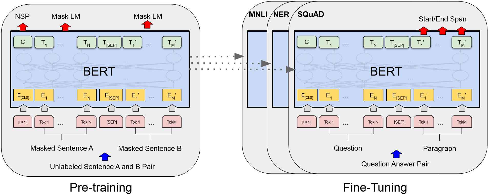
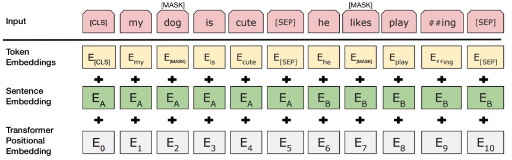
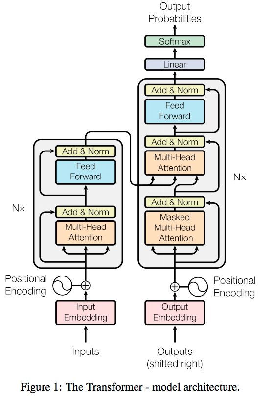
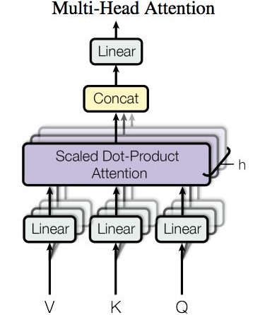

<h1 style="text-align:center">自然语言处理应用</h1>

## 实验介绍

本实验主要介绍使用MindSpore开发和训练[BERT](https://arxiv.org/pdf/1810.04805.pdf)模型。本实验使用MindSpore model_zoo中提供的BERT模型定义，并参考MindSpore开源仓库中的[BERT Example](https://gitee.com/mindspore/mindspore/tree/r0.2/example/Bert_NEZHA_cnwiki)模型案例。

BERT（Bidirectional Encoder Representations from Transformers），即基于Transformer的双向编码表征。其中：

- Transformer是一种注意力（Attention）机制，用来学习文本中单词上下文之间的关系；
- 双向是指通过Masked Language Model（MLM）方法，随机的掩盖掉句子中的某些单词，然后利用前后未掩盖的信息来预测掩盖的单词。

BERT模型包含由不同隐含层数（number hidden layers）和隐含层单元数（hidden size）构成的不同版本。更多BERT的介绍可以参考[google-research/bert](https://github.com/google-research/bert)和[Link](https://www.jianshu.com/p/d110d0c13063)

## 实验目的

- 了解如何使用MindSpore加载常用的NLP数据集。
- 了解MindSpore的model_zoo模块，以及如何使用model_zoo中的模型。
- 了解BERT模型的基本结构和编程方法。

## 预备知识

- 熟练使用Python，了解Shell及Linux操作系统基本知识。
- 具备一定的深度学习理论知识，如Embedding、Encoder、Decoder、损失函数、优化器，训练策略、Checkpoint等。
- 了解华为云的基本使用方法，包括[OBS（对象存储）](https://www.huaweicloud.com/product/obs.html)、[ModelArts（AI开发平台）](https://www.huaweicloud.com/product/modelarts.html)、[训练作业](https://support.huaweicloud.com/engineers-modelarts/modelarts_23_0046.html)等功能。华为云官网：https://www.huaweicloud.com
- 了解并熟悉MindSpore AI计算框架，MindSpore官网：https://www.mindspore.cn/

## 实验环境

- MindSpore 0.2.0（MindSpore版本会定期更新，本指导也会定期刷新，与版本配套）；
- 华为云ModelArts（控制台左上角选择“华北-北京四”）：ModelArts是华为云提供的面向开发者的一站式AI开发平台，集成了昇腾AI处理器资源池，用户可以在该平台下体验MindSpore。

## 实验准备

### 创建OBS桶

本实验需要使用华为云OBS存储脚本和数据集，可以参考[快速通过OBS控制台上传下载文件](https://support.huaweicloud.com/qs-obs/obs_qs_0001.html)了解使用OBS创建桶、上传文件、下载文件的使用方法。

> **提示：** 华为云新用户使用OBS时通常需要创建和配置“访问密钥”，可以在使用OBS时根据提示完成创建和配置。也可以参考[获取访问密钥并完成ModelArts全局配置](https://support.huaweicloud.com/prepare-modelarts/modelarts_08_0002.html)获取并配置访问密钥。

打开[OBS控制台](https://storage.huaweicloud.com/obs/?region=cn-north-4&locale=zh-cn#/obs/manager/buckets)，点击右上角的“创建桶”按钮进入桶配置页面，创建OBS桶的参考配置如下：

- 区域：华北-北京四
- 数据冗余存储策略：单AZ存储
- 桶名称：如ms-course
- 存储类别：标准存储
- 桶策略：公共读
- 归档数据直读：关闭
- 企业项目、标签等配置：免

### 数据集准备

由于数据集较大，且预处理过程较为繁琐、耗时，本实验不进行数据预处理，请从网盘下载处理好的zhwiki_part和tnews数据集：

链接: https://pan.baidu.com/s/1F2S9Wr-ND0LMfATjv7WEug 提取码: gent

**预训练（pretrain）数据集**：zhwiki dumps，为中文维基百科的文本数据，需要预处理了后才能使用。

下载某一日期的[zhwiki dump](https://dumps.wikimedia.org/zhwiki)，使用[WikiExtractor](https://github.com/attardi/wikiextractor)进行文本进行提取和清理，然后使用[google-research/bert:create_pretraining_data.py](https://github.com/google-research/bert/blob/master/create_pretraining_data.py)进行数据集创建，包括基于词典vocab.txt对文本进行token化，生成具有上下文关系的句子对，创建Mask LM数据，最后存储为为TFRecord格式；

**微调（finetune）数据集**：TNEWS，今日头条中文新闻（短文本）分类（Short Text Classificaiton for News）数据集。该数据集来自今日头条的新闻版块，共提取了15个类别的新闻，包括旅游，教育，金融，军事等。数据量：训练集(53,360)，验证集(10,000)，测试集(10,000)。例子：

{"label": "102", "label_des": "news_entertainment", "sentence": "江疏影甜甜圈自拍，迷之角度竟这么好看，美吸引一切事物"}

每一条数据有三个属性，从前往后分别是分类ID，分类名称，新闻字符串（仅含标题）。

使用[CLUEbenchmark/CLUEPretrainedModels中的脚本](https://github.com/CLUEbenchmark/CLUEPretrainedModels/blob/master/baselines/models/bert/run_classifier_tnews.sh)下载、处理TNEWS数据集，并将数据转为TFRecord格式。脚本代码包含数据处理和模型评估的逻辑，只需保留数据处理部分即可。

### 脚本准备

从[课程gitee仓库](https://gitee.com/mindspore/course)上下载本实验相关脚本。其中`tokenization.py`来源于[google-research/bert](https://github.com/google-research/bert/blob/master/tokenization.py)

### 上传文件

点击新建的OBS桶名，再打开“对象”标签页，通过“上传对象”、“新建文件夹”等功能，将脚本和数据集上传到OBS桶中，组织为如下形式：

```
experiment_4
├── 脚本等文件
├── tnews
│   ├── bert_base.ckpt
│   ├── dev.tf_record
│   ├── dev_schema.json
│   ├── label2id.json
│   ├── train.tf_record
│   ├── train_schema.json
│   └── vocab.txt
└── zhwiki_part
    ├── schema.json
    └── part.tfrecord
```

## 实验步骤

### 预训练BERT

通常情况下使用BERT需要预训练（pretrain）和微调（fine-tune）两个阶段。预训练BERT模型通常需要在大数据集上多卡并行训练多天。本实验通过在部分zhwiki数据集上训练若干Epochs为例展示预训练的过程。

BERT预训练阶段包含两个任务（两个输出）：

- Mask语言模型（Mask LM）：预测被掩盖掉（mask）的单词；
- NextSentence预测（NSP）：判断句子对是否具有上下文关系，即句子B是否时句子A的下一句。



[1] 图片来源于https://arxiv.org/pdf/1810.04805.pdf

#### 代码梳理

model_zoo:Bert_NEZHA中包含两个模块：

- `bert_for_pre_training.py`：包含`GetMaskedLMOutput`, `GetNextSentenceOutput`, `BertPreTraining`, `BertPretrainingLoss`, `BertNetworkWithLoss`, `BertTrainOneStepCell`, `BertTrainOneStepWithLossScaleCell`；
- `bert_model.py`：包含`BertModel`及其依赖的`EmbeddingLookup`,`EmbeddingPostprocessor`和`BertTransformer`（`BertAttention->BertSelfAttention->BertEncoderCell`)。

`GetMaskedLMOutput`接在BERT基础模型的后面，用于获取Mask LM的输出。

`GetNextSentenceOutput`在BERT基础模型的后面接了一个全连接层和Softmax层，用于获取NSP的输出。

```python
class GetNextSentenceOutput(nn.Cell):
    def construct(self, input_tensor):
        logits = self.dense(input_tensor)
        logits = self.cast(logits, self.dtype)
        log_prob = self.log_softmax(logits)
        return log_prob
```

`BertPreTraining`将Mask LM模型和NSP模型封装成一个模型定义，`BertPretrainingLoss`将Mask LM Loss和NSP Loss加和封装为一个Loss定义。`BertNetworkWithLoss`根据模型输出计算Loss值。

```python
class BertNetworkWithLoss(nn.Cell):
    """
    Provide bert pre-training loss through network.

    Args:
        config (BertConfig): The config of BertModel.
        is_training (bool): Specifies whether to use the training mode.
        use_one_hot_embeddings (bool): Specifies whether to use one-hot for embeddings. Default: False.

    Returns:
        Tensor, the loss of the network.
    """
    def __init__(self, config, is_training, use_one_hot_embeddings=False):
        super(BertNetworkWithLoss, self).__init__()
        self.bert = BertPreTraining(config, is_training, use_one_hot_embeddings)
        self.loss = BertPretrainingLoss(config)
        self.cast = P.Cast()

    def construct(self,
                  input_ids,
                  input_mask,
                  token_type_id,
                  next_sentence_labels,
                  masked_lm_positions,
                  masked_lm_ids,
                  masked_lm_weights):
        prediction_scores, seq_relationship_score = \
            self.bert(input_ids, input_mask, token_type_id, masked_lm_positions)
        total_loss = self.loss(prediction_scores, seq_relationship_score,
                               masked_lm_ids, masked_lm_weights, next_sentence_labels)
        return self.cast(total_loss, mstype.float32)
```

`BertTrainOneStepCell`在`BertNetworkWithLoss`上加上了反向传播和梯度更新（优化器），接收数据输入，更新模型权重。`BertTrainOneStepWithLossScaleCell`在此基础上引入了损失缩放（Loss Scaling）。损失缩放是为了应对反向传播过程中梯度数值较小，计算时（如采用FP16）会被当做0处理，所以先对Loss做一个放大，然后再对梯度进行缩小。

`bert_model.py`中`BertModel`接收数据输入，经过`EmbeddingLookup`, `EmbeddingPostprocessor`, `BertTransformer`和`Dense`计算后得到输出（用于下游NSP和Mask LM等任务）。

```python
class BertModel(nn.Cell):
    def construct(self, input_ids, token_type_ids, input_mask):
        # embedding
        if not self.token_type_ids_from_dataset:
            token_type_ids = self.token_type_ids
        word_embeddings, embedding_tables = self.bert_embedding_lookup(input_ids)
        embedding_output = self.bert_embedding_postprocessor(token_type_ids,
                                                             word_embeddings)

        # attention mask [batch_size, seq_length, seq_length]
        attention_mask = self._create_attention_mask_from_input_mask(input_mask)

        # bert encoder
        encoder_output = self.bert_encoder(self.cast_compute_type(embedding_output),
                                           attention_mask)

        sequence_output = self.cast(encoder_output[self.last_idx], self.dtype)

        # pooler
        sequence_slice = self.slice(sequence_output,
                                    (0, 0, 0),
                                    (self.batch_size, 1, self.hidden_size),
                                    (1, 1, 1))
        first_token = self.squeeze_1(sequence_slice)
        pooled_output = self.dense(first_token)
        pooled_output = self.cast(pooled_output, self.dtype)

        return sequence_output, pooled_output, embedding_tables
```

`EmbeddingLookup`和`EmbeddingPostprocessor`用于将输入转换成Embedding张量，Embedding如下图所示：



[2] 图片来源于https://arxiv.org/pdf/1810.04805.pdf

`BertTransformer`采用了下图中Transformer中的encoder部分（左侧半边），包含`BertAttention->BertSelfAttention->BertEncoderCell`。



[3] 图片来源于https://arxiv.org/pdf/1706.03762.pdf

`BertAttention`为Multi-Head Attention：



[4] 图片来源于https://arxiv.org/pdf/1706.03762.pdf

创建训练作业时，运行参数会通过脚本传参的方式输入给脚本代码，脚本必须解析传参才能在代码中使用相应参数。如data_url和train_url，分别对应数据存储路径(OBS路径)和训练输出路径(OBS路径)。脚本对传参进行解析后赋值到`args`变量里，在后续代码里可以使用。

```python
import argparse
parser = argparse.ArgumentParser()
parser.add_argument('--data_url', required=True, default=None, help='Location of data.')
parser.add_argument('--train_url', required=True, default=None, help='Location of training outputs.')
parser.add_argument('--num_epochs', type=int, default=1, help='Number of training epochs.')
args, unknown = parser.parse_known_args()
```

MindSpore暂时没有提供直接访问OBS数据的接口，需要通过ModelArts自带的moxing框架与OBS交互。将OBS桶中的数据拷贝至执行容器中，供MindSpore使用：

```python
import moxing as mox
mox.file.copy_parallel(src_url=args.data_url, dst_url='zhwiki_part/')
```

将训练模型Checkpoint从执行容器拷贝至OBS：

```python
import moxing as mox
mox.file.copy_parallel(src_url='bert_classfication-3_3335.ckpt',
                       dst_url=os.path.join(args.data_url, 'bert_classfication-3_3335.ckpt'))
```

#### 创建训练作业

可以参考[使用常用框架训练模型](https://support.huaweicloud.com/engineers-modelarts/modelarts_23_0238.html)来创建并启动训练作业。

打开[ModelArts控制台-训练管理-训练作业](https://console.huaweicloud.com/modelarts/?region=cn-north-4#/trainingJobs)，点击“创建”按钮进入训练作业配置页面，创建训练作业的参考配置：

- 算法来源：常用框架->Ascend-Powered-Engine->MindSpore
- 代码目录：选择上述新建的OBS桶中的experiment_4目录
- 启动文件：选择上述新建的OBS桶中的experiment_4目录下的`pretrain.py`
- 数据来源：数据存储位置->选择上述新建的OBS桶中的experiment_4文件夹下的zhiwiki_part目录
- 训练输出位置：选择上述新建的OBS桶中的experiment_4目录并在其中创建pretrain_output目录
- 作业日志路径：同训练输出位置
- 规格：Ascend:1*Ascend 910
- 其他均为默认

启动并查看训练过程：

1. 点击提交以开始训练；
2. 在训练作业列表里可以看到刚创建的训练作业，在训练作业页面可以看到版本管理；
3. 点击运行中的训练作业，在展开的窗口中可以查看作业配置信息，以及训练过程中的日志，日志会不断刷新，等训练作业完成后也可以下载日志到本地进行查看；
4. 在训练日志中可以看到`epoch: 5, outputs are:([10.741777], False)`等字段，即预训练过程的loss数据（本实验仅训练若干Epochs展示训练过程）。

### 微调BERT

通常情况下，需要基于与训练的BERT模型在各类细分任务上做微调（finetune），提高BERT在具体任务上的效果。本实验在CLUEbenchmark/CLUE提供的TNEWS数据集上对预训练的BERT做微调，即学习一个短文本分类任务。

预训练和微调两种情况下BERT基础模型是相同的，只是最后会在基础模型上加上不同的任务层，用于解决文本分类（新闻分类、情感分类）、序列标注（命名实体识别、问答）等任务。

#### 代码梳理

微调BERT依赖如下几个模块：

- `finetune.py`：包含Loss打印、数据处理、优化器、模型保存等；
- `fintune_config.py`：模型和训练配置；
- `utils.py`模块中定义了finetune需要的模型，包含`BertFinetuneCell`, `BertCLSModel`, `BertNERModel`, `BertCLS`和`BertNER`。

`BertFinetuneCell`等同于预训练时的`BertTrainOneStepCell`/`BertTrainOneStepWithLossScaleCell`，接收数据输入，更新模型权重。

`BertCLSModel`在BERT基础模型上接了分类任务头：

```python
class BertCLSModel(nn.Cell):
    """
    This class is responsible for classification task evaluation, i.e. XNLI(num_labels=3),
    LCQMC(num_labels=2), Chnsenti(num_labels=2). The returned output represents the final
    logits as the results of log_softmax is propotional to that of softmax.
```

`BertNERModel`在BERT基础模型上接了命名实体识别（NER）任务头：

```python
class BertNERModel(nn.Cell):
    """
    This class is responsible for sequence labeling task evaluation, i.e. NER(num_labels=11).
    The returned output represents the final logits as the results of log_softmax is propotional to that of softmax.
    """
```

`BertCLS`和`BertNER`在任务模型上接了损失函数，作为`BertFinetuneCell`的输入。


#### 创建训练作业

可以参考[使用常用框架训练模型](https://support.huaweicloud.com/engineers-modelarts/modelarts_23_0238.html)来创建并启动训练作业

打开[ModelArts控制台-训练管理-训练作业](https://console.huaweicloud.com/modelarts/?region=cn-north-4#/trainingJobs)，点击“创建”按钮进入训练作业配置页面，创建训练作业的参考配置：

- 算法来源：常用框架->Ascend-Powered-Engine->MindSpore
- 代码目录：选择上述新建的OBS桶中的experiment_4目录
- 启动文件：选择上述新建的OBS桶中的experiment_4目录下的`fintune.py`
- 数据来源：数据存储位置->选择上述新建的OBS桶中的experiment_4文件夹下的tnews目录
- 训练输出位置：选择上述新建的OBS桶中的experiment_4目录并在其中创建finetune_output目录
- 作业日志路径：同训练输出位置
- 规格：Ascend:1*Ascend 910
- 其他均为默认

启动并查看训练过程：

1. 点击提交以开始训练，预训练过程约18分钟；
2. 在训练作业列表里可以看到刚创建的训练作业，在训练作业页面可以看到版本管理；
3. 点击运行中的训练作业，在展开的窗口中可以查看作业配置信息，以及训练过程中的日志，日志会不断刷新，等训练作业完成后也可以下载日志到本地进行查看；
4. 在训练日志中可以看到`epoch: 3, step: 10005, outputs are (1.4425085, False)`等字段，即微调过程的输出；

### 验证BERT

在TNEWS验证集上对微调后的BERT模型做验证（evaluation）。

#### 代码梳理

验证BERT依赖如下几个模块：

- `evaluation.py`：包含Accuracy（分类任务）、F1值（NER任务）的计算，数据处理等。
- `evaluation_config.py`：模型和训练配置；
- `cluener_evaluation.py`：中文任务基准测评（Chinese Language Understanding Evaluation Benchmark）方法，未使用；
- `tokenization.py`：基于vocab.txt，将单词token化，未使用；
- `sample_process.py`：基于`tokenization.py`进行文本数据处理，未使用；
- `utils.py`：依赖微调时用的模型。

脚本传参、数据拷贝等代码参考预训练BERT中的解释。

#### 创建训练作业

可以参考[使用常用框架训练模型](https://support.huaweicloud.com/engineers-modelarts/modelarts_23_0238.html)来创建并启动训练作业。

打开[ModelArts控制台-训练管理-训练作业](https://console.huaweicloud.com/modelarts/?region=cn-north-4#/trainingJobs)，点击“创建”按钮进入训练作业配置页面，创建训练作业的参考配置：

- 算法来源：常用框架->Ascend-Powered-Engine->MindSpore
- 代码目录：选择上述新建的OBS桶中的experiment_4目录
- 启动文件：选择上述新建的OBS桶中的experiment_4目录下的`fintune.py`
- 数据来源：数据存储位置->选择上述新建的OBS桶中的experiment_4文件夹下的tnews目录
- 训练输出位置：选择上述新建的OBS桶中的experiment_4目录并在其中创建eval_output目录
- 作业日志路径：同训练输出位置
- 规格：Ascend:1*Ascend 910
- 其他均为默认

启动并查看训练过程：

1. 点击提交以开始训练；
2. 在训练作业列表里可以看到刚创建的训练作业，在训练作业页面可以看到版本管理；
3. 点击运行中的训练作业，在展开的窗口中可以查看作业配置信息，以及训练过程中的日志，日志会不断刷新，等训练作业完成后也可以下载日志到本地进行查看；
4. 在训练日志中可以看到`acc_num 5437 , total_num 10000, accuracy 0.543700`字段，即微调完成后的验证精度。

## 实验结论

本实验主要介绍使用MindSpore在zhiwiki数据集上预训练BERT，在TNEWS短文本分类数据集上进行微调，最后对微调的模型进行验证，了解了以下知识点：

- 常用的NLP数据集及其使用；
- BERT模型的基本结构及其MindSpore实现；
- BERT预训练过程及其MindSpore实现；
- BERT微调过程及其MindSpore实现；
- BERT验证方法及其MindSpore实现。
