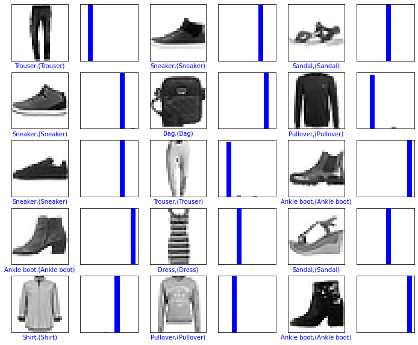

# 前馈神经网络

## 实验介绍

本实验主要介绍使用MindSpore开发前馈神经网络，并使用Fashion-MNIST数据集训练和测试模型。

## 实验目的

- 掌握如何使用MindSpore进行简单前馈神经网络的开发。
- 了解如何使用MindSpore进行简单图片分类任务的训练。
- 了解如何使用MindSpore进行简单图片分类任务的测试和预测。

## 预备知识

- 熟练使用Python。
- 具备一定的深度学习理论知识，如感知机、前馈神经网络、损失函数、优化器，训练策略等。
- 了解华为云的基本使用方法，包括[OBS（对象存储）](https://www.huaweicloud.com/product/obs.html)、[ModelArts（AI开发平台）](https://www.huaweicloud.com/product/modelarts.html)、[训练作业](https://support.huaweicloud.com/engineers-modelarts/modelarts_23_0238.html)等功能。华为云官网：https://www.huaweicloud.com
- 了解并熟悉MindSpore AI计算框架，MindSpore官网：https://www.mindspore.cn/

## 实验环境

- MindSpore 0.5.0（MindSpore版本会定期更新，本指导也会定期刷新，与版本配套）；
- 华为云ModelArts（控制台左上角选择“华北-北京四”）：ModelArts是华为云提供的面向开发者的一站式AI开发平台，集成了昇腾AI处理器资源池，用户可以在该平台下体验MindSpore。

## 实验准备

### 创建OBS桶

本实验需要使用华为云OBS存储脚本和数据集，可以参考[快速通过OBS控制台上传下载文件](https://support.huaweicloud.com/qs-obs/obs_qs_0001.html)了解使用OBS创建桶、上传文件、下载文件的使用方法。

> **提示：** 华为云新用户使用OBS时通常需要创建和配置“访问密钥”，可以在使用OBS时根据提示完成创建和配置。也可以参考[获取访问密钥并完成ModelArts全局配置](https://support.huaweicloud.com/prepare-modelarts/modelarts_08_0002.html)获取并配置访问密钥。

打开[OBS控制台](https://storage.huaweicloud.com/obs/?region=cn-north-4&locale=zh-cn#/obs/manager/buckets)，点击右上角的“创建桶”按钮进入桶配置页面，创建OBS桶的参考配置如下：

- 区域：华北-北京四
- 数据冗余存储策略：单AZ存储
- 桶名称：全局唯一的字符串
- 存储类别：标准存储
- 桶策略：公共读
- 归档数据直读：关闭
- 企业项目、标签等配置：免

### 数据集准备

Fashion-MNIST是一个替代MNIST手写数字集的图像数据集。 它是由Zalando（一家德国的时尚科技公司）旗下的研究部门提供。其涵盖了来自10种类别的共7万个不同商品的正面图片。Fashion-MNIST的大小、格式和训练集/测试集划分与原始的MNIST完全一致。60000/10000的训练测试数据划分，28x28x1的灰度图片。

这里介绍一下经典的MNIST（手写字母）数据集。经典的MNIST数据集包含了大量的手写数字。十几年来，来自机器学习、机器视觉、人工智能、深度学习领域的研究员们把这个数据集作为衡量算法的基准之一。实际上，MNIST数据集已经成为算法作者的必测的数据集之一，但是MNIST数据集太简单了。很多深度学习算法在测试集上的准确率已经达到99.6%。

- 方式一，从[Fashion-MNIST GitHub仓库](https://github.com/zalandoresearch/fashion-mnist/tree/master/data/fashion)下载如下4个文件到本地并解压：

```
train-images-idx3-ubyte     training set images（47,042,560 bytes）   
train-labels-idx1-ubyte     training set labels（61,440 bytes）  
t10k-images-idx3-ubyte      test set images (7,843,840 bytes)  
t10k-labels-idx1-ubyte      test set labels (12,288 bytes) 
```

- 方式二，从华为云OBS中下载[Fashion-MNIST数据集](https://share-course.obs.cn-north-4.myhuaweicloud.com/dataset/fashion-mnist.zip)并解压。

### 脚本准备

从[课程gitee仓库](https://gitee.com/mindspore/course)上下载本实验相关脚本。

### 上传文件

点击新建的OBS桶名，再打开“对象”标签页，通过“上传对象”、“新建文件夹”等功能，将脚本和数据集上传到OBS桶中，组织为如下形式：

```
feedforward  
├── Fashion-MNIST  
│   ├── test  
│   │   ├── t10k-images-idx3-ubyte  
│   │   └── t10k-labels-idx1-ubyte  
│   └── train  
│       ├── train-images-idx3-ubyte  
│       └── train-labels-idx1-ubyte   
└── main.py  
```

## 实验步骤

### 代码梳理

#### 导入MindSpore模块和辅助模块

用到的框架主要包括：

- mindspore，用于神经网络的搭建 
- numpy，用于处理一些数据 
- matplotlib，用于画图、图像展示
- struct，用于处理二进制文件

```python
import os
import struct
import sys
from easydict import EasyDict as edict

import matplotlib.pyplot as plt
import numpy as np

import mindspore
import mindspore.dataset as ds
import mindspore.nn as nn
from mindspore import context
from mindspore.nn.metrics import Accuracy
from mindspore.train import Model
from mindspore.train.callback import ModelCheckpoint, CheckpointConfig, LossMonitor, TimeMonitor
from mindspore import Tensor

context.set_context(mode=context.GRAPH_MODE, device_target='Ascend')
```

#### 变量定义

```python
cfg = edict({
    'train_size': 60000,  # 训练集大小
    'test_size': 10000,  # 测试集大小
    'channel': 1,  # 图片通道数
    'image_height': 28,  # 图片高度
    'image_width': 28,  # 图片宽度
    'batch_size': 60,
    'num_classes': 10,  # 分类类别
    'lr': 0.001,  # 学习率
    'epoch_size': 20,  # 训练次数
    'data_dir_train': os.path.join('Fashion-MNIST', 'train'),
    'data_dir_test': os.path.join('Fashion-MNIST', 'test'),
    'save_checkpoint_steps': 1,  # 多少步保存一次模型
    'keep_checkpoint_max': 3,  # 最多保存多少个模型
    'output_directory': './model_fashion',  # 保存模型路径
    'output_prefix': "checkpoint_fashion_forward"  # 保存模型文件名字
})
```

#### 读取并处理数据

读取数据

```python
def read_image(file_name):
    '''
    :param file_name: 文件路径
    :return:  训练或者测试数据
    如下是训练的图片的二进制格式
    [offset] [type]          [value]          [description]
    0000     32 bit integer  0x00000803(2051) magic number
    0004     32 bit integer  60000            number of images
    0008     32 bit integer  28               number of rows
    0012     32 bit integer  28               number of columns
    0016     unsigned byte   ??               pixel
    0017     unsigned byte   ??               pixel
    ........
    xxxx     unsigned byte   ??               pixel
    '''
    file_handle = open(file_name, "rb")  # 以二进制打开文档
    file_content = file_handle.read()  # 读取到缓冲区中
    head = struct.unpack_from('>IIII', file_content, 0)  # 取前4个整数，返回一个元组
    offset = struct.calcsize('>IIII')
    imgNum = head[1]  # 图片数
    width = head[2]  # 宽度
    height = head[3]  # 高度
    bits = imgNum * width * height  # data一共有60000*28*28个像素值
    bitsString = '>' + str(bits) + 'B'  # fmt格式：'>47040000B'
    imgs = struct.unpack_from(bitsString, file_content, offset)  # 取data数据，返回一个元组
    imgs_array = np.array(imgs).reshape((imgNum, width * height))  # 最后将读取的数据reshape成 【图片数，图片像素】二维数组
    return imgs_array


def read_label(file_name):
    '''
    :param file_name:
    :return:
    标签的格式如下：
    [offset] [type]          [value]          [description]
    0000     32 bit integer  0x00000801(2049) magic number (MSB first)
    0004     32 bit integer  60000            number of items
    0008     unsigned byte   ??               label
    0009     unsigned byte   ??               label
    ........
    xxxx     unsigned byte   ??               label
    The labels values are 0 to 9.
    '''
    file_handle = open(file_name, "rb")  # 以二进制打开文档
    file_content = file_handle.read()  # 读取到缓冲区中
    head = struct.unpack_from('>II', file_content, 0)  # 取前2个整数，返回一个元组
    offset = struct.calcsize('>II')
    labelNum = head[1]  # label数
    bitsString = '>' + str(labelNum) + 'B'  # fmt格式：'>47040000B'
    label = struct.unpack_from(bitsString, file_content, offset)  # 取data数据，返回一个元组
    return np.array(label)


def get_data():
    # 文件获取
    train_image = os.path.join(cfg.data_dir_train, 'train-images-idx3-ubyte')
    test_image = os.path.join(cfg.data_dir_test, "t10k-images-idx3-ubyte")
    train_label = os.path.join(cfg.data_dir_train, "train-labels-idx1-ubyte")
    test_label = os.path.join(cfg.data_dir_test, "t10k-labels-idx1-ubyte")
    # 读取数据
    train_x = read_image(train_image)
    test_x = read_image(test_image)
    train_y = read_label(train_label)
    test_y = read_label(test_label)
    return train_x, train_y, test_x, test_y
```

数据预处理和处理结果图片展示

```python
train_x, train_y, test_x, test_y = get_data()
train_x = train_x.reshape(-1, 1, cfg.image_height, cfg.image_width)
test_x = test_x.reshape(-1, 1, cfg.image_height, cfg.image_width)
train_x = train_x / 255.0
test_x = test_x / 255.0
train_x = train_x.astype('Float32')
test_x = test_x.astype('Float32')
train_y = train_y.astype('int32')
test_y = test_y.astype('int32')
print('训练数据集样本数：', train_x.shape[0])
print('测试数据集样本数：', test_y.shape[0])
print('通道数/图像长/宽：', train_x.shape[1:])
print('一张图像的标签样式：', train_y[0])  # 一共10类，用0-9的数字表达类别。

plt.figure()
plt.imshow(train_x[0,0,...])
plt.colorbar()
plt.grid(False)
plt.show()
```

    训练数据集数量： 60000
    测试数据集数量： 10000
    通道数/图像长/宽： (1, 28, 28)
    一张图像的标签样式： 9


使用MindSpore  GeneratorDataset接口将numpy.ndarray类型的数据转换为Dataset

```python
# 转换数据类型为Dataset
XY_train = list(zip(train_x, train_y))
ds_train = ds.GeneratorDataset(XY_train, ['x', 'y'])
ds_train.set_dataset_size(cfg.train_size)
ds_train = ds_train.shuffle(buffer_size=cfg.train_size).batch(cfg.batch_size, drop_remainder=True).repeat(
    cfg.epoch_size)
XY_test = list(zip(test_x, test_y))
ds_test = ds.GeneratorDataset(XY_test, ['x', 'y'])
ds_test.set_dataset_size(cfg.test_size)
ds_test = ds_test.shuffle(buffer_size=cfg.test_size).batch(cfg.batch_size, drop_remainder=True).repeat(cfg.epoch_size)
```

#### 定义前馈神经网络

前馈神经网络是一种最简单的神经网络，各神经元分层排列（其中每一层包含若干个神经元）。每个神经元只与前一层的神经元相连，接收前一层的输出，并输出给下一层，各层间没有反馈。是目前应用最广泛、发展最迅速的人工神经网络之一。第0层叫输入层，最后一层叫输出层，其他中间层叫做隐含层（或隐藏层、隐层）。隐层可以是一层，也可以是多层，是由全连接层堆叠而成。

<div align=center>
    
</div>

```python
# 定义前馈神经网络
class Forward_fashion(nn.Cell):
    def __init__(self, num_class=10):  # 一共分十类，图片通道数是1
        super(Forward_fashion, self).__init__()
        self.num_class = num_class
        self.flatten = nn.Flatten()
        self.fc1 = nn.Dense(cfg.channel * cfg.image_height * cfg.image_width, 128)
        self.relu = nn.ReLU()
        self.fc2 = nn.Dense(128, self.num_class)

    def construct(self, x):
        x = self.flatten(x)
        x = self.fc1(x)
        x = self.relu(x)
        x = self.fc2(x)
        return x
```

#### 训练

使用Fashion-MNIST数据集对上述定义的前馈神经网络模型进行训练。训练策略如下表所示，可以调整训练策略并查看训练效果。

batch size|number of epochs	| learning rate	|input shape|optimizer
:--:|:--:|:--:|:--:|:--:
60|20|0.001|(1，28，28)|Adam

```python
# 构建网络
network = Forward_fashion(cfg.num_classes)
# 定义模型的损失函数，优化器
net_loss = nn.SoftmaxCrossEntropyWithLogits(is_grad=False, sparse=True, reduction="mean")
net_opt = nn.Adam(network.trainable_params(), cfg.lr)
# 训练模型
model = Model(network, loss_fn=net_loss, optimizer=net_opt, metrics={"acc"})
loss_cb = LossMonitor(per_print_times=int(cfg.train_size / cfg.batch_size))
config_ck = CheckpointConfig(save_checkpoint_steps=cfg.save_checkpoint_steps,
                             keep_checkpoint_max=cfg.keep_checkpoint_max)
ckpoint_cb = ModelCheckpoint(prefix=cfg.output_prefix, directory=cfg.output_directory, config=config_ck)
print("============== Starting Training ==============")
model.train(cfg.epoch_size, ds_train, callbacks=[ckpoint_cb, loss_cb], dataset_sink_mode=True)
```

    ============== Starting Training ==============
    epoch: 1 step 1000, loss is 0.567767322063446
    Epoch time: 11428.370, per step time: 11.428, avg loss: 0.568
    ************************************************************
    epoch: 2 step 1000, loss is 0.3970850706100464
    Epoch time: 2018.074, per step time: 2.018, avg loss: 0.397
    ************************************************************
    epoch: 3 step 1000, loss is 0.31815576553344727
    Epoch time: 1971.219, per step time: 1.971, avg loss: 0.318
    ************************************************************
    epoch: 4 step 1000, loss is 0.3128049373626709
    Epoch time: 1974.937, per step time: 1.975, avg loss: 0.313
    ************************************************************
    epoch: 5 step 1000, loss is 0.3095005750656128
    Epoch time: 2029.930, per step time: 2.030, avg loss: 0.310
    ************************************************************
    epoch: 6 step 1000, loss is 0.25628671050071716
    Epoch time: 1934.886, per step time: 1.935, avg loss: 0.256
    ************************************************************
    epoch: 7 step 1000, loss is 0.24347715079784393
    Epoch time: 1897.307, per step time: 1.897, avg loss: 0.243
    ************************************************************
    epoch: 8 step 1000, loss is 0.28936269879341125
    Epoch time: 1921.264, per step time: 1.921, avg loss: 0.289
    ************************************************************
    epoch: 9 step 1000, loss is 0.4469510316848755
    Epoch time: 1875.093, per step time: 1.875, avg loss: 0.447
    ************************************************************
    epoch: 10 step 1000, loss is 0.2915213108062744
    Epoch time: 1876.605, per step time: 1.877, avg loss: 0.292
    ************************************************************
    epoch: 11 step 1000, loss is 0.24928903579711914
    Epoch time: 1910.094, per step time: 1.910, avg loss: 0.249
    ************************************************************
    epoch: 12 step 1000, loss is 0.12853321433067322
    Epoch time: 1974.167, per step time: 1.974, avg loss: 0.129
    ************************************************************
    epoch: 13 step 1000, loss is 0.14836660027503967
    Epoch time: 1841.105, per step time: 1.841, avg loss: 0.148
    ************************************************************
    epoch: 14 step 1000, loss is 0.26581835746765137
    Epoch time: 1694.728, per step time: 1.695, avg loss: 0.266
    ************************************************************
    epoch: 15 step 1000, loss is 0.2012856900691986
    Epoch time: 1937.829, per step time: 1.938, avg loss: 0.201
    ************************************************************
    epoch: 16 step 1000, loss is 0.14978612959384918
    Epoch time: 1793.748, per step time: 1.794, avg loss: 0.150
    ************************************************************
    epoch: 17 step 1000, loss is 0.3085048198699951
    Epoch time: 1667.389, per step time: 1.667, avg loss: 0.309
    ************************************************************
    epoch: 18 step 1000, loss is 0.17254383862018585
    Epoch time: 1558.955, per step time: 1.559, avg loss: 0.173
    ************************************************************
    epoch: 19 step 1000, loss is 0.10585948824882507
    Epoch time: 1567.354, per step time: 1.567, avg loss: 0.106
    ************************************************************
    epoch: 20 step 1000, loss is 0.27113234996795654
    Epoch time: 1589.239, per step time: 1.589, avg loss: 0.271
    ************************************************************

#### 评估测试

```python
# 使用测试集评估模型，打印总体准确率
metric = model.eval(ds_test)
print(metric)
```

    {'acc': 0.8862449799196788}

#### 预测

```python
# 预测
test_ = ds_test.create_dict_iterator().get_next()
test = Tensor(test_['x'], mindspore.float32)
predictions = model.predict(test)
softmax = nn.Softmax()
predictions = softmax(predictions)
predictions = predictions.asnumpy()
for i in range(15):
    p_np = predictions[i, :]
    p_list = p_np.tolist()
    print('第' + str(i) + '个sample预测结果：', p_list.index(max(p_list)), '   真实结果：', test_['y'][i])
```

    第0个sample预测结果： 7    真实结果： 7
    第1个sample预测结果： 0    真实结果： 0
    第2个sample预测结果： 2    真实结果： 2
    第3个sample预测结果： 6    真实结果： 6
    第4个sample预测结果： 0    真实结果： 0
    第5个sample预测结果： 6    真实结果： 6
    第6个sample预测结果： 5    真实结果： 5
    第7个sample预测结果： 0    真实结果： 0
    第8个sample预测结果： 5    真实结果： 5
    第9个sample预测结果： 7    真实结果： 7
    第10个sample预测结果： 8    真实结果： 8
    第11个sample预测结果： 8    真实结果： 8
    第12个sample预测结果： 6    真实结果： 6
    第13个sample预测结果： 7    真实结果： 9
    第14个sample预测结果： 0    真实结果： 6

#### 对预测结果可视化

```python
# -------------------定义可视化函数--------------------------------
# 输入预测结果序列，真实标签序列，以及图片序列
# 目标是根据预测值对错，让其标签显示为红色或者蓝色。对：标签为红色；错：标签为蓝色
def plot_image(predictions_array, true_label, img):
    plt.grid(False)
    plt.xticks([])
    plt.yticks([])
    # 显示对应图片
    plt.imshow(img, cmap=plt.cm.binary)
    # 显示预测结果的颜色，如果对上了是蓝色，否则为红色
    predicted_label = np.argmax(predictions_array)
    if predicted_label == true_label:
        color = 'blue'
    else:
        color = 'red'
    # 显示对应标签的格式，样式
    plt.xlabel('{},{:2.0f}% ({})'.format(class_names[predicted_label],
                                         100 * np.max(predictions_array),
                                         class_names[true_label]), color=color)
```

```python
# 将预测的结果以柱状图形状显示蓝对红错
def plot_value_array(predictions_array, true_label):
    plt.grid(False)
    plt.xticks([])
    plt.yticks([])
    this_plot = plt.bar(range(10), predictions_array, color='#777777')
    plt.ylim([0, 1])
    predicted_label = np.argmax(predictions_array)
    this_plot[predicted_label].set_color('red')
    this_plot[true_label].set_color('blue')
```

```python
# 预测15个图像与标签，并展现出来
num_rows = 5
num_cols = 3
num_images = num_rows * num_cols
plt.figure(figsize=(2 * 2 * num_cols, 2 * num_rows))
class_names = ['T-shirt/top', 'Trouser', 'Pullover', 'Dress', 'Coat',
               'Sandal', 'Shirt', 'Sneaker', 'Bag', 'Ankle boot']
for i in range(num_images):
    plt.subplot(num_rows, 2 * num_cols, 2 * i + 1)
    pred_np_ = predictions[i, :]  
    plot_image(pred_np_, test_['y'][i], test_['x'][i, 0, ...])
    plt.subplot(num_rows, 2 * num_cols, 2 * i + 2)
    plot_value_array(pred_np_, test_['y'][i])
plt.show()
```



### 适配训练作业

创建训练作业时，运行参数会通过脚本传参的方式输入给脚本代码，脚本必须解析传参才能在代码中使用相应参数。如data_url和train_url，分别对应数据存储路径(OBS路径)和训练输出路径(OBS路径)。脚本对传参进行解析后赋值到args变量里，在后续代码里可以使用。

```python
import argparse
parser = argparse.ArgumentParser()
parser.add_argument('--data_url', required=True, default=None, help='Location of data.')
parser.add_argument('--train_url', required=True, default=None, help='Location of training outputs.')
args, unknown = parser.parse_known_args()
```

MindSpore暂时没有提供直接访问OBS数据的接口，需要通过ModelArts自带的moxing框架与OBS交互。将OBS桶中的数据拷贝至执行容器中，供MindSpore使用：

```python
import moxing
# src_url形如's3://OBS/PATH'，为OBS桶中数据集的路径，dst_url为执行容器中的路径
moxing.file.copy_parallel(src_url=args.data_url, dst_url='Fashion-MNIST/')
```

如需将训练输出（如模型Checkpoint）从执行容器拷贝至OBS，请参考：

```python
import moxing
# src_url为执行容器中的路径，dst_url形如's3://OBS/PATH'，目录若不存在则会新建
moxing.file.copy_parallel(src_url='model_fashion', dst_url=args.train_url)   
```

### 创建训练作业

可以参考[使用常用框架训练模型](https://support.huaweicloud.com/engineers-modelarts/modelarts_23_0238.html)来创建并启动训练作业。

打开[ModelArts控制台-训练管理-训练作业](https://console.huaweicloud.com/modelarts/?region=cn-north-4#/trainingJobs)，点击“创建”按钮进入训练作业配置页面，创建训练作业的参考配置：

>- 算法来源：常用框架->Ascend-Powered-Engine->MindSpore；
>- 代码目录：选择上述新建的OBS桶中的feedforward目录；
>- 启动文件：选择上述新建的OBS桶中的feedforward目录下的`main.py`；
>- 数据来源：数据存储位置->选择上述新建的OBS桶中的feedforward目录下的Fashion-MNIST目录；
>- 训练输出位置：选择上述新建的OBS桶中的feedforward目录并在其中创建model_fashion目录；
>- 作业日志路径：同训练输出位置；
>- 规格：Ascend:1*Ascend 910；
>- 其他均为默认；

>**启动并查看训练过程：**
>
>1. 点击提交以开始训练；
>2. 在训练作业列表里可以看到刚创建的训练作业，在训练作业页面可以看到版本管理；
>3. 点击运行中的训练作业，在展开的窗口中可以查看作业配置信息，以及训练过程中的日志，日志会不断刷新，等训练作业完成后也可以下载日志到本地进行查看；
>4. 参考上述代码梳理，在日志中找到对应的打印信息，检查实验是否成功；

## 实验小结

本实验展示了如何使用MindSpore进行Fashion-MNIST数据集分类。

首先训练前馈神经网络，然后使用训练后的前馈神经网络模型对Fashion-MNIST测试数据进行分类，从结果上分析准确率大于80%，即前馈神经网络学习到了Fashion-MNIST数据集分类。
