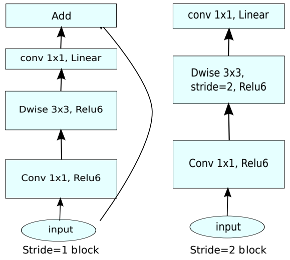

# Fine-tuning on MobileNetV2

## Introduction

This experiment describes how to use MindSpore to perform Fine-tuning. In the CPU environment, 
use the pre-trained MobileNetV2 model (trained on OpenImage) to perform fine-tune on the flower dataset.

## Objectives

- Learn how to use MindSpore to do Fine-tuning.
- Understand the principles and methods of Fine-tuning.
- Learn the structure and principles of MobileNetV2.

## Prerequisites

- Be proficient in Python and understand the basic knowledge of Shell and Linux operating systems.
- Have certain theoretical knowledge of deep learning, such as convolutional neural networks, loss functions, optimizers, and training strategies.

## Environment

MindSpore 1.0.0 CPU and third-party auxiliary modules.

MindSpore supports running on local CPU/GPU/Ascend environments, such as Windows/Ubuntu x64 laptops, 
NVIDIA GPU servers, and Atlas Ascend servers. Before running the experiment in the local environment, 
you need to refer to [Installation Tutorial](https://www.mindspore.cn/install/en) to install and configure the environment.

## Preparation

### Dataset Preparation

Download the flower classification datasets from the following links:

- Training dataset: https://professional.obs.cn-north-4.myhuaweicloud.com/flower_photos_train.zip
- Test dataset: https://professional.obs.cn-north-4.myhuaweicloud.com/flower_photos_test.zip

Prepare the dataset in MindSpore ImageFolderDataset format.

### Pre-training Model Preparation

Download the [pre-training MobileNetV2 model](https://download.mindspore.cn/model_zoo/official/lite/mobilenetv2_openimage_lite/mobilenetv2_cpu_gpu.ckpt) from MindSpore Hub.

### Script Preparation

Download the MobileNetV2 codes from the [Model Zoo in MindSpore open-source repository](https://gitee.com/mindspore/mindspore/tree/r1.0/model_zoo/official/cv/mobilenetv2/).
 
Specifically, Download the zip package of the r1.0 branch from the MindSpore repository or run the git command to download the package.

```bash
git clone https://gitee.com/mindspore/mindspore.git -b r1.0
mkdir mobilenetv2
cp -r ./mindspore/model_zoo/official/cv/mobilenetv2  ./mobilenetv2/code
```

Organize the script and dataset as follows:

```
mobilenetv2
├── code
│   ├── src
│   │   ├── config.py           # parameter configuration
│   │   ├── dataset.py          # creating dataset
│   │   ├── launch.py           # start Python script
│   │   ├── lr_generator.py     # learning rate config
│   │   ├── mobilenetV2.py      # MobileNetV2 architecture
│   │   ├── models.py           # net utils to load ckpt_file, define_net...

│   │   └── utils.py            # net utils to switch precision, set_context 
│   ├── train.py                # training script
│   └── eval.py                 # evaluation script
├── pretrain_checkpoint
│   └── mobilenetv2_cpu_gpu.ckpt        # Pre-trained model
└── data
    ├── flower_photos_train
    │   └── *            # daisy, dandelion, roses, sunflowers, tulips 
    └──flower_photos_test
        └── *            # daisy, dandelion, roses, sunflowers, tulips 
```

## Procedures

The downloaded mobilenetv2_cpu_gpu.ckpt is obtained by training the MobileNetV2 network on the OpenImage dataset. 
The OpenImage dataset contains a large amount of data. And it will take a long time to training a model on the OpenImage dataset.
To accelerate the training speed on CPU, we perform Fine-tuning on the flower classification data based on pretrained MobileNetV2 checkpoint. 
Define the MobileNetV2Backbone network (excluding the Pooling and FullyConnecting Layers) and 
the MobileNetV2Head network (Pooling and FullyConnecting Layer). Then, load the checkpoint into the Backbone network, and train only the MobileNetV2Head. 

The scripts in this experiment contains the following three training modes:

1.	train: Fine-tuning is not used, and the MobileNetV2 network is trained from the beginning. For details about the network definition, see the MobileNetV2 class in src/MobileNetV2.py.
2.	fine-tune: Fine-tuning is used. The network contains two parts: MobileNetV2Backbone and MobileNetV2Head.
    The MobileNetV2Backbone network parameters are obtained from a trained ckpt model. 
    For details about the network definition, see the MobileNetV2Backbone and MobileNetV2Head classes in src/MobileNetV2.py.
    There are two training modes according to whether freeze the MobileNetV2Backbone weights or not.
    
    1. The MobileNetV2Backbone part is not frozen. 
    2. The MobileNetV2Backbone part is frozen. Only the MobileNetV2Head network is trained.

**Note:** The CPU has limited computing power, so only supports fine-tuning with freezing. `freeze_layer` should be `backbone`.

The training process is as follows:

1. Define the Backbone network, load the mobilenetv2_cpu_gpu.ckpt, and use the Backbone network to featurelize the dataset and generate feature data.
2. Define the MobileNetV2Head network and use the feature data as the input to train the MobileNetV2Head network.

Note: The input dimensions of the MobileNetV2Head network must be the same as the output dimensions of the Backbone network.

### MobileNetV2

MobileNetV1 is a lightweight deep neural network released by Google in 2017. It uses depthwise separable convolution to 
replace common convolution. MobileNetV2 proposed in 2018 introduces linear bottleneck and inverted residual on the basis
 of V1 to improve the network representation capability.

#### Depthwise Separable Convolution of MobileNetV1

Depthwise Separable Convolutions are a key building block for efficient neural network architectures. The basic idea is 
to replace a full convolutional operator with a factorized version that splits convolution into two separate layers. 
The first layer is called a depthwise convolution, it performs lightweight filtering by applying a single convolutional 
filter per input channel. The second layer is a 1x1 convolution, called a pointwise convolution, which is responsible 
for building new features through computing linear combinations of the input channels.

Convolution Type|Input Dimension|Number of Output Channels|Kernel|Number of Kernel Prameters|Output Dimension|Computation Amount
:--:|:--:|:--:|:--:|:--:|----|----
Standard convolution|$C_{in} * H * W$|$C_{out}$| $K * K $ | $K * K * C_{in} * C_{out}$ |$C_{out} * H * W$|$K * K* C_{in} * C_{out} *  H* W$
Depthwise convolution|$C_{in} * H * W$|$C_{in}$|$K * K$| $K * K * C_{in}$|$C_{in} * H * W$|$K * K * C_{in} * H * W$
Pointwise convolution|$C_{in} * H * W$|$C_{out}$|$1 * 1$|$1 * 1 * C_{in} * C_{out}$|$C_{out} * H * W$|$1 * 1 *  C_{in} * C_{out} *  H* W$
Depthwise separable convolution|$C_{in} * H * W$|$C_{out}$|||$C_{out} * H * W$|$（K * K + C_{out}） * C_{in} * H * W$

The table shows that a depthwise separable convolution uses two separable convolutions (depthwise convolution and 
pointwise convolution) to replace a standard convolution, which increases the depth but greatly reduces the computation amount.

#### Improvements of MobileNetV2

- Linear Bottlenecks

    Informally, for an input set of real images, we say that the set of layer activations (for any layer Li) forms a 
    "manifold of interest". It has been long assumed that manifolds of interest in neural networks could be embedded in 
    low-dimensional subspaces. In other words, when we look at all individual d-channel pixels of a deep convolutional 
    layer, the information encoded in those values actually lie in some manifold, which in turn is embeddable into a 
    low-dimensional subspace.
    
    - If the manifold of interest remains non-zero volume after ReLU transformation, it corresponds to a linear transformation.
    - ReLU is capable of preserving complete information about the input manifold, but only if the input manifold lies in a low-dimensional subspace of the input space.

    These two insights provide us with an empirical hint for optimizing existing neural architectures: assuming the 
    manifold of interest is low-dimensional we can capture this by inserting linear bottleneck layers into the 
    convolutional blocks. Experimental evidence suggests that using linear layers is crucial as it prevents 
    nonlinearities from destroying too much information.

- Inverted residuals

    The bottleneck blocks appear similar to residual block where each block contains an input followed by several 
    bottlenecks then followed by expansion. However, inspired by the intuition that the bottlenecks actually contain 
    all the necessary information, while an expansion layer acts merely as an implementation detail that accompanies a 
    non-linear transformation of the tensor, we use shortcuts directly between the bottlenecks.
    
    The following figures show the MobileNetV2 blocks with or without shortcut.
    
    - If stride = 1, use shortcut to connect the input bottleneck to the output bottleneck (on the left of the following figure).
    - If stride = 2, there is no input or output feature of the short cut connection (on the right of the following figure).

    

#### Define MobileNetV2

For details about MobileNetV2, see https://arxiv.org/pdf/1801.04381.pdf. For details about the network definition, see `src/MobileNetV2.py`.

Input|Operations|t(expand_ratio)|c(Number of output channels)|n(repeat number)|s(stride)
:--:|:--:|:--:|:--:|:--:|:--:
$3 * 224 * 224 $|conv2d|-|32|1|1
$32 * 112 * 112$|InvertedResidual|1|16|1|1
$16 * 112 * 112$|InvertedResidual|6|24|2|2
$24 * 56 * 56$|InvertedResidual|6|32|3|2
$32 * 28 * 28$|InvertedResidual|6|64|4|2
$64 * 28 * 28$|InvertedResidual|6|96|3|1
$96 * 14 * 14$|InvertedResidual|6|160|3|2
$160 * 7 * 7$|InvertedResidual|6|320|1|1
$320 * 7 * 7$|conv2d 1*1|-|1280|1|1
$1280 * 7 * 7$|avgpool 7*7|-|-|1|-
$1 * 1 * k$|conv2d 1*1|-|k|-|-

Define the `MobileNetV2Backbone` Network(`src/MobileNetV2.py`)

```python
class MobileNetV2Backbone(nn.Cell):
    """
    MobileNetV2 architecture.

    Args:
        class_num (int): number of classes.
        width_mult (int): Channels multiplier for round to 8/16 and others. Default is 1.
        has_dropout (bool): Is dropout used. Default is false
        inverted_residual_setting (list): Inverted residual settings. Default is None
        round_nearest (list): Channel round to . Default is 8
    Returns:
        Tensor, output tensor.

    Examples:
        >>> MobileNetV2(num_classes=1000)
    """

    def __init__(self, width_mult=1., inverted_residual_setting=None, round_nearest=8,
                 input_channel=32, last_channel=1280):
        super(MobileNetV2Backbone, self).__init__()
        block = InvertedResidual
        # setting of inverted residual blocks
        self.cfgs = inverted_residual_setting
        if inverted_residual_setting is None:
            self.cfgs = [
                # t, c, n, s
                [1, 16, 1, 1],
                [6, 24, 2, 2],
                [6, 32, 3, 2],
                [6, 64, 4, 2],
                [6, 96, 3, 1],
                [6, 160, 3, 2],
                [6, 320, 1, 1],
            ]

        # building first layer
        input_channel = _make_divisible(input_channel * width_mult, round_nearest)
        self.out_channels = _make_divisible(last_channel * max(1.0, width_mult), round_nearest)
        features = [ConvBNReLU(3, input_channel, stride=2)]
        # building inverted residual blocks
        for t, c, n, s in self.cfgs:
            output_channel = _make_divisible(c * width_mult, round_nearest)
            for i in range(n):
                stride = s if i == 0 else 1
                features.append(block(input_channel, output_channel, stride, expand_ratio=t))
                input_channel = output_channel
        # building last several layers
        features.append(ConvBNReLU(input_channel, self.out_channels, kernel_size=1))
        # make it nn.CellList
        self.features = nn.SequentialCell(features)
        self._initialize_weights()

    def construct(self, x):
        x = self.features(x)
        return x

    def _initialize_weights(self):
        """
        Initialize weights.

        Args:

        Returns:
            None.

        Examples:
            >>> _initialize_weights()
        """
        self.init_parameters_data()
        for _, m in self.cells_and_names():
            if isinstance(m, nn.Conv2d):
                n = m.kernel_size[0] * m.kernel_size[1] * m.out_channels
                m.weight.set_data(Tensor(np.random.normal(0, np.sqrt(2. / n),
                                                          m.weight.data.shape).astype("float32")))
                if m.bias is not None:
                    m.bias.set_data(
                        Tensor(np.zeros(m.bias.data.shape, dtype="float32")))
            elif isinstance(m, nn.BatchNorm2d):
                m.gamma.set_data(
                    Tensor(np.ones(m.gamma.data.shape, dtype="float32")))
                m.beta.set_data(
                    Tensor(np.zeros(m.beta.data.shape, dtype="float32")))

    @property
    def get_features(self):
        return self.features
```

Among them, InvertedResidual is composed of three parts, as shown in the following table.

Input|Operation|Output|Description
:--:|:--:|:--:|----
$c_{in}*h*w$|conv2d 1*1, Relu|$c_{in} t*h*w$|Pointwise Conv
$c_{in} t*h*w$|depthwise conv2d  3*3 ,Relu|$c_{in} t* \frac{h}{s}*\frac{w}{s}$|Depthwise Conv
$c_{in} t* \frac{h}{s}*\frac{w}{s}$|conv2d 1*1, linear|$c* \frac{h}{s}*\frac{w}{s}$|Pointwise Conv

**Note:** Where t means expand_ratio, c means number of output channels, s means stride.

Define the InvertedResidual (src/MobileNetV2.py):

```python
class InvertedResidual(nn.Cell):
    """
    Mobilenetv2 residual block definition.

    Args:
        inp (int): Input channel.
        oup (int): Output channel.
        stride (int): Stride size for the first convolutional layer. Default: 1.
        expand_ratio (int): expand ration of input channel

    Returns:
        Tensor, output tensor.

    Examples:
        >>> ResidualBlock(3, 256, 1, 1)
    """

    def __init__(self, inp, oup, stride, expand_ratio):
        super(InvertedResidual, self).__init__()
        assert stride in [1, 2]

        hidden_dim = int(round(inp * expand_ratio))
        self.use_res_connect = stride == 1 and inp == oup

        layers = []
        if expand_ratio != 1:
            layers.append(ConvBNReLU(inp, hidden_dim, kernel_size=1))
        layers.extend([
            # dw
            ConvBNReLU(hidden_dim, hidden_dim,
                       stride=stride, groups=hidden_dim),
            # pw-linear
            nn.Conv2d(hidden_dim, oup, kernel_size=1,
                      stride=1, has_bias=False),
            nn.BatchNorm2d(oup),
        ])
        self.conv = nn.SequentialCell(layers)
        self.add = TensorAdd()
        self.cast = P.Cast()

    def construct(self, x):
        identity = x
        x = self.conv(x)
        if self.use_res_connect:
            return self.add(identity, x)
        return x
```

Among them, ConvBNReLU (`src/MobileNetV2.py`) integrates convolution, BatchNorm and ReLU. Both depthwise convolution and
 normal convolution use the function nn.Conv2d. The difference lies in the groups parameter. When groups is equal to the
  number of input channels, it is depthwise convolution, and when groups is equal to 1, it is normal convolution.

```python
class ConvBNReLU(nn.Cell):
    """
    Convolution/Depthwise fused with Batchnorm and ReLU block definition.

    Args:
        in_planes (int): Input channel.
        out_planes (int): Output channel.
        kernel_size (int): Input kernel size.
        stride (int): Stride size for the first convolutional layer. Default: 1.
        groups (int): channel group. Convolution is 1 while Depthiwse is input channel. Default: 1.

    Returns:
        Tensor, output tensor.

    Examples:
        >>> ConvBNReLU(16, 256, kernel_size=1, stride=1, groups=1)
    """

    def __init__(self, in_planes, out_planes, kernel_size=3, stride=1, groups=1):
        super(ConvBNReLU, self).__init__()
        padding = (kernel_size - 1) // 2
        in_channels = in_planes
        out_channels = out_planes
        if groups == 1:
            conv = nn.Conv2d(in_channels, out_channels, kernel_size, stride, pad_mode='pad', padding=padding)
        else:
            out_channels = in_planes
            conv = nn.Conv2d(in_channels, out_channels, kernel_size, stride, pad_mode='pad',
                             padding=padding, group=in_channels)

        layers = [conv, nn.BatchNorm2d(out_planes), nn.ReLU6()]
        self.features = nn.SequentialCell(layers)

    def construct(self, x):
        output = self.features(x)
        return output
```

### MobileNetV2Head

Define the MobileNetV2Head Network (src/MobileNetV2.py)

```python
class MobileNetV2Head(nn.Cell):
    """
    MobileNetV2 architecture.

    Args:
        class_num (int): Number of classes. Default is 1000.
        has_dropout (bool): Is dropout used. Default is false
    Returns:
        Tensor, output tensor.

    Examples:
        >>> MobileNetV2(num_classes=1000)
    """

    def __init__(self, input_channel=1280, num_classes=1000, has_dropout=False, activation="None"):
        super(MobileNetV2Head, self).__init__()
        # mobilenet head
        head = ([GlobalAvgPooling(), nn.Dense(input_channel, num_classes, has_bias=True)] 
                if not has_dropout else
                [GlobalAvgPooling(), nn.Dropout(0.2), nn.Dense(input_channel, num_classes, has_bias=True)])
        self.head = nn.SequentialCell(head)
        self.need_activation = True
        if activation == "Sigmoid":
            self.activation = P.Sigmoid()
        elif activation == "Softmax":
            self.activation = P.Softmax()
        else:
            self.need_activation = False
        self._initialize_weights()

    def construct(self, x):
        x = self.head(x)
        if self.need_activation:
            x = self.activation(x)
        return x

    def _initialize_weights(self):
        """
        Initialize weights.

        Args:

        Returns:
            None.

        Examples:
            >>> _initialize_weights()
        """
        self.init_parameters_data()
        for _, m in self.cells_and_names():
            if isinstance(m, nn.Dense):
                m.weight.set_data(Tensor(np.random.normal(
                    0, 0.01, m.weight.data.shape).astype("float32")))
                if m.bias is not None:
                    m.bias.set_data(
                        Tensor(np.zeros(m.bias.data.shape, dtype="float32")))
    @property
    def get_head(self):
        return self.head
```

### Other code

Network definition and initialization (`src/model.py`).

```python
def define_net(config, is_training):
    backbone_net = MobileNetV2Backbone()
    activation = config.activation if not is_training else "None"
    head_net = MobileNetV2Head(input_channel=backbone_net.out_channels,
                               num_classes=config.num_classes,
                               activation=activation)
    net = mobilenet_v2(backbone_net, head_net)
    return backbone_net, head_net, net
```

Define the feature extraction function `extract_features()` (`src/dataset.py`). Use Backbone to do a reasoning on the
 full flower data set to get feature maps.

```python
def extract_features(net, dataset_path, config):
    features_folder = os.path.abspath(dataset_path) + '_features'
    if not os.path.exists(features_folder):
        os.makedirs(features_folder)
    dataset = create_dataset(dataset_path=dataset_path,
                             do_train=False,
                             config=config)
    step_size = dataset.get_dataset_size()
    if step_size == 0:
        raise ValueError("The step_size of dataset is zero. Check if the images count of train dataset \
                         is more than batch_size in config.py")
    model = Model(net)

    for i, data in enumerate(dataset.create_dict_iterator(output_numpy=True)):
        features_path = os.path.join(features_folder, f"feature_{i}.npy")
        label_path = os.path.join(features_folder, f"label_{i}.npy")
        if not os.path.exists(features_path) or not os.path.exists(label_path):
            image = data["image"]
            label = data["label"]
            features = model.predict(Tensor(image))
            np.save(features_path, features.asnumpy())
            np.save(label_path, label)
        print(f"Complete the batch {i+1}/{step_size}")
    return step_size
```

Initialize the network and extract feature maps from the dataset (`train.py`)

```python
# define network
backbone_net, head_net, net = define_net(config, args_opt.is_training)

if args_opt.pretrain_ckpt and args_opt.freeze_layer == "backbone":
    load_ckpt(backbone_net, args_opt.pretrain_ckpt, trainable=False)
    step_size = extract_features(backbone_net, args_opt.dataset_path, config)
```

Fine-tune(`train.py`)

```python
if args_opt.pretrain_ckpt is None or args_opt.freeze_layer == "none":
    loss_scale = FixedLossScaleManager(config.loss_scale, drop_overflow_update=False)
    opt = Momentum(filter(lambda x: x.requires_grad, net.get_parameters()), lr, config.momentum, \
            config.weight_decay, config.loss_scale)
    model = Model(net, loss_fn=loss, optimizer=opt, loss_scale_manager=loss_scale)

    cb = config_ckpoint(config, lr, step_size)
    print("============== Starting Training ==============")
    model.train(epoch_size, dataset, callbacks=cb)
    print("============== End Training ==============")

else:
    opt = Momentum(filter(lambda x: x.requires_grad, head_net.get_parameters()), lr, config.momentum,\      
                   config.weight_decay)

    network = WithLossCell(head_net, loss)
    network = TrainOneStepCell(network, opt)
    network.set_train()

    features_path = args_opt.dataset_path + '_features'
    idx_list = list(range(step_size))
    rank = 0
    if config.run_distribute:
        rank = get_rank()
    save_ckpt_path = os.path.join(config.save_checkpoint_path, 'ckpt_' + str(rank) + '/')
    if not os.path.isdir(save_ckpt_path):
        os.mkdir(save_ckpt_path)

    for epoch in range(epoch_size):
        random.shuffle(idx_list)
        epoch_start = time.time()
        losses = []
        for j in idx_list:
            feature = Tensor(np.load(os.path.join(features_path, f"feature_{j}.npy")))
            label = Tensor(np.load(os.path.join(features_path, f"label_{j}.npy")))
            losses.append(network(feature, label).asnumpy())
        epoch_mseconds = (time.time()-epoch_start) * 1000
        per_step_mseconds = epoch_mseconds / step_size
        print("epoch[{}/{}], iter[{}] cost: {:5.3f}, per step time: {:5.3f}, avg loss: {:5.3f}"\
        .format(epoch + 1, epoch_size, step_size, epoch_mseconds, per_step_mseconds, 
                np.mean(np.array(losses))))
        if (epoch + 1) % config.save_checkpoint_epochs == 0:
            save_checkpoint(net, os.path.join(save_ckpt_path, f"mobilenetv2_{epoch+1}.ckpt"))
    print("total cost {:5.4f} s".format(time.time() - start))
```

### Set the HyperParameter

```python
config_cpu = ed({
    "num_classes": 5,         # Number of categories of the dataset.
    "image_height": 224,      # Height of the image to be trained
    "image_width": 224,       # Width of the image to be trained
    "batch_size": 64,         # Number of samples in each batch
    "epoch_size": 20,         # Training epochs
    "warmup_epochs": 0,       # lr warmup epochs
    "lr_init": .0,            # Initial learning rate
    "lr_end": 0.0 ,           # Final learning rate
    "lr_max": 0.01,           # Maximum learning rate
    "momentum": 0.9,          # Momentum factor for optimizer
    "weight_decay": 4e-5,     # Regularization parameter
    "label_smooth": 0.1,      # Smooth factor for loss
    "loss_scale": 1024,       # Factor multiplied to loss
    "save_checkpoint": True,  # Whether to save model
    "save_checkpoint_epochs": 5,   # Number of epochs to save the model once in incremental_learn mode.
    "keep_checkpoint_max": 20,     # Maximum number of models that can be saved in “none” mode.
    "save_checkpoint_path": "./",  # Model storage path
    "platform": args.platform,     # The value can be CPU, GPU, or Ascend. Here, the value is fixed to CPU.
    "run_distribute": False,       # Should be False on CPU
    "activation": "Softmax"        # Activation function for last layer
})

```

**Note:** The batch_size for the validation experiment is set to 1, and the other parameters are the same as during training.

### Fine-tune the model

Run `train.py` when using MobileNetV2 for Fine-tuning. Currently, `train.py` supports only a single processor. Pass mandatory parameters as follows:
- `--dataset_path`: path of training dataset.
- `--platform`: device type, such as Ascend, CPU, or GPU. In this experiment, set --platform to CPU.
- `--freeze_layer`：whether freeze the  backbone or not. "none" or "backbone". "none" means train the entire network. "backbone" means do not train the backbone. Choose "backbone" on CPU platform.
- `--pretrain_ckpt`: the path of the pretrain_checkpoint.
- `--run_distribute`: whether to use the distributed training mode. The CPU platform does not support distributed training. Set this parameter to False.

**Method 1:** Set running parameters with the args file.

1. Open the `src/args.py` configuration file and modify train_parse_args as follows to specify the default running parameters:

```python
def train_parse_args():
    train_parser = argparse.ArgumentParser(description='Image classification trian')
    train_parser.add_argument('--platform', type=str, default="CPU", choices=("CPU", "GPU", "Ascend"), \
        help='run platform, only support CPU, GPU and Ascend')
    train_parser.add_argument('--dataset_path', type=str, default="../data/flower_photos_train", help='Dataset path')
    train_parser.add_argument('--pretrain_ckpt', type=str, default="../pretrain_checkpoint/mobilenetv2_cpu_gpu.ckpt", help='Pretrained checkpoint path \
        for fine tune or incremental learning')
    train_parser.add_argument('--freeze_layer', type=str, default="backbone", choices=["none", "backbone"], \
        help="freeze the weights of network from start to which layers")
    train_parser.add_argument('--run_distribute', type=ast.literal_eval, default=True, help='Run distribute')
    train_args = train_parser.parse_args()
    train_args.is_training = True
    return train_args
```

2. Open the CLI and run the `cd` command to go to the directory where `train.py` located. Enter `python train.py` to train the network.

**Method 2:** Set running parameters with the CLI.

```Shell
python train.py --platform CPU --dataset_path ../data/flower_photos_train --freeze_layer backbone --pretrain_ckpt ../pretrain_checkpoint/mobilenetv2_cpu_gpu.ckpt --run_distribute False 
```

Run the Python file and view the print information in the interactive command line.

```
train args: Namespace(dataset_path='../data/flower_photos_train', freeze_layer='backbone', is_training=True, platform='CPU', pretrain_ckpt='../pretrain_checkpoint/mobilenetv2_cpu_gpu.ckpt', run_distribute=True)
cfg: {'num_classes': 5, 'image_height': 224, 'image_width': 224, 'batch_size': 64, 'epoch_size': 20, 'warmup_epochs': 0, 'lr_init': 0.0, 'lr_end': 0.0, 'lr_max': 0.01, 'momentum': 0.9, 'weight_decay': 4e-05, 'label_smooth': 0.1, 'loss_scale': 1024, 'save_checkpoint': True, 'save_checkpoint_epochs': 5, 'keep_checkpoint_max': 20, 'save_checkpoint_path': './', 'platform': 'CPU', 'run_distribute': False, 'activation': 'Softmax'}
Complete the batch 1/56
Complete the batch 2/56
Complete the batch 3/56
...
Complete the batch 54/56
Complete the batch 55/56
Complete the batch 56/56
epoch[1/20], iter[56] cost: 8033.059, per step time: 143.447, avg loss: 1.276
epoch[2/20], iter[56] cost: 7573.483, per step time: 135.241, avg loss: 0.880
epoch[3/20], iter[56] cost: 7492.869, per step time: 133.801, avg loss: 0.784
epoch[4/20], iter[56] cost: 7391.710, per step time: 131.995, avg loss: 0.916
epoch[5/20], iter[56] cost: 7421.159, per step time: 132.521, avg loss: 0.827
epoch[6/20], iter[56] cost: 7474.850, per step time: 133.479, avg loss: 0.828
epoch[7/20], iter[56] cost: 7415.375, per step time: 132.417, avg loss: 0.796
epoch[8/20], iter[56] cost: 7369.605, per step time: 131.600, avg loss: 0.714
epoch[9/20], iter[56] cost: 7457.325, per step time: 133.167, avg loss: 0.700
epoch[10/20], iter[56] cost: 7545.579, per step time: 134.742, avg loss: 0.739
epoch[11/20], iter[56] cost: 8036.823, per step time: 143.515, avg loss: 0.685
epoch[12/20], iter[56] cost: 7922.403, per step time: 141.471, avg loss: 0.666
epoch[13/20], iter[56] cost: 8000.985, per step time: 142.875, avg loss: 0.665
epoch[14/20], iter[56] cost: 7997.285, per step time: 142.809, avg loss: 0.657
epoch[15/20], iter[56] cost: 7973.143, per step time: 142.378, avg loss: 0.655
epoch[16/20], iter[56] cost: 7872.075, per step time: 140.573, avg loss: 0.649
epoch[17/20], iter[56] cost: 7925.634, per step time: 141.529, avg loss: 0.646
epoch[18/20], iter[56] cost: 7949.169, per step time: 141.949, avg loss: 0.645
epoch[19/20], iter[56] cost: 7692.628, per step time: 137.368, avg loss: 0.641
epoch[20/20], iter[56] cost: 7353.783, per step time: 131.318, avg loss: 0.640
total cost 156.8277 s
```

Note: If the values of batch_size, image_height, and image_width are changed, delete the `../data/flower_photos_train_features`
 folder and generate a new one. When the feature folder `flower_photos_train_features` exists, feature files are no 
 longer generated to save time. Features is related to batch_size, image_height, and image_width, and feature files vary
 depending on the batch_size, image_height, and image_width parameters.)

### Validate the model

Pass mandatory parameters for `eval.py` to validate the model on validation dataset.
- `--dataset_path`: path of the test dataset.
- `--platform`: device type, such as Ascend, CPU, or GPU. In this experiment, set platform to CPU.
- `--pretrain_ckpt`: path of the checkpoint of the finetuned model.
- `--run_distribute`: specifies whether to use the distributed running mode. The CPU does not support distributed running. Set this parameter to False.

Note: Batch size should less or equal than number of validation dataset. Please modify `src/config.py` line 26 as follows:

`"batch_size": 50,`

**Method 1:** Set running parameters in the args file.

1. Open the `src/args.py` configuration file and modify `eval_parse_args` as follows to specify the default running parameters:

```python
def eval_parse_args():
    eval_parser = argparse.ArgumentParser(description='Image classification eval')
    eval_parser.add_argument('--platform', type=str, default="CPU", choices=("Ascend", "GPU", "CPU"), \
        help='run platform, only support GPU, CPU and Ascend')
    eval_parser.add_argument('--dataset_path', type=str, default="../data/flower_photos_test", help='Dataset path')
    eval_parser.add_argument('--pretrain_ckpt', type=str, default="./ckpt_0/mobilenetv2_20.ckpt", help='Pretrained checkpoint path \
        for fine tune or incremental learning')
    eval_parser.add_argument('--run_distribute', type=ast.literal_eval, default=False, help='If run distribute in GPU.')
    eval_args = eval_parser.parse_args()
    eval_args.is_training = False
    return eval_args
```

2. Open the CLI and run the `cd` command to go to the directory where `eval.py` located. Enter `python eval.py` to evaluate the network.

**Method 2:** Set running parameters with the CLI.

```Shell
python eval.py --platform CPU --dataset_path ../data/flower_photos_test  --pretrain_ckpt ./ckpt_0/mobilenetv2_{epoch_num}.ckpt  --run_distribute False
```

When the Python file is run, the validation result is displayed in the interactive command line. The result is as follows:

```
result:{'acc': 0.9038461538461539}
pretrain_ckpt=./ckpt_0/mobilenetv2_20.ckpt
```
