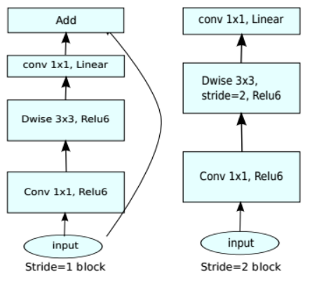

#  使用MobileNetV2网络实现微调（Fine Tune）

## 实验介绍

本实验介绍使用MindSpore，在CPU环境下，mobileNetV2网络做微调训练与验证。

## 实验目的

- 掌握如何使用MindSpore进行微调实验开发。
- 理解微调方法的原理、方法。
- 了解如何使用MindSpore进行MobileNetV2网络训练与验证。

## 预备知识

- 熟练使用Python，了解Shell及Linux操作系统基本知识。
- 具备一定的深度学习理论知识，如卷积神经网络、损失函数、优化器，训练策略等。

## 实验环境

- MindSpore 1.0.0-CPU

## 实验准备

### 数据集准备

准备ImageFolder格式管理的数据集，运行`train.py`时加入`--dataset_path [dataset_path]`参数。

这里采用花分类数据集。下载地址为：
- 训练数据集链接：https://professional.obs.cn-north-4.myhuaweicloud.com/flower_photos_train.zip
- 测试数据集链接：https://professional.obs.cn-north-4.myhuaweicloud.com/flower_photos_test.zip

### 预训练模型准备  

[下载预训练模型](https://download.mindspore.cn/model_zoo/official/lite/mobilenetv2_openimage_lite/)(mobilenetv2_cpu_gpu.ckpt)到以下目录： 
`./pretrain_checkpoint/[pretrain_checkpoint_file]`  

```Python
mkdir pretrain_checkpoint
wget -P ./pretrain_checkpoint https://download.mindspore.cn/model_zoo/official/lite/mobilenetv2_openimage_lite/mobilenetv2_cpu_gpu.ckpt
```

### 脚本准备

从[课程gitee仓库](https://gitee.com/mindspore/course)上下载本实验相关脚本。  

在Gitee中克隆[MindSpore开源项目仓库](https://gitee.com/mindspore/mindspore.git)，进入`./model_zoo/official/cv/mobilenetv2/`直接下载。  

```bash
git clone https://gitee.com/mindspore/mindspore.git -b r1.0
mkdir mobilenetv2
cp -r ./mindspore/model_zoo/official/cv/mobilenetv2  ./mobilenetv2/code
```

### 文件结构

```
mobilenetv2
├── code
│   ├── src
│   │   ├── config.py           # parameter configuration
│   │   ├── dataset.py          # creating dataset
│   │   ├── launch.py           # start Python script
│   │   ├── lr_generator.py     # learning rate config
│   │   ├── mobilenetV2.py      # MobileNetV2 architecture
│   │   ├── models.py           # net utils to load ckpt_file, define_net...
│   │   └── utils.py            # net utils to switch precision, set_context 
│   ├── train.py                # training script
│   └── eval.py                 # evaluation script
├── pretrain_checkpoint
│   └── mobilenetv2_cpu_gpu.ckpt        # Pre-trained model
└── data
    ├── flower_photos_train
    │   └── *            # daisy, dandelion, roses, sunflowers, tulips 
    └──flower_photos_test
        └── *            # daisy, dandelion, roses, sunflowers, tulips 
```

## 实验步骤

### 微调

MobileNetV2实验包含2种训练方式，分别为：
- `train`: 不使用预训练模型。从头到尾训练MobileNetV2网络（参数freeze_layer为“none”，参数pretrain_ckpt为None）。网络定义参考src/MobileNetV2.py 中的MobileNetV2类。
- `fine_tune`：微调，使用预训练模型（大数据集）训练网络，根据是否冻结一部分网络分为两种。 
  - 不冻结MobileNetV2Backbone部分（参数freeze_layer为“none”）。网络包含MobileNetV2Backbone和MobileNetV2Head两部分，其中MobileNetV2Backbone网络参数是从一个已经训练好的ckpt模型中得到（参数pretrain_ckpt非空）。网络定义参考src/MobileNetV2.py 中的MobileNetV2Backbone、MobileNetV2Head类。
  - 冻结MobileNetV2Backbone部分（参数freeze_layer为"backbone"）。只训练MobileNetV2Head网络，其中MobileNetV2Backbone网络参数是从一个已经训练好的ckpt模型中得到（参数pretrain_ckpt非空）。

**注意：** CPU运行速度慢，所以仅支持`fine_tune`方式下的冻结MobileNetV2Backbone部分。即：参数freeze_layer为"backbone"，参数pretrain_ckpt非空。

前面下载的模型mobilenetv2_cpu_gpu.ckpt是mobileNetV2网络在ImageNet数据集上面训练得到的。ImageNet数据集数据量大，不适合在CPU上运行。为了加快训练速度，突出微调的优势，使CPU上训练大网络成为可能。我们采用mobilenetv2_cpu_gpu.ckpt模型作为花卉分类模型的预训练模型，只训练MobileNetV2Head（两个全连接层）网络。具体训练流程为：

- 加载mobilenetv2_cpu_gpu.ckpt模型，并利用模型将数据集特征化，生成特征数据。
- 定义MobileNetV2Head网络，以特征数据作为其输入，训练MobileNetV2Head网络。

**注意：** 定义MobileNetV2Head网络的输入维度和mobilenetv2_cpu_gpu.ckpt网络的输出维度保持一致。

微调让CPU训练大型网络成为可能，并且实现了不同数据集的迁移学习。

### mobileNetv2网络

mobileNetV1是由google在2017年发布的一个轻量级深度神经网络，其主要特点是采用深度可分离卷积（Depthwise Separable Convolution）替换了普通卷积，2018年提出的mobileNetV2在V1的基础上引入了线性瓶颈 (Linear Bottleneck)和倒残差 (Inverted Residual)来提高网络的表征能力。

#### mobileNetV1的深度可分离卷积

Depthwise Separable Convolution实质上是将标准卷积分成了两步：depthwise卷积和pointwise卷积，大大减少了普通卷积的计算量。

- depthwise卷积：对每个输入通道单独使用一个卷积核处理，输入输出维度是相同的；
- pointwise卷积：1×1卷积，用于将depthwise卷积的输出组合起来；

卷积类型|输入维度|输出通道数|卷积核|卷积核参数量|输出维度|计算量
:--:|:--:|:--:|:--:|:--:|----|----
标准卷积 |$C_{in} * H * W$|$C_{out}$| $K * K $ | $K * K * C_{in} * C_{out}$ |$C_{out} * H * W$|$K * K* C_{in} * C_{out} *  H* W$
depthwise卷积|$C_{in} * H * W$|$C_{in}$|$K * K$| $K * K * C_{in}$|$C_{in} * H * W$|$K * K * C_{in} * H * W$
pointwise卷积|$C_{in} * H * W$|$C_{out}$|$1 * 1$|$1 * 1 * C_{in} * C_{out}$|$C_{out} * H * W$|$1 * 1 *  C_{in} * C_{out} *  H* W$
深度可分离卷积|$C_{in} * H * W$|$C_{out}$|||$C_{out} * H * W$|$（K * K + C_{out}） * C_{in} * H * W$

从表格可以看出：深度可分离卷积利用两个可分离的卷积（depthwise卷积和pointwise卷积）替换标准卷积，增加的深度，但却大大减少了计算量。

#### mobileNetV2的改进

MobileNet V1的结构较为简单，Depthwise Convolution确实降低了计算量，但是 Depthwise 部分的 kernel 训练容易废掉，最终再经过ReLU出现输出为0的情况。

Resnet及Densenet等一系列采用shortcut的网络的成功，表明了shortcut是个非常好的东西，于是MobileNet-V2就将这个好东西拿来用。

拿来主义，最重要的就是要结合自身的特点，MobileNet的特点就是depth-wise separable convolution，但是直接把depth-wise separable convolution应用到 residual block中，会碰到如下问题：

1. DWConv layer层提取得到的特征受限于输入的通道数，若是采用以往的residual block，先“压缩”，再卷积提特征，那么DWConv layer可提取得特征就太少了，因此一开始不“压缩”，MobileNetV2反其道而行，一开始先“扩张”。 通常residual block里面是 “压缩”→“卷积提特征”→“扩张”，MobileNetV2就变成了 “扩张”→“卷积提特征”→ “压缩”，因此称为Inverted residuals。
2. 当采用“扩张”→“卷积提特征”→ “压缩”时，在“压缩”之后会碰到一个问题，那就是Relu会破坏特征。为什么这里的Relu会破坏特征呢？这得从Relu的性质说起，Relu对于负的输入，输出全为零；而本来特征就已经被“压缩”，再经过Relu的话，又要“损失”一部分特征，因此这里不采用Relu，实验结果表明这样做是正确的，这就称为Linear bottlenecks。

下图分别展示了有无shortcut连接的mobileNetV2对depth-wise separable convolution的改进。

- 当stride=1时，使用short cut连接，将输入和输出特征连接（下图左侧）；
- 当stride=2时，无short cut连接（下图右侧）。



#### mobileNetV2网络结构（MobileNetV2Backbone）

mobileNetV2网络总结构如下表所示，请参照src/MobileNetV2.py

输入|操作|t(扩张倍数expand_ratio)|c(输出通道数)|n(重复次数)|s(步长stride)
:--:|:--:|:--:|:--:|:--:|:--:
$3 * 224 * 224 $|conv2d|-|32|1|1
$32 * 112 * 112$|InvertedResidual|1|16|1|1
$16 * 112 * 112$|InvertedResidual|6|24|2|2
$24 * 56 * 56$|InvertedResidual|6|32|3|2
$32 * 28 * 28$|InvertedResidual|6|64|4|2
$64 * 28 * 28$|InvertedResidual|6|96|3|1
$96 * 14 * 14$|InvertedResidual|6|160|3|2
$160 * 7 * 7$|InvertedResidual|6|320|1|1
$320 * 7 * 7$|conv2d 1*1|-|1280|1|1
$1280 * 7 * 7$|avgpool 7*7|-|-|1|-
$1 * 1 * k$|conv2d 1*1|-|k|-|-

定义MobileNetV2Backbone网络（src/MobileNetV2.py）

```python
class MobileNetV2Backbone(nn.Cell):
    """
    MobileNetV2 architecture.

    Args:
        class_num (int): number of classes.
        width_mult (int): Channels multiplier for round to 8/16 and others. Default is 1.
        has_dropout (bool): Is dropout used. Default is false
        inverted_residual_setting (list): Inverted residual settings. Default is None
        round_nearest (list): Channel round to . Default is 8
    Returns:
        Tensor, output tensor.

    Examples:
        >>> MobileNetV2(num_classes=1000)
    """

    def __init__(self, width_mult=1., inverted_residual_setting=None, round_nearest=8,
                 input_channel=32, last_channel=1280):
        super(MobileNetV2Backbone, self).__init__()
        block = InvertedResidual
        # setting of inverted residual blocks
        self.cfgs = inverted_residual_setting
        if inverted_residual_setting is None:
            self.cfgs = [
                # t, c, n, s
                [1, 16, 1, 1],
                [6, 24, 2, 2],
                [6, 32, 3, 2],
                [6, 64, 4, 2],
                [6, 96, 3, 1],
                [6, 160, 3, 2],
                [6, 320, 1, 1],
            ]

        # building first layer
        input_channel = _make_divisible(input_channel * width_mult, round_nearest)
        self.out_channels = _make_divisible(last_channel * max(1.0, width_mult), round_nearest)
        features = [ConvBNReLU(3, input_channel, stride=2)]
        # building inverted residual blocks
        for t, c, n, s in self.cfgs:
            output_channel = _make_divisible(c * width_mult, round_nearest)
            for i in range(n):
                stride = s if i == 0 else 1
                features.append(block(input_channel, output_channel, stride, expand_ratio=t))
                input_channel = output_channel
        # building last several layers
        features.append(ConvBNReLU(input_channel, self.out_channels, kernel_size=1))
        # make it nn.CellList
        self.features = nn.SequentialCell(features)
        self._initialize_weights()

    def construct(self, x):
        x = self.features(x)
        return x

    def _initialize_weights(self):
        """
        Initialize weights.

        Args:

        Returns:
            None.

        Examples:
            >>> _initialize_weights()
        """
        self.init_parameters_data()
        for _, m in self.cells_and_names():
            if isinstance(m, nn.Conv2d):
                n = m.kernel_size[0] * m.kernel_size[1] * m.out_channels
                m.weight.set_data(Tensor(np.random.normal(0, np.sqrt(2. / n),
                                                          m.weight.data.shape).astype("float32")))
                if m.bias is not None:
                    m.bias.set_data(
                        Tensor(np.zeros(m.bias.data.shape, dtype="float32")))
            elif isinstance(m, nn.BatchNorm2d):
                m.gamma.set_data(
                    Tensor(np.ones(m.gamma.data.shape, dtype="float32")))
                m.beta.set_data(
                    Tensor(np.zeros(m.beta.data.shape, dtype="float32")))

    @property
    def get_features(self):
        return self.features
```

其中InvertedResidual是由三部分组成，如下表所示。

输入|操作|输出|功能说明
:--:|:--:|:--:
$c_{in}*h*w$|conv2d 1*1, Relu|$c_{in} t*h*w$|扩张
$c_{in} t*h*w$|depthwise卷积  3*3 ,Relu|$c_{in} t* \frac{h}{s}*\frac{w}{s}$|depthwise卷积
$c_{in} t* \frac{h}{s}*\frac{w}{s}$|conv2d 1*1, linear|$c* \frac{h}{s}*\frac{w}{s}$|depthwise卷积

**注解： ** 其中t(扩张倍数expand_ratio)，c(输出通道数)，s(步长stride)

InvertedResidual（src/MobileNetV2.py）定义如下所示：

```python
class InvertedResidual(nn.Cell):
    """
    Mobilenetv2 residual block definition.

    Args:
        inp (int): Input channel.
        oup (int): Output channel.
        stride (int): Stride size for the first convolutional layer. Default: 1.
        expand_ratio (int): expand ration of input channel

    Returns:
        Tensor, output tensor.

    Examples:
        >>> ResidualBlock(3, 256, 1, 1)
    """

    def __init__(self, inp, oup, stride, expand_ratio):
        super(InvertedResidual, self).__init__()
        assert stride in [1, 2]

        hidden_dim = int(round(inp * expand_ratio))
        self.use_res_connect = stride == 1 and inp == oup

        layers = []
        if expand_ratio != 1:
            layers.append(ConvBNReLU(inp, hidden_dim, kernel_size=1))
        layers.extend([
            # dw
            ConvBNReLU(hidden_dim, hidden_dim,
                       stride=stride, groups=hidden_dim),
            # pw-linear
            nn.Conv2d(hidden_dim, oup, kernel_size=1,
                      stride=1, has_bias=False),
            nn.BatchNorm2d(oup),
        ])
        self.conv = nn.SequentialCell(layers)
        self.add = TensorAdd()
        self.cast = P.Cast()

    def construct(self, x):
        identity = x
        x = self.conv(x)
        if self.use_res_connect:
            return self.add(identity, x)
        return x
```

其中ConvBNReLU（src/MobileNetV2.py）集成了卷积、BN和ReLU。depthwise卷积和普通卷积都使用函数nn.Conv2d，区别在于groups参数，当groups等于输入通道数实现depthwise卷积，当groups等于1为普通卷积。

```python
class ConvBNReLU(nn.Cell):
    """
    Convolution/Depthwise fused with Batchnorm and ReLU block definition.

    Args:
        in_planes (int): Input channel.
        out_planes (int): Output channel.
        kernel_size (int): Input kernel size.
        stride (int): Stride size for the first convolutional layer. Default: 1.
        groups (int): channel group. Convolution is 1 while Depthiwse is input channel. Default: 1.

    Returns:
        Tensor, output tensor.

    Examples:
        >>> ConvBNReLU(16, 256, kernel_size=1, stride=1, groups=1)
    """

    def __init__(self, in_planes, out_planes, kernel_size=3, stride=1, groups=1):
        super(ConvBNReLU, self).__init__()
        padding = (kernel_size - 1) // 2
        in_channels = in_planes
        out_channels = out_planes
        if groups == 1:
            conv = nn.Conv2d(in_channels, out_channels, kernel_size, stride, pad_mode='pad', padding=padding)
        else:
            out_channels = in_planes
            conv = nn.Conv2d(in_channels, out_channels, kernel_size, stride, pad_mode='pad',
                             padding=padding, group=in_channels)

        layers = [conv, nn.BatchNorm2d(out_planes), nn.ReLU6()]
        self.features = nn.SequentialCell(layers)

    def construct(self, x):
        output = self.features(x)
        return output
```

### MobileNetV2Head网络

定义MobileNetV2Head网络（src/MobileNetV2.py）

```python
class MobileNetV2Head(nn.Cell):
    """
    MobileNetV2 architecture.

    Args:
        class_num (int): Number of classes. Default is 1000.
        has_dropout (bool): Is dropout used. Default is false
    Returns:
        Tensor, output tensor.

    Examples:
        >>> MobileNetV2(num_classes=1000)
    """

    def __init__(self, input_channel=1280, num_classes=1000, has_dropout=False, activation="None"):
        super(MobileNetV2Head, self).__init__()
        # mobilenet head
        head = ([GlobalAvgPooling(), nn.Dense(input_channel, num_classes, has_bias=True)] 
                if not has_dropout else
                [GlobalAvgPooling(), nn.Dropout(0.2), nn.Dense(input_channel, num_classes, has_bias=True)])
        self.head = nn.SequentialCell(head)
        self.need_activation = True
        if activation == "Sigmoid":
            self.activation = P.Sigmoid()
        elif activation == "Softmax":
            self.activation = P.Softmax()
        else:
            self.need_activation = False
        self._initialize_weights()

    def construct(self, x):
        x = self.head(x)
        if self.need_activation:
            x = self.activation(x)
        return x

    def _initialize_weights(self):
        """
        Initialize weights.

        Args:

        Returns:
            None.

        Examples:
            >>> _initialize_weights()
        """
        self.init_parameters_data()
        for _, m in self.cells_and_names():
            if isinstance(m, nn.Dense):
                m.weight.set_data(Tensor(np.random.normal(
                    0, 0.01, m.weight.data.shape).astype("float32")))
                if m.bias is not None:
                    m.bias.set_data(
                        Tensor(np.zeros(m.bias.data.shape, dtype="float32")))
    @property
    def get_head(self):
        return self.head
```

### 其他代码解读

定义初始化网络函数（src/model.py）

```python
def define_net(config, is_training):
    backbone_net = MobileNetV2Backbone()
    activation = config.activation if not is_training else "None"
    head_net = MobileNetV2Head(input_channel=backbone_net.out_channels,
                               num_classes=config.num_classes,
                               activation=activation)
    net = mobilenet_v2(backbone_net, head_net)
    return backbone_net, head_net, net
```

定义特征化函数extract_features(src/dataset.py)

```python
def extract_features(net, dataset_path, config):
    features_folder = os.path.abspath(dataset_path) + '_features'
    if not os.path.exists(features_folder):
        os.makedirs(features_folder)
    dataset = create_dataset(dataset_path=dataset_path,
                             do_train=False,
                             config=config)
    step_size = dataset.get_dataset_size()
    if step_size == 0:
        raise ValueError("The step_size of dataset is zero. Check if the images count of train dataset \
                         is more than batch_size in config.py")
    model = Model(net)

    for i, data in enumerate(dataset.create_dict_iterator(output_numpy=True)):
        features_path = os.path.join(features_folder, f"feature_{i}.npy")
        label_path = os.path.join(features_folder, f"label_{i}.npy")
        if not os.path.exists(features_path) or not os.path.exists(label_path):
            image = data["image"]
            label = data["label"]
            features = model.predict(Tensor(image))
            np.save(features_path, features.asnumpy())
            np.save(label_path, label)
        print(f"Complete the batch {i+1}/{step_size}")
    return step_size
```

初始化网络并特征化(train.py)

```python
# define network
backbone_net, head_net, net = define_net(config, args_opt.is_training)

if args_opt.pretrain_ckpt and args_opt.freeze_layer == "backbone":
    load_ckpt(backbone_net, args_opt.pretrain_ckpt, trainable=False)
    step_size = extract_features(backbone_net, args_opt.dataset_path, config)
```

微调(train.py)

```python
if args_opt.pretrain_ckpt is None or args_opt.freeze_layer == "none":
    loss_scale = FixedLossScaleManager(config.loss_scale, drop_overflow_update=False)
    opt = Momentum(filter(lambda x: x.requires_grad, net.get_parameters()), lr, config.momentum, \
            config.weight_decay, config.loss_scale)
    model = Model(net, loss_fn=loss, optimizer=opt, loss_scale_manager=loss_scale)

    cb = config_ckpoint(config, lr, step_size)
    print("============== Starting Training ==============")
    model.train(epoch_size, dataset, callbacks=cb)
    print("============== End Training ==============")

else:
    opt = Momentum(filter(lambda x: x.requires_grad, head_net.get_parameters()), lr, config.momentum,\      
                   config.weight_decay)

    network = WithLossCell(head_net, loss)
    network = TrainOneStepCell(network, opt)
    network.set_train()

    features_path = args_opt.dataset_path + '_features'
    idx_list = list(range(step_size))
    rank = 0
    if config.run_distribute:
        rank = get_rank()
    save_ckpt_path = os.path.join(config.save_checkpoint_path, 'ckpt_' + str(rank) + '/')
    if not os.path.isdir(save_ckpt_path):
        os.mkdir(save_ckpt_path)

    for epoch in range(epoch_size):
        random.shuffle(idx_list)
        epoch_start = time.time()
        losses = []
        for j in idx_list:
            feature = Tensor(np.load(os.path.join(features_path, f"feature_{j}.npy")))
            label = Tensor(np.load(os.path.join(features_path, f"label_{j}.npy")))
            losses.append(network(feature, label).asnumpy())
        epoch_mseconds = (time.time()-epoch_start) * 1000
        per_step_mseconds = epoch_mseconds / step_size
        print("epoch[{}/{}], iter[{}] cost: {:5.3f}, per step time: {:5.3f}, avg loss: {:5.3f}"\
        .format(epoch + 1, epoch_size, step_size, epoch_mseconds, per_step_mseconds, 
                np.mean(np.array(losses))))
        if (epoch + 1) % config.save_checkpoint_epochs == 0:
            save_checkpoint(net, os.path.join(save_ckpt_path, f"mobilenetv2_{epoch+1}.ckpt"))
    print("total cost {:5.4f} s".format(time.time() - start))
```

### 网络参数设定

```python
config_cpu = ed({
    "num_classes": 5,        # 类别数,根据实验数据集调整
    "image_height": 224,     # 参与训练的图片高度
    "image_width": 224,      # 参与训练的图片宽度
    "batch_size": 64,        # 每批次样本数
    "epoch_size": 20,        # 训练次数
    "warmup_epochs": 0,      # 学习率变换步数
    "lr_init": .0,           # 初始化学习率
    "lr_end": 0.0,           # 最终学习率
    "lr_max": 0.01,          # 最大学习率
    "momentum": 0.9,         # momentum优化器参数
    "weight_decay": 4e-5,    # momentum优化器正则化参数
    "label_smooth": 0.1,     # 损失函数参数:smooth factor
    "loss_scale": 1024,      # "none"方式下损失函数参数,"backbone"方式下无用
    "save_checkpoint": True, # 是否保存模型
    "save_checkpoint_epochs": 5,    # "backbone"方式下,多少个epochs保存一次模型,"none"方式下无用
    "keep_checkpoint_max": 20,      # "none"方式下最多保存多少个模型,"backbone"方式下无用.
    "save_checkpoint_path": "./",   # 保存模型路径
    "platform": args.platform,      # 平台.可选"CPU", "GPU", "Ascend",这里固定"CPU"
    "run_distribute": False,        # 是否并行执行，"CPU"环境下默认False
    "activation": "Softmax"         # 最后一层激活函数
})
```

**注意： ** 验证实验batch_size设为1，其他参数与训练时一致。

### 微调训练  

MobileNetV2做微调时，只需要运行`train.py`。目前运行`train.py`时仅支持单处理器。

运行`train.py`时需要传入`dataset_path`、`platform`、`--run_distribute`、`freeze_layer`与`pretrain_ckpt`五个参数。

- `--dataset_path`：训练数据集地址，无默认值，用户训练时必须输入。
- `--platform`：处理器类型，默认为`Ascend`，可以设置为`CPU`或`GPU`。
- `--freeze_layer`：冻结网络，选填"none"或"backbone" 。"none"代表不冻结网络，"backbone" 代表冻结网络"backbone" 部分。CPU只支持微调head网络，不支持微调整个网络。所以这里填"backbone"。
- `--pretrain_ckpt`：微调时，需要传入pretrain_checkpoint文件路径以加载预训练好的模型参数权重。
- `--run_distribute`：是否使用分布式运行。默认为`True`。CPU不支持分布式运行。

**方式一：** args文件指定运行参数

1. 打开src/args配置文件，更改train_parse_args函数为如下所示，以此来指定运行默认参数。

```python
def train_parse_args():
    train_parser = argparse.ArgumentParser(description='Image classification trian')
    train_parser.add_argument('--platform', type=str, default="CPU", choices=("CPU", "GPU", "Ascend"), \
        help='run platform, only support CPU, GPU and Ascend')
    train_parser.add_argument('--dataset_path', type=str, default="../data/flower_photos_train", help='Dataset path')
    train_parser.add_argument('--pretrain_ckpt', type=str, default="../pretrain_checkpoint/mobilenetv2_cpu_gpu.ckpt", help='Pretrained checkpoint path \
        for fine tune or incremental learning')
    train_parser.add_argument('--freeze_layer', type=str, default="backbone", choices=["none", "backbone"], \
        help="freeze the weights of network from start to which layers")
    train_parser.add_argument('--run_distribute', type=ast.literal_eval, default=True, help='Run distribute')
    train_args = train_parser.parse_args()
    train_args.is_training = True
    return train_args
```

2. 打开命令框，cd到train.py文件目录。输入`python train.py`来训练网络。

**方式二** 命令行指定运行

```Shell
python train.py --platform CPU --dataset_path ../data/flower_photos_train --freeze_layer backbone --pretrain_ckpt ../pretrain_checkpoint/mobilenetv2_cpu_gpu.ckpt --run_distribute False 
```

运行Python文件时在交互式命令行中查看打印信息，输出结果如下：

```
train args: Namespace(dataset_path='../data/flower_photos_train', freeze_layer='backbone', is_training=True, platform='CPU', pretrain_ckpt='../pretrain_checkpoint/mobilenetv2_cpu_gpu.ckpt', run_distribute=True)
cfg: {'num_classes': 5, 'image_height': 224, 'image_width': 224, 'batch_size': 64, 'epoch_size': 20, 'warmup_epochs': 0, 'lr_init': 0.0, 'lr_end': 0.0, 'lr_max': 0.01, 'momentum': 0.9, 'weight_decay': 4e-05, 'label_smooth': 0.1, 'loss_scale': 1024, 'save_checkpoint': True, 'save_checkpoint_epochs': 5, 'keep_checkpoint_max': 20, 'save_checkpoint_path': './', 'platform': 'CPU', 'run_distribute': False, 'activation': 'Softmax'}
Complete the batch 1/56
Complete the batch 2/56
Complete the batch 3/56
Complete the batch 4/56
Complete the batch 5/56
Complete the batch 6/56
...
Complete the batch 49/56
Complete the batch 50/56
Complete the batch 51/56
Complete the batch 52/56
Complete the batch 53/56
Complete the batch 54/56
Complete the batch 55/56
Complete the batch 56/56
epoch[1/20], iter[56] cost: 8033.059, per step time: 143.447, avg loss: 1.276
epoch[2/20], iter[56] cost: 7573.483, per step time: 135.241, avg loss: 0.880
epoch[3/20], iter[56] cost: 7492.869, per step time: 133.801, avg loss: 0.784
epoch[4/20], iter[56] cost: 7391.710, per step time: 131.995, avg loss: 0.916
epoch[5/20], iter[56] cost: 7421.159, per step time: 132.521, avg loss: 0.827
epoch[6/20], iter[56] cost: 7474.850, per step time: 133.479, avg loss: 0.828
epoch[7/20], iter[56] cost: 7415.375, per step time: 132.417, avg loss: 0.796
epoch[8/20], iter[56] cost: 7369.605, per step time: 131.600, avg loss: 0.714
epoch[9/20], iter[56] cost: 7457.325, per step time: 133.167, avg loss: 0.700
epoch[10/20], iter[56] cost: 7545.579, per step time: 134.742, avg loss: 0.739
epoch[11/20], iter[56] cost: 8036.823, per step time: 143.515, avg loss: 0.685
epoch[12/20], iter[56] cost: 7922.403, per step time: 141.471, avg loss: 0.666
epoch[13/20], iter[56] cost: 8000.985, per step time: 142.875, avg loss: 0.665
epoch[14/20], iter[56] cost: 7997.285, per step time: 142.809, avg loss: 0.657
epoch[15/20], iter[56] cost: 7973.143, per step time: 142.378, avg loss: 0.655
epoch[16/20], iter[56] cost: 7872.075, per step time: 140.573, avg loss: 0.649
epoch[17/20], iter[56] cost: 7925.634, per step time: 141.529, avg loss: 0.646
epoch[18/20], iter[56] cost: 7949.169, per step time: 141.949, avg loss: 0.645
epoch[19/20], iter[56] cost: 7692.628, per step time: 137.368, avg loss: 0.641
epoch[20/20], iter[56] cost: 7353.783, per step time: 131.318, avg loss: 0.640
total cost 156.8277 s
```

**注意：** 当改变batch_size、image_height、image_width参数时，需要删除 ../data/flower_photos_train_features 文件夹，重新生成。因为当特征文件夹（flower_photos_train_features）存在时，为了节约时间，运行时不再特征化（特征化与batch_size、image_height、image_width参数有关，不同的batch_size、image_height、image_width参数生成的特征文件不同）。

### 验证模型

使用验证集测试模型性能，需要输入必要参数，`--platform`默认为“Ascend”，可自行设置为"CPU"或"GPU"。最终在交互式命令行中展示标准输出与错误输出。

验证时，运行`eval.py`并且传入`dataset_path`、`platform`、`pretrain_ckpt`与`--run_distribute`四个参数。

- `--dataset_path`：测试数据集地址，无默认值，用户测试时必须输入。
- `--platform`：处理器类型，默认为“Ascend”，可以设置为“CPU”或“GPU”。本实验设置为“CPU”
- `--pretrain_ckpt`：pretrain_checkpoint文件路径以加载训练好的模型
- `--run_distribute`：是否使用分布式运行。CPU不支持分布式运行，默认值为False。

**方式一**: args文件指定运行参数

1. 打开src/args配置文件，更改eval_parse_args函数为如下所示，以此来指定运行默认参数。

```python
def eval_parse_args():
    eval_parser = argparse.ArgumentParser(description='Image classification eval')
    eval_parser.add_argument('--platform', type=str, default="CPU", choices=("Ascend", "GPU", "CPU"), \
        help='run platform, only support GPU, CPU and Ascend')
    eval_parser.add_argument('--dataset_path', type=str, default="../data/flower_photos_test", help='Dataset path')
    eval_parser.add_argument('--pretrain_ckpt', type=str, default="./ckpt_0/mobilenetv2_20.ckpt", help='Pretrained checkpoint path \
        for fine tune or incremental learning')
    eval_parser.add_argument('--run_distribute', type=ast.literal_eval, default=False, help='If run distribute in GPU.')
    eval_args = eval_parser.parse_args()
    eval_args.is_training = False
    return eval_args
```

2. 打开命令框，cd到eval.py文件目录。输入`python eval.py`来训练网络。

**方式二**: 命令行指定运行

```Shell
python eval.py --platform CPU --dataset_path ../data/flower_photos_test  --pretrain_ckpt ./ckpt_0/mobilenetv2_{epoch_num}.ckpt  --run_distribute False
```

运行Python文件时在交互式命令行中输出验证结果，结果如下：

```
result:{'acc': 0.9038461538461539}
pretrain_ckpt=./ckpt_0/mobilenetv2_20.ckpt
```
