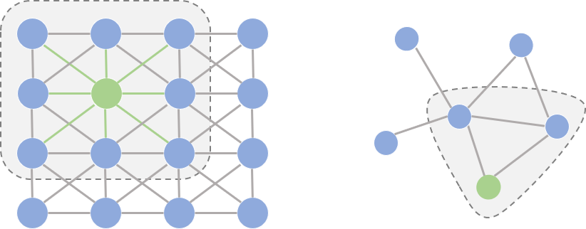
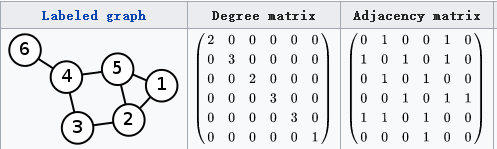

# Graph Convolutional Network

## 实验介绍

图卷积网络（Graph Convolutional Network，GCN）是近年来逐渐流行的一种神经网络结构。不同于只能用于网格结构（grid-based）数据的传统网络模型LSTM和CNN，图卷积网络能够处理具有广义拓扑图结构的数据，并深入发掘其特征和规律。

本实验主要介绍在下载的Cora和Citeseer数据集上使用MindSpore进行图卷积网络的训练。

### 图卷积神经网络由来

**为什么传统的卷积神经网络不能直接运用到图上？还需要设计专门的图卷积网络？**

简单来说，卷积神经网络的研究的对象是限制在Euclidean domains的数据。Euclidean data最显著的特征就是有规则的空间结构，比如图片是规则的正方形栅格，或者语音是规则的一维序列。而这些数据结构能够用一维、二维的矩阵表示，卷积神经网络处理起来很高效。但是，我们的现实生活中有很多数据并不具备规则的空间结构，称为Non Euclidean data。比如推荐系统、电子交易、计算几何、脑信号、分子结构等抽象出的图谱。这些图谱结构每个节点连接都不尽相同，有的节点有三个连接，有的节点有两个连接，是不规则的数据结构。

如下图所示左图是欧式空间数据，右图为非欧式空间数据。其中绿色节点为卷积核。

> **观察可以发现**
>
> 1. 在图像为代表的欧式空间中，结点的邻居数量都是固定的。比如说绿色结点的邻居始终是8个。在图这种非欧空间中，结点有多少邻居并不固定。目前绿色结点的邻居结点有2个，但其他结点也会有5个邻居的情况。
> 2. 欧式空间中的卷积操作实际上是用固定大小可学习的卷积核来抽取像素的特征。对于非欧式空间因为邻居结点不固定，所以传统的卷积核不能直接用于抽取图上结点的特征。



为了解决传统卷积不能直接应用在邻居结点数量不固定的非欧式空间数据上的问题，目前有两种主流的方法：

1. 提出一种方式把非欧空间的图转换成欧式空间。
2. 找出一种可处理变长邻居结点的卷积核在图上抽取特征。图卷积属于这一种，又分为基于空间域和基于频域的方法。

### 图卷积神经网络概述

GCN的本质目的就是用来提取拓扑图的空间特征。图卷积神经网络主要有两类，一类是基于空间域（spatial domain）或顶点域（vertex domain）的，另一类则是基于频域或谱域（spectral domain）的。GCN属于频域图卷积神经网络。

空间域方法直接将卷积操作定义在每个结点的连接关系上，它跟传统的卷积神经网络中的卷积更相似一些。在这个类别中比较有代表性的方法有Message Passing Neural Networks(MPNN), GraphSage, Diffusion Convolution Neural Networks(DCNN), PATCHY-SAN等。

频域方法希望借助图谱的理论来实现拓扑图上的卷积操作。从整个研究的时间进程来看：首先研究GSP（graph signal processing）的学者定义了graph上的傅里叶变化（Fourier Transformation），进而定义了graph上的卷积，最后与深度学习结合提出了Graph Convolutional Network（GCN）。

### GCN网络过程

过程：

1. 定义graph上的Fourier Transformation傅里叶变换；
2. 定义graph上的convolution卷积。

#### 图上的傅里叶变换

传统的傅里叶变换：

$$
F(w) = \int f(t)e^{-jwt}dt
$$

其中$ e^{-jwt} $为基函数、特征向量。

注：特征向量定义：特征方程$ AV= \lambda V $中V为特征向量，$\lambda $为特征值

由于图节点为离散的，我们将上面傅里叶变换离散化，使用有限项分量来近似F(w)，得到图上的傅里叶变换：

$$
F(\lambda _l) = \hat {f(\lambda _l)} = \sum_ {i=1}^{N} f(i) u_l(i)
$$

其中$u_l(i)$为基函数、特征向量，$\lambda _l$为$u_l(i)$对应的特征值，$f(i)$为特征值$\lambda _l$下的$f$ 。即：特征值$\lambda _l$下的$f$ 的傅里叶变换是该分量与$\lambda _l$对应的特征向量$u_l$进行内积运算。这里用拉普拉斯正交向量$u_l$替换傅里叶变换的基$ e^{-jwt} $，后边我们将定义拉普拉斯矩阵。

利用矩阵乘法将Graph上的傅里叶变换推广到矩阵形式：


$$
\left[ \begin{matrix} \hat {f(\lambda _1)} \\ \hat {f(\lambda _2)} \\ ...  \\  \hat {f(\lambda _N)} \end{matrix} \right] = 
\left[ \begin{matrix} u_1(1) & u_1(2) & ... & u_1(N) \\ u_2(1) & u_2(2) & ... & u_2(N) \\ ... & ... & ... & ...  \\  u_N(1) & u_N(2) & ... & u_N(N) \end{matrix} \right]
\left[ \begin{matrix} {f(1)} \\  {f(2)} \\ ...  \\  {f(N)} \end{matrix} \right]
$$

即：

- f 在Graph上傅里叶变换的矩阵形式为：$\hat f = U^Tf$
- f 在Graph上傅里叶逆变换的矩阵形式为：$f = U\hat f$

其中$U$为f的特征矩阵，拉普拉斯矩阵的正交基（后边我们会提到拉普拉斯矩阵）。它是一个对称正交矩阵，故$U^T=U^{-1}$。

#### 图卷积

传统卷积:

卷积定理：函数$f(t)$、$h(t)$（h为卷积核）的卷积是其傅里叶变换的逆运算，所以传统卷积可以定义为：
$$
f*h = F^{-1}[\hat {f(w)}\hat {h(w)}] = \frac{1}{2\pi}\int \hat {f(w)}\hat {h(w)}e^jwtdw
$$
图卷积:

根据卷积定理和前面得到的Graph上的傅里叶逆变换可以得到图卷积为：
$$
(f*h)_G = F^{-1}[U^Tf F(h)]=UF(h)U^Tf
$$
其中h为卷积核，F(h)为h的傅里叶变换。

将F(h）写成对角矩阵形式得到：
$$
H = F(h)=\left[ \begin{matrix} \hat {h(\lambda _1)} & & \\ & ... & \\ & & \hat {h(\lambda _N)} \end{matrix} \right]
$$

图卷积可以写成如下形式：

$$
(f*h)_G = U\left[ \begin{matrix} \hat {h(\lambda _1)} & & \\ & ... & \\ & & \hat {h(\lambda _N)} \end{matrix} \right]U^Tf = Lf
$$

其中L为拉普拉斯矩阵。U为L的正交化矩阵。上面式子也是GCN算法计算公式，通俗的解释，我们可以把GCN看成是基于拉普拉斯矩阵的特征分解。

### 拉普拉斯矩阵

GCN的核心基于拉普拉斯矩阵的谱分解（特征分解）。所以GCN算法的关键在于定义拉普拉斯矩阵。

本文的拉普拉斯矩阵定义如下：
$$
L = \widetilde U^{-\frac{1}{2}}\widetilde H\widetilde U^{-\frac{1}{2}}
$$
其中

$$
\widetilde U^{-\frac{1}{2}}\widetilde H\widetilde U^{-\frac{1}{2}} = I + U^{-\frac{1}{2}}HU^{-\frac{1}{2}}
$$

$$
\widetilde H= H + I \\
\widetilde U_{ii} = \sum_{j}\widetilde H_{ij}
$$

U取图的度矩阵（如下图中的degree matrix）,H取图的邻接矩阵（如下图中的adjacency matrix）



[1] Graph Convolutional Network原理引用自论文：https://arxiv.org/pdf/1609.02907.pdf

## 实验目的

- 了解GCN相关知识；
- 在MindSpore中使用Cora和Citeseer数据集训练GCN示例。
- 了解MindSpore的model_zoo模块，以及如何使用model_zoo中的模型。

## 预备知识

- 熟练使用Python，了解Shell及Linux操作系统基本知识。
- 具备一定的深度学习理论知识，如前馈神经网络、卷积神经网络、图卷积网络等。
- 了解华为云的基本使用方法，包括[OBS（对象存储）](https://www.huaweicloud.com/product/obs.html)、[ModelArts（AI开发平台）](https://www.huaweicloud.com/product/modelarts.html)、[Notebook（开发工具）](https://support.huaweicloud.com/engineers-modelarts/modelarts_23_0032.html)、[训练作业](https://support.huaweicloud.com/engineers-modelarts/modelarts_23_0238.html)等服务。华为云官网：https://www.huaweicloud.com
- 了解并熟悉MindSpore AI计算框架，MindSpore官网：https://www.mindspore.cn

## 实验环境

- MindSpore 1.0.0（MindSpore版本会定期更新，本指导也会定期刷新，与版本配套）；
- 华为云ModelArts：ModelArts是华为云提供的面向开发者的一站式AI开发平台，集成了昇腾AI处理器资源池，用户可以在该平台下体验MindSpore。ModelArts官网：https://www.huaweicloud.com/product/modelarts.html

## 实验准备

### 数据集准备

Cora和CiteSeer是图神经网络常用的数据集，数据集官网[LINQS Datasets](https://linqs.soe.ucsc.edu/data)。

Cora数据集包含2708个科学出版物，分为七个类别。 引用网络由5429个链接组成。 数据集中的每个出版物都用一个0/1值的词向量描述，0/1指示词向量中是否出现字典中相应的词。 该词典包含1433个独特的单词。 数据集中的README文件提供了更多详细信息。

CiteSeer数据集包含3312种科学出版物，分为六类。 引用网络由4732个链接组成。 数据集中的每个出版物都用一个0/1值的词向量描述，0/1指示词向量中是否出现字典中相应的词。 该词典包含3703个独特的单词。 数据集中的README文件提供了更多详细信息。

本实验使用Github上[kimiyoung/planetoid](https://github.com/kimiyoung/planetoid/tree/master/data)预处理和划分好的数据集。

将数据集放置到所需的路径下，该文件夹应包含以下文件：

```
data 
├── ind.cora.allx 
├── ind.cora.ally 
├── ...
├── ind.cora.test.index 
├── trans.citeseer.tx
├── trans.citeseer.ty
├── ...
└── trans.pubmed.y
```

inductive模型的输入包含：

- `x`，已标记的训练实例的特征向量，
- `y`，已标记的训练实例的one-hot标签，
- `allx`，标记的和未标记的训练实例（`x`的超集）的特征向量，
- `graph`，一个`dict`，格式为`{index: [index_of_neighbor_nodes]}.`

令n为标记和未标记训练实例的数量。在`graph`中这n个实例的索引应从0到n-1，其顺序与`allx`中的顺序相同。

除了`x`，`y`，`allx`，和`graph`如上所述，预处理的数据集还包括：

- `tx`，测试实例的特征向量，
- `ty`，测试实例的one-hot标签，
- `test.index`，`graph`中测试实例的索引，
- `ally`，是`allx`中实例的标签。

### 脚本准备

从[MindSpore model_zoo](https://gitee.com/mindspore/mindspore/tree/r0.5/model_zoo/gcn)中下载GCN代码；从[课程gitee仓库](https://gitee.com/mindspore/course)中下载本实验相关脚本。将脚本和数据集放到到gcn文件夹中，组织为如下形式：

```
gcn
├── data
├── graph_to_mindrecord 
│   ├── citeseer
│   ├── cora
│   ├── graph_map_schema.py
│   └── writer.py
│── src
│   ├── config.py
│   ├── dataset.py
│   ├── gcn.py
│   └── metrics.py
│── main.py
└── README.md
```

### 创建OBS桶

本实验需要使用华为云OBS存储脚本和数据集，可以参考[快速通过OBS控制台上传下载文件](https://support.huaweicloud.com/qs-obs/obs_qs_0001.html)了解使用OBS创建桶、上传文件、下载文件的使用方法（下文给出了操作步骤）。

> **提示：** 华为云新用户使用OBS时通常需要创建和配置“访问密钥”，可以在使用OBS时根据提示完成创建和配置。也可以参考[获取访问密钥并完成ModelArts全局配置](https://support.huaweicloud.com/prepare-modelarts/modelarts_08_0002.html)获取并配置访问密钥。

打开[OBS控制台](https://storage.huaweicloud.com/obs/?region=cn-north-4&locale=zh-cn#/obs/manager/buckets)，点击右上角的“创建桶”按钮进入桶配置页面，创建OBS桶的参考配置如下：

- 区域：华北-北京四
- 数据冗余存储策略：单AZ存储
- 桶名称：全局唯一的字符串
- 存储类别：标准存储
- 桶策略：公共读
- 归档数据直读：关闭
- 企业项目、标签等配置：免

### 上传文件

点击新建的OBS桶名，再打开“对象”标签页，通过“上传对象”、“新建文件夹”等功能，将脚本和数据集上传到OBS桶中。上传文件后，查看页面底部的“任务管理”状态栏（正在运行、已完成、失败），确保文件均上传完成。若失败请：

- 参考[上传对象大小限制/切换上传方式](https://support.huaweicloud.com/qs-obs/obs_qs_0008.html)，
- 参考[上传对象失败常见原因](https://support.huaweicloud.com/obs_faq/obs_faq_0134.html)。
- 若无法解决请[新建工单](https://console.huaweicloud.com/ticket/?region=cn-north-4&locale=zh-cn#/ticketindex/createIndex)，产品类为“对象存储服务”，问题类型为“桶和对象相关”，会有技术人员协助解决。

## 实验步骤（ModelArts训练作业）

ModelArts提供了训练作业服务，训练作业资源池大，且具有作业排队等功能，适合大规模并发使用。使用训练作业时，如果有修改代码和调试的需求，有如下三个方案：

1. 在本地修改代码后重新上传；
2. 使用[PyCharm ToolKit](https://support.huaweicloud.com/tg-modelarts/modelarts_15_0001.html)配置一个本地Pycharm+ModelArts的开发环境，便于上传代码、提交训练作业和获取训练日志。
3. 在ModelArts上创建Notebook，然后设置[Sync OBS功能](https://support.huaweicloud.com/engineers-modelarts/modelarts_23_0038.html)，可以在线修改代码并自动同步到OBS中。因为只用Notebook来编辑代码，所以创建CPU类型最低规格的Notebook就行。

### 适配训练作业

创建训练作业时，运行参数会通过脚本传参的方式输入给脚本代码，脚本必须解析传参才能在代码中使用相应参数。如data_url和train_url，分别对应数据存储路径(OBS路径)和训练输出路径(OBS路径)。脚本对传参进行解析后赋值到`args`变量里，在后续代码里可以使用。

```python
import argparse
parser = argparse.ArgumentParser(description='GCN')
parser.add_argument('--data_url', required=True, help='Location of data.')
parser.add_argument('--train_url', required=True, help='Location of training outputs.')
args_opt = parser.parse_args()
```

MindSpore暂时没有提供直接访问OBS数据的接口，需要通过ModelArts自带的moxing框架与OBS交互。拷贝自己账户下或他人共享的OBS桶内的数据集至执行容器。

```python
import moxing as mox
# src_url形如's3://OBS/PATH'，为OBS桶中数据集的路径，dst_url为执行容器中的路径
mox.file.copy_parallel(src_url=args_opt.data_url, dst_url='./data')
```

### 创建训练作业

可以参考[使用常用框架训练模型](https://support.huaweicloud.com/engineers-modelarts/modelarts_23_0238.html)来创建并启动训练作业（下文给出了操作步骤）。

打开[ModelArts控制台-训练管理-训练作业](https://console.huaweicloud.com/modelarts/?region=cn-north-4#/trainingJobs)，点击“创建”按钮进入训练作业配置页面，创建训练作业的参考配置：

- 算法来源：常用框架->Ascend-Powered-Engine->MindSpore
- 代码目录：选择上述新建的OBS桶中的gcn目录
- 启动文件：选择上述新建的OBS桶中的gcn目录下的`main.py`
- 数据来源：数据存储位置->选择上述新建的OBS桶中的gcn目录下的data目录
- 训练输出位置：选择上述新建的OBS桶中的gcn目录并在其中创建output目录
- 作业日志路径：同训练输出位置
- 规格：Ascend:1*Ascend 910
- 其他均为默认

启动并查看训练过程：

1. 点击提交以开始训练；
2. 在训练作业列表里可以看到刚创建的训练作业，在训练作业页面可以看到版本管理；
3. 点击运行中的训练作业，在展开的窗口中可以查看作业配置信息，以及训练过程中的日志，日志会不断刷新，等训练作业完成后也可以下载日志到本地进行查看；
4. 参考实验步骤（ModelArts Notebook），在日志中找到对应的打印信息，检查实验是否成功。

## 实验步骤（ModelArts Notebook）

推荐使用ModelArts训练作业进行实验，适合大规模并发使用。若使用ModelArts Notebook，请参考[LeNet5](../lenet5)及[Checkpoint](../checkpoint)实验案例，了解Notebook的使用方法和注意事项。

### 导入模块

```python
import os

import time
import argparse
import numpy as np

from mindspore import context
from easydict import EasyDict as edict

from src.gcn import GCN, LossAccuracyWrapper, TrainNetWrapper
from src.config import ConfigGCN
from src.dataset import get_adj_features_labels, get_mask
from graph_to_mindrecord.writer import run

context.set_context(mode=context.GRAPH_MODE,device_target="Ascend", save_graphs=False)
```

### 数据处理

`graph_to_mindrecord/writer.py`用于将Cora或Citeseer数据集转换为mindrecord格式，便于提高数据集读取和处理的性能。（可在`main.py`的cfg中设置`DATASET_NAME`为cora或者citeseer来切换不同的数据集）

```python
# init writer
writer = init_writer(graph_schema)

# write nodes data
mindrecord_dict_data = mr_api.yield_nodes
run_parallel_workers()

# write edges data
mindrecord_dict_data = mr_api.yield_edges
run_parallel_workers()
```

### 参数配置

训练参数可以在`src/config.py`中设置。

```python
"learning_rate": 0.01,            # Learning rate
"epochs": 200,                    # Epoch sizes for training
"hidden1": 16,                    # Hidden size for the first graph convolution layer
"dropout": 0.5,                   # Dropout ratio for the first graph convolution layer
"weight_decay": 5e-4,             # Weight decay for the parameter of the first graph convolution layer
"early_stopping": 10,             # Tolerance for early stopping
```

### 模型定义

图卷积网络及其依赖的图卷积算子定义在`gcn/src/gcn.py`中。

图卷积算子基于MindSpore `nn.Dense()`和`P.MatMul()`算子实现。

```python
class GraphConvolution(nn.Cell):
    """
    GCN graph convolution layer.

    Args:
        feature_in_dim (int): The input feature dimension.
        feature_out_dim (int): The output feature dimension.
        dropout_ratio (float): Dropout ratio for the dropout layer. Default: None.
        activation (str): Activation function applied to the output of the layer, eg. 'relu'. Default: None.

    Inputs:
        - **adj** (Tensor) - Tensor of shape :math:`(N, N)`.
        - **input_feature** (Tensor) - Tensor of shape :math:`(N, C)`.

    Outputs:
        Tensor, output tensor.
    """

    def __init__(self,
                 feature_in_dim,
                 feature_out_dim,
                 dropout_ratio=None,
                 activation=None):
        super(GraphConvolution, self).__init__()
        self.in_dim = feature_in_dim
        self.out_dim = feature_out_dim
        self.weight_init = glorot([self.out_dim, self.in_dim])
        self.fc = nn.Dense(self.in_dim,
                           self.out_dim,
                           weight_init=self.weight_init,
                           has_bias=False)
        self.dropout_ratio = dropout_ratio
        if self.dropout_ratio is not None:
            self.dropout = nn.Dropout(keep_prob=1-self.dropout_ratio)
        self.dropout_flag = self.dropout_ratio is not None
        self.activation = get_activation(activation)
        self.activation_flag = self.activation is not None
        self.matmul = P.MatMul()

    def construct(self, adj, input_feature):
        dropout = input_feature
        if self.dropout_flag:
            dropout = self.dropout(dropout)

        fc = self.fc(dropout)
        output_feature = self.matmul(adj, fc)

        if self.activation_flag:
            output_feature = self.activation(output_feature)
        return output_feature
```

图卷积网络使用了两层图卷积层，即只采集二阶邻居。

```python
class GCN(nn.Cell):
    """
    GCN architecture.

    Args:
        config (ConfigGCN): Configuration for GCN.
        adj (numpy.ndarray): Numbers of block in different layers.
        feature (numpy.ndarray): Input channel in each layer.
        output_dim (int): The number of output channels, equal to classes num.
    """

    def __init__(self, config, adj, feature, output_dim):
        super(GCN, self).__init__()
        self.adj = Tensor(adj)
        self.feature = Tensor(feature)
        input_dim = feature.shape[1]
        self.layer0 = GraphConvolution(input_dim, config.hidden1, activation="relu", dropout_ratio=config.dropout)
        self.layer1 = GraphConvolution(config.hidden1, output_dim, dropout_ratio=None)

    def construct(self):
        output0 = self.layer0(self.adj, self.feature)
        output1 = self.layer1(self.adj, output0)
        return output1
```

### 模型训练

训练和验证的主要逻辑在`main.py`中。包括数据集、网络、训练函数和验证函数的初始化，以及训练逻辑的控制。

```python
def train(args_opt):
    """Train model."""
    np.random.seed(args_opt.seed)    
    config = ConfigGCN()
    adj, feature, label = get_adj_features_labels(args_opt.data_dir)

    nodes_num = label.shape[0]
    train_mask = get_mask(nodes_num, 0, args_opt.train_nodes_num)
    eval_mask = get_mask(nodes_num, args_opt.train_nodes_num, args_opt.train_nodes_num + args_opt.eval_nodes_num)
    test_mask = get_mask(nodes_num, nodes_num - args_opt.test_nodes_num, nodes_num)

    class_num = label.shape[1]
    gcn_net = GCN(config, adj, feature, class_num)
    gcn_net.add_flags_recursive(fp16=True)

    eval_net = LossAccuracyWrapper(gcn_net, label, eval_mask, config.weight_decay)
    test_net = LossAccuracyWrapper(gcn_net, label, test_mask, config.weight_decay)
    train_net = TrainNetWrapper(gcn_net, label, train_mask, config)

    loss_list = []
    for epoch in range(config.epochs):
        t = time.time()

        train_net.set_train()
        train_result = train_net()
        train_loss = train_result[0].asnumpy()
        train_accuracy = train_result[1].asnumpy()

        eval_net.set_train(False)
        eval_result = eval_net()
        eval_loss = eval_result[0].asnumpy()
        eval_accuracy = eval_result[1].asnumpy()

        loss_list.append(eval_loss)
        print("Epoch:", '%04d' % (epoch + 1), "train_loss=", "{:.5f}".format(train_loss),
              "train_acc=", "{:.5f}".format(train_accuracy), "val_loss=", "{:.5f}".format(eval_loss),
              "val_acc=", "{:.5f}".format(eval_accuracy), "time=", "{:.5f}".format(time.time() - t))

        if epoch > config.early_stopping and loss_list[-1] > np.mean(loss_list[-(config.early_stopping+1):-1]):
            print("Early stopping...")
            break

    t_test = time.time()
    test_net.set_train(False)
    test_result = test_net()
    test_loss = test_result[0].asnumpy()
    test_accuracy = test_result[1].asnumpy()
    print("Test set results:", "loss=", "{:.5f}".format(test_loss),
          "accuracy=", "{:.5f}".format(test_accuracy), "time=", "{:.5f}".format(time.time() - t_test))
```

训练结果将存储在脚本路径中，该路径的文件夹名称以“train”开头。可以在日志中找到类似以下结果。

    Epoch: 0000 train_loss= 1.95401 train_acc= 0.12143 val_loss= 1.94917 val_acc= 0.31400 time= 36.95478
    Epoch: 0010 train_loss= 1.86495 train_acc= 0.85000 val_loss= 1.90644 val_acc= 0.50200 time= 0.00491
    Epoch: 0020 train_loss= 1.75353 train_acc= 0.88571 val_loss= 1.86284 val_acc= 0.53000 time= 0.00525
    Epoch: 0030 train_loss= 1.59934 train_acc= 0.87857 val_loss= 1.80850 val_acc= 0.55400 time= 0.00517
    Epoch: 0040 train_loss= 1.45166 train_acc= 0.91429 val_loss= 1.74404 val_acc= 0.59400 time= 0.00502
    Epoch: 0050 train_loss= 1.29577 train_acc= 0.94286 val_loss= 1.67278 val_acc= 0.67200 time= 0.00491
    Epoch: 0060 train_loss= 1.13297 train_acc= 0.97857 val_loss= 1.59820 val_acc= 0.72800 time= 0.00482
    Epoch: 0070 train_loss= 1.05231 train_acc= 0.95714 val_loss= 1.52455 val_acc= 0.74800 time= 0.00506
    Epoch: 0080 train_loss= 0.97807 train_acc= 0.97143 val_loss= 1.45385 val_acc= 0.76800 time= 0.00519
    Epoch: 0090 train_loss= 0.85581 train_acc= 0.97143 val_loss= 1.39556 val_acc= 0.77400 time= 0.00476
    Epoch: 0100 train_loss= 0.81426 train_acc= 0.98571 val_loss= 1.34453 val_acc= 0.78400 time= 0.00479
    Epoch: 0110 train_loss= 0.74759 train_acc= 0.97143 val_loss= 1.28945 val_acc= 0.78400 time= 0.00516
    Epoch: 0120 train_loss= 0.70512 train_acc= 0.99286 val_loss= 1.24538 val_acc= 0.78600 time= 0.00517
    Epoch: 0130 train_loss= 0.69883 train_acc= 0.98571 val_loss= 1.21186 val_acc= 0.78200 time= 0.00531
    Epoch: 0140 train_loss= 0.66174 train_acc= 0.98571 val_loss= 1.19131 val_acc= 0.78400 time= 0.00481
    Epoch: 0150 train_loss= 0.57727 train_acc= 0.98571 val_loss= 1.15812 val_acc= 0.78600 time= 0.00475
    Epoch: 0160 train_loss= 0.59659 train_acc= 0.98571 val_loss= 1.13203 val_acc= 0.77800 time= 0.00553
    Epoch: 0170 train_loss= 0.59405 train_acc= 0.97143 val_loss= 1.12650 val_acc= 0.78600 time= 0.00555
    Epoch: 0180 train_loss= 0.55484 train_acc= 1.00000 val_loss= 1.09338 val_acc= 0.78000 time= 0.00542
    Epoch: 0190 train_loss= 0.52347 train_acc= 0.99286 val_loss= 1.07537 val_acc= 0.78800 time= 0.00510
    Test set results: loss= 1.01702 accuracy= 0.81400 time= 6.51215

运行main.py会在当前目录下生成一个关于Cora训练数据的动态图t-SNE_visualization_on_Cora.gif。


## 实验结论

本实验介绍在Cora和Citeseer数据集上使用MindSpore进行GCN实验，GCN能很好的处理和学习图结构数据。
