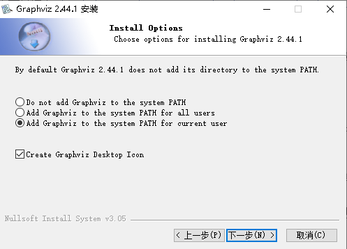
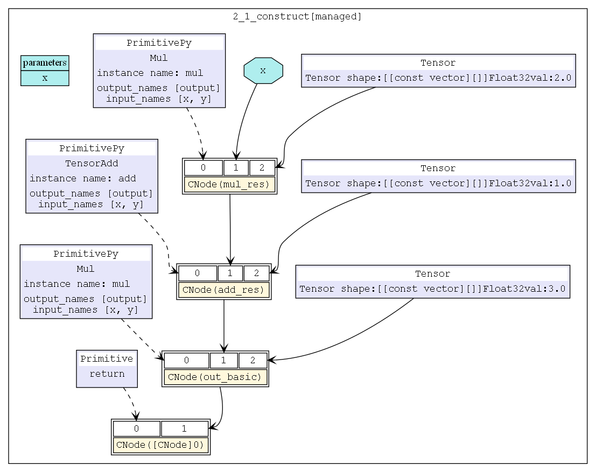
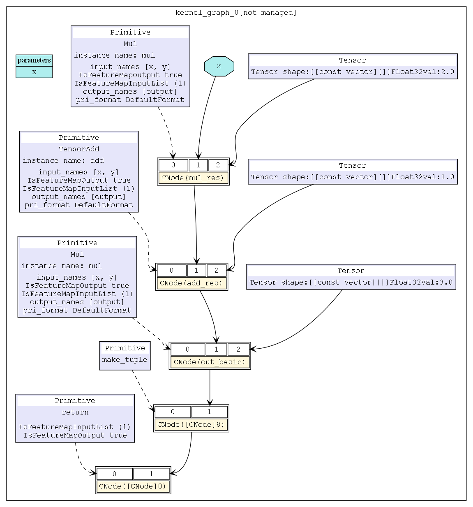
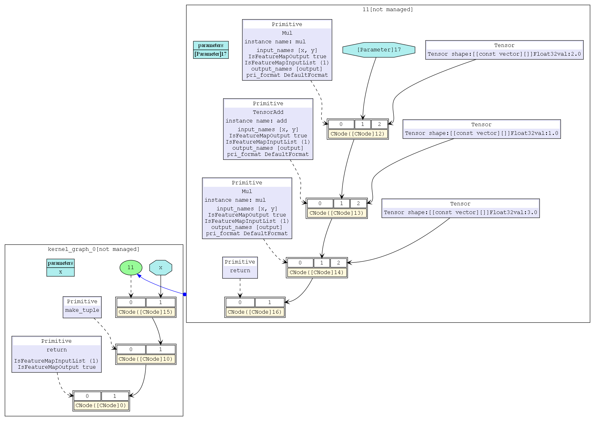
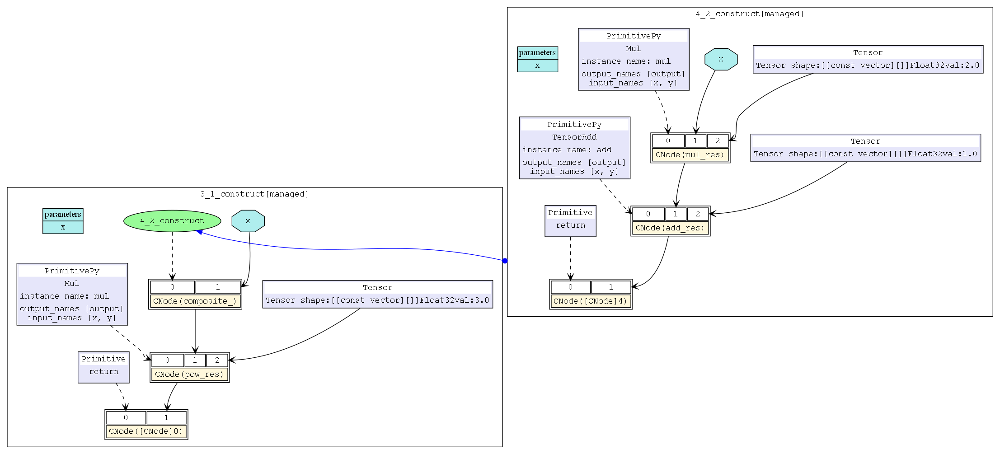
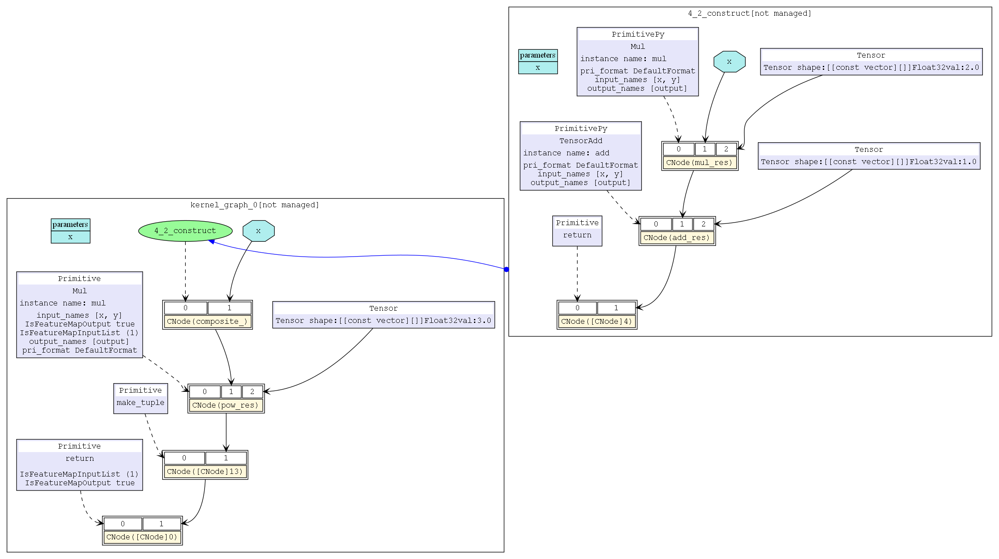
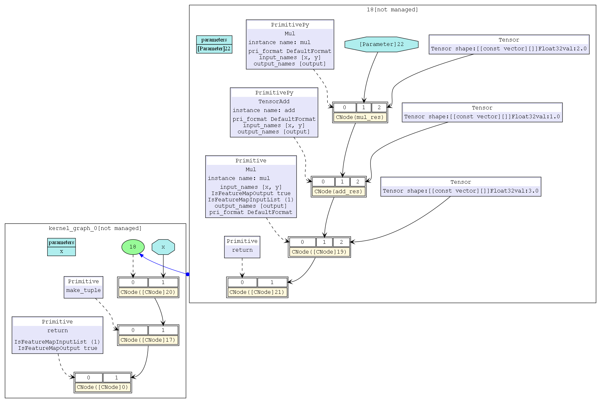

# 性能优化—图算融合

## 实验介绍

本实验主要介绍使用MindSpore进行图算融合开发。对比基础算子融合前后、组合算子融合前后计算图，体会图算融合在性能上的优化。

## 实验目的

- 掌握如何使用MindSpore进行图算融合开发。
- 理解图算融合、基础算子融合、组合算子融合概念和流程。
- 了解如何使用MindSpore进行组合图算算子开发。

## 预备知识

- 熟练使用Python。
- 具备一定的机器学习/深度学习理论知识，如算子、计算图等。
- 了解华为云的基本使用方法，包括[OBS（对象存储）](https://www.huaweicloud.com/product/obs.html)、[ModelArts（AI开发平台）](https://www.huaweicloud.com/product/modelarts.html)等功能。华为云官网：https://www.huaweicloud.com
- 了解并熟悉MindSpore AI计算框架，MindSpore官网：https://www.mindspore.cn

## 实验环境

- MindSpore 0.5.0（MindSpore版本会定期更新，本指导也会定期刷新，与版本配套）；
- 华为云ModelArts（控制台左上角选择“华北-北京四”）：ModelArts是华为云提供的面向开发者的一站式AI开发平台，集成了昇腾AI处理器资源池，用户可以在该平台下体验MindSpore。

## 实验准备

### 创建OBS桶

本实验需要使用华为云OBS存储脚本和数据集，可以参考[快速通过OBS控制台上传下载文件](https://support.huaweicloud.com/qs-obs/obs_qs_0001.html)了解使用OBS创建桶、上传文件、下载文件的使用方法。

> **提示：** 华为云新用户使用OBS时通常需要创建和配置“访问密钥”，可以在使用OBS时根据提示完成创建和配置。也可以参考[获取访问密钥并完成ModelArts全局配置](https://support.huaweicloud.com/prepare-modelarts/modelarts_08_0002.html)获取并配置访问密钥。

打开[OBS控制台](https://storage.huaweicloud.com/obs/?region=cn-north-4&locale=zh-cn#/obs/manager/buckets)，点击右上角的“创建桶”按钮进入桶配置页面，创建OBS桶的参考配置如下：

- 区域：华北-北京四
- 数据冗余存储策略：单AZ存储
- 桶名称：全局唯一的字符串
- 存储类别：标准存储
- 桶策略：公共读
- 归档数据直读：关闭
- 企业项目、标签等配置：免

### 脚本准备

从[课程gitee仓库](https://gitee.com/mindspore/course)上下载本实验相关脚本。test_graph_kernel_fusion.py 和graph_kernel.ipynb。其中test_graph_kernel_fusion.py为图算融合测试用例。graph_kernel.ipynb为测试用例执行脚本。

### 上传文件

点击新建的OBS桶名，再打开“对象”标签页，通过“上传对象”、“新建文件夹”等功能，将脚本和数据集上传到OBS桶中，组织为如下形式：

```
graph_kernel  
├── graph_kernel.ipynb   
└── test_graph_kernel_fusion.py  
```

### 创建并打开Notebook

ModelArts Notebook资源池较小，且每个运行中的Notebook会一直占用Device资源不释放，不适合大规模并发使用（不使用时需停止实例，以释放资源）。可以参考[创建并打开Notebook](https://support.huaweicloud.com/engineers-modelarts/modelarts_23_0034.html)来创建并打开本实验的Notebook脚本。

打开[ModelArts控制台-开发环境-Notebook](https://console.huaweicloud.com/modelarts/?region=cn-north-4#/notebook)，点击“创建”按钮进入Notebook配置页面，创建Notebook的参考配置：

- 计费模式：按需计费
- 名称：graph_kernel
- 工作环境：Python3
- 资源池：公共资源
- 类型：Ascend
- 规格：单卡1*Ascend 910
- 存储位置：对象存储服务（OBS）->选择上述新建的OBS桶中的lenet5文件夹
- 自动停止：打开->选择1小时后（后续可在Notebook中随时调整）

> **注意：**
> - 在Jupyter Notebook/JupyterLab文件列表里，展示的是关联的OBS桶里的文件，并不在当前Notebook工作环境（容器）中，Notebook中的代码无法直接访问这些文件。
> - 打开Notebook前，选中文件列表里的所有文件/文件夹（实验脚本和数据集），并点击列表上方的“Sync OBS”按钮，使OBS桶中的所有文件同时同步到Notebook执行容器中，这样Notebook中的代码才能访问数据集。
>   - 使用Jupyter Notebook时，可参考[与OBS同步文件](https://support.huaweicloud.com/engineers-modelarts/modelarts_23_0038.html)；
>   - 使用JupyterLab时，可参考[与OBS同步文件](https://support.huaweicloud.com/engineers-modelarts/modelarts_23_0336.html)。
>   - 同步文件的大小和数量超过限制时，请参考[MoXing常用操作示例](https://support.huaweicloud.com/moxing-devg-modelarts/modelarts_11_0005.html#section5)中的拷贝操作，将大文件（如数据集）拷贝到Notebook执行容器中，再行使用。
> - 打开Notebook后，选择MindSpore环境作为Kernel。
> - Notebook运行中一直处于计费状态，不使用时，在Notebook控制台页面点击实例右侧的“停止”，以停止计费。停止后，Notebook里的内容不会丢失（已同步至OBS）。下次需要使用时，点击实例右侧的“启动”即可。可参考[启动或停止Notebook实例](https://support.huaweicloud.com/engineers-modelarts/modelarts_23_0041.html)。

> **提示：** 
> - 上述数据集和脚本的准备工作也可以在Notebook环境中完成，在Jupyter Notebook文件列表页面，点击右上角的"New"->"Terminal"，进入Notebook环境所在终端，进入`work`目录，可以使用常用的linux shell命令，如`wget, gzip, tar, mkdir, mv`等，完成数据集和脚本的下载和准备。
> - 可将如下每段代码拷贝到Notebook代码框/Cell中，从上至下阅读提示并执行代码框进行体验。代码框执行过程中左侧呈现[\*]，代码框执行完毕后左侧呈现如[1]，[2]等。请等上一个代码框执行完毕后再执行下一个代码框。

## 实验原理

图算融合是通过分析和优化现有网络计算图逻辑，对原有计算逻辑进行拆分、重组、融合等操作，以减少算子执行间隙的开销并且提升设备计算资源利用率，从而实现网络整体执行时间的优化。

### 启用方法

MindSpore中的图算融合优化分布于网络图层编译和执行的多个步骤中，默认关闭状态，我们可以在训练脚本中为context指定参数enable_graph_kernel=True从而启用图算融合：

```python
from mindspore import context
context.set_context(enable_graph_kernel=True)
```

### 融合场景

基础算子融合场景：基础算子融合是指对网络中相关联的基础算子进行分析，在可以得到性能收益的条件下，将多个基础算子融合成为组合算子，以简单样例NetBasicFuse（见test_graph_kernel_fusion.py文件）说明。

组合算子融合场景：组合算子融合是指将原有的组合算子和与其相关的基础算子进行分析，在可以得到性能收益的条件下，将原有的组合算子和基础算子融合成为一个更大的组合算子，以简单样例NetCompositeFuse（见test_graph_kernel_fusion.py文件）说明。

>**设定场景包括：**
>
>- 基础算子无融合场景
>- 基础算子融合场景
>- 组合算子无融合场景
>- 组合算子融合场景

### 测试用例

本实验使用第三方工具pytest（安装方法：`pip install -U pytest`）测试NetBasicFuse网络图算融合前后、NetCompositeFuse网络图算融合前后性能，并将生成的初始计算图6_validate.dot和算子融合后计算图hwopt_d_end.dot转化为png格式。比较不同场景下的初始计算图和算子融合后计算图。

## 实验步骤

为了说明融合场景，我们构造两个简单网络，NetBasicFuse包含两个乘法和一个加法计算，NetCompositeFuse包含一个组合算子（一个乘法和加法）和一个乘法计算。保存为test_graph_kernel_fusion.py文件。对比不同场景下，启用图算融合和关闭图算融合的计算图。

### 代码梳理

- test_graph_kernel_fusion.py：融合场景测试用例。
- graph_kernel.ipynb: 测试用例执行脚本。

#### test_graph_kernel_fusion.py代码梳理

导入模块

```python
import numpy as np

import mindspore.context as context
from mindspore import Tensor
from mindspore.nn import Cell,GraphKernel
from mindspore.ops import operations as P

context.set_context(mode=context.GRAPH_MODE, device_target="Ascend")
# save graph files.
context.set_context(save_graphs=True)
# enable graph kernel fusion.
context.set_context(enable_graph_kernel=True)
```

NetBasicFuse网络定义
```python
# example for basic fusion.
class NetBasicFuse(Cell):
    def __init__(self):
        super(NetBasicFuse, self).__init__()
        self.add = P.TensorAdd()
        self.mul = P.Mul()
    def construct(self, x):
        mul_res = self.mul(x, 2.0)
        add_res = self.add(mul_res, 1.0)
        out_basic = self.mul(add_res, 3.0)
        return out_basic
```

NetCompositeFuse网络定义。其中Composite类为GraphKernel算子，该定义包含两个基本算子（一个乘法和一个加法）。

```python
# example for composite fusion.
class Composite(GraphKernel):
    def __init__(self):
        super(Composite, self).__init__()
        self.add = P.TensorAdd()
        self.mul = P.Mul()

    def construct(self, x):
        mul_res = self.mul(x, 2.0)
        add_res = self.add(mul_res, 1.0)
        return add_res   

class NetCompositeFuse(Cell):
    def __init__(self):
        super(NetCompositeFuse, self).__init__()
        self.mul = P.Mul()
        self.composite=Composite()
    def construct(self, x):
        composite_=self.composite(x)
        pow_res = self.mul(composite_, 3.0)
        return pow_res
```

NetBasicFuse网络测试用例test_basic_fuse

```python
def test_basic_fuse():
    x = np.random.randn(4, 4).astype(np.float32)
    net = NetBasicFuse()
    result = net(Tensor(x))
    print("================result=======================")
    print("x: {}".format(x))
    print("result: {}".format(result))
    print("=======================================")
```

NetCompositeFuse网络测试用例test_composite_fuse

```python
def test_composite_fuse():
    x = np.random.randn(4, 4).astype(np.float32)
    net = NetCompositeFuse()
    result = net(Tensor(x))
    print("================result=======================")
    print("x: {}".format(x))
    print("result: {}".format(result))
    print("=======================================")
```

#### graph_kernel.ipynb代码梳理

安装pytest测试工具

```python
!pip install -U pytest
```

#####  基础算子融合场景

导入模块、变量定义、清理文件

```python
import os
import shutil

test_basic_dir = 'test_basic_fuse'
test_composite_dir = 'test_composite_fuse'

! rm -rf *.ir
! rm -rf *.dot
! rm -rf *.dat
! rm -rf *.pb
! rm -rf kernel_meta
! rm -rf *.log
```

运行NetBasicFuse网络测试用例test_basic_fuse，会生成很多.ir 、.dot等文件。

```python
! pytest -s test_graph_kernel_fusion.py::test_basic_fuse
```
将初始计算图6_validate.dot和算子融合后计算图hwopt_d_end.dot复制到obs桶中。

```python
if os.path.exists(test_basic_dir):
    shutil.rmtree(test_basic_dir)
! mkdir $test_basic_dir
! cp  6_validate.dot $test_basic_dir
! cp  hwopt_d_end.dot $test_basic_dir

import moxing
moxing.file.copy_parallel(src_url=test_basic_dir, dst_url='s3://user/graph_kernel/test_basic/')  
```
##### 组合算子融合场景

运行NetCompositeFuse网络测试用例test_composite_fuse生成组合算子融合场景下的初始计算图6_validate.dot和算子融合后计算图hwopt_d_end.dot并复制到obs中。

```python
! rm -rf *.ir
! rm -rf *.dot
! rm -rf *.dat
! rm -rf *.pb
! rm -rf kernel_meta
! rm -rf *.log

!pytest -s test_graph_kernel_fusion.py::test_composite_fuse

if os.path.exists(test_composite_dir):
    shutil.rmtree(test_composite_dir)
! mkdir $test_composite_dir
! cp  6_validate.dot $test_composite_dir
! cp  hwopt_d_end.dot $test_composite_dir

import moxing
moxing.file.copy_parallel(src_url=test_composite_dir, dst_url='s3://user/graph_kernel/test_composite/')   
```

##### 无融合场景

改 test_graph_kernel_fusion.py中`context.set_context(enable_graph_kernel=True)`为
`context.set_context(enable_graph_kernel=False)` 关闭图算融合。

改graph_kernel.ipynb中初始计算图6_validate.dot和算子融合后计算图hwopt_d_end.dot保存路径。

```python
test_basic_dir = 'test_basic_fuse_no'
test_composite_dir = 'test_composite_fuse_no'
```

重新运行graph_kernel.ipynb生成基础算子无融合场景、组合算子无融合场景下的初始计算图6_validate.dot和算子融合后计算图hwopt_d_end.dot。

### 转换结果并分析

#### 下载结果到本地

进入obs桶，下载文件夹`test_basic_fuse_no`、`test_composite_fuse_no`、`test_basic_fuse`、`test_composite_fuse` 到本地。

>**注意：** obs桶没有下载文件夹功能，可以先在本地建立目录，然后再一个一个文件下载存放。

#### 将.dot文件转换成.png格式

本实验使用Graphviz工具将.dot格式文件转换为可以可视化的.png文件进行结果的展示和分析。

1. 根据自己电脑系统，下载[Graphviz](https://www2.graphviz.org/Packages/stable/windows/10/cmake/Release/) 工具并安装。
   
    >**注意：** 安装过程中选择配置环境变量，如下图所示，若没有选择需要安装完成手动配置。
    
    
    
2. 检查Graphviz是否安装成功
   
    进入windows命令行界面（cmd），输入dot -version，然后按回车，如果显示graphviz的相关版本信息，则安装配置成功。
    
3. 转换.dot文件为png格式文件
   
    在windows命令行界面输入以下命令，即可在.dot文件目录找到转换成功的png格式文件。
    
    ```
    cd 需要转换的.dot文件目录
    dot 6_validate.dot -Tpng -o 6_validate.png
    dot hwopt_d_end.dot.dot -Tpng -o hwopt_d_end.dot.png
    ```

### 结果展示

#### 基础算子无融合场景


图1：基础算子初始计算图


图2：基础算子处理后计算图

#### 基础算子融合场景

图3：初始计算图同图1


图4：基础算子融合后计算图

#### 组合算子无融合场景


图5：组合算子初始计算图


图6：组合算子处理后计算图

#### 组合算子融合场景

图7：初始计算图同图5


图8：组合算子融合后计算图

### 结果分析及结论

从结果展示中可以看出：
- 无融合场景初始计算图和处理后的计算图相同；
- 融合场景初始计算图和处理后的计算图不同；
- 算子融合会将多个算子融合为一个组合算子，可以减少算子执行间隙。
