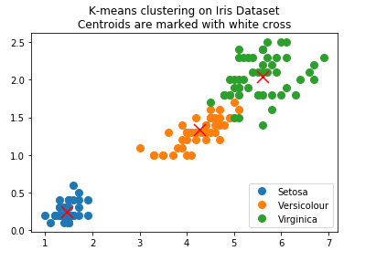

# K-Means

## 实验介绍

K-Means算法是最为经典的基于划分的聚类方法，是十大经典数据挖掘算法之一。K-Means算法的基本思想是：以空间中k个点为中心进行聚类，对最靠近他们的对象归类。通过迭代的方法，逐次更新各聚类中心的值，直至得到最好的聚类结果。
K-Means 算法接受参数 k ，然后将事先输入的n个数据对象划分为 k个聚类以便使得所获得的聚类满足同一聚类中的对象相似度较高，而不同聚类中的对象相似度较小。聚类相似度是利用各聚类中对象的均值所获得一个“中心对象”来进行计算的。

聚类算法有很多种（几十种），K-Means是聚类算法中的最常用的一种，算法最大的特点是简单，好理解，运算速度快，但是**只能应用于连续型**的数据，并且一定要在聚类前需要手工指定要分成几类。

下面，我们描述一下K-Means算法的过程，为了尽量不用数学符号，所以描述的不是很严谨，大概就是这个意思，“物以类聚、人以群分”：

1. 首先输入K的值，即我们希望将数据集经过聚类得到K个分组。
2. 从数据集中随机选择K个数据点作为初始数据（质心，Centroid）也可选择非样本点。
3. 对集合中每一个样本，分别计算其与K个质心的距离（这里的距离一般取欧氏距离或余弦距离），找到离该点最近的质心，将它归属到对应的簇。
4. 所有点都归属到簇之后，M个样本就分为了K个簇，之后重新计算每个簇的质心（平均距离中心），将其定为新的质心。
5. 如果新质心和老质心之间的距离小于某一个设置的阈值（表示重新计算的质心的位置变化不大，趋于稳定，或者说收敛），可以认为我们进行的聚类已经达到期望的结果，算法终止。
6. 如果新质心和老质心距离变化很大，需要迭代3~5步骤。

K-Means是个简单实用的聚类算法，这里对K-Means的优缺点做一个总结。

K-Means的主要优点有：

1. 原理比较简单，实现也是很容易，收敛速度快。
2. 聚类效果较优。
3. 算法的可解释度比较强。
4. 主要需要调参的参数仅仅是簇数k。

K-Means的主要缺点有：

1. K值的选取不好把握
2. 对于不是凸的数据集比较难收敛
3. 如果各隐含类别的数据不平衡，比如各隐含类别的数据量严重失衡，或者各隐含类别的方差不同，则聚类效果不佳。
4. 采用迭代方法，得到的结果只是局部最优。
5. 对噪音和异常点比较的敏感。

## 实验目的

- 了解聚类算法和K-Means的基本概念；
- 了解如何使用MindSpore进行K-Means聚类实验。

## 预备知识

- 熟练使用Python。
- 具备一定的机器学习理论知识，如K-Means、监督学习、无监督学习，训练策略等。
- 了解华为云的基本使用方法，包括[OBS（对象存储）](https://www.huaweicloud.com/product/obs.html)、[ModelArts（AI开发平台）](https://www.huaweicloud.com/product/modelarts.html)、[训练作业](https://support.huaweicloud.com/engineers-modelarts/modelarts_23_0238.html)等功能。华为云官网：<https://www.huaweicloud.com>
- 了解并熟悉MindSpore AI计算框架，MindSpore官网：<https://www.mindspore.cn/>

## 实验环境

- MindSpore 1.0.0（MindSpore版本会定期更新，本指导也会定期刷新，与版本配套）；
- 华为云ModelArts（控制台左上角选择“华北-北京四”）：ModelArts是华为云提供的面向开发者的一站式AI开发平台，集成了昇腾AI处理器资源池，用户可以在该平台下体验MindSpore。

## 实验准备

### 数据准备

Iris数据集是模式识别最著名的数据集之一。数据集包含3类，每类50个实例，其中每个类都涉及一种鸢尾植物。 本实验使用iris数据集，做一个降维数据集。Iris数据集的官网：[Iris Data Set](http://archive.ics.uci.edu/ml/datasets/Iris)。

- 方式一，从Iris数据集官网下载[iris.data文件](http://archive.ics.uci.edu/ml/machine-learning-databases/iris/iris.data)。
- 方式二，从华为云OBS中下载[iris.data文件](https://share-course.obs.cn-north-4.myhuaweicloud.com/dataset/iris.data)。

每个样本含有4个数值属性和一个类别属性：

1. sepal length in cm
2. sepal width in cm
3. petal length in cm
4. petal width in cm
5. class:
    - Iris Setosa
    - Iris Versicolour
    - Iris Virginica

概括统计:
| Attribute  |Min |Max |Mean|SD |Class Correlation
|:---- |:----  |:----  |:---- |:---- |:----
|sepal length: |4.3  |7.9   |5.84  |0.83    |0.7826
|sepal width: |2.0  |4.4   |3.05  |0.43   |-0.4194
|petal length: |1.0  |6.9   |3.76  |1.76    |0.9490  (high!)
|petal width: |0.1  |2.5   |1.20  |0.76    |0.9565  (high!)

### 脚本准备

从[课程gitee仓库](https://gitee.com/mindspore/course)中下载本实验相关脚本。将脚本和数据集组织为如下形式：

```text
k-Means
├── main.py
└── iris.data
```

### 创建OBS桶

本实验需要使用华为云OBS存储脚本和数据集，可以参考[快速通过OBS控制台上传下载文件](https://support.huaweicloud.com/qs-obs/obs_qs_0001.html)了解使用OBS创建桶、上传文件、下载文件的使用方法（下文给出了操作步骤）。

> **提示：** 华为云新用户使用OBS时通常需要创建和配置“访问密钥”，可以在使用OBS时根据提示完成创建和配置。也可以参考[获取访问密钥并完成ModelArts全局配置](https://support.huaweicloud.com/prepare-modelarts/modelarts_08_0002.html)获取并配置访问密钥。

打开[OBS控制台](https://storage.huaweicloud.com/obs/?region=cn-north-4&locale=zh-cn#/obs/manager/buckets)，点击右上角的“创建桶”按钮进入桶配置页面，创建OBS桶的参考配置如下：

- 区域：华北-北京四
- 数据冗余存储策略：单AZ存储
- 桶名称：全局唯一的字符串
- 存储类别：标准存储
- 桶策略：公共读
- 归档数据直读：关闭
- 企业项目、标签等配置：免

### 上传文件

点击新建的OBS桶名，再打开“对象”标签页，通过“上传对象”、“新建文件夹”等功能，将脚本和数据集上传到OBS桶中。上传文件后，查看页面底部的“任务管理”状态栏（正在运行、已完成、失败），确保文件均上传完成。若失败请：

- 参考[上传对象大小限制/切换上传方式](https://support.huaweicloud.com/qs-obs/obs_qs_0008.html)，
- 参考[上传对象失败常见原因](https://support.huaweicloud.com/obs_faq/obs_faq_0134.html)。
- 若无法解决请[新建工单](https://console.huaweicloud.com/ticket/?region=cn-north-4&locale=zh-cn#/ticketindex/createIndex)，产品类为“对象存储服务”，问题类型为“桶和对象相关”，会有技术人员协助解决。

## 实验步骤

推荐使用ModelArts训练作业进行实验，适合大规模并发使用。若使用ModelArts Notebook，请参考[LeNet5](../lenet5)及[Checkpoint](../checkpoint)实验案例，了解Notebook的使用方法和注意事项。

### 代码梳理

导入MindSpore模块和辅助模块，设置MindSpore上下文，如执行模式、设备等。

```python
import os
import csv
import random
import numpy as np
import pandas as pd
import seaborn as sns
import matplotlib.pyplot as plt

import mindspore as ms
from mindspore import context, Tensor, nn
from mindspore.ops import operations as ops

context.set_context(mode=context.PYNATIVE_MODE, device_target="Ascend")
```

读取Iris数据集`iris.data`；数据集有3类样本共150条，将样本的4个属性作为自变量$X$，将样本的3个类别映射为{0, 1, 2}，作为因变量$Y$。本实验为了让聚类结果更明显，取样本的后两个属性演示。

```python
def create_dataset(data_path):
    with open(data_path) as csv_file:
        data = list(csv.reader(csv_file, delimiter=','))

    label_map = {
        'Iris-setosa': 0,
        'Iris-versicolor': 1,
        'Iris-virginica': 2
    }
    X = np.array([[float(x) for x in s[2:-1]] for s in data[:150]], np.float32)
    Y = np.array([label_map[s[-1]] for s in data[:150]], np.int32)
    return X,Y
```

设置K值为3。iris数据集有三类花，实际上是分类任务的数据集，所以堆的数量是确定的；迭代次数为100。随机选取数据点准备进行聚类运算。

```python
k=3
generations = 100
x,y = create_dataset('./iris.data')
num_pts = len(x)
num_feats = len(x[0])
data_points = Tensor(x)
cluster_labels = np.zeros(num_pts)
# 先随机选择iris数据集中的三个数据点作为每个堆的中心点
rand_starts = np.array([x[np.random.choice(len(x))] for _ in range(k)])
centroids = Tensor(rand_starts)
```

聚类运算，利用MindSpore提供的Reshape，Tile，ReduceSum，Square，Argmin等算子，通过矩阵运算的方式对输入样本数据进行计算，计算每个数据点到每个中心点的欧氏距离，这里是将数据点都放入矩阵，直接按矩阵进行运算。返回聚类后的数据。后续再进行迭代。

```python
def calculate():
    reshape = ops.Reshape()
    tile = ops.Tile()
    reduce_sum = ops.ReduceSum(keep_dims=False)
    square = ops.Square()
    argmin = ops.Argmin()

    centroid_matrix = reshape(tile(centroids, (num_pts,1)), (num_pts, k, num_feats))
    point_matrix = reshape(tile(data_points, (1, k)),(num_pts,k,num_feats))
    distances = reduce_sum(square(point_matrix-centroid_matrix),2)
    # 分配时，以每个数据点最小距离为最接近的中心点
    centroid_group = argmin(distances)

    return centroid_group
```

通过分组求和、计算堆大小和求距离均值，计算三个堆的平均距离更新堆中新的中心点。

```python
unsorted_segment_sum = ops.UnsortedSegmentSum()
ones_like = ops.OnesLike()
assign = ops.Assign()

def data_group_avg(group_ids, data):
    # 分组求和
    sum_total = unsorted_segment_sum(data, group_ids, 3)
    #计算堆大小
    num_total = unsorted_segment_sum(ones_like(data), group_ids, 3)
    #求距离均值
    avg_by_group = sum_total/num_total
    return avg_by_group
```

遍历循环训练，更新每组分类的中心点

```python
for i in range(generations):
    print('Calculating gen {}'.format(i))
    centroid_group = calculate()
    means = data_group_avg(centroid_group, data_points)
    centroids = assign(ms.Parameter(centroids, name='w'), means)
    cluster_labels = assign(ms.Parameter(Tensor(cluster_labels,ms.int64),name='w'), centroid_group)
    centroid_group_count = assign(ms.Parameter(Tensor(cluster_labels,ms.int64),name='w'), centroid_group).asnumpy()
    group_count = []
    for ix in range(k):
        group_count.append(np.sum(centroid_group_count==ix))
    print('Group counts: {}'.format(group_count))
```

输出准确率。将聚类结果和iris数据集中的标签进行对比

```python
centers, assignments = centroids, cluster_labels.asnumpy()

def most_common(my_list):
    return(max(set(my_list), key=my_list.count))

label0 = most_common(list(assignments[0:50]))
label1 = most_common(list(assignments[50:100]))
label2 = most_common(list(assignments[100:150]))
group0_count = np.sum(assignments[0:50]==label0)
group1_count = np.sum(assignments[50:100]==label1)
group2_count = np.sum(assignments[100:150]==label2)
accuracy = (group0_count + group1_count + group2_count)/150.
print('==============Accuracy: {:.2}=============='.format(accuracy))
```

```python
==============Accuracy: 0.96==============
```

通过`matplotlib`模块将数据进行K-Means聚类后的结果进行可视化展示出来。红叉为多次迭代计算出的聚类中心。

```python
reduced_data = x
reduced_centers = means
# 设置图例
symbols = ['o']
label_name = ['Setosa', 'Versicolour', 'Virginica']
for i in range(3):
    temp_group = reduced_data[(i*50):(50)*(i+1)]
    plt.plot(temp_group[:, 0], temp_group[:, 1], symbols[0], markersize=8, label=label_name[i])
# 绘图
plt.scatter(reduced_centers[:, 0].asnumpy(), reduced_centers[:, 1].asnumpy(),
            marker='x', s=169, linewidths=3,color='red', zorder=10)
plt.title('K-Means clustering on Iris Dataset\n'
          'Centroids are marked with white cross')
plt.legend(loc='lower right')
plt.show()
```



### 适配训练作业

创建训练作业时，运行参数会通过脚本传参的方式输入给脚本代码，脚本必须解析传参才能在代码中使用相应参数。如data_url对应数据存储路径(OBS路径)，脚本对传参进行解析后赋值到`args`变量里，在后续代码里可以使用。

```python
import argparse
parser = argparse.ArgumentParser()
parser.add_argument('--data_url', required=True, default=None, help='Location of data.')
args, unknown = parser.parse_known_args()
```

MindSpore暂时没有提供直接访问OBS数据的接口，需要通过ModelArts自带的moxing框架与OBS交互。将OBS桶中的数据拷贝至执行容器中，供MindSpore使用：

```python
import moxing
# src_url形如's3://OBS/PATH'，为OBS桶中数据集的路径，dst_url为执行容器中的路径，两者皆为目录/皆为文件
moxing.file.copy_parallel(src_url=os.path.join(args.data_url, 'iris.data'), dst_url='iris.data')
```

### 创建训练作业

可以参考[使用常用框架训练模型](https://support.huaweicloud.com/engineers-modelarts/modelarts_23_0238.html)来创建并启动训练作业（下文给出了操作步骤）。[当模型引用了依赖包时创建训练作业](https://support.huaweicloud.com/modelarts_faq/modelarts_05_0063.html)同时需要在代码目录下放置相应的文件或安装包。

在代码目录中创建一个命名为“pip-requirements.txt”的文件，并且在文件中写明依赖包的包名及其版本号（可选），格式为包名==版本号。例如，代码目录对应的OBS路径下，包含启动文件，同时还存在“pip-requirements.txt”文件。代码目录的结构如下所示：

```text
├── 模型启动文件所在OBS文件夹
├── main.py               #启动文件。
├── pip-requirements.txt  #定义的配置文件，用于指定依赖包的包名及版本号。
```

“pip-requirements.txt”文件内容如下所示：

```text
seaborn
```

打开[ModelArts控制台-训练管理-训练作业](https://console.huaweicloud.com/modelarts/?region=cn-north-4#/trainingJobs)，点击“创建”按钮进入训练作业配置页面，创建训练作业的参考配置：

- 算法来源：常用框架->Ascend-Powered-Engine->MindSpore
- 代码目录：选择上述新建的OBS桶中的k_Means目录
- 启动文件：选择上述新建的OBS桶中的k-Means目录下的`main.py`
- 数据来源：数据存储位置->选择上述新建的OBS桶中的k-Means目录，本实验使用其中的iris.data
- 训练输出位置：选择上述新建的OBS桶中的k-Means目录并在其中创建output目录
- 作业日志路径：同训练输出位置
- 规格：Ascend:1*Ascend 910
- 其他均为默认

启动并查看训练过程：

1. 点击提交以开始训练；
2. 在训练作业列表里可以看到刚创建的训练作业，在训练作业页面可以看到版本管理；
3. 点击运行中的训练作业，在展开的窗口中可以查看作业配置信息，以及训练过程中的日志，日志会不断刷新，等训练作业完成后也可以下载日志到本地进行查看；
4. 参考上述代码梳理，在日志中找到对应的打印信息，检查实验是否成功。

## 实验结论

本实验使用MindSpore实现了对鸢尾花数据集做聚类分析，k-Means算法使用简单的迭代将数据集聚成k个类，迭代的核心步骤有：（1）更新聚簇中心；（2）更新聚簇标识。尽管它有不少缺陷，但是其实现简单、可解释性好、伸缩性良好等优点使得它成为聚类中最常用的算法之一。
