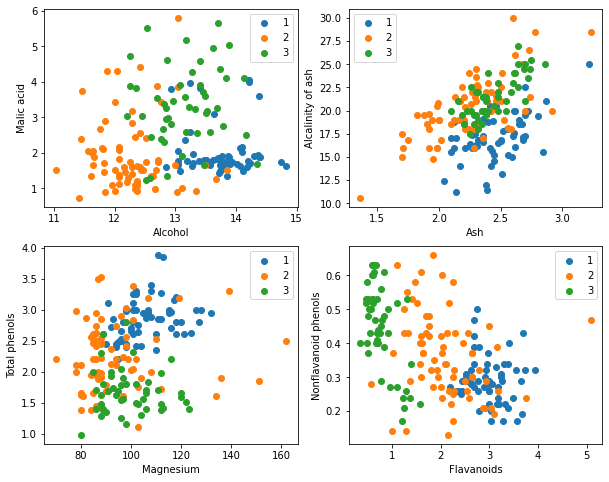

# K近邻算法

## 实验介绍

K近邻算法（K-Nearest-Neighbor, KNN）是一种用于分类和回归的非参数统计方法，是机器学习最基础的算法之一。KNN是无监督学习算法，无需训练，但是每次预测都需要遍历数据集，效率不高。KNN的三个基本要素：

- K值，一个样本的分类是由K个邻居的“多数表决”确定的。K值越小，容易受噪声影响，反之，会使类别之间的界限变得模糊。
- 距离度量，反映了特征空间中两个样本间的相似度，距离越小，越相似。常用的有Lp距离（p=2时，即为欧式距离）、曼哈顿距离、海明距离等。
- 分类决策规则，通常是多数表决，或者基于距离加权的多数表决（权值与距离成反比）。

本实验主要介绍使用MindSpore在部分wine数据集上进行KNN实验。

## 实验目的

- 了解KNN的基本概念；
- 了解如何使用MindSpore进行KNN实验。

## 预备知识

- 熟练使用Python。
- 具备一定的机器学习理论知识，如KNN、无监督学习、Lp距离等。
- 了解华为云的基本使用方法，包括[OBS（对象存储）](https://www.huaweicloud.com/product/obs.html)、[ModelArts（AI开发平台）](https://www.huaweicloud.com/product/modelarts.html)、[训练作业](https://support.huaweicloud.com/engineers-modelarts/modelarts_23_0238.html)等功能。华为云官网：https://www.huaweicloud.com
- 了解并熟悉MindSpore AI计算框架，MindSpore官网：https://www.mindspore.cn/

## 实验环境

- MindSpore 1.0.0（MindSpore版本会定期更新，本指导也会定期刷新，与版本配套）；
- 华为云ModelArts（控制台左上角选择“华北-北京四”）：ModelArts是华为云提供的面向开发者的一站式AI开发平台，集成了昇腾AI处理器资源池，用户可以在该平台下体验MindSpore。

## 实验准备

### 数据准备

Wine数据集是模式识别最著名的数据集之一，Wine数据集的官网：[Wine Data Set](http://archive.ics.uci.edu/ml/datasets/Wine)。这些数据是对来自意大利同一地区但来自三个不同品种的葡萄酒进行化学分析的结果。数据集分析了三种葡萄酒中每种所含13种成分的量。这些13种属性是

1. Alcohol，酒精
2. Malic acid，苹果酸
3. Ash，灰
4. Alcalinity of ash，灰的碱度
5. Magnesium，镁
6. Total phenols，总酚
7. Flavanoids，类黄酮
8. Nonflavanoid phenols，非黄酮酚
9. Proanthocyanins，原花青素
10. Color intensity，色彩强度
11. Hue，色调
12. OD280/OD315 of diluted wines，稀释酒的OD280/OD315
13. Proline，脯氨酸

- 方式一，从Wine数据集官网下载[wine.data文件](http://archive.ics.uci.edu/ml/machine-learning-databases/wine/wine.data)。
- 方式二，从华为云OBS中下载[wine.data文件](https://share-course.obs.cn-north-4.myhuaweicloud.com/dataset/wine.data)。

| Key | Value | Key | Value |
| :------------------------- | :------------- | :-------------------- | :--- |
| Data Set Characteristics:  | Multivariate   | Number of Instances:  | 178  |
| Attribute Characteristics: | Integer, Real  | Number of Attributes: | 13   |
| Associated Tasks:          | Classification | Missing Values?       | No   |

### 脚本准备

从[课程gitee仓库](https://gitee.com/mindspore/course)中下载本实验相关脚本。将脚本和数据集组织为如下形式：

```
knn
├── main.py
└── wine.data
```

### 创建OBS桶

本实验需要使用华为云OBS存储脚本和数据集，可以参考[快速通过OBS控制台上传下载文件](https://support.huaweicloud.com/qs-obs/obs_qs_0001.html)了解使用OBS创建桶、上传文件、下载文件的使用方法（下文给出了操作步骤）。

> **提示：** 华为云新用户使用OBS时通常需要创建和配置“访问密钥”，可以在使用OBS时根据提示完成创建和配置。也可以参考[获取访问密钥并完成ModelArts全局配置](https://support.huaweicloud.com/prepare-modelarts/modelarts_08_0002.html)获取并配置访问密钥。

打开[OBS控制台](https://storage.huaweicloud.com/obs/?region=cn-north-4&locale=zh-cn#/obs/manager/buckets)，点击右上角的“创建桶”按钮进入桶配置页面，创建OBS桶的参考配置如下：

- 区域：华北-北京四
- 数据冗余存储策略：单AZ存储
- 桶名称：全局唯一的字符串
- 存储类别：标准存储
- 桶策略：公共读
- 归档数据直读：关闭
- 企业项目、标签等配置：免

### 上传文件

点击新建的OBS桶名，再打开“对象”标签页，通过“上传对象”、“新建文件夹”等功能，将脚本和数据集上传到OBS桶中。上传文件后，查看页面底部的“任务管理”状态栏（正在运行、已完成、失败），确保文件均上传完成。若失败请：

- 参考[上传对象大小限制/切换上传方式](https://support.huaweicloud.com/qs-obs/obs_qs_0008.html)，
- 参考[上传对象失败常见原因](https://support.huaweicloud.com/obs_faq/obs_faq_0134.html)。
- 若无法解决请[新建工单](https://console.huaweicloud.com/ticket/?region=cn-north-4&locale=zh-cn#/ticketindex/createIndex)，产品类为“对象存储服务”，问题类型为“桶和对象相关”，会有技术人员协助解决。

## 实验步骤

推荐使用ModelArts训练作业进行实验，适合大规模并发使用。若使用ModelArts Notebook，请参考[LeNet5](../lenet5)及[Checkpoint](../checkpoint)实验案例，了解Notebook的使用方法和注意事项。

### 代码梳理

导入MindSpore模块和辅助模块：

```python
import os
# os.environ['DEVICE_ID'] = '4'
import csv
import numpy as np

import mindspore as ms
from mindspore import context
from mindspore import nn
from mindspore.ops import operations as P
from mindspore.ops import functional as F

context.set_context(device_target="Ascend")
```

读取Wine数据集`wine.data`，并查看部分数据。

```python
with open('wine.data') as csv_file:
    data = list(csv.reader(csv_file, delimiter=','))
print(data[56:62]+data[130:133])  # print some samples
```

    [['1', '14.22', '1.7', '2.3', '16.3', '118', '3.2', '3', '.26', '2.03', '6.38', '.94', '3.31', '970'], ['1', '13.29', '1.97', '2.68', '16.8', '102', '3', '3.23', '.31', '1.66', '6', '1.07', '2.84', '1270'], ['1', '13.72', '1.43', '2.5', '16.7', '108', '3.4', '3.67', '.19', '2.04', '6.8', '.89', '2.87', '1285'], ['2', '12.37', '.94', '1.36', '10.6', '88', '1.98', '.57', '.28', '.42', '1.95', '1.05', '1.82', '520'], ['2', '12.33', '1.1', '2.28', '16', '101', '2.05', '1.09', '.63', '.41', '3.27', '1.25', '1.67', '680'], ['2', '12.64', '1.36', '2.02', '16.8', '100', '2.02', '1.41', '.53', '.62', '5.75', '.98', '1.59', '450'], ['3', '12.86', '1.35', '2.32', '18', '122', '1.51', '1.25', '.21', '.94', '4.1', '.76', '1.29', '630'], ['3', '12.88', '2.99', '2.4', '20', '104', '1.3', '1.22', '.24', '.83', '5.4', '.74', '1.42', '530'], ['3', '12.81', '2.31', '2.4', '24', '98', '1.15', '1.09', '.27', '.83', '5.7', '.66', '1.36', '560']]

取三类样本（共178条），将数据集的13个属性作为自变量$X$。将数据集的3个类别作为因变量$Y$。

```python
X = np.array([[float(x) for x in s[1:]] for s in data[:178]], np.float32)
Y = np.array([s[0] for s in data[:178]], np.int32)
```

取样本的某两个属性进行2维可视化，可以看到在某两个属性上样本的分布情况以及可分性。

```python
attrs = ['Alcohol', 'Malic acid', 'Ash', 'Alcalinity of ash', 'Magnesium', 'Total phenols',
         'Flavanoids', 'Nonflavanoid phenols', 'Proanthocyanins', 'Color intensity', 'Hue',
         'OD280/OD315 of diluted wines', 'Proline']
plt.figure(figsize=(10, 8))
for i in range(0, 4):
    plt.subplot(2, 2, i+1)
    a1, a2 = 2 * i, 2 * i + 1
    plt.scatter(X[:59, a1], X[:59, a2], label='1')
    plt.scatter(X[59:130, a1], X[59:130, a2], label='2')
    plt.scatter(X[130:, a1], X[130:, a2], label='3')
    plt.xlabel(attrs[a1])
    plt.ylabel(attrs[a2])
    plt.legend()
plt.show()
```



将数据集按128:50划分为训练集（已知类别样本）和验证集（待验证样本）：

```python
train_idx = np.random.choice(178, 128, replace=False)
test_idx = np.array(list(set(range(178)) - set(train_idx)))
X_train, Y_train = X[train_idx], Y[train_idx]
X_test, Y_test = X[test_idx], Y[test_idx]
```

利用MindSpore提供的`tile, suqare, ReduceSum, sqrt, TopK`等算子，通过矩阵运算的方式同时计算输入样本x和已明确分类的其他样本X_train的距离，并计算出top k近邻。

```python
class KnnNet(nn.Cell):
    def __init__(self, k):
        super(KnnNet, self).__init__()
        self.tile = P.Tile()
        self.sum = P.ReduceSum()
        self.topk = P.TopK()
        self.k = k

    def construct(self, x, X_train):
        # Tile input x to match the number of samples in X_train
        x_tile = self.tile(x, (128, 1))
        square_diff = F.square(x_tile - X_train)
        square_dist = self.sum(square_diff, 1)
        dist = F.sqrt(square_dist)
        # -dist mean the bigger the value is, the nearer the samples are
        values, indices = self.topk(-dist, self.k)
        return indices


def knn(knn_net, x, X_train, Y_train):
    x, X_train = ms.Tensor(x), ms.Tensor(X_train)
    indices = knn_net(x, X_train)
    topk_cls = [0]*len(indices.asnumpy())
    for idx in indices.asnumpy():
        topk_cls[Y_train[idx]] += 1
    cls = np.argmax(topk_cls)
    return cls
```

在验证集上验证KNN算法的有效性，取$k = 5$，验证精度接近80%，说明KNN算法在该3分类任务上有效，能根据酒的13种属性判断出酒的品种。

```python
acc = 0
knn_net = KnnNet(5)
for x, y in zip(X_test, Y_test):
    pred = knn(knn_net, x, X_train, Y_train)
    acc += (pred == y)
    print('label: %d, prediction: %s' % (y, pred))
print('Validation accuracy is %f' % (acc/len(Y_test)))
```

    label: 1, prediction: 1
    label: 3, prediction: 3
    label: 1, prediction: 1
    label: 3, prediction: 3
    label: 1, prediction: 1
    label: 1, prediction: 1
    label: 1, prediction: 1
    label: 1, prediction: 1
    label: 3, prediction: 3
    label: 1, prediction: 1
    label: 1, prediction: 1
    label: 3, prediction: 2
    label: 3, prediction: 3
    label: 1, prediction: 1
    label: 3, prediction: 2
    label: 1, prediction: 1
    label: 1, prediction: 1
    label: 1, prediction: 1
    label: 3, prediction: 2
    label: 3, prediction: 2
    label: 3, prediction: 1
    label: 3, prediction: 2
    label: 3, prediction: 2
    label: 3, prediction: 2
    label: 1, prediction: 1
    label: 3, prediction: 2
    label: 1, prediction: 1
    label: 3, prediction: 1
    label: 1, prediction: 1
    label: 3, prediction: 2
    label: 1, prediction: 1
    label: 1, prediction: 1
    label: 1, prediction: 1
    label: 1, prediction: 1
    label: 2, prediction: 2
    label: 2, prediction: 2
    label: 2, prediction: 3
    label: 2, prediction: 2
    label: 2, prediction: 1
    label: 2, prediction: 2
    label: 2, prediction: 3
    label: 2, prediction: 1
    label: 2, prediction: 2
    label: 2, prediction: 2
    label: 2, prediction: 2
    label: 2, prediction: 3
    label: 2, prediction: 2
    label: 2, prediction: 3
    label: 2, prediction: 2
    label: 2, prediction: 2
    Validation accuracy is 0.660000

### 创建训练作业

可以参考[使用常用框架训练模型](https://support.huaweicloud.com/engineers-modelarts/modelarts_23_0238.html)来创建并启动训练作业（下文给出了操作步骤）。

打开[ModelArts控制台-训练管理-训练作业](https://console.huaweicloud.com/modelarts/?region=cn-north-4#/trainingJobs)，点击“创建”按钮进入训练作业配置页面，创建训练作业的参考配置：

- 算法来源：常用框架->Ascend-Powered-Engine->MindSpore
- 代码目录：选择上述新建的OBS桶中的knn目录
- 启动文件：选择上述新建的OBS桶中的knn目录下的`main.py`
- 数据来源：数据存储位置->选择上述新建的OBS桶中的knn目录，本实验使用其中的wine.data
- 训练输出位置：选择上述新建的OBS桶中的knn目录并在其中创建output目录
- 作业日志路径：同训练输出位置
- 规格：Ascend:1*Ascend 910
- 其他均为默认

启动并查看训练过程：

1. 点击提交以开始训练；
2. 在训练作业列表里可以看到刚创建的训练作业，在训练作业页面可以看到版本管理；
3. 点击运行中的训练作业，在展开的窗口中可以查看作业配置信息，以及训练过程中的日志，日志会不断刷新，等训练作业完成后也可以下载日志到本地进行查看；
4. 参考上述代码梳理，在日志中找到对应的打印信息，检查实验是否成功。

创建训练作业时，运行参数会通过脚本传参的方式输入给脚本代码，脚本必须解析传参才能在代码中使用相应参数。如data_url对应数据存储路径(OBS路径)，脚本对传参进行解析后赋值到`args`变量里，在后续代码里可以使用。

```python
import argparse
parser = argparse.ArgumentParser()
parser.add_argument('--data_url', required=True, default=None, help='Location of data.')
args, unknown = parser.parse_known_args()
```

MindSpore暂时没有提供直接访问OBS数据的接口，需要通过ModelArts自带的moxing框架与OBS交互。将OBS桶中的数据拷贝至执行容器中，供MindSpore使用：

```python
import moxing
# src_url形如's3://OBS/PATH'，为OBS桶中数据集的路径，dst_url为执行容器中的路径，两者皆为目录/皆为文件
moxing.file.copy_parallel(src_url=os.path.join(args.data_url, 'wine.data'), dst_url='wine.data')
```

## 实验结论

本实验使用MindSpore实现了KNN算法，用来解决3分类问题。取wine数据集上的3类样本，分为已知类别样本和待验证样本，从验证结果可以看出KNN算法在该任务上有效，能根据酒的13种属性判断出酒的品种。
