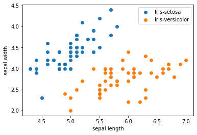

# K Nearest Neighbor

## 实验介绍

K近邻算法（K-Nearest-Neighbor, KNN）是一种用于分类和回归的非参数统计方法，是机器学习最基础的算法之一。KNN是无监督学习算法，无需训练，但是每次预测都需要遍历数据集，效率不高。KNN的三个基本要素：

- K值，一个样本的分类是由K个邻居的“多数表决”确定的。K值越小，容易受噪声影响，反之，会使类别之间的界限变得模糊。
- 距离度量，反映了特征空间中两个样本间的相似度，距离越小，越相似。常用的有Lp距离（p=2时，即为欧式距离）、曼哈顿距离、海明距离等。
- 分类决策规则，通常是多数表决，或者基于距离加权的多数表决（权值与距离成反比）。

本实验主要介绍使用MindSpore在部分Iris数据集上进行KNN实验。

## 实验目的

- 了解KNN的基本概念；
- 了解如何使用MindSpore进行KNN实验。

## 预备知识

- 熟练使用Python。
- 具备一定的机器学习理论知识，如KNN、无监督学习、Lp距离等。
- 了解华为云的基本使用方法，包括[ModelArts（AI开发平台）](https://www.huaweicloud.com/product/modelarts.html)、[训练作业](https://support.huaweicloud.com/engineers-modelarts/modelarts_23_0046.html)等功能。华为云官网：https://www.huaweicloud.com
- 了解并熟悉MindSpore AI计算框架，MindSpore官网：https://www.mindspore.cn/

## 实验环境

- MindSpore 0.2.0（MindSpore版本会定期更新，本指导也会定期刷新，与版本配套）；
- 华为云ModelArts：ModelArts是华为云提供的面向开发者的一站式AI开发平台，集成了昇腾AI处理器资源池，用户可以在该平台下体验MindSpore。ModelArts官网：https://www.huaweicloud.com/product/modelarts.html

## 实验准备

### 创建OBS桶

本实验需要使用华为云OBS存储脚本，可以参考[快速通过OBS控制台上传下载文件](https://support.huaweicloud.com/qs-obs/obs_qs_0001.html)了解使用OBS创建桶、上传文件、下载文件的使用方法。

> **提示：** 华为云新用户使用OBS时通常需要创建和配置“访问密钥”，可以在使用OBS时根据提示完成创建和配置。也可以参考[获取访问密钥并完成ModelArts全局配置](https://support.huaweicloud.com/prepare-modelarts/modelarts_08_0002.html)获取并配置访问密钥。

创建OBS桶的参考配置如下：

- 区域：华北-北京四
- 数据冗余存储策略：单AZ存储
- 桶名称：全局唯一的字符串
- 存储类别：标准存储
- 桶策略：公共读
- 归档数据直读：关闭
- 企业项目、标签等配置：免

### 脚本准备

从[课程gitee仓库](https://gitee.com/mindspore/course)上下载本实验相关脚本。

### 上传文件

将脚本上传到OBS桶中。

## 实验步骤

### 代码梳理

导入MindSpore模块和辅助模块：

```python
import os
# os.environ['DEVICE_ID'] = '4'
import csv
import numpy as np

import mindspore as ms
from mindspore import context
from mindspore import nn
from mindspore.ops import operations as P
from mindspore.ops import functional as F

context.set_context(device_target="Ascend")
```

读取Iris数据集`iris.data`，并查看部分数据。

```python
with open('iris.data') as csv_file:
    data = list(csv.reader(csv_file, delimiter=','))
print(data[40:60]) # 打印部分数据
```

    [['5.0', '3.5', '1.3', '0.3', 'Iris-setosa'], ['4.5', '2.3', '1.3', '0.3', 'Iris-setosa'], ['4.4', '3.2', '1.3', '0.2', 'Iris-setosa'], ['5.0', '3.5', '1.6', '0.6', 'Iris-setosa'], ['5.1', '3.8', '1.9', '0.4', 'Iris-setosa'], ['4.8', '3.0', '1.4', '0.3', 'Iris-setosa'], ['5.1', '3.8', '1.6', '0.2', 'Iris-setosa'], ['4.6', '3.2', '1.4', '0.2', 'Iris-setosa'], ['5.3', '3.7', '1.5', '0.2', 'Iris-setosa'], ['5.0', '3.3', '1.4', '0.2', 'Iris-setosa'], ['7.0', '3.2', '4.7', '1.4', 'Iris-versicolor'], ['6.4', '3.2', '4.5', '1.5', 'Iris-versicolor'], ['6.9', '3.1', '4.9', '1.5', 'Iris-versicolor'], ['5.5', '2.3', '4.0', '1.3', 'Iris-versicolor'], ['6.5', '2.8', '4.6', '1.5', 'Iris-versicolor'], ['5.7', '2.8', '4.5', '1.3', 'Iris-versicolor'], ['6.3', '3.3', '4.7', '1.6', 'Iris-versicolor'], ['4.9', '2.4', '3.3', '1.0', 'Iris-versicolor'], ['6.6', '2.9', '4.6', '1.3', 'Iris-versicolor'], ['5.2', '2.7', '3.9', '1.4', 'Iris-versicolor']]

取前两类样本（共100条），将数据集的4个属性作为自变量$X$。将数据集的2个类别映射为{0, 1}，作为因变量$Y$。

```python
label_map = {
    'Iris-setosa': 0,
    'Iris-versicolor': 1,
}

X = np.array([[float(x) for x in s[:-1]] for s in data[:100]], np.float32)
Y = np.array([label_map[s[-1]] for s in data[:100]], np.int32)
```

取样本的前两个属性进行2维可视化，可以看到在前两个属性上两类样本是线性可分的。

```python
from matplotlib import pyplot as plt
plt.scatter(X[:50, 0], X[:50, 1], label='Iris-setosa')
plt.scatter(X[50:, 0], X[50:, 1], label='Iris-versicolor')
plt.xlabel('sepal length')
plt.ylabel('sepal width')
plt.legend()
```



将数据集按8:2划分为训练集（已知类别样本）和验证集（待验证样本）：

```python
train_idx = np.random.choice(100, 80, replace=False)
test_idx = np.array(list(set(range(100)) - set(train_idx)))
X_train, Y_train = X[train_idx], Y[train_idx]
X_test, Y_test = X[test_idx], Y[test_idx]
```

利用MindSpore提供的`tile, suqare, ReduceSum, sqrt, TopK`等算子，通过矩阵运算的方式同时计算输入样本x和已明确分类的其他样本X_train的距离，并计算出top k近邻。

```python
class KnnNet(nn.Cell):
    def __init__(self, k):
        super(KnnNet, self).__init__()
        self.tile = P.Tile()
        self.sum = P.ReduceSum()
        self.topk = P.TopK()
        self.k = k

    def construct(self, x, X_train):
        # Tile input x to match the number of samples in X_train
        x_tile = self.tile(x, (80, 1))
        square_diff = F.square(x_tile - X_train)
        square_dist = self.sum(square_diff, 1)
        dist = F.sqrt(square_dist)
        # '-dist' means the bigger the value is, the nearer the samples are
        values, indices = self.topk(-dist, self.k)
        return indices


def knn(knn_net, x, X_train, Y_train):
    x, X_train = ms.Tensor(x), ms.Tensor(X_train)
    indices = knn_net(x, X_train)
    topk_cls = [0]*len(indices.asnumpy())
    for idx in indices.asnumpy():
        topk_cls[Y_train[idx]] += 1
    cls = np.argmax(topk_cls)
    return cls
```

在验证集上验证KNN算法的有效性，验证精度接近100%，说明KNN算法在该任务上十分有效。

```python
acc = 0
knn_net = KnnNet(5)
for x, y in zip(X_test, Y_test):
    pred = knn(knn_net, x, X_train, Y_train)
    acc += (pred == y)
    print('sample: %s, label: %d, prediction: %s' % (x, y, pred))
print('Validation accuracy is %f' % (acc/len(Y_test)))
```

    sample: [5.1 3.5 1.4 0.2], label: 0, prediction: 0
    sample: [4.6 3.4 1.4 0.3], label: 0, prediction: 0
    sample: [5.1 3.5 1.4 0.3], label: 0, prediction: 0
    sample: [5.4 3.4 1.7 0.2], label: 0, prediction: 0
    sample: [4.8 3.1 1.6 0.2], label: 0, prediction: 0
    sample: [5.5 4.2 1.4 0.2], label: 0, prediction: 0
    sample: [4.9 3.1 1.5 0.1], label: 0, prediction: 0
    sample: [5.  3.2 1.2 0.2], label: 0, prediction: 0
    sample: [5.5 3.5 1.3 0.2], label: 0, prediction: 0
    sample: [4.5 2.3 1.3 0.3], label: 0, prediction: 0
    sample: [5.  3.3 1.4 0.2], label: 0, prediction: 0
    sample: [7.  3.2 4.7 1.4], label: 1, prediction: 1
    sample: [6.3 3.3 4.7 1.6], label: 1, prediction: 1
    sample: [6.6 2.9 4.6 1.3], label: 1, prediction: 1
    sample: [5.2 2.7 3.9 1.4], label: 1, prediction: 1
    sample: [5.9 3.  4.2 1.5], label: 1, prediction: 1
    sample: [6.  2.2 4.  1. ], label: 1, prediction: 1
    sample: [5.5 2.4 3.8 1.1], label: 1, prediction: 1
    sample: [5.8 2.7 3.9 1.2], label: 1, prediction: 1
    sample: [6.3 2.3 4.4 1.3], label: 1, prediction: 1
    Validation accuracy is 1.000000

### 创建训练作业

可以参考[使用常用框架训练模型](https://support.huaweicloud.com/engineers-modelarts/modelarts_23_0238.html)来创建并启动训练作业。

创建训练作业的参考配置：

- 算法来源：常用框架->Ascend-Powered-Engine->MindSpore
- 代码目录：选择上述新建的OBS桶中的experiment目录
- 启动文件：选择上述新建的OBS桶中的experiment目录下的`main.py`
- 数据来源：数据存储位置->选择上述新建的OBS桶中的experiment目录，本实验使用其中的iris.data
- 训练输出位置：选择上述新建的OBS桶中的experiment目录并在其中创建output目录
- 作业日志路径：同训练输出位置
- 规格：Ascend:1*Ascend 910
- 其他均为默认

启动并查看训练过程：

1. 点击提交以开始训练；
2. 在训练作业列表里可以看到刚创建的训练作业，在训练作业页面可以看到版本管理；
3. 点击运行中的训练作业，在展开的窗口中可以查看作业配置信息，以及训练过程中的日志，日志会不断刷新，等训练作业完成后也可以下载日志到本地进行查看；
4. 参考上述代码梳理，在日志中找到对应的打印信息，检查实验是否成功。

创建训练作业时，运行参数会通过脚本传参的方式输入给脚本代码，脚本必须解析传参才能在代码中使用相应参数。如data_url对应数据存储路径(OBS路径)，脚本对传参进行解析后赋值到`args`变量里，在后续代码里可以使用。

```python
import argparse
parser = argparse.ArgumentParser()
parser.add_argument('--data_url', required=True, default=None, help='Location of data.')
args, unknown = parser.parse_known_args()
```

MindSpore暂时没有提供直接访问OBS数据的接口，需要通过MoXing提供的API与OBS交互。将OBS中存储的数据拷贝至执行容器：

```python
import moxing as mox
mox.file.copy_parallel(src_url=os.path.join(args.data_url, 'iris.data'), dst_url='iris.data')
```

## 实验结论

本实验使用MindSpore实现了KNN算法，用来解决分类问题。取Iris数据集上的2类样本，按8:2分为已知类别样本和待验证样本，结果发现KNN算法在该任务上十分有效。
