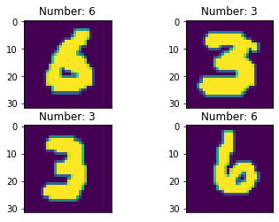

# 基于LeNet5的手写数字识别

## 实验介绍

LeNet5 + MNIST被誉为深度学习领域的“Hello world”。本实验主要介绍使用MindSpore在MNIST手写数字数据集上开发和训练一个LeNet5模型，并验证模型精度。

## 实验目的

- 了解如何使用MindSpore进行简单卷积神经网络的开发。
- 了解如何使用MindSpore进行简单图片分类任务的训练。
- 了解如何使用MindSpore进行简单图片分类任务的验证。

## 预备知识

- 熟练使用Python，了解Shell及Linux操作系统基本知识。
- 具备一定的深度学习理论知识，如卷积神经网络、损失函数、优化器，训练策略等。
- 了解华为云的基本使用方法，包括[OBS（对象存储）](https://www.huaweicloud.com/product/obs.html)、[ModelArts（AI开发平台）](https://www.huaweicloud.com/product/modelarts.html)、[Notebook（开发工具）](https://support.huaweicloud.com/engineers-modelarts/modelarts_23_0032.html)、[训练作业](https://support.huaweicloud.com/engineers-modelarts/modelarts_23_0238.html)等服务。华为云官网：https://www.huaweicloud.com
- 了解并熟悉MindSpore AI计算框架，MindSpore官网：https://www.mindspore.cn

## 实验环境

- MindSpore 1.0.0（MindSpore版本会定期更新，本指导也会定期刷新，与版本配套）；
- 华为云ModelArts（控制台左上角选择“华北-北京四”）：ModelArts是华为云提供的面向开发者的一站式AI开发平台，集成了昇腾AI处理器资源池，用户可以在该平台下体验MindSpore；
- Windows/Ubuntu x64笔记本，NVIDIA GPU服务器，或Atlas Ascend服务器等。

## 实验准备

### 数据集准备

MNIST是一个手写数字数据集，训练集包含60000张手写数字，测试集包含10000张手写数字，共10类。MNIST数据集的官网：[THE MNIST DATABASE](http://yann.lecun.com/exdb/mnist/)。

- 方式一，从MNIST官网下载如下4个文件到本地并解压：

```
train-images-idx3-ubyte.gz:  training set images (9912422 bytes)
train-labels-idx1-ubyte.gz:  training set labels (28881 bytes)
t10k-images-idx3-ubyte.gz:   test set images (1648877 bytes)
t10k-labels-idx1-ubyte.gz:   test set labels (4542 bytes)
```

- 方式二，从华为云OBS中下载[MNIST数据集](https://share-course.obs.cn-north-4.myhuaweicloud.com/dataset/MNIST.zip)并解压。

- 方式三（推荐），使用ModelArts训练作业/Notebook时，可以拷贝他人账户下OBS桶内的数据集，方法详见[适配训练作业](#适配训练作业)、[数据拷贝](#数据拷贝)。

### 脚本准备

从[课程gitee仓库](https://gitee.com/mindspore/course)上下载本实验相关脚本。将脚本和数据集组织为如下形式：

```
lenet5
├── MNIST
│   ├── test
│   │   ├── t10k-images-idx3-ubyte
│   │   └── t10k-labels-idx1-ubyte
│   └── train
│       ├── train-images-idx3-ubyte
│       └── train-labels-idx1-ubyte
└── main.py
```

### 创建OBS桶

使用ModelArts训练作业/Notebook时，需要使用华为云OBS存储实验脚本和数据集，可以参考[快速通过OBS控制台上传下载文件](https://support.huaweicloud.com/qs-obs/obs_qs_0001.html)了解使用OBS创建桶、上传文件、下载文件的使用方法（下文给出了操作步骤）。

> **提示：** 华为云新用户使用OBS时通常需要创建和配置“访问密钥”，可以在使用OBS时根据提示完成创建和配置。也可以参考[获取访问密钥并完成ModelArts全局配置](https://support.huaweicloud.com/prepare-modelarts/modelarts_08_0002.html)获取并配置访问密钥。

打开[OBS控制台](https://storage.huaweicloud.com/obs/?region=cn-north-4&locale=zh-cn#/obs/manager/buckets)，点击右上角的“创建桶”按钮进入桶配置页面，创建OBS桶的参考配置如下：

- 区域：华北-北京四
- 数据冗余存储策略：单AZ存储
- 桶名称：全局唯一的字符串
- 存储类别：标准存储
- 桶策略：公共读
- 归档数据直读：关闭
- 企业项目、标签等配置：免

### 上传文件

点击新建的OBS桶名，再打开“对象”标签页，通过“上传对象”、“新建文件夹”等功能，将脚本和数据集上传到OBS桶中。上传文件后，查看页面底部的“任务管理”状态栏（正在运行、已完成、失败），确保文件均上传完成。若失败请：

- 参考[上传对象大小限制/切换上传方式](https://support.huaweicloud.com/qs-obs/obs_qs_0008.html)，
- 参考[上传对象失败常见原因](https://support.huaweicloud.com/obs_faq/obs_faq_0134.html)。
- 若无法解决请[新建工单](https://console.huaweicloud.com/ticket/?region=cn-north-4&locale=zh-cn#/ticketindex/createIndex)，产品类为“对象存储服务”，问题类型为“桶和对象相关”，会有技术人员协助解决。

## 实验步骤（ModelArts训练作业）

ModelArts提供了训练作业服务，训练作业资源池大，且具有作业排队等功能，适合大规模并发使用。使用训练作业时，如果有修改代码和调试的需求，有如下三个方案：

1. 在本地修改代码后重新上传；

2. 使用[PyCharm ToolKit](https://support.huaweicloud.com/tg-modelarts/modelarts_15_0001.html)配置一个本地Pycharm+ModelArts的开发环境，便于上传代码、提交训练作业和获取训练日志。

3. 在ModelArts上创建Notebook，然后设置[Sync OBS功能](https://support.huaweicloud.com/engineers-modelarts/modelarts_23_0038.html)，可以在线修改代码并自动同步到OBS中。因为只用Notebook来编辑代码，所以创建CPU类型最低规格的Notebook就行。

### 适配训练作业

创建训练作业时，运行参数会通过脚本传参的方式输入给脚本代码，脚本必须解析传参才能在代码中使用相应参数。如data_url和train_url，分别对应数据存储路径(OBS路径)和训练输出路径(OBS路径)。脚本对传参进行解析后赋值到`args`变量里，在后续代码里可以使用。

```python
import argparse
parser = argparse.ArgumentParser()
parser.add_argument('--data_url', required=True, default=None, help='Location of data.')
parser.add_argument('--train_url', required=True, default=None, help='Location of training outputs.')
args, unknown = parser.parse_known_args()
```

MindSpore暂时没有提供直接访问OBS数据的接口，需要通过ModelArts自带的moxing框架与OBS交互。将OBS桶中的数据拷贝至执行容器中，供MindSpore使用：

- 方式一，拷贝自己账户下OBS桶内的数据集。
    
    ```python
    import moxing
    # src_url形如's3://OBS/PATH'，为OBS桶中数据集的路径，dst_url为执行容器中的路径
    moxing.file.copy_parallel(src_url=args.data_url, dst_url='MNIST/')
    ```

- 方式二（推荐），拷贝他人账户下OBS桶内的数据集，前提是他人账户下的OBS桶已设为公共读/公共读写，且需要他人账户的访问密钥、私有访问密钥、OBS桶-概览-基本信息-Endpoint。
    
    ```python
    import moxing
    # 设置moxing/obs认证信息, ak:Access Key Id, sk:Secret Access Key, server:endpoint of obs bucket
    moxing.file.set_auth(ak='VCT2GKI3GJOZBQYJG5WM', sk='t1y8M4Z6bHLSAEGK2bCeRYMjo2S2u0QBqToYbxzB',
                         server="obs.cn-north-4.myhuaweicloud.com")
    moxing.file.copy_parallel(src_url="s3://share-course/dataset/MNIST/", dst_url='MNIST/')
    ```

### 创建训练作业

可以参考[使用常用框架训练模型](https://support.huaweicloud.com/engineers-modelarts/modelarts_23_0238.html)来创建并启动训练作业（下文给出了操作步骤）。

打开[ModelArts控制台-训练管理-训练作业](https://console.huaweicloud.com/modelarts/?region=cn-north-4#/trainingJobs)，点击“创建”按钮进入训练作业配置页面，创建训练作业的参考配置：

- 算法来源：常用框架->Ascend-Powered-Engine->MindSpore
- 代码目录：选择上述新建的OBS桶中的lenet5目录
- 启动文件：选择上述新建的OBS桶中的lenet5目录下的`main.py`
- 数据来源：数据存储位置->选择上述新建的OBS桶中的lenet5目录下的MNIST目录
- 训练输出位置：选择上述新建的OBS桶中的lenet5目录并在其中创建output目录
- 作业日志路径：同训练输出位置
- 规格：Ascend:1*Ascend 910
- 其他均为默认

启动并查看训练过程：

1. 点击提交以开始训练；
2. 在训练作业列表里可以看到刚创建的训练作业，在训练作业页面可以看到版本管理；
3. 点击运行中的训练作业，在展开的窗口中可以查看作业配置信息，以及训练过程中的日志，日志会不断刷新，等训练作业完成后也可以下载日志到本地进行查看；
4. 参考实验步骤（Notebook），在日志中找到对应的打印信息，检查实验是否成功。

## 实验步骤（ModelArts Notebook）

ModelArts Notebook资源池较小，且每个运行中的Notebook会一直占用Device资源不释放，不适合大规模并发使用（不使用时需停止实例，以释放资源）。

### 创建Notebook

可以参考[创建并打开Notebook](https://support.huaweicloud.com/engineers-modelarts/modelarts_23_0034.html)来创建并打开Notebook（下文给出了操作步骤）。

打开[ModelArts控制台-开发环境-Notebook](https://console.huaweicloud.com/modelarts/?region=cn-north-4#/notebook)，点击“创建”按钮进入Notebook配置页面，创建Notebook的参考配置：

- 计费模式：按需计费
- 名称：lenet5
- 工作环境：Python3
- 资源池：公共资源
- 类型：Ascend
- 规格：单卡1*Ascend 910
- 存储位置：对象存储服务（OBS）->选择上述新建的OBS桶中的lenet5文件夹
- 自动停止：打开->选择1小时后（后续可在Notebook中随时调整）

> **注意：**
> - 在Jupyter Notebook/JupyterLab文件列表里，展示的是关联的OBS桶里的文件，并不在当前Notebook工作环境（容器）中，Notebook中的代码无法直接访问这些文件。
> - 打开Notebook前，选中文件列表里的所有文件/文件夹（实验脚本和数据集），并点击列表上方的“Sync OBS”按钮，使OBS桶中的所有文件同时同步到Notebook执行容器中，这样Notebook中的代码才能访问数据集。
>   - 使用Notebook时，可参考[与OBS同步文件](https://support.huaweicloud.com/engineers-modelarts/modelarts_23_0038.html)；
>   - 使用JupyterLab时，可参考[与OBS同步文件](https://support.huaweicloud.com/engineers-modelarts/modelarts_23_0336.html)。
>   - 同步文件的大小和数量超过限制时，请参考[MoXing常用操作示例](https://support.huaweicloud.com/moxing-devg-modelarts/modelarts_11_0005.html#section5)中的拷贝操作，将大文件（如数据集）拷贝到Notebook容器中。
> - Notebook/JupyterLab文件列表页面的“Upload/上传”功能，会将文件上传至OBS桶中，而不是Notebook执行容器中，仍需额外同步/拷贝。
> - 在Notebook里通过代码/命令（如`wget, git`、python`urllib, requests`等）获取的文件，存在于Notebook执行容器中，但不会显示在文件列表里。
> - 每个Notebook实例仅被分配了1个Device，如果在一个实例中打开多个Notebook页面（即多个进程），运行其中一个页面上的MindSpore代码时，请关闭其他页面的kernel，否则会出现Device被占用的错误。
> - Notebook运行中一直处于计费状态，不使用时，在Notebook控制台页面点击实例右侧的“停止”，以停止计费。停止后，Notebook里的内容不会丢失（已同步至OBS）。下次需要使用时，点击实例右侧的“启动”即可。可参考[启动或停止Notebook实例](https://support.huaweicloud.com/engineers-modelarts/modelarts_23_0041.html)。

打开Notebook后，选择MindSpore环境作为Kernel。

> **提示：** 
> - 上述数据集和脚本的准备工作也可以在Notebook环境中完成，在Jupyter Notebook文件列表页面，点击右上角的"New"->"Terminal"，进入Notebook环境所在终端，进入`work`目录，可以使用常用的linux shell命令，如`wget, gzip, tar, mkdir, mv`等，完成数据集和脚本的下载和准备。
> - 可将如下每段代码拷贝到Notebook代码框/Cell中，从上至下阅读提示并执行代码框进行体验。代码框执行过程中左侧呈现[\*]，代码框执行完毕后左侧呈现如[1]，[2]等。请等上一个代码框执行完毕后再执行下一个代码框。

### 数据拷贝

（推荐、可选）若未上传数据集到自己的OBS桶中，可拷贝他人账户下OBS桶内的数据集，前提是他人账户下的OBS桶已设为公共读/公共读写，且需要他人账户的访问密钥、私有访问密钥、OBS桶-概览-基本信息-Endpoint。

```python
import moxing
# 设置moxing/obs认证信息, ak:Access Key Id, sk:Secret Access Key, server:endpoint of obs bucket
moxing.file.set_auth(ak='VCT2GKI3GJOZBQYJG5WM', sk='t1y8M4Z6bHLSAEGK2bCeRYMjo2S2u0QBqToYbxzB',
                     server="obs.cn-north-4.myhuaweicloud.com")
moxing.file.copy_parallel(src_url="s3://share-course/dataset/MNIST/", dst_url='MNIST/')
```

### 导入模块

导入MindSpore模块和辅助模块，设置MindSpore上下文，如执行模式、设备等。

```python
import os
# os.environ['DEVICE_ID'] = '0'

import mindspore as ms
import mindspore.context as context
import mindspore.dataset.transforms.c_transforms as C
import mindspore.dataset.vision.c_transforms as CV

from mindspore import nn
from mindspore.train import Model
from mindspore.train.callback import LossMonitor

context.set_context(mode=context.GRAPH_MODE, device_target='Ascend') # Ascend, CPU, GPU
```

### 数据处理

在使用数据集训练网络前，首先需要对数据进行预处理，如下：

```python
def create_dataset(data_dir, training=True, batch_size=32, resize=(32, 32),
                   rescale=1/(255*0.3081), shift=-0.1307/0.3081, buffer_size=64):
    data_train = os.path.join(data_dir, 'train') # train set
    data_test = os.path.join(data_dir, 'test') # test set
    ds = ms.dataset.MnistDataset(data_train if training else data_test)

    ds = ds.map(input_columns=["image"], operations=[CV.Resize(resize), CV.Rescale(rescale, shift), CV.HWC2CHW()])
    ds = ds.map(input_columns=["label"], operations=C.TypeCast(ms.int32))
    # When `dataset_sink_mode=True` on Ascend, append `ds = ds.repeat(num_epochs) to the end
    ds = ds.shuffle(buffer_size=buffer_size).batch(batch_size, drop_remainder=True)

    return ds
```

对其中几张图片进行可视化，可以看到图片中的手写数字，图片的大小为32x32。

```python
import matplotlib.pyplot as plt
ds = create_dataset('MNIST', training=False)
data = ds.create_dict_iterator().get_next()
images = data['image']
labels = data['label']

for i in range(1, 5):
    plt.subplot(2, 2, i)
    plt.imshow(images[i][0])
    plt.title('Number: %s' % labels[i])
    plt.xticks([])
plt.show()
```



### 定义模型

定义LeNet5模型，模型结构如下图所示：


[1] 图片来源于http://yann.lecun.com/exdb/publis/pdf/lecun-01a.pdf

> **提示**: MindSpore model_zoo中提供了多种常见的模型，可以直接使用。

```python
class LeNet5(nn.Cell):
    def __init__(self):
        super(LeNet5, self).__init__()
        self.conv1 = nn.Conv2d(1, 6, 5, stride=1, pad_mode='valid')
        self.conv2 = nn.Conv2d(6, 16, 5, stride=1, pad_mode='valid')
        self.relu = nn.ReLU()
        self.pool = nn.MaxPool2d(kernel_size=2, stride=2)
        self.flatten = nn.Flatten()
        self.fc1 = nn.Dense(400, 120)
        self.fc2 = nn.Dense(120, 84)
        self.fc3 = nn.Dense(84, 10)

    def construct(self, x):
        x = self.relu(self.conv1(x))
        x = self.pool(x)
        x = self.relu(self.conv2(x))
        x = self.pool(x)
        x = self.flatten(x)
        x = self.fc1(x)
        x = self.fc2(x)
        x = self.fc3(x)

        return x
```

### 训练

使用MNIST数据集对上述定义的LeNet5模型进行训练。训练策略如下表所示，可以调整训练策略并查看训练效果，要求验证精度大于95%。

| batch size | number of epochs | learning rate | optimizer |
| -- | -- | -- | -- |
| 32 | 3 | 0.01 | Momentum 0.9 |

```python
def train(data_dir, lr=0.01, momentum=0.9, num_epochs=3):
    ds_train = create_dataset(data_dir)
    ds_eval = create_dataset(data_dir, training=False)

    net = LeNet5()
    loss = nn.loss.SoftmaxCrossEntropyWithLogits(sparse=True, reduction='mean')
    opt = nn.Momentum(net.trainable_params(), lr, momentum)
    loss_cb = LossMonitor(per_print_times=ds_train.get_dataset_size())

    model = Model(net, loss, opt, metrics={'acc', 'loss'})
    # dataset_sink_mode can be True when using Ascend
    model.train(num_epochs, ds_train, callbacks=[loss_cb], dataset_sink_mode=False)
    metrics = model.eval(ds_eval, dataset_sink_mode=False)
    print('Metrics:', metrics)

train('MNIST/')
```

    epoch: 1 step 1875, loss is 0.23394052684307098
    epoch: 2 step 1875, loss is 0.4737345278263092
    epoch: 3 step 1875, loss is 0.07734094560146332
    Metrics: {'loss': 0.10531254443608654, 'acc': 0.9701522435897436}

## 实验步骤（本地CPU/GPU/Ascend）

MindSpore还支持在本地CPU/GPU/Ascend环境上运行，如Windows/Ubuntu x64笔记本，NVIDIA GPU服务器，以及Atlas Ascend服务器等。在本地环境运行实验前，需要先参考[安装教程](https://www.mindspore.cn/install/)配置环境。

在Windows/Ubuntu x64笔记本上运行实验：

```shell script
# 编辑main.py 将第15行的context设置为`device_target='CPU'`
python main.py --data_url=D:\dataset\MNIST
```

在Ascend服务器上运行实验：

```shell script
vim main.py # 将第15行的context设置为`device_target='Ascend'`
python main.py --data_url=/PATH/TO/MNIST
```

## 实验小结

本实验展示了如何使用MindSpore进行手写数字识别，以及开发和训练LeNet5模型。通过对LeNet5模型做几代的训练，然后使用训练后的LeNet5模型对手写数字进行识别，识别准确率大于95%。即LeNet5学习到了如何进行手写数字识别。
