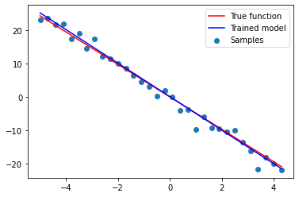

# 线性回归

## 实验介绍

线性回归（Linear Regression）是机器学习最经典的算法之一，具有如下特点：

- 自变量服从正态分布；
- 因变量是连续性数值变量；
- 自变量和因变量呈线性关系。

本实验主要介绍使用MindSpore在模拟数据上进行线性回归实验，分析自变量和因变量之间的线性关系，即求得一个线性函数。

## 实验目的

- 了解线性回归的基本概念和问题模拟；
- 了解如何使用MindSpore进行线性回归实验。

## 预备知识

- 熟练使用Python。
- 具备一定的机器学习理论知识，如线性回归、损失函数、优化器，训练策略等。
- 了解华为云的基本使用方法，包括[ModelArts（AI开发平台）](https://www.huaweicloud.com/product/modelarts.html)、[训练作业](https://support.huaweicloud.com/engineers-modelarts/modelarts_23_0238.html)等功能。华为云官网：https://www.huaweicloud.com
- 了解并熟悉MindSpore AI计算框架，MindSpore官网：https://www.mindspore.cn/

## 实验环境

- MindSpore 1.0.0（MindSpore版本会定期更新，本指导也会定期刷新，与版本配套）；
- 华为云ModelArts（控制台左上角选择“华北-北京四”）：ModelArts是华为云提供的面向开发者的一站式AI开发平台，集成了昇腾AI处理器资源池，用户可以在该平台下体验MindSpore。

## 实验准备

### 脚本准备

从[课程gitee仓库](https://gitee.com/mindspore/course)中下载本实验相关脚本。将脚本组织为如下形式：

```
linear_regression
└── main.py
```

### 创建OBS桶

本实验需要使用华为云OBS存储脚本，可以参考[快速通过OBS控制台上传下载文件](https://support.huaweicloud.com/qs-obs/obs_qs_0001.html)了解使用OBS创建桶、上传文件、下载文件的使用方法（下文给出了操作步骤）。

> **提示：** 华为云新用户使用OBS时通常需要创建和配置“访问密钥”，可以在使用OBS时根据提示完成创建和配置。也可以参考[获取访问密钥并完成ModelArts全局配置](https://support.huaweicloud.com/prepare-modelarts/modelarts_08_0002.html)获取并配置访问密钥。

打开[OBS控制台](https://storage.huaweicloud.com/obs/?region=cn-north-4&locale=zh-cn#/obs/manager/buckets)，点击右上角的“创建桶”按钮进入桶配置页面，创建OBS桶的参考配置如下：

- 区域：华北-北京四
- 数据冗余存储策略：单AZ存储
- 桶名称：全局唯一的字符串
- 存储类别：标准存储
- 桶策略：公共读
- 归档数据直读：关闭
- 企业项目、标签等配置：免

### 上传文件

点击新建的OBS桶名，再打开“对象”标签页，通过“上传对象”、“新建文件夹”等功能，将脚本上传到OBS桶中。上传文件后，查看页面底部的“任务管理”状态栏（正在运行、已完成、失败），确保文件均上传完成。若失败请：

- 参考[上传对象大小限制/切换上传方式](https://support.huaweicloud.com/qs-obs/obs_qs_0008.html)，
- 参考[上传对象失败常见原因](https://support.huaweicloud.com/obs_faq/obs_faq_0134.html)。
- 若无法解决请[新建工单](https://console.huaweicloud.com/ticket/?region=cn-north-4&locale=zh-cn#/ticketindex/createIndex)，产品类为“对象存储服务”，问题类型为“桶和对象相关”，会有技术人员协助解决。

## 实验步骤

推荐使用ModelArts训练作业进行实验，适合大规模并发使用。若使用ModelArts Notebook，请参考[LeNet5](../lenet5)及[Checkpoint](../checkpoint)实验案例，了解Notebook的使用方法和注意事项。

### 代码梳理

导入MindSpore模块和辅助模块：

```python
import os
# os.environ['DEVICE_ID'] = '0'
import numpy as np

import mindspore as ms
from mindspore import nn
from mindspore import context

context.set_context(mode=context.GRAPH_MODE, device_target="Ascend")
```

根据以下线性函数生成模拟数据，并在其中加入少许扰动。

$$y = -5 * x + 0.1$$

```python
x = np.arange(-5, 5, 0.3)[:32].reshape((32, 1))
y = -5 * x +  0.1 * np.random.normal(loc=0.0, scale=20.0, size=x.shape)
```

使用MindSpore提供的[`nn.Dense(1, 1)`算子](https://www.mindspore.cn/api/zh-CN/0.2.0-alpha/api/python/mindspore/mindspore.nn.html#mindspore.nn.Dense)作为线性模型，其中`(1, 1)`表示线性模型的输入和输出皆是1维，即$w$是1x1的矩阵。算子会随机初始化权重$w$和偏置$b$。

$$y = w * x + b$$

采用均方差（Mean Squared Error, MSE）作为损失函数。

采用随机梯度下降（Stochastic Gradient Descent, SGD）对模型进行优化。

```python
net = nn.Dense(1, 1)
loss_fn = nn.loss.MSELoss()
opt = nn.optim.SGD(net.trainable_params(), learning_rate=0.01)
with_loss = nn.WithLossCell(net, loss_fn)
train_step = nn.TrainOneStepCell(with_loss, opt).set_train()
```

使用模拟数据对模型进行几代（Epoch）训练：

```python
for epoch in range(20):
    loss = train_step(ms.Tensor(x, ms.float32), ms.Tensor(y, ms.float32))
    print('epoch: {0}, loss is {1}'.format(epoch, loss))
```

    epoch: 0, loss is 199.50531
    epoch: 1, loss is 142.8598
    epoch: 2, loss is 102.52245
    epoch: 3, loss is 73.8164
    epoch: 4, loss is 53.36943
    epoch: 5, loss is 38.76838
    epoch: 6, loss is 28.440298
    epoch: 7, loss is 21.0473
    epoch: 8, loss is 15.757072
    epoch: 9, loss is 12.019189
    epoch: 10, loss is 9.352854
    epoch: 11, loss is 7.4382267
    epoch: 12, loss is 6.0836077
    epoch: 13, loss is 5.122441
    epoch: 14, loss is 4.4334188
    epoch: 15, loss is 3.929727
    epoch: 16, loss is 3.5708385
    epoch: 17, loss is 3.32268
    epoch: 18, loss is 3.1429064
    epoch: 19, loss is 3.0036016

训练一定的代数后，得到的模型已经十分接近真实的线性函数了。

```python
wb = [x.data.asnumpy() for x in net.trainable_params()]
w, b = np.squeeze(wb[0]), np.squeeze(wb[1])
print('The true linear function is y = -5 * x + 0.1')
print('The trained linear model is y = {0} * x + {1}'.format(w, b))

for i in range(-10, 11, 5):
    print('x = {0}, predicted y = {1}'.format(i, net(ms.Tensor([[i]], ms.float32))))
```

    The true linear function is y = -5 * x + 0.1
    The trained linear model is y = -4.842680931091309 * x + 0.03442131727933884
    x = -10, predicted y = [[49.714813]]
    x = -5, predicted y = [[24.974724]]
    x = 0, predicted y = [[0.23463698]]
    x = 5, predicted y = [[-24.505451]]
    x = 10, predicted y = [[-49.245537]]

模拟的样本数据、真实的线性函数和训练得到的线性模型如下图所示：

```python
from matplotlib import pyplot as plt
plt.scatter(x, y, label='Samples')
plt.plot(x, w * x +  b, c='r', label='True function')
plt.plot(x, -5 * x +  0.1, c='b', label='Trained model')
plt.legend()
```



### 创建训练作业

可以参考[使用常用框架训练模型](https://support.huaweicloud.com/engineers-modelarts/modelarts_23_0238.html)来创建并启动训练作业（下文给出了操作步骤）。

打开[ModelArts控制台-训练管理-训练作业](https://console.huaweicloud.com/modelarts/?region=cn-north-4#/trainingJobs)，点击“创建”按钮进入训练作业配置页面，创建训练作业的参考配置：

- 算法来源：常用框架->Ascend-Powered-Engine->MindSpore
- 代码目录：选择上述新建的OBS桶中的linear_regression目录
- 启动文件：选择上述新建的OBS桶中的linear_regression目录下的`main.py`
- 数据来源：数据存储位置->选择上述新建的OBS桶中的linear_regression目录，本实验实际上没有使用OBS中的数据
- 训练输出位置：选择上述新建的OBS桶中的linear_regression目录并在其中创建output目录
- 作业日志路径：同训练输出位置
- 规格：Ascend:1*Ascend 910
- 其他均为默认

启动并查看训练过程：

1. 点击提交以开始训练；
2. 在训练作业列表里可以看到刚创建的训练作业，在训练作业页面可以看到版本管理；
3. 点击运行中的训练作业，在展开的窗口中可以查看作业配置信息，以及训练过程中的日志，日志会不断刷新，等训练作业完成后也可以下载日志到本地进行查看；
4. 参考上述代码梳理，在日志中找到对应的打印信息，检查实验是否成功。

## 实验结论

本实验使用MindSpore实现了线性回归，在模拟样本上进行几代的训练后，所得的模型可以很好的表示模拟样本中y和x的线性关系。
