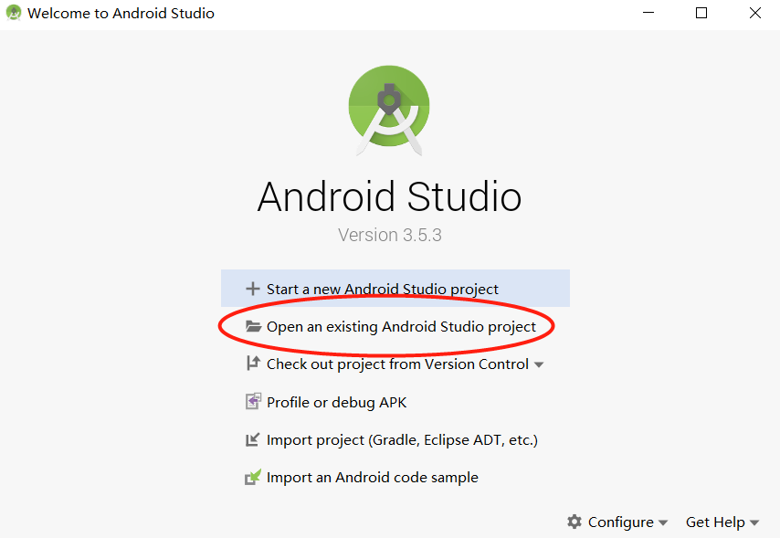
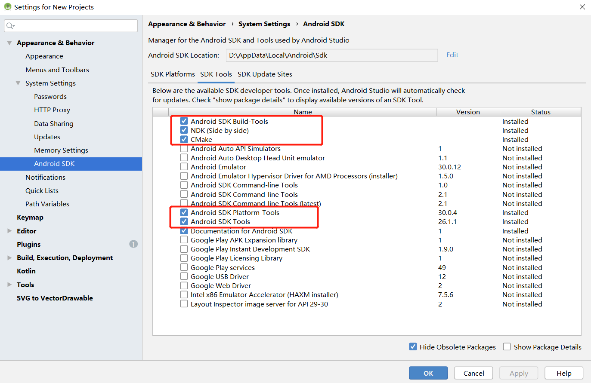
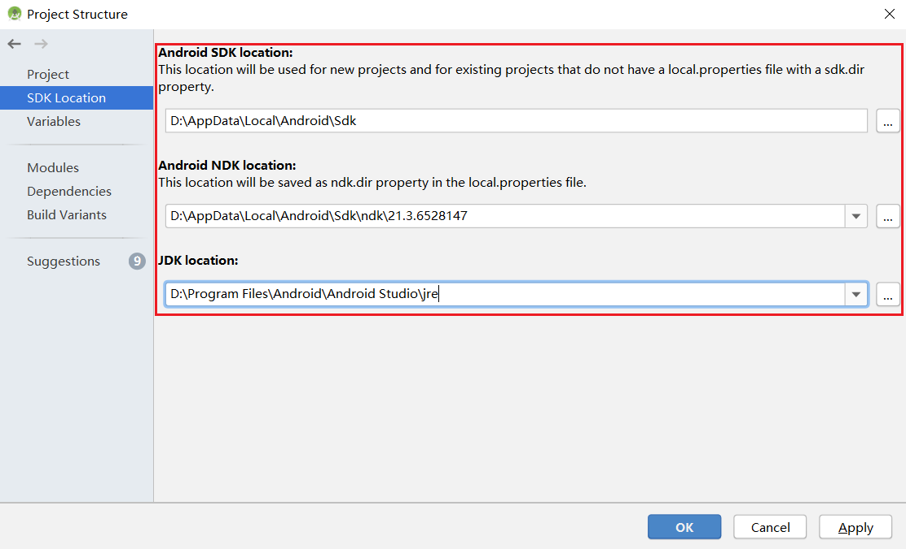
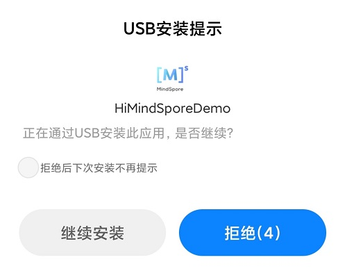
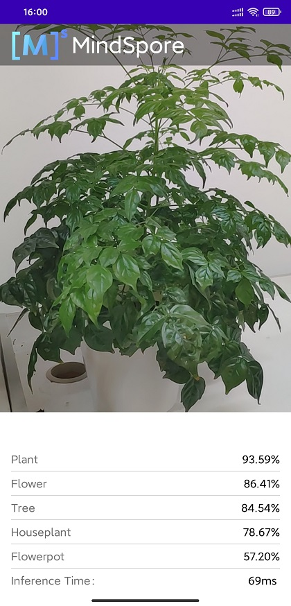

# 端侧部署图像分类应用

## 实验介绍

图像分类是MindSpore AI计算框架在端侧的典型应用场景。完成图像分类demo安装后，可利用已经训练好的预置模型在手机等设备上完成推理过程，对设备摄像头捕获的内容进行分类，并在App图像预览界面中显示出最可能的分类结果。

本实验主要介绍MindSpore Lite demo在手机端的部署方法，并在这一过程中完成端侧开发环境准备。

## 实验目的

- 在安卓手机中安装Image Classification图像分类demo。
- 完成MindSpore Lite手机端开发环境搭建。

## 预备知识

- 具备一定的Android开发基础知识
- 了解并熟悉MindSpore端侧框架，MindSpore Lite官网：<https://www.mindspore.cn/lite>

## 实验环境

- Android手机
- Android Studio >= 3.5 (推荐4.0以上版本)
- NDK >= 21.3
- CMake >= 3.10.2  
- Android SDK >= 26
- JDK >= 1.8

## 实验步骤

1. 下载course课程仓库，或下载本课程目录下的code文件夹： `course / lite_demo_deploy / code /`。在Android Studio中点击打开工程，加载本示例源码。

    

2. 启动Android Studio后，点击`File->Settings->System Settings->Android SDK`，勾选相应的SDK。如下图所示，勾选后，点击`OK`，Android Studio即可自动安装SDK。

    

    使用过程中若出现Android Studio配置问题，可参考下表解决：

    |      | 报错                                                         | 解决方案                                                     |
    | ---- | ------------------------------------------------------------ | ------------------------------------------------------------ |
    | 1    | Gradle sync failed: NDK not configured.                      | 在local.properties中指定安装的ndk目录：ndk.dir={ndk的安装目录} |
    | 2    | Requested NDK version did not match the version requested by ndk.dir | 可手动下载相应的[NDK版本](https://developer.android.com/ndk/downloads?hl=zh-cn)，并在Project Structure - Android NDK location设置中指定SDK的位置（可参考下图完成） |
    | 3    | This version of Android Studio cannot open this project, please retry with Android Studio or newer. | 在工具栏-help-Checkout for Updates中更新版本                 |
    | 4    | SSL peer shut down incorrectly                               | 重新构建                                                     |

    

3. 连接Android设备，运行图像分类应用程序。

    通过USB连接Android设备调试，点击`Run 'app'`即可在您的设备上运行本示例项目。

    > 编译过程中Android Studio会自动下载MindSpore Lite、模型文件等相关依赖项，编译过程需做耐心等待。

    

    Android Studio连接设备调试操作，可参考<https://developer.android.com/studio/run/device?hl=zh-cn>。

    手机需开启“USB调试模式”，Android Studio 才能识别到手机。 华为手机一般在设置->系统和更新->开发人员选项->USB调试中开始“USB调试模型”。

4. 在Android设备上，点击“继续安装”，安装完即可查看到设备摄像头捕获的内容和推理结果。

    

    如下图所示，识别出的概率最高的物体是植物。

    

## 实验结论

本实验基于MindSpore Lite预置模型完成了端侧推理过程，可在Android手机中体验图像分类功能。
