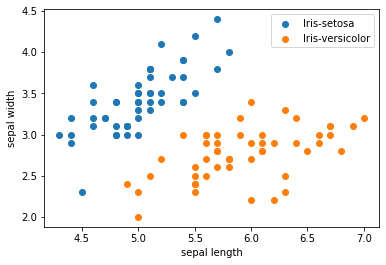
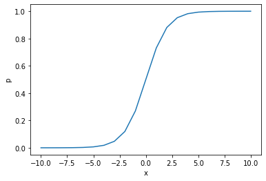

# 逻辑回归

## 实验介绍

逻辑回归（Logistic Regression）是机器学习最经典的算法之一，与线性回归有很多不同，这两种回归都属于广义线性回归（Generalized Linear Regression）的范畴。逻辑回归具有如下特点：

- 逻辑回归对自变量分布没有要求；
- 因变量是离散型变量，即分类变量；
- 逻辑回归分析的是因变量取某个值的概率与自变量的关系。

本实验主要介绍使用MindSpore在2分类数据集上进行逻辑回归实验，分析自变量和因变量（概率）之间的关系，即求得一个概率函数。

## 实验目的

- 了解逻辑回归的基本概念；
- 了解如何使用MindSpore进行逻辑回归实验。

## 预备知识

- 熟练使用Python。
- 具备一定的机器学习理论知识，如逻辑回归、损失函数、优化器，训练策略等。
- 了解华为云的基本使用方法，包括[OBS（对象存储）](https://www.huaweicloud.com/product/obs.html)、[ModelArts（AI开发平台）](https://www.huaweicloud.com/product/modelarts.html)、[训练作业](https://support.huaweicloud.com/engineers-modelarts/modelarts_23_0238.html)等功能。华为云官网：https://www.huaweicloud.com
- 了解并熟悉MindSpore AI计算框架，MindSpore官网：https://www.mindspore.cn/

## 实验环境

- MindSpore 1.0.0（MindSpore版本会定期更新，本指导也会定期刷新，与版本配套）；
- 华为云ModelArts（控制台左上角选择“华北-北京四”）：ModelArts是华为云提供的面向开发者的一站式AI开发平台，集成了昇腾AI处理器资源池，用户可以在该平台下体验MindSpore。

## 实验准备

### 数据准备

Iris数据集是模式识别最著名的数据集之一。数据集包含3类，每类50个实例，其中每个类都涉及一种鸢尾植物。 第一类与后两类可线性分离，后两类之间不能线性分离，所以本实验取前两类数据，做一个2分类数据集。Iris数据集的官网：[Iris Data Set](http://archive.ics.uci.edu/ml/datasets/Iris)。

- 方式一，从Iris数据集官网下载[iris.data文件](http://archive.ics.uci.edu/ml/machine-learning-databases/iris/iris.data)。
- 方式二，从华为云OBS中下载[iris.data文件](https://share-course.obs.cn-north-4.myhuaweicloud.com/dataset/iris.data)。

每个样本含有4个数值属性和一个类别属性：
1. sepal length in cm
2. sepal width in cm
3. petal length in cm
4. petal width in cm
5. class: 
    - Iris Setosa
    - Iris Versicolour
    - Iris Virginica

概括统计:

```
                 Min  Max   Mean    SD   Class Correlation
   sepal length: 4.3  7.9   5.84  0.83    0.7826   
    sepal width: 2.0  4.4   3.05  0.43   -0.4194
   petal length: 1.0  6.9   3.76  1.76    0.9490  (high!)
    petal width: 0.1  2.5   1.20  0.76    0.9565  (high!)
```

### 脚本准备

从[课程gitee仓库](https://gitee.com/mindspore/course)中下载本实验相关脚本。将脚本和数据集组织为如下形式：

```
logistic_regression
├── main.py
└── iris.data
```

### 创建OBS桶

本实验需要使用华为云OBS存储脚本和数据集，可以参考[快速通过OBS控制台上传下载文件](https://support.huaweicloud.com/qs-obs/obs_qs_0001.html)了解使用OBS创建桶、上传文件、下载文件的使用方法（下文给出了操作步骤）。

> **提示：** 华为云新用户使用OBS时通常需要创建和配置“访问密钥”，可以在使用OBS时根据提示完成创建和配置。也可以参考[获取访问密钥并完成ModelArts全局配置](https://support.huaweicloud.com/prepare-modelarts/modelarts_08_0002.html)获取并配置访问密钥。

打开[OBS控制台](https://storage.huaweicloud.com/obs/?region=cn-north-4&locale=zh-cn#/obs/manager/buckets)，点击右上角的“创建桶”按钮进入桶配置页面，创建OBS桶的参考配置如下：

- 区域：华北-北京四
- 数据冗余存储策略：单AZ存储
- 桶名称：全局唯一的字符串
- 存储类别：标准存储
- 桶策略：公共读
- 归档数据直读：关闭
- 企业项目、标签等配置：免

### 上传文件

点击新建的OBS桶名，再打开“对象”标签页，通过“上传对象”、“新建文件夹”等功能，将脚本和数据集上传到OBS桶中。上传文件后，查看页面底部的“任务管理”状态栏（正在运行、已完成、失败），确保文件均上传完成。若失败请：

- 参考[上传对象大小限制/切换上传方式](https://support.huaweicloud.com/qs-obs/obs_qs_0008.html)，
- 参考[上传对象失败常见原因](https://support.huaweicloud.com/obs_faq/obs_faq_0134.html)。
- 若无法解决请[新建工单](https://console.huaweicloud.com/ticket/?region=cn-north-4&locale=zh-cn#/ticketindex/createIndex)，产品类为“对象存储服务”，问题类型为“桶和对象相关”，会有技术人员协助解决。

## 实验步骤

推荐使用ModelArts训练作业进行实验，适合大规模并发使用。若使用ModelArts Notebook，请参考[LeNet5](../lenet5)及[Checkpoint](../checkpoint)实验案例，了解Notebook的使用方法和注意事项。

### 代码梳理

导入MindSpore模块和辅助模块：

```python
import os
# os.environ['DEVICE_ID'] = '6'
import csv
import numpy as np

import mindspore as ms
from mindspore import nn
from mindspore import context
from mindspore import dataset
from mindspore.train.callback import LossMonitor
from mindspore.common.api import ms_function
from mindspore.ops import operations as P

context.set_context(mode=context.GRAPH_MODE, device_target="Ascend")
```

读取Iris数据集`iris.data`，并查看部分数据。

```python
with open('iris.data') as csv_file:
    data = list(csv.reader(csv_file, delimiter=','))
print(data[40:60]) # 打印部分数据
```

    [['5.0', '3.5', '1.3', '0.3', 'Iris-setosa'], ['4.5', '2.3', '1.3', '0.3', 'Iris-setosa'], ['4.4', '3.2', '1.3', '0.2', 'Iris-setosa'], ['5.0', '3.5', '1.6', '0.6', 'Iris-setosa'], ['5.1', '3.8', '1.9', '0.4', 'Iris-setosa'], ['4.8', '3.0', '1.4', '0.3', 'Iris-setosa'], ['5.1', '3.8', '1.6', '0.2', 'Iris-setosa'], ['4.6', '3.2', '1.4', '0.2', 'Iris-setosa'], ['5.3', '3.7', '1.5', '0.2', 'Iris-setosa'], ['5.0', '3.3', '1.4', '0.2', 'Iris-setosa'], ['7.0', '3.2', '4.7', '1.4', 'Iris-versicolor'], ['6.4', '3.2', '4.5', '1.5', 'Iris-versicolor'], ['6.9', '3.1', '4.9', '1.5', 'Iris-versicolor'], ['5.5', '2.3', '4.0', '1.3', 'Iris-versicolor'], ['6.5', '2.8', '4.6', '1.5', 'Iris-versicolor'], ['5.7', '2.8', '4.5', '1.3', 'Iris-versicolor'], ['6.3', '3.3', '4.7', '1.6', 'Iris-versicolor'], ['4.9', '2.4', '3.3', '1.0', 'Iris-versicolor'], ['6.6', '2.9', '4.6', '1.3', 'Iris-versicolor'], ['5.2', '2.7', '3.9', '1.4', 'Iris-versicolor']]

取前两类样本（共100条），将数据集的4个属性作为自变量$X$。将数据集的2个类别映射为{0, 1}，作为因变量$Y$。

```python
label_map = {
    'Iris-setosa': 0,
    'Iris-versicolor': 1,
}

X = np.array([[float(x) for x in s[:-1]] for s in data[:100]], np.float32)
Y = np.array([[label_map[s[-1]]] for s in data[:100]], np.float32)
```

取样本的前两个属性进行2维可视化，可以看到在前两个属性上两类样本是线性可分的。

```python
from matplotlib import pyplot as plt
plt.scatter(X[:50, 0], X[:50, 1], label='Iris-setosa')
plt.scatter(X[50:, 0], X[50:, 1], label='Iris-versicolor')
plt.xlabel('sepal length')
plt.ylabel('sepal width')
plt.legend()
```



将数据集按8:2划分为训练集和验证集：

```python
train_idx = np.random.choice(100, 80, replace=False)
test_idx = np.array(list(set(range(100)) - set(train_idx)))
X_train, Y_train = X[train_idx], Y[train_idx]
X_test, Y_test = X[test_idx], Y[test_idx]
```

对数据进行处理通常是有益的，但对于这个简单的任务是不必要的。

```python
# def normalize(data):
#     v_max = np.max(data, axis=0)
#     v_min = np.min(data, axis=0)
#     return np.divide(data - v_min, v_max - v_min) * 2.0 - 1.0
# train_data = list(zip(normalize(X_train), Y_train))
```

使用MindSpore`GeneratorDataset`接口将numpy.ndarray类型的数据转换为Dataset：

```python
XY_train = list(zip(X_train, Y_train))
ds_train = dataset.GeneratorDataset(XY_train, ['x', 'y'])
ds_train = ds_train.shuffle(buffer_size=80).batch(32, drop_remainder=True)
```

逻辑回归常用的联系函数是Sigmoid（S形函数），Sigmoid函数如下图所示，可以将连续值映射到{0, 1}，同时也是单调可微的。

```python
coor_x = np.arange(-10, 11, dtype=np.float32)
coor_y = nn.Sigmoid()(ms.Tensor(coor_x)).asnumpy()
plt.plot(coor_x, coor_y)
plt.xlabel('x')
plt.ylabel('p')
```



使用MindSpore提供的[`nn.Dense(4, 1)`算子](https://www.mindspore.cn/api/zh-CN/0.2.0-alpha/api/python/mindspore/mindspore.nn.html#mindspore.nn.Dense)作为线性部分，其中`(4, 1)`表示每个样本的输入是含4个元素的向量，输出是含1个元素的向量，即$W$是1x4的矩阵。算子会随机初始化权重$W$和偏置$b$。使用[`SigmoidCrossEntropyWithLogits`算子](https://www.mindspore.cn/api/zh-CN/0.3.0-alpha/api/python/mindspore/mindspore.ops.operations.html?#mindspore.ops.operations.SigmoidCrossEntropyWithLogits)作为非线性部分：

对于每个样本$N_i$，模型的计算方式如下：

$$
Z_i = W \cdot X_i + b \\
P_{i} = sigmoid(Z_{i}) = \frac{1}{1 + e^{-Z_{i}}} \\
loss = -\frac{1}n\sum_i[Y_{i} * ln(P_{i}) + (1 - Y_{i})ln(1 - P_{i})]
$$

其中，$X_i$是1D Tensor（含4个元素），$Z_i$是1D Tensor（含1个元素），$Y_i$是真实类别（2个类别{0, 1}中的一个），$P_i$是1D Tensor（含1个元素，表示属于类别1的概率，值域为[0, 1]），$loss$是标量。


```python
# 自定义Loss
class Loss(nn.Cell):
    def __init__(self):
        super(Loss, self).__init__()
        self.sigmoid_cross_entropy_with_logits = P.SigmoidCrossEntropyWithLogits()
        self.reduce_mean = P.ReduceMean(keep_dims=False)
    def construct(self, x, y):
        loss = self.sigmoid_cross_entropy_with_logits(x, y)
        return self.reduce_mean(loss, -1)

net = nn.Dense(4, 1)
loss = Loss()
opt = nn.optim.SGD(net.trainable_params(), learning_rate=0.003)
```

使用2分类的Iris数据集对模型进行几代（Epoch）训练：

```python
model = ms.train.Model(net, loss, opt)
model.train(5, ds_train, callbacks=[LossMonitor(per_print_times=ds_train.get_dataset_size())], dataset_sink_mode=False)
```

    epoch: 1 step 2, loss is 0.6358570456504822
    epoch: 2 step 2, loss is 0.5617856979370117
    epoch: 3 step 2, loss is 0.5153790712356567
    epoch: 4 step 2, loss is 0.5422952771186829
    epoch: 5 step 2, loss is 0.42156651616096497

然后计算模型在测试集上精度，测试集上的精度达到了1.0左右，即逻辑回归模型学会了区分2类鸢尾花。

```python
x = model.predict(ms.Tensor(X_test)).asnumpy()
pred = np.round(1 / (1 + np.exp(-x)))
correct = np.equal(pred, Y_test)
acc = np.mean(correct)
print('Test accuracy is', acc)
```

    Test accuracy is 1.0

### 适配训练作业

创建训练作业时，运行参数会通过脚本传参的方式输入给脚本代码，脚本必须解析传参才能在代码中使用相应参数。如data_url对应数据存储路径(OBS路径)，脚本对传参进行解析后赋值到`args`变量里，在后续代码里可以使用。

```python
import argparse
parser = argparse.ArgumentParser()
parser.add_argument('--data_url', required=True, default=None, help='Location of data.')
args, unknown = parser.parse_known_args()
```

MindSpore暂时没有提供直接访问OBS数据的接口，需要通过ModelArts自带的moxing框架与OBS交互。将OBS桶中的数据拷贝至执行容器中，供MindSpore使用：

```python
import moxing
# src_url形如's3://OBS/PATH'，为OBS桶中数据集的路径，dst_url为执行容器中的路径，两者皆为目录/皆为文件
moxing.file.copy_parallel(src_url=os.path.join(args.data_url, 'iris.data'), dst_url='iris.data')
```

### 创建训练作业

可以参考[使用常用框架训练模型](https://support.huaweicloud.com/engineers-modelarts/modelarts_23_0238.html)来创建并启动训练作业（下文给出了操作步骤）。

打开[ModelArts控制台-训练管理-训练作业](https://console.huaweicloud.com/modelarts/?region=cn-north-4#/trainingJobs)，点击“创建”按钮进入训练作业配置页面，创建训练作业的参考配置：

- 算法来源：常用框架->Ascend-Powered-Engine->MindSpore
- 代码目录：选择上述新建的OBS桶中的logistic_regression目录
- 启动文件：选择上述新建的OBS桶中的logistic_regression目录下的`main.py`
- 数据来源：数据存储位置->选择上述新建的OBS桶中的logistic_regression目录，本实验使用其中的iris.data
- 训练输出位置：选择上述新建的OBS桶中的logistic_regression目录并在其中创建output目录
- 作业日志路径：同训练输出位置
- 规格：Ascend:1*Ascend 910
- 其他均为默认

启动并查看训练过程：

1. 点击提交以开始训练；
2. 在训练作业列表里可以看到刚创建的训练作业，在训练作业页面可以看到版本管理；
3. 点击运行中的训练作业，在展开的窗口中可以查看作业配置信息，以及训练过程中的日志，日志会不断刷新，等训练作业完成后也可以下载日志到本地进行查看；
4. 参考上述代码梳理，在日志中找到对应的打印信息，检查实验是否成功。

## 实验结论

本实验使用MindSpore实现了逻辑回归，用来解决2分类问题。在Iris数据集上进行训练后，所得的模型可以很好的表示每个样本类别y和属性x的关系。
