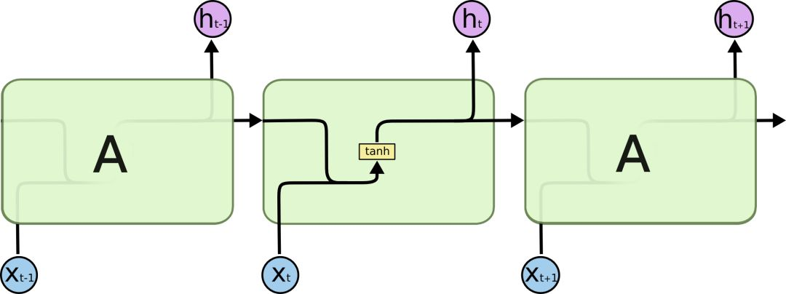
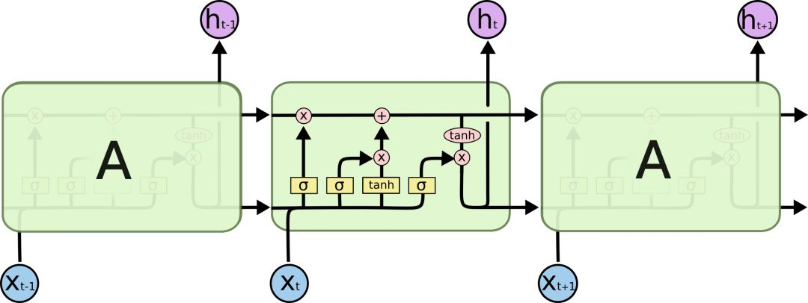
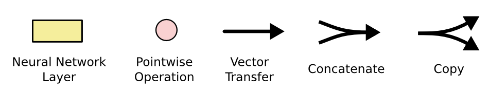
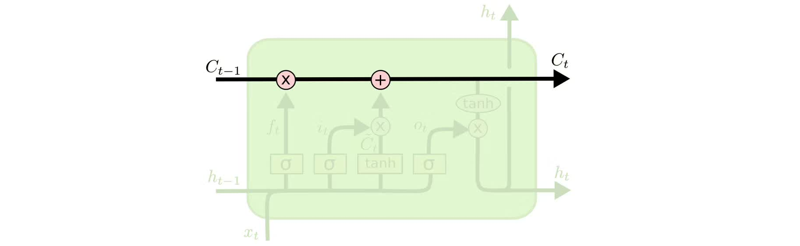

# Sentiment Classification on IMDB

## Introduction

This experiment describes how to use MindSpore to train the LSTM model in the CPU or GPU environment. In this
 experiment, the SentimentNet network constructed based on LSTM is used for natural language processing, and the
 [nlp_to_mindrecord](https://gitee.com/mindspore/mindspore/tree/r1.0/model_zoo/utils/nlp_to_mindrecord) in the MindSpore open-source repository is used.

### Introdution to LSTM

The long-term short-term memory network-commonly referred to as "LSTM" is a special kind of RNN that can learn long-term
 dependencies. It is mainly to solve the problem of gradient disappearance and gradient explosion in the training
 process of long sequences, and is suitable for processing and predicting important events with very long intervals and
 delays in time sequences. It was first proposed by Hochreiter & Schmidhuber in 1997,
 and after being refined and popularized by many experts and scholars, it is now widely used due to its excellent performance.

The design purpose of LSTM is very clear: to solve long-term dependency problems. For LSTM, "remembering" information
 for a long time is a default behavior, not something difficult to learn.

RNN is a chain that contains a large number of repetitive neural network modules. In a standard RNN, these repetitive
 neural network structures are often very simple, such as a structure containing only a single tanh layer:



LSTM also has a similar chain structure, but the difference is that its repeating module is different, and it
 is 4 neural networks structure that interact in a special way.



Here we first look at these symbols in the picture:



In the schematic diagram, from the output of a node to the input of other nodes, each line passes a complete vector.
 The pink circles represent pointwise operations, such as node summation, while the yellow boxes represent the neural
 network layer used for learning. The merged two lines indicate connection, and the separated two lines indicate that
 the information is copied into two copies and will be delivered to different locations.

### The core idea behind LSTMs

The key to LSTMs is the state of the cell, the horizontal line running through the top of the diagram.
The cell state is a bit like a conveyor belt. It can run through the entire chain structure with only some minor linear
 interactions. This is actually the place where information is stored, so information can easily flow through it in a constant form.



In order to add/delete the information in the cell, there are some control gates in LSTM. They determine the way
 information passes, including a sigmoid neural network layer and a pointwise multiplication operation.


The sigmoid layer outputs a number between 0 and 1. The pointwise multiplication operation determines how much
 information can be transmitted. When it is 0, it is not transmitted; when it is 1, it is transmitted all.
 There are 3 control gates like this in LSTM to protect and control the cell state.

## Objectives

- Learn how to use MindSpore to load common NLP datasets.
- Learn the model_zoo module of MindSpore and how to use models in model_zoo.
- Learn the training and evaluation of the SentimentNet network model constructed based on the LSTM.

## Prerequisites

- Be proficient in Python and understand the basic knowledge of Shell and Linux operating systems.
- Have certain theoretical knowledge of deep learning, such as Embedding, Encoder, Decoder, loss function, optimizer,
 training strategy, and Checkpoint.

## Environment

MindSpore 1.0.0 CPU and third-party auxiliary modules:

- MindSpore: <https://www.mindspore.cn/install/en>
- Jupyter Notebook/JupyterLab: <https://jupyter.org/install>
- gensim: <https://pypi.org/project/gensim/>

## Preparation

### Dataset Preparation

IMDB is a movie review website similar to Douban, and the data set used in this experiment is some user comments on this
 website. The IMDB data set contains a total of 50,000 movie review texts, 25,000 training data and test data each.
 Each movie review text is marked as positive or negative, so this experiment can be regarded as a two-category problem.
 IMDB dataset official website: [Large Movie Review Dataset](http://ai.stanford.edu/~amaas/data/sentiment/).

- Method 1: Download [aclImdb_v1.tar.gz](http://ai.stanford.edu/~amaas/data/sentiment/aclImdb_v1.tar.gz) from the official website of Stanford University and unzip it.
- Method 2, download [aclImdb_v1.tar.gz](https://obs-deeplearning.obs.cn-north-1.myhuaweicloud.com/obs-80d2/aclImdb_v1.tar.gz) from Huawei Cloud OBS and unzip it.

At the same time, download the GloVe file and add a new line `400000 200` at the beginning of the glove.6B.200d.txt file.
 This means that a total of 400,000 words are read, and each word is represented by a word vector of 200 dimensions.

Modifiy glove.6B.200.txt as follows(you may need Sublime Text):

```text
400000 200
the -0.071549 0.093459 0.023738 -0.090339 0.056123 0.32547…
```

### Determine the Evaluation Criteria

As a typical classification problem, the evaluation metric of sentiment classification can be handled in the same way as that of common classification problems. Accuracy, precision, recall, and F_beta scores can be used as references.

- Accuracy = Number of accurately classified samples/Total number of samples
- Precision = True positives/(True positives + False positives)
- Recall = True positives/(True positives + False negatives)
- F_beta = (2 x Precision x Recall)/(Precision + Recall)

In the IMDB dataset, the number of positive samples is similar to that of negative samples. Therefore, accuracy can be used as the measurement metric of the classifier.

### Script Preparation

Create a Jupyter Notebook and copy the code in the subsequent experiment steps to the Notebook for execution.
Alternatively, copy the code in the subsequent experiment steps to the  `main.py` and run the script in a Terminal.
Organize the script and dataset as follows:

```text
lstm
├── aclImdb
│   ├── imdbEr.txt
│   ├── imdb.vocab
│   ├── README
│   ├── test
│   ├── train
├── glove
│   ├── glove.6B.50d.txt # optional
│   ├── glove.6B.100d.txt # optional
│   ├── glove.6B.200d.txt
│   ├── glove.6B.300d.txt # optional
├── src # ignored in English version
│   ├── config.py
│   ├── lstm.py
│   ├── imdb.py
│   ├── lr_schedule.py
│   └── dataset.py
└── main.ipynb # Alternatively, main.py
```

## Procedures

1. Preparation.
2. Load the data set and perform data processing.
3. Define the network.
4. Define the optimizer and loss function.
5. Train the network on data set to generate models.
6. After obtaining the model, use the validation data set to check the accuracy of the model.

### Import Modules

Import the MindSpore module and auxiliary module:

```python
import os
import math
import gensim
import argparse
import numpy as np
import mindspore.dataset as ds

from itertools import chain
from easydict import EasyDict as edict
from mindspore import Model
from mindspore import Tensor, nn, context, Parameter, ParameterTuple
from mindspore.nn import Accuracy
from mindspore.ops import operations as P
from mindspore.mindrecord import FileWriter
from mindspore.common.initializer import initializer
from mindspore.train.callback import Callback, CheckpointConfig, ModelCheckpoint, TimeMonitor, LossMonitor
```

### Data Preprocessing

Process the text dataset, including encoding, word segmentation, alignment, and processing of the original data of
GloVe, to adapt it to the network structure.

```python
class ImdbParser():
    """
    parse aclImdb data to features and labels.
    sentence->tokenized->encoded->padding->features
    """

    def __init__(self, imdb_path, glove_path, embed_size=300):
        self.__segs = ['train', 'test']
        self.__label_dic = {'pos': 1, 'neg': 0}
        self.__imdb_path = imdb_path
        self.__glove_dim = embed_size
        self.__glove_file = os.path.join(glove_path, 'glove.6B.' + str(self.__glove_dim) + 'd.txt')

        # properties
        self.__imdb_datas = {}
        self.__features = {}
        self.__labels = {}
        self.__vacab = {}
        self.__word2idx = {}
        self.__weight_np = {}
        self.__wvmodel = None

    def parse(self):
        """
        parse imdb data to memory
        """
        self.__wvmodel = gensim.models.KeyedVectors.load_word2vec_format(self.__glove_file)

        for seg in self.__segs:
            self.__parse_imdb_datas(seg)
            self.__parse_features_and_labels(seg)
            self.__gen_weight_np(seg)

    def __parse_imdb_datas(self, seg):
        """
        load data from txt
        """
        data_lists = []
        for label_name, label_id in self.__label_dic.items():
            sentence_dir = os.path.join(self.__imdb_path, seg, label_name)
            for file in os.listdir(sentence_dir):
                with open(os.path.join(sentence_dir, file), mode='r', encoding='utf8') as f:
                    sentence = f.read().replace('\n', '')
                    data_lists.append([sentence, label_id])
        self.__imdb_datas[seg] = data_lists

    def __parse_features_and_labels(self, seg):
        """
        parse features and labels
        """
        features = []
        labels = []
        for sentence, label in self.__imdb_datas[seg]:
            features.append(sentence)
            labels.append(label)

        self.__features[seg] = features
        self.__labels[seg] = labels

        # update feature to tokenized
        self.__updata_features_to_tokenized(seg)
        # parse vacab
        self.__parse_vacab(seg)
        # encode feature
        self.__encode_features(seg)
        # padding feature
        self.__padding_features(seg)

    def __updata_features_to_tokenized(self, seg):
        tokenized_features = []
        for sentence in self.__features[seg]:
            tokenized_sentence = [word.lower() for word in sentence.split(" ")]
            tokenized_features.append(tokenized_sentence)
        self.__features[seg] = tokenized_features

    def __parse_vacab(self, seg):
        # vocab
        tokenized_features = self.__features[seg]
        vocab = set(chain(*tokenized_features))
        self.__vacab[seg] = vocab

        # word_to_idx: {'hello': 1, 'world':111, ... '<unk>': 0}
        word_to_idx = {word: i + 1 for i, word in enumerate(vocab)}
        word_to_idx['<unk>'] = 0
        self.__word2idx[seg] = word_to_idx

    def __encode_features(self, seg):
        """ encode word to index """
        word_to_idx = self.__word2idx['train']
        encoded_features = []
        for tokenized_sentence in self.__features[seg]:
            encoded_sentence = []
            for word in tokenized_sentence:
                encoded_sentence.append(word_to_idx.get(word, 0))
            encoded_features.append(encoded_sentence)
        self.__features[seg] = encoded_features

    def __padding_features(self, seg, maxlen=200, pad=0):
        """ pad all features to the same length """
        padded_features = []
        for feature in self.__features[seg]:
            if len(feature) >= maxlen:
                padded_feature = feature[:maxlen]
            else:
                padded_feature = feature
                while len(padded_feature) < maxlen:
                    padded_feature.append(pad)
            padded_features.append(padded_feature)
        self.__features[seg] = padded_features

    def __gen_weight_np(self, seg):
        """
        generate weight by gensim
        """
        weight_np = np.zeros((len(self.__word2idx[seg]), self.__glove_dim), dtype=np.float32)
        for word, idx in self.__word2idx[seg].items():
            if word not in self.__wvmodel:
                continue
            word_vector = self.__wvmodel.get_vector(word)
            weight_np[idx, :] = word_vector

        self.__weight_np[seg] = weight_np

    def get_datas(self, seg):
        """
        return features, labels, and weight
        """
        features = np.array(self.__features[seg]).astype(np.int32)
        labels = np.array(self.__labels[seg]).astype(np.int32)
        weight = np.array(self.__weight_np[seg])
        return features, labels, weight
```

Define the `convert_to_mindrecord` function to convert the dataset format to MindRecord for MindSpore to read.
The `weight.txt` file in the `_convert_to_mindrecord` function is the weight parameter file automatically generated
after data preprocessing.

```python
def _convert_to_mindrecord(data_home, features, labels, weight_np=None, training=True):
    """
    convert imdb dataset to mindrecoed dataset
    """
    if weight_np is not None:
        np.savetxt(os.path.join(data_home, 'weight.txt'), weight_np)

    # write mindrecord
    schema_json = {"id": {"type": "int32"},
                   "label": {"type": "int32"},
                   "feature": {"type": "int32", "shape": [-1]}}

    data_dir = os.path.join(data_home, "aclImdb_train.mindrecord")
    if not training:
        data_dir = os.path.join(data_home, "aclImdb_test.mindrecord")

    def get_imdb_data(features, labels):
        data_list = []
        for i, (label, feature) in enumerate(zip(labels, features)):
            data_json = {"id": i,
                         "label": int(label),
                         "feature": feature.reshape(-1)}
            data_list.append(data_json)
        return data_list

    writer = FileWriter(data_dir, shard_num=4)
    data = get_imdb_data(features, labels)
    writer.add_schema(schema_json, "nlp_schema")
    writer.add_index(["id", "label"])
    writer.write_raw_data(data)
    writer.commit()


def convert_to_mindrecord(embed_size, aclimdb_path, preprocess_path, glove_path):
    """
    convert imdb dataset to mindrecoed dataset
    """
    parser = ImdbParser(aclimdb_path, glove_path, embed_size)
    parser.parse()

    if not os.path.exists(preprocess_path):
        print(f"preprocess path {preprocess_path} is not exist")
        os.makedirs(preprocess_path)

    train_features, train_labels, train_weight_np = parser.get_datas('train')
    _convert_to_mindrecord(preprocess_path, train_features, train_labels, train_weight_np)

    test_features, test_labels, _ = parser.get_datas('test')
    _convert_to_mindrecord(preprocess_path, test_features, test_labels, training=False)
```

Define the dataset creation function `lstm_create_dataset` and create the training set `ds_train` and validation set `ds_eval`.

```python
def lstm_create_dataset(data_home, batch_size, repeat_num=1, training=True):
    """Data operations."""
    ds.config.set_seed(1)
    data_dir = os.path.join(data_home, "aclImdb_train.mindrecord0")
    if not training:
        data_dir = os.path.join(data_home, "aclImdb_test.mindrecord0")

    data_set = ds.MindDataset(data_dir, columns_list=["feature", "label"], num_parallel_workers=4)

    # apply map operations on images
    data_set = data_set.shuffle(buffer_size=data_set.get_dataset_size())
    data_set = data_set.batch(batch_size=batch_size, drop_remainder=True)
    data_set = data_set.repeat(count=repeat_num)

    return data_set

ds_train = lstm_create_dataset(args.preprocess_path, cfg.batch_size)
ds_eval = lstm_create_dataset(args.preprocess_path, cfg.batch_size, training=False)
```

### Network Definition

Currently, MindSpore support LSTM operator and stacked LSTMCell on GPU, but only support stacked LSTMCell on CPU device.

```python
STACK_LSTM_DEVICE = ["CPU"]
```

For GPU device, define the `lstm_default_state` function to initialize network parameters and network status.

```python
# Initialize short-term memory (h) and long-term memory (c) to 0
def lstm_default_state(batch_size, hidden_size, num_layers, bidirectional):
    """init default input."""
    num_directions = 2 if bidirectional else 1
    h = Tensor(np.zeros((num_layers * num_directions, batch_size, hidden_size)).astype(np.float32))
    c = Tensor(np.zeros((num_layers * num_directions, batch_size, hidden_size)).astype(np.float32))
    return h, c
```

`For CPU device, define the  stack_lstm_default_state` function to initialize network parameters and network status.

```python
def stack_lstm_default_state(batch_size, hidden_size, num_layers, bidirectional):
    """init default input."""
    num_directions = 2 if bidirectional else 1

    h_list = c_list = []
    for _ in range(num_layers):
        h_list.append(Tensor(np.zeros((num_directions, batch_size, hidden_size)).astype(np.float32)))
        c_list.append(Tensor(np.zeros((num_directions, batch_size, hidden_size)).astype(np.float32)))
    h, c = tuple(h_list), tuple(c_list)
    return h, c
```

For CPU device, stack LSTMCell operators to replace LSTM operator.

```python
class StackLSTM(nn.Cell):
    """
    Stack multi-layers LSTM together.
    """

    def __init__(self,
                 input_size,
                 hidden_size,
                 num_layers=1,
                 has_bias=True,
                 batch_first=False,
                 dropout=0.0,
                 bidirectional=False):
        super(StackLSTM, self).__init__()
        self.num_layers = num_layers
        self.batch_first = batch_first
        self.transpose = P.Transpose()

        # direction number
        num_directions = 2 if bidirectional else 1

        # input_size list
        input_size_list = [input_size]
        for i in range(num_layers - 1):
            input_size_list.append(hidden_size * num_directions)

        # layers
        layers = []
        for i in range(num_layers):
            layers.append(nn.LSTMCell(input_size=input_size_list[i],
                                      hidden_size=hidden_size,
                                      has_bias=has_bias,
                                      batch_first=batch_first,
                                      bidirectional=bidirectional,
                                      dropout=dropout))

        # weights
        weights = []
        for i in range(num_layers):
            # weight size
            weight_size = (input_size_list[i] + hidden_size) * num_directions * hidden_size * 4
            if has_bias:
                bias_size = num_directions * hidden_size * 4
                weight_size = weight_size + bias_size

            # numpy weight
            stdv = 1 / math.sqrt(hidden_size)
            w_np = np.random.uniform(-stdv, stdv, (weight_size, 1, 1)).astype(np.float32)

            # lstm weight
            weights.append(Parameter(initializer(Tensor(w_np), w_np.shape), name="weight" + str(i)))

        #
        self.lstms = layers
        self.weight = ParameterTuple(tuple(weights))

    def construct(self, x, hx):
        """construct"""
        if self.batch_first:
            x = self.transpose(x, (1, 0, 2))
        # stack lstm
        h, c = hx
        hn = cn = None
        for i in range(self.num_layers):
            x, hn, cn, _, _ = self.lstms[i](x, h[i], c[i], self.weight[i])
        if self.batch_first:
            x = self.transpose(x, (1, 0, 2))
        return x, (hn, cn)
```

Use the `cell` method to define the `SentimentNet` network.

```python
class SentimentNet(nn.Cell):
    """Sentiment network structure."""

    def __init__(self,
                 vocab_size,
                 embed_size,
                 num_hiddens,
                 num_layers,
                 bidirectional,
                 num_classes,
                 weight,
                 batch_size):
        super(SentimentNet, self).__init__()
        # Mapp words to vectors
        self.embedding = nn.Embedding(vocab_size,
                                      embed_size,
                                      embedding_table=weight)
        self.embedding.embedding_table.requires_grad = False
        self.trans = P.Transpose()
        self.perm = (1, 0, 2)

        if context.get_context("device_target") in STACK_LSTM_DEVICE:
            # stack lstm by user
            self.encoder = StackLSTM(input_size=embed_size,
                                     hidden_size=num_hiddens,
                                     num_layers=num_layers,
                                     has_bias=True,
                                     bidirectional=bidirectional,
                                     dropout=0.0)
            self.h, self.c = stack_lstm_default_state(batch_size, num_hiddens, num_layers, bidirectional)
        else:
            # standard lstm
            self.encoder = nn.LSTM(input_size=embed_size,
                                   hidden_size=num_hiddens,
                                   num_layers=num_layers,
                                   has_bias=True,
                                   bidirectional=bidirectional,
                                   dropout=0.0)
            self.h, self.c = lstm_default_state(batch_size, num_hiddens, num_layers, bidirectional)

        self.concat = P.Concat(1)
        if bidirectional:
            self.decoder = nn.Dense(num_hiddens * 4, num_classes)
        else:
            self.decoder = nn.Dense(num_hiddens * 2, num_classes)

    def construct(self, inputs):
        # input：(64,500,300)
        embeddings = self.embedding(inputs)
        embeddings = self.trans(embeddings, self.perm)
        output, _ = self.encoder(embeddings, (self.h, self.c))
        # states[i] size(64,200)  -> encoding.size(64,400)
        encoding = self.concat((output[0], output[199]))
        outputs = self.decoder(encoding)
        return outputs
```

### Defining the Callback Function

Define the callback function `EvalCallBack` to validate the accuracy of the model every number of epochs during training.
After the training, quickly select the optimal model by viewing the accuracy change of the corresponding model.

```python
class EvalCallBack(Callback):
    def __init__(self, model, eval_dataset, eval_per_epoch, epoch_per_eval):
        self.model = model
        self.eval_dataset = eval_dataset
        self.eval_per_epoch = eval_per_epoch
        self.epoch_per_eval = epoch_per_eval

    def epoch_end(self, run_context):
        cb_param = run_context.original_args()
        cur_epoch = cb_param.cur_epoch_num
        if cur_epoch % self.eval_per_epoch == 0:
            acc = self.model.eval(self.eval_dataset, dataset_sink_mode=False)
            self.epoch_per_eval["epoch"].append(cur_epoch)
            self.epoch_per_eval["acc"].append(acc["acc"])
            print(acc)
```

### Configure the running information

The parser module is used to import necessary information, such as the dataset storage path and GloVe storage path.
This enables flexible input of the configuration that changes frequently during code running.

- `preprocess`: specifies whether to preprocess the dataset. The default value is false.
- `aclimdb_path`: dataset storage path.
- `glove_path`: GloVe file storage path.
- `preprocess_path`: the result folder of the preprocessed dataset.
- `ckpt_path`: checkpoint file path.
- `pre_trained`: preloading checkpoint file.
- `device_target`: specifies the GPU or CPU environment.

```python
parser = argparse.ArgumentParser(description='MindSpore LSTM Example')
parser.add_argument('--preprocess', type=str, default='false', choices=['true', 'false'],   help='whether to preprocess data.')
parser.add_argument('--aclimdb_path', type=str, default="./aclImdb",
                    help='path where the dataset is stored.')
parser.add_argument('--glove_path', type=str, default="./glove",
                    help='path where the GloVe is stored.')
parser.add_argument('--preprocess_path', type=str, default="./preprocess",
                    help='path where the pre-process data is stored.')
parser.add_argument('--ckpt_path', type=str, default="./",
                    help='the path to save the checkpoint file.')
parser.add_argument('--pre_trained', type=str, default=None,
                    help='the pretrained checkpoint file path.')
parser.add_argument('--device_target', type=str, default="GPU", choices=['GPU', 'CPU'],
                    help='the target device to run, support "GPU", "CPU". Default: "GPU".')
args = parser.parse_args(['--device_target', 'CPU', '--preprocess', 'true'])

context.set_context(mode=context.GRAPH_MODE, save_graphs=False, device_target=args.device_target)
```

Convert the data to the mindrecord format.

```python
if args.preprocess == "true":
    print("============== Starting Data Pre-processing ==============")
    convert_to_mindrecord(cfg.embed_size, args.aclimdb_path, args.preprocess_path, args.glove_path)
    print("======================= Successful =======================")
```

After the conversion is successful, a MindRecord file will be generated in the `preprocess` directory.
Normally, this operation does not need to be executed every time when the data set is unchanged.
The `preprocess` file directory is as follows:

```text
 $ tree preprocess
 ├── aclImdb_test.mindrecord0
 ├── aclImdb_test.mindrecord0.db
 ├── aclImdb_test.mindrecord1
 ├── aclImdb_test.mindrecord1.db
 ├── aclImdb_test.mindrecord2
 ├── aclImdb_test.mindrecord2.db
 ├── aclImdb_test.mindrecord3
 ├── aclImdb_test.mindrecord3.db
 ├── aclImdb_train.mindrecord0
 ├── aclImdb_train.mindrecord0.db
 ├── aclImdb_train.mindrecord1
 ├── aclImdb_train.mindrecord1.db
 ├── aclImdb_train.mindrecord2
 ├── aclImdb_train.mindrecord2.db
 ├── aclImdb_train.mindrecord3
 ├── aclImdb_train.mindrecord3.db
 └── weight.txt
```

Among the above documents:

- The training data set with the name containing `aclImdb_train.mindrecord` is the converted MindRecord format.
- The test data set with the name containing `aclImdb_test.mindrecord` is the converted MindRecord format.
- `weight.txt` is the weight parameter information file automatically generated after preprocessing.

Use the `create_dict_iterator` method to create a dictionary iterator to read data from the `ds_train` dataset.
Run the following code to read the `label` data list in the first batch and the `feature` data of the first element in the first batch:

```python
iterator = ds_train.create_dict_iterator().get_next()
first_batch_label = iterator["label"]
first_batch_first_feature = iterator["feature"][0]
print(f"The first batch contains label below:\n{first_batch_label}\n")
print(f"The feature of the first item in the first batch is below vector:\n{first_batch_first_feature}")
```

Instantiate `SentimentNet` to create a network.

```python
embedding_table = np.loadtxt(os.path.join(args.preprocess_path, "weight.txt")).astype(np.float32)
network = SentimentNet(vocab_size=embedding_table.shape[0],
                       embed_size=cfg.embed_size,
                       num_hiddens=cfg.num_hiddens,
                       num_layers=cfg.num_layers,
                       bidirectional=cfg.bidirectional,
                       num_classes=cfg.num_classes,
                       weight=Tensor(embedding_table),
                       batch_size=cfg.batch_size)
```

### Define optimizer and loss function

```python
loss = nn.SoftmaxCrossEntropyWithLogits(sparse=True, reduction='mean')
opt = nn.Momentum(network.trainable_params(), cfg.learning_rate, cfg.momentum)
```

### Synchronous Model Training and Validation

Load the training dataset (`ds_train`), configure the checkpoint parameter, and use the `model.train` API to train the model.
This step takes about 7 minutes on the GPU. It requires a longer time on the CPU. According to the output, the loss
value gradually decreases with the training and finally reaches about 0.225. And the validation accuracy is about 83%.

```python
model = Model(network, loss, opt, {'acc': Accuracy()})
loss_cb = LossMonitor()
print("============== Starting Training ==============")
config_ck = CheckpointConfig(save_checkpoint_steps=ds_train.get_dataset_size(),
                             keep_checkpoint_max=cfg.keep_checkpoint_max)
ckpoint_cb = ModelCheckpoint(prefix="lstm", directory=args.ckpt_path,
                             config=config_ck)
time_cb = TimeMonitor(data_size=ds_train.get_dataset_size())
if args.device_target == "CPU":
    epoch_per_eval = {"epoch": [], "acc": []}
    eval_cb = EvalCallBack(model, ds_eval, 1, epoch_per_eval)
    model.train(cfg.num_epochs, ds_train, callbacks=[time_cb, ckpoint_cb, loss_cb, eval_cb], dataset_sink_mode=False)
else:
    epoch_per_eval = {"epoch": [], "acc": []}
    eval_cb = EvalCallBack(model, ds_eval, 1, epoch_per_eval)
    model.train(cfg.num_epochs, ds_train, callbacks=[time_cb, ckpoint_cb, loss_cb, eval_cb])
print("============== Training Success ==============")
```

```text
============== Starting Training ==============
epoch: 1 step: 1, loss is 0.6938
epoch: 1 step: 2, loss is 0.6922
epoch: 1 step: 3, loss is 0.6917
epoch: 1 step: 4, loss is 0.6952
epoch: 1 step: 5, loss is 0.6868
epoch: 1 step: 6, loss is 0.6982
epoch: 1 step: 7, loss is 0.6856
epoch: 1 step: 8, loss is 0.6819
epoch: 1 step: 9, loss is 0.7372
epoch: 1 step: 10, loss is 0.6948
...
epoch: 10 step 774, loss is 0.3010297119617462
epoch: 10 step 775, loss is 0.4418136477470398
epoch: 10 step 776, loss is 0.29638347029685974
epoch: 10 step 777, loss is 0.38901057839393616
epoch: 10 step 778, loss is 0.3772362470626831
epoch: 10 step 779, loss is 0.4098552167415619
epoch: 10 step 780, loss is 0.41440871357917786
epoch: 10 step 781, loss is 0.2255304455757141
Epoch time: 63056.078, per step time: 80.738
Epoch time: 63056.078, per step time: 80.738, avg loss: 0.354
************************************************************
{'acc': 0.8312996158770807}
============== Training Success ==============
```

## Summary

This experiment helps us understand how to use MindSpore to process sentiment classification problems in natural
languages, how to define and initialize the LSTM-based SentimentNet network for model training, and how to validate the accuracy.
