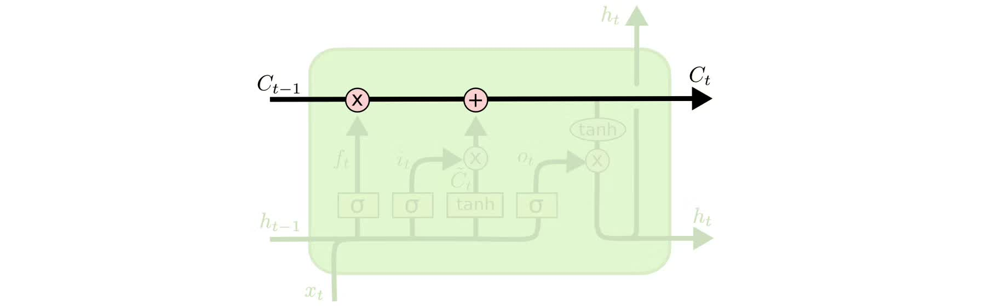

# LSTM-IMDB情感分类

## 实验介绍

本实验主要介绍使用MindSpore在CPU/GPU环境下训练LSTM模型，本实验使用基于LSTM构建的SentimentNet网络进行自然语言处理，并参考MindSpore开源仓库中的[nlp_to_mindrecord](https://gitee.com/mindspore/mindspore/tree/r1.0/model_zoo/utils/nlp_to_mindrecord)模型案例。

### LSTM介绍

长期短期记忆网络——通常被称为“LSTM”——是一种特殊的RNN，能学习长期依赖性。主要是为了解决长序列训练过程中的梯度消失和梯度爆炸问题，适合于处理和预测时间序列中间隔和延迟非常长的重要事件。它最早由Hochreiter＆Schmidhuber于1997年提出，后经众多专家学者提炼和推广，现在因性能出色已经被广泛使用。

LSTM的设计目的非常明确：解决长期依赖性问题。对LSTM来说，长时间“记住”信息是一种默认的行为，而不是难以学习的东西。

RNN是一个包含大量重复神经网络模块的链式形式，在标准RNN里，这些重复的神经网络结构往往也非常简单，比如只包含单个tanh层：


LSTM也有与之相似的链式结构，但不同的是它的重复模块结构不同，是4个以特殊方式进行交互的神经网络。


这里我们先来看看图中的这些符号：


在示意图中，从某个节点的输出到其他节点的输入，每条线都传递一个完整的向量。粉色圆圈表示pointwise操作，如节点求和，而黄色框则表示用于学习的神经网络层。合并的两条线表示连接，分开的两条线表示信息被复制成两个副本，并将传递到不同的位置。

### LSTMs背后的核心理念

LSTMs的关键是cell的状态，即贯穿示意图顶部的水平线。cell状态有点像传送带，它只用一些次要的线性交互就能贯穿整个链式结构，这其实也就是信息记忆的地方，因此信息能很容易地以不变的形式从中流过。



为了增加/删除cell中的信息，LSTM中有一些控制门（gate）。它们决定了信息通过的方式，包含一个sigmoid神经网络层和一个pointwise点乘操作。


sigmoid层输出0到1之间的数字，点乘操作决定多少信息可以传送过去，当为0时，不传送；当为1时，全部传送。
像这样的控制门，LSTM共有3个，以此保护和控制cell状态。

### 深入了解LSTM

我们先来看看cell该删除哪些信息，做这个决定的是包含sigmoid层的遗忘门。对于输入xt和ht-1，遗忘门会输出一个值域为[0, 1]的数字，放进细胞状态Ct−1中。当为0时，全部删除；当为1时，全部保留。

以之前预测下一个词的语言模型为例，对于“天空中漂浮着云朵，”这个句子，LSTM的cell状态会记住句子主语“云朵”的词性，这之后才能判断正确的代词。等下次再遇到新主语时，cell会“忘记”“云朵”的词性。


我们再来看看cell该如何增加新信息。这可以分为两步，首先，LSTM会用一个包含sigmoid层的输入门决定哪些信息该保留，其次，它会用一个tanh层为这些信息生成一个向量C~t，用来更新细胞状态。

在语言模型例子中，如果句子变成了“天空中漂浮着云朵，草地上奔跑着骏马”。那LSTM就会用“骏马”的词性代替正在被遗忘的“云朵”的词性。


有了遗忘门和输入门，现在我们就能把细胞状态Ct−1更新为Ct了。如下图所示，其中ft×Ct−1表示希望删除的信息，it×Ct表示新增的信息。


最后就是决定LSTM输出内容的输出门。它的信息基于cell状态，但还要经过一定过滤。我们先用sigmoid层决定将要输出的cell内容，再用tanh层把cell状态值推到-1和1之间，并将其乘以sigmoid层的输出，以此做到只输出想要输出的部分。


## 实验目的

- 了解如何使用MindSpore加载常用的NLP数据集。
- 了解MindSpore的model_zoo模块，以及如何使用model_zoo中的模型。
- 了解LSTM构建的SentimentNet网络模型的训练和评估。

## 预备知识

- 熟练使用Python，了解Shell及Linux操作系统基本知识。
- 具备一定的深度学习理论知识，如Embedding、Encoder、Decoder、损失函数、优化器，训练策略、Checkpoint等。
- 了解并熟悉MindSpore AI计算框架，MindSpore官网：<https://www.mindspore.cn/>

## 实验环境

- MindSpore 1.0.0（MindSpore版本会定期更新，本指导也会定期刷新，与版本配套）；
- 华为云ModelArts（控制台左上角选择“华北-北京四”）：ModelArts是华为云提供的面向开发者的一站式AI开发平台，集成了昇腾AI处理器资源池，用户可以在该平台下体验MindSpore；
- Windows/Ubuntu x64笔记本，NVIDIA GPU服务器，或Atlas Ascend服务器等。

## 实验准备

### 数据集准备

IMDB是一个与国内豆瓣比较类似的与电影相关的网站，而本次实验用到的数据集是这个网站中的一些用户评论。IMDB数据集共包含50000项影评文字，训练数据和测试数据各25000项，每一项影评文字都被标记为正面评价或负面评价，所以本实验可以看做一个二分类问题。IMDB数据集官网：[Large Movie Review Dataset](http://ai.stanford.edu/~amaas/data/sentiment/)。

- 方式一，从斯坦福大学官网下载[aclImdb_v1.tar.gz](http://ai.stanford.edu/~amaas/data/sentiment/aclImdb_v1.tar.gz)并解压。
- 方式二，从华为云OBS中下载[aclImdb_v1.tar.gz](https://obs-deeplearning.obs.cn-north-1.myhuaweicloud.com/obs-80d2/aclImdb_v1.tar.gz)并解压。

同时，我们要下载[GloVe](http://nlp.stanford.edu/data/glove.6B.zip)文件，并在文件glove.6B.300d.txt开头处添加新的一行`400000 300`，意思是总共读取400000个单词，每个单词用300维度的词向量表示。
修改glove.6B.300.txt如下（你可能需要Sublime Text）:

```text
400000 300
the -0.071549 0.093459 0.023738 -0.090339 0.056123 0.32547…
```

### 确定评价标准

作为典型的分类问题，情感分类的评价标准可以比照普通的分类问题处理。常见的精度（Accuracy）、精准度（Precision）、召回率（Recall）和F_beta分数都可以作为参考。

精度（**Accuracy**）=分类正确的样本数目/总样本数目

精准度（**Precision**）=真阳性样本数目/所有预测类别为阳性的样本数目

召回率（**Recall**）=真阳性样本数目/所有真实类别为阳性的样本数目

F1分数=(**2**∗**Precision**∗**Recall**)/(**Precision**+**Recall**)

在IMDB这个数据集中，正负样本数差别不大，可以简单地用精度（accuracy）作为分类器的衡量标准。

### 脚本准备

从[课程gitee仓库](https://gitee.com/mindspore/mindspore/tree/r1.0/model_zoo/official/nlp/lstm)上下载本实验相关脚本。将脚本和数据集组织为如下形式：

```text
lstm
├── aclImdb
│   ├── imdbEr.txt
│   ├── imdb.vocab
│   ├── README
│   ├── test
│   ├── train
├── glove
│   ├── glove.6B.50d.txt
│   ├── glove.6B.100d.txt
│   ├── glove.6B.200d.txt
│   ├── glove.6B.300d.txt
├── src
│   ├── config.py
│   ├── lstm.py
│   ├── imdb.py
│   ├── lr_schedule.py
│   ├── dataset.py
├── main.py
└── README.md
```

### 创建OBS桶

本实验需要使用华为云OBS存储脚本和数据集，可以参考[快速通过OBS控制台上传下载文件](https://support.huaweicloud.com/qs-obs/obs_qs_0001.html)了解使用OBS创建桶、上传文件、下载文件的使用方法（下文给出了操作步骤）。

> **提示：** 华为云新用户使用OBS时通常需要创建和配置“访问密钥”，可以在使用OBS时根据提示完成创建和配置。也可以参考[获取访问密钥并完成ModelArts全局配置](https://support.huaweicloud.com/prepare-modelarts/modelarts_08_0002.html)获取并配置访问密钥。

打开[OBS控制台](https://storage.huaweicloud.com/obs/?region=cn-north-4&locale=zh-cn#/obs/manager/buckets)，点击右上角的“创建桶”按钮进入桶配置页面，创建OBS桶的参考配置如下：

- 区域：华北-北京四
- 数据冗余存储策略：单AZ存储
- 桶名称：全局唯一的字符串
- 存储类别：标准存储
- 桶策略：公共读
- 归档数据直读：关闭
- 企业项目、标签等配置：免

### 上传文件

点击新建的OBS桶名，再打开“对象”标签页，通过“上传对象”、“新建文件夹”等功能，将脚本和数据集上传到OBS桶中。上传文件后，查看页面底部的“任务管理”状态栏（正在运行、已完成、失败），确保文件均上传完成。若失败请：

- 参考[上传对象大小限制/切换上传方式](https://support.huaweicloud.com/qs-obs/obs_qs_0008.html)，
- 参考[上传对象失败常见原因](https://support.huaweicloud.com/obs_faq/obs_faq_0134.html)。
- 若无法解决请[新建工单](https://console.huaweicloud.com/ticket/?region=cn-north-4&locale=zh-cn#/ticketindex/createIndex)，产品类为“对象存储服务”，问题类型为“桶和对象相关”，会有技术人员协助解决。

## 实验步骤（ModelArts Notebook）

推荐使用ModelArts训练作业进行实验，适合大规模并发使用。若使用ModelArts Notebook，请参考[LeNet5](https://gitee.com/mindspore/course/blob/master/lenet5)及[Checkpoint](https://gitee.com/mindspore/course/blob/master/checkpoint)实验案例，了解Notebook的使用方法和注意事项。

1. 准备环节。
2. 加载数据集，进行数据处理。
3. 定义网络。
4. 定义优化器和损失函数。
5. 在数据集上训练网络，生成模型。
6. 得到模型之后，使用验证数据集，查看模型精度情况。

### 导入模块

导入MindSpore模块和辅助模块，设置MindSpore上下文，如执行模式、设备等。

```python
import os
import sys
sys.path.insert(0,'./')  
import numpy as np
from easydict import EasyDict as edict

from src.config import lstm_cfg, lstm_cfg_ascend
from src.dataset import convert_to_mindrecord
from src.dataset import lstm_create_dataset
from src.lr_schedule import get_lr
from src.lstm import SentimentNet
from mindspore.nn import Accuracy
from mindspore import Tensor, nn, Model, context
from mindspore.train.callback import LossMonitor, CheckpointConfig, ModelCheckpoint, TimeMonitor
from mindspore.train.serialization import load_param_into_net, load_checkpoint

context.set_context(mode=context.GRAPH_MODE,save_graphs=False,device_target='Ascend')
```

### 配置运行信息

使用`parser`模块，传入运行必要的信息，如数据集存放路径，GloVe存放路径，这样的好处是，对于经常变化的配置，可以在运行代码时输入，使用更加灵活。

- device_target：指定Ascend或CPU/GPU环境。
- pre_trained：预加载CheckPoint文件。
- preprocess：是否预处理数据集，默认为否。
- aclimdb_path：数据集存放路径。
- glove_path：GloVe文件存放路径。
- preprocess_path：预处理数据集的结果文件夹。
- ckpt_path：CheckPoint文件路径。
- train_url：预处理数据集拷贝出来的存放路径。

```python
args = edict({
    'device_target':'Ascend',
    'pre_trained':None,
    'preprocess': 'true',
    'aclimdb_path': './aclImdb',
    'glove_path':'./glove',
    'preprocess_path': './preprocess' ,
    'ckpt_path':'./',
    'train_url':'s3://{user-obs}/lstm/preprocess',
})
```

### 数据拷贝

当在ModelArts上运行实验时，需要将数据拷贝至容器中；若已通过“Sync OBS”功能将OBS桶中的数据集同步到Notebook执行容器中，则跳过数据拷贝环节。若大小或数量超过同步限制，可通过ModelArts自带的moxing框架，将数据集拷贝至执行容器中。

- 方式一，拷贝自己账户下OBS桶内的数据集至执行容器。

  ```python
  import moxing
  # src_url形如's3://OBS/PATH'，为OBS桶中数据集的路径，dst_url为执行容器中的路径
  moxing.file.copy_parallel(src_url="s3://OBS/PATH/TO/aclImdb/", dst_url='aclImdb/')
  ```

- 方式二（推荐），拷贝他人共享的OBS桶内的数据集至执行容器，前提是他人账户下的OBS桶已设为公共读/公共读写。若在创建桶时桶策略为私有，请参考[配置标准桶策略](https://support.huaweicloud.com/usermanual-obs/obs_03_0142.html)修改为公共读/公共读写。

  ```python
  import moxing as mox
  mox.file.copy_parallel(src_url='s3://zhengnj-course/lstm/aclImdb', dst_url=args.aclimdb_path)
  mox.file.copy_parallel(src_url='s3://zhengnj-course/lstm/glove', dst_url=args.glove_path)
  ```

### 预处理数据集

对文本数据集进行处理，包括编码、分词、对齐、处理GloVe原始数据，使之能够适应网络结构。详见`src/imdb.py`。

```python
class ImdbParser():
    """
    parse aclImdb data to features and labels.
    sentence->tokenized->encoded->padding->features
    """

    def __init__(self, imdb_path, glove_path, embed_size=300):
        self.__segs = ['train', 'test']
        self.__label_dic = {'pos': 1, 'neg': 0}
        self.__imdb_path = imdb_path
        self.__glove_dim = embed_size
        self.__glove_file = os.path.join(glove_path, 'glove.6B.' + str(self.__glove_dim) + 'd.txt')

        # properties
        self.__imdb_datas = {}
        self.__features = {}
        self.__labels = {}
        self.__vacab = {}
        self.__word2idx = {}
        self.__weight_np = {}
        self.__wvmodel = None

    def parse(self):
        """
        parse imdb data to memory
        """
        self.__wvmodel = gensim.models.KeyedVectors.load_word2vec_format(self.__glove_file)

        for seg in self.__segs:
            self.__parse_imdb_datas(seg)
            self.__parse_features_and_labels(seg)
            self.__gen_weight_np(seg)

    def __parse_imdb_datas(self, seg):
        """
        load data from txt
        """
        data_lists = []
        for label_name, label_id in self.__label_dic.items():
            sentence_dir = os.path.join(self.__imdb_path, seg, label_name)
            for file in os.listdir(sentence_dir):
                with open(os.path.join(sentence_dir, file), mode='r', encoding='utf8') as f:
                    sentence = f.read().replace('\n', '')
                    data_lists.append([sentence, label_id])
        self.__imdb_datas[seg] = data_lists

    def __parse_features_and_labels(self, seg):
        """
        parse features and labels
        """
        features = []
        labels = []
        for sentence, label in self.__imdb_datas[seg]:
            features.append(sentence)
            labels.append(label)

        self.__features[seg] = features
        self.__labels[seg] = labels

        # update feature to tokenized
        self.__updata_features_to_tokenized(seg)
        # parse vacab
        self.__parse_vacab(seg)
        # encode feature
        self.__encode_features(seg)
        # padding feature
        self.__padding_features(seg)

    def __updata_features_to_tokenized(self, seg):
        tokenized_features = []
        for sentence in self.__features[seg]:
            tokenized_sentence = [word.lower() for word in sentence.split(" ")]
            tokenized_features.append(tokenized_sentence)
        self.__features[seg] = tokenized_features

    def __parse_vacab(self, seg):
        # vocab
        tokenized_features = self.__features[seg]
        vocab = set(chain(*tokenized_features))
        self.__vacab[seg] = vocab

        word_to_idx = {word: i + 1 for i, word in enumerate(vocab)}
        word_to_idx['<unk>'] = 0
        self.__word2idx[seg] = word_to_idx

    def __encode_features(self, seg):
        """ encode word to index """
        word_to_idx = self.__word2idx['train']
        encoded_features = []
        for tokenized_sentence in self.__features[seg]:
            encoded_sentence = []
            for word in tokenized_sentence:
                encoded_sentence.append(word_to_idx.get(word, 0))
            encoded_features.append(encoded_sentence)
        self.__features[seg] = encoded_features

    def __padding_features(self, seg, maxlen=500, pad=0):
        """ pad all features to the same length """
        padded_features = []
        for feature in self.__features[seg]:
            if len(feature) >= maxlen:
                padded_feature = feature[:maxlen]
            else:
                padded_feature = feature
                while len(padded_feature) < maxlen:
                    padded_feature.append(pad)
            padded_features.append(padded_feature)
        self.__features[seg] = padded_features

    def __gen_weight_np(self, seg):
        """
        generate weight by gensim
        """
        weight_np = np.zeros((len(self.__word2idx[seg]), self.__glove_dim), dtype=np.float32)
        for word, idx in self.__word2idx[seg].items():
            if word not in self.__wvmodel:
                continue
            word_vector = self.__wvmodel.get_vector(word)
            weight_np[idx, :] = word_vector

        self.__weight_np[seg] = weight_np

    def get_datas(self, seg):
        """
        get features, labels, and weight by gensim.
        """
        features = np.array(self.__features[seg]).astype(np.int32)
        labels = np.array(self.__labels[seg]).astype(np.int32)
        weight = np.array(self.__weight_np[seg])
        return features, labels, weight
```

定义创建数据集函数`lstm_create_dataset`，创建训练集`ds_train`和验证集`ds_eval`。

定义`convert_to_mindrecord`函数将数据集格式转换为MindRecord格式，便于MindSpore读取。
函数`_convert_to_mindrecord`中`weight.txt`为数据预处理后自动生成的weight参数信息文件。详见`src/dataset.py`。

```python
def lstm_create_dataset(data_home, batch_size, repeat_num=1, training=True):
    """Data operations."""
    ds.config.set_seed(1)
    data_dir = os.path.join(data_home, "aclImdb_train.mindrecord0")
    if not training:
        data_dir = os.path.join(data_home, "aclImdb_test.mindrecord0")

    data_set = ds.MindDataset(data_dir, columns_list=["feature", "label"], num_parallel_workers=4)

    # apply map operations on images
    data_set = data_set.shuffle(buffer_size=data_set.get_dataset_size())
    data_set = data_set.batch(batch_size=batch_size, drop_remainder=True)
    data_set = data_set.repeat(count=repeat_num)

    return data_set
```

```python
def _convert_to_mindrecord(data_home, features, labels, weight_np=None, training=True):
    """
    convert imdb dataset to mindrecord dataset
    """
    if weight_np is not None:
        np.savetxt(os.path.join(data_home, 'weight.txt'), weight_np)

    # write mindrecord
    schema_json = {"id": {"type": "int32"},
                   "label": {"type": "int32"},
                   "feature": {"type": "int32", "shape": [-1]}}

    data_dir = os.path.join(data_home, "aclImdb_train.mindrecord")
    if not training:
        data_dir = os.path.join(data_home, "aclImdb_test.mindrecord")

    def get_imdb_data(features, labels):
        data_list = []
        for i, (label, feature) in enumerate(zip(labels, features)):
            data_json = {"id": i,
                         "label": int(label),
                         "feature": feature.reshape(-1)}
            data_list.append(data_json)
        return data_list

    writer = FileWriter(data_dir, shard_num=4)
    data = get_imdb_data(features, labels)
    writer.add_schema(schema_json, "nlp_schema")
    writer.add_index(["id", "label"])
    writer.write_raw_data(data)
    writer.commit()


def convert_to_mindrecord(embed_size, aclimdb_path, preprocess_path, glove_path):
    """
    convert imdb dataset to mindrecord dataset
    """
    parser = ImdbParser(aclimdb_path, glove_path, embed_size)
    parser.parse()

    if not os.path.exists(preprocess_path):
        print(f"preprocess path {preprocess_path} is not exist")
        os.makedirs(preprocess_path)

    train_features, train_labels, train_weight_np = parser.get_datas('train')
    _convert_to_mindrecord(preprocess_path, train_features, train_labels, train_weight_np)

    test_features, test_labels, _ = parser.get_datas('test')
    _convert_to_mindrecord(preprocess_path, test_features, test_labels, training=False)
```

### 定义网络

定义需要单层LSTM小算子堆叠的设备类型。

```python
STACK_LSTM_DEVICE = ["CPU"]
```

定义`lstm_default_state`函数来初始化网络参数及网络状态。

```python
# Initialize short-term memory (h) and long-term memory (c) to 0
def lstm_default_state(batch_size, hidden_size, num_layers, bidirectional):
    """init default input."""
    num_directions = 2 if bidirectional else 1
    h = Tensor(np.zeros((num_layers * num_directions, batch_size, hidden_size)).astype(np.float32))
    c = Tensor(np.zeros((num_layers * num_directions, batch_size, hidden_size)).astype(np.float32))
    return h, c
```

对于不同平台，定义`stack_lstm_default_state`函数来初始化小算子堆叠需要的初始化网络参数及网络状态。详见`src/lstm.py`下的`stack_lstm_default_state` 和 `stack_lstm_default_state_ascend`。

针对不同的场景，自定义单层LSTM小算子堆叠，来实现多层LSTM大算子功能。

```python
class StackLSTM(nn.Cell):
    """
    Stack multi-layers LSTM together.
    """

    def __init__(self,
                 input_size,
                 hidden_size,
                 num_layers=1,
                 has_bias=True,
                 batch_first=False,
                 dropout=0.0,
                 bidirectional=False):
        super(StackLSTM, self).__init__()
        self.num_layers = num_layers
        self.batch_first = batch_first
        self.transpose = P.Transpose()

        # direction number
        num_directions = 2 if bidirectional else 1

        # input_size list
        input_size_list = [input_size]
        for i in range(num_layers - 1):
            input_size_list.append(hidden_size * num_directions)

        # layers
        layers = []
        for i in range(num_layers):
            layers.append(nn.LSTMCell(input_size=input_size_list[i],
                                      hidden_size=hidden_size,
                                      has_bias=has_bias,
                                      batch_first=batch_first,
                                      bidirectional=bidirectional,
                                      dropout=dropout))

        # weights
        weights = []
        for i in range(num_layers):
            # weight size
            weight_size = (input_size_list[i] + hidden_size) * num_directions * hidden_size * 4
            if has_bias:
                bias_size = num_directions * hidden_size * 4
                weight_size = weight_size + bias_size

            # numpy weight
            stdv = 1 / math.sqrt(hidden_size)
            w_np = np.random.uniform(-stdv, stdv, (weight_size, 1, 1)).astype(np.float32)

            # lstm weight
            weights.append(Parameter(initializer(Tensor(w_np), w_np.shape), name="weight" + str(i)))

        #
        self.lstms = layers
        self.weight = ParameterTuple(tuple(weights))

    def construct(self, x, hx):
        """construct"""
        if self.batch_first:
            x = self.transpose(x, (1, 0, 2))
        # stack lstm
        h, c = hx
        hn = cn = None
        for i in range(self.num_layers):
            x, hn, cn, _, _ = self.lstms[i](x, h[i], c[i], self.weight[i])
        if self.batch_first:
            x = self.transpose(x, (1, 0, 2))
        return x, (hn, cn)
```

使用`cell`方法，定义`SentimentNet`网络。

```python
class SentimentNet(nn.Cell):
    """Sentiment network structure."""

    def __init__(self,
                 vocab_size,
                 embed_size,
                 num_hiddens,
                 num_layers,
                 bidirectional,
                 num_classes,
                 weight,
                 batch_size):
        super(SentimentNet, self).__init__()
        # Mapp words to vectors
        self.embedding = nn.Embedding(vocab_size,
                                      embed_size,
                                      embedding_table=weight)
        self.embedding.embedding_table.requires_grad = False
        self.trans = P.Transpose()
        self.perm = (1, 0, 2)

        if context.get_context("device_target") in STACK_LSTM_DEVICE:
            # stack lstm by user
            self.encoder = StackLSTM(input_size=embed_size,
                                     hidden_size=num_hiddens,
                                     num_layers=num_layers,
                                     has_bias=True,
                                     bidirectional=bidirectional,
                                     dropout=0.0)
            self.h, self.c = stack_lstm_default_state(batch_size, num_hiddens, num_layers, bidirectional)
        elif context.get_context("device_target") == "GPU":
            # standard lstm
            self.encoder = nn.LSTM(input_size=embed_size,
                                   hidden_size=num_hiddens,
                                   num_layers=num_layers,
                                   has_bias=True,
                                   bidirectional=bidirectional,
                                   dropout=0.0)
            self.h, self.c = lstm_default_state(batch_size, num_hiddens, num_layers, bidirectional)
        else:
            self.encoder = StackLSTMAscend(input_size=embed_size,
                                           hidden_size=num_hiddens,
                                           num_layers=num_layers,
                                           has_bias=True,
                                           bidirectional=bidirectional)
            self.h, self.c = stack_lstm_default_state_ascend(batch_size, num_hiddens, num_layers, bidirectional)

        self.concat = P.Concat(1)
        self.squeeze = P.Squeeze(axis=0)
        if bidirectional:
            self.decoder = nn.Dense(num_hiddens * 4, num_classes)
        else:
            self.decoder = nn.Dense(num_hiddens * 2, num_classes)

    def construct(self, inputs):
        # input：(64,500,300)
        embeddings = self.embedding(inputs)
        embeddings = self.trans(embeddings, self.perm)
        output, _ = self.encoder(embeddings, (self.h, self.c))
        # states[i] size(64,200)  -> encoding.size(64,400)
        encoding = self.concat((self.squeeze(output[0:1:1]), self.squeeze(output[499:500:1])))
        outputs = self.decoder(encoding)
        return outputs
```

调用`convert_to_mindrecord`函数执行数据集预处理。

```python
if args.device_target == 'Ascend':
    cfg = lstm_cfg_ascend
else:
    cfg = lstm_cfg

if args.preprocess == "true":
    print("============== Starting Data Pre-processing ==============")
    convert_to_mindrecord(cfg.embed_size, args.aclimdb_path, args.preprocess_path, args.glove_path)
```

转换成功后会在`preprocess`目录下生成MindRecord文件，通常该操作在数据集不变的情况下，无需每次训练都执行。`preprocess`文件目录如下所示：

```text
 $ tree preprocess
 ├── aclImdb_test.mindrecord0
 ├── aclImdb_test.mindrecord0.db
 ├── aclImdb_test.mindrecord1
 ├── aclImdb_test.mindrecord1.db
 ├── aclImdb_test.mindrecord2
 ├── aclImdb_test.mindrecord2.db
 ├── aclImdb_test.mindrecord3
 ├── aclImdb_test.mindrecord3.db
 ├── aclImdb_train.mindrecord0
 ├── aclImdb_train.mindrecord0.db
 ├── aclImdb_train.mindrecord1
 ├── aclImdb_train.mindrecord1.db
 ├── aclImdb_train.mindrecord2
 ├── aclImdb_train.mindrecord2.db
 ├── aclImdb_train.mindrecord3
 ├── aclImdb_train.mindrecord3.db
 └── weight.txt
```

以上各文件中：

- 名称包含`aclImdb_train.mindrecord`的为转换后的MindRecord格式的训练数据集。
- 名称包含`aclImdb_test.mindrecord`的为转换后的MindRecord格式的测试数据集。
- `weight.txt`为预处理后自动生成的weight参数信息文件。

实例化`SentimentNet`，创建网络。

```python
embedding_table = np.loadtxt(os.path.join(args.preprocess_path, "weight.txt")).astype(np.float32)
# DynamicRNN in this network on Ascend platform only support the condition that the shape of input_size
# and hiddle_size is multiples of 16, this problem will be solved later.
if args.device_target == 'Ascend':
    pad_num = int(np.ceil(cfg.embed_size / 16) * 16 - cfg.embed_size)
    if pad_num > 0:
        embedding_table = np.pad(embedding_table, [(0, 0), (0, pad_num)], 'constant')
    cfg.embed_size = int(np.ceil(cfg.embed_size / 16) * 16)
network = SentimentNet(vocab_size=embedding_table.shape[0],
                        embed_size=cfg.embed_size,
                        num_hiddens=cfg.num_hiddens,
                        num_layers=cfg.num_layers,
                        bidirectional=cfg.bidirectional,
                        num_classes=cfg.num_classes,
                        weight=Tensor(embedding_table),
                        batch_size=cfg.batch_size)
```

### 运行训练

定义优化器及损失函数，加载训练数据集（`ds_train`）并配置好`CheckPoint`生成信息，然后使用`model.train`接口，进行模型训练。根据输出可以看到loss值随着训练逐步降低，最后达到0.223左右。

```python
if args.pre_trained:
    load_param_into_net(network, load_checkpoint(args.pre_trained))

ds_train = lstm_create_dataset(args.preprocess_path, cfg.batch_size, 1)

loss = nn.SoftmaxCrossEntropyWithLogits(sparse=True, reduction='mean')
if cfg.dynamic_lr:
    lr = Tensor(get_lr(global_step=cfg.global_step,
                        lr_init=cfg.lr_init, lr_end=cfg.lr_end, lr_max=cfg.lr_max,
                        warmup_epochs=cfg.warmup_epochs,
                        total_epochs=cfg.num_epochs,
                        steps_per_epoch=ds_train.get_dataset_size(),
                        lr_adjust_epoch=cfg.lr_adjust_epoch))
else:
    lr = cfg.learning_rate

opt = nn.Momentum(network.trainable_params(), lr, cfg.momentum)
loss_cb = LossMonitor()

model = Model(network, loss, opt, {'acc': Accuracy()})

print("============== Starting Training ==============")
config_ck = CheckpointConfig(save_checkpoint_steps=cfg.save_checkpoint_steps,
                                 keep_checkpoint_max=cfg.keep_checkpoint_max)
ckpoint_cb = ModelCheckpoint(prefix="lstm", directory=args.ckpt_path, config=config_ck)
time_cb = TimeMonitor(data_size=ds_train.get_dataset_size())
if args.device_target == "CPU":
    model.train(cfg.num_epochs, ds_train, callbacks=[time_cb, ckpoint_cb, loss_cb], dataset_sink_mode=False)
else:
    model.train(cfg.num_epochs, ds_train, callbacks=[time_cb, ckpoint_cb, loss_cb])
print("============== Training Success ==============")
```

```text
============== Starting Training ==============
epoch: 1 step: 390, loss is 0.64208215
Epoch time: 247122.700, per step time: 633.648
epoch: 2 step: 390, loss is 0.53282154
Epoch time: 193912.441, per step time: 497.211
epoch: 3 step: 390, loss is 0.39332953
Epoch time: 193913.711, per step time: 497.215
epoch: 4 step: 390, loss is 0.40547797
Epoch time: 193913.937, per step time: 497.215
epoch: 5 step: 390, loss is 0.42584082
Epoch time: 193913.454, per step time: 497.214
...
epoch: 16 step: 390, loss is 0.27781054
Epoch time: 193912.797, per step time: 497.212
epoch: 17 step: 390, loss is 0.21557969
Epoch time: 193913.056, per step time: 497.213
epoch: 18 step: 390, loss is 0.25238198
Epoch time: 193913.553, per step time: 497.214
epoch: 19 step: 390, loss is 0.35879555
Epoch time: 193912.703, per step time: 497.212
epoch: 20 step: 390, loss is 0.22300689
Epoch time: 194366.220, per step time: 498.375
============== Training Success ==============
```

### 模型验证

加载验证数据集（`ds_eval`）使用模型进行精度验证可以得出以下代码。可以看到验证精度在86%左右。

```python
ds_eval = lstm_create_dataset(args.preprocess_path, cfg.batch_size, training=False)

print("============== Starting Testing ==============")
param_dict = load_checkpoint('lstm-20_390.ckpt')
load_param_into_net(network, param_dict)
if args.device_target == "CPU":
    acc = model.eval(ds_eval, dataset_sink_mode=False)
else:
    acc = model.eval(ds_eval)
print("============== {} ==============".format(acc))
```

```text
============== Starting Testing ==============
============== {'acc': 0.8619791666666666} ==============
```

## 实验总结

本章提供了一个基于Ascend环境的情感分析实验，如果使用其他平台可进行参数配置。通过本次体验全面了解了如何使用MindSpore进行自然语言中处理情感分类问题，理解了如何通过定义和初始化基于LSTM的SentimentNet网络进行训练模型及验证正确率。
