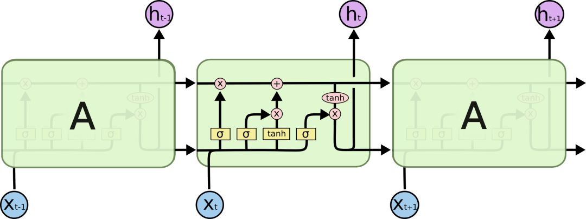
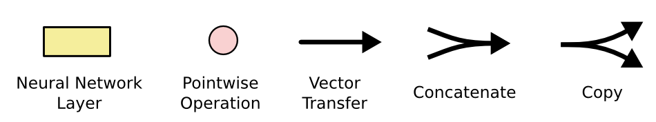

# LSTM-IMDB情感分类

## 实验介绍

### LSTM介绍

本实验主要介绍使用MindSpore在CPU/GPU环境下训练LSTM模型，本实验使用基于LSTM构建的SentimentNet网络进行自然语言处理，并参考MindSpore开源仓库中的[nlp_to_mindrecord](https://gitee.com/mindspore/mindspore/tree/r0.5/example/nlp_to_mindrecord/)模型案例。

长期短期记忆网络——通常被称为“LSTM”——是一种特殊的RNN，能学习长期依赖性。主要是为了解决长序列训练过程中的梯度消失和梯度爆炸问题，适合于处理和预测时间序列中间隔和延迟非常长的重要事件。它最早由Hochreiter＆Sch[mi](http://www.hqpcb.com/zhuoluye9)dhuber于1997年提出，后经众多专家学者提炼和推广，现在因性能出色已经被广泛使用。

LSTM的设计目的非常明确：避免长期依赖性问题。对LSTM来说，长时间“记住”信息是一种默认的行为，而不是难以学习的东西。

RNN是一个包含大量重复神经网络模块的链式形式，在标准RNN里，这些重复的神经网络结构往往也非常简单，比如只包含单个tanh层：


LSTM也有与之相似的链式结构，但不同的是它的重复模块结构不同，是4个以特殊方式进行交互的神经网络。



这里我们先来看看图中的这些符号：



在示意图中，从某个节点的输出到其他节点的输入，每条线都传递一个完整的向量。粉色圆圈表示pointwise操作，如节点求和，而黄色框则表示用于学习的神经网络层。合并的两条线表示连接，分开的两条线表示信息被复制成两个副本，并将传递到不同的位置。

**LSTMs背后的核心理念：**

LSTMs的关键是cell的状态，即贯穿示意图顶部的水平线。

cell状态有点像传送带，它只用一些次要的线性交互就能贯穿整个链式结构，这其实也就是信息记忆的地方，因此信息能很容易地以不变的形式从中流过。


为了增加/删除cell中的信息，LSTM中有一些控制门（gate）。它们决定了信息通过的方式，包含一个sigmoid神经网络层和一个pointwise点乘操作。


sigmoid层输出0到1之间的数字，点乘操作决定多少信息可以传送过去，当为0时，不传送；当为1时，全部传送。

像这样的控制门，LSTM共有3个，以此保护和控制cell状态。

**深入了解LSTM**

我们先来看看cell该删除哪些信息，做这个决定的是包含sigmoid层的遗忘门。对于输入xt和ht-1，遗忘门会输出一个值域为[0, 1]的数字，放进细胞状态Ct−1中。当为0时，全部删除；当为1时，全部保留。

以之前预测下一个词的语言模型为例，对于“天空中漂浮着云朵，”这个句子，LSTM的cell状态会记住句子主语“云朵”的词性，这之后才能判断正确的代词。等下次再遇到新主语时，cell会“忘记”“云朵”的词性。

我们再来看看cell该如何增加新信息。这可以分为两步，首先，LSTM会用一个包含sigmoid层的输入门决定哪些信息该保留，其次，它会用一个tanh层为这些信息生成一个向量C~t，用来更新细胞状态。

在语言模型例子中，如果句子变成了“天空中漂浮着云朵，草地上奔跑着骏马”。那LSTM就会用“骏马”的词性代替正在被遗忘的“云朵”的词性。


有了遗忘门和输入门，现在我们就能把细胞状态Ct−1更新为Ct了。如下图所示，其中ft×Ct−1表示希望删除的信息，it×Ct表示新增的信息。


最后就是决定LSTM输出内容的输出门。它的信息基于cell状态，但还要经过一定过滤。我们先用sigmoid层决定将要输出的cell内容，再用tanh层把cell状态值推到-1和1之间，并将其乘以sigmoid层的输出，以此做到只输出想要输出的部分。


### 数据集介绍

IMDB是一个与国内豆瓣比较类似的与电影相关的网站，而本次实验用到的数据集是这个网站中的一些用户评论。IMDB数据集共包含50000项影评文字，训练数据和测试数据各25000项，每一项影评文字都被标记为正面评价或负面评价，所以本实验可以看做一个二分类问题。IMDB数据集官网：[Large Movie Review Dataset](http://ai.stanford.edu/~amaas/data/sentiment/)。

- 方式一，从斯坦福大学官网下载[aclImdb_v1.tar.gz](http://ai.stanford.edu/~amaas/data/sentiment/aclImdb_v1.tar.gz)并解压。
- 方式二，从华为云OBS中下载[aclImdb_v1.tar.gz](https://obs-deeplearning.obs.cn-north-1.myhuaweicloud.com/obs-80d2/aclImdb_v1.tar.gz)并解压。

## 实验目的

- 了解如何使用MindSpore加载常用的NLP数据集。
- 了解MindSpore的model_zoo模块，以及如何使用model_zoo中的模型。
- 了解LSTM构建的SentimentNet网络模型的训练和评估。

## 预备知识

- 熟练使用Python，了解Shell及Linux操作系统基本知识。
- 具备一定的深度学习理论知识，如Embedding、Encoder、Decoder、损失函数、优化器，训练策略、Checkpoint等。
- 了解并熟悉MindSpore AI计算框架，MindSpore官网：https://www.mindspore.cn/

## 实验环境

- MindSpore 0.5.0（MindSpore版本会定期更新，本指导也会定期刷新，与版本配套）；
- CPU/GPU环境。

## 实验准备

### 数据集准备

采用[IMDB影评数据集](http://ai.stanford.edu/~amaas/data/sentiment/)作为实验数据。同时，我们要下载[GloVe](http://nlp.stanford.edu/data/glove.6B.zip)文件，并在文件glove.6B.200d.txt开头处添加新的一行400000	200，意思是总共读取400000个单词，每个单词用200维度的词向量表示。

### 确定评价标准

作为典型的分类问题，情感分类的评价标准可以比照普通的分类问题处理。常见的精度（Accuracy）、精准度（Precision）、召回率（Recall）和F_beta分数都可以作为参考。

*精度（**Accuracy**）=分类正确的样本数目/总样本数目*

*精准度（**Precision**）=真阳性样本数目/所有预测类别为阳性的样本数目*

*召回率（**Recall**）=真阳性样本数目/所有真实类别为阳性的样本数目*

*F1分数=(**2**∗**Precision**∗**Recall**)/(**Precision**+**Recall**)*

在IMDB这个数据集中，正负样本数差别不大，可以简单地用精度（accuracy）作为分类器的衡量标准。

### 脚本准备

从[课程gitee仓库](https://gitee.com/mindspore/docs/tree/r0.5/tutorials/tutorial_code/lstm)上下载本实验相关脚本。将脚本和数据集组织为如下形式：

```
experiment
├── aclImdb
│   ├── imdbEr.txt
│   ├── imdb.vocab
│   ├── README
│   ├── test
│   ├── train
├── glove
│   ├── glove.6B.50d.txt
│   ├── glove.6B.100d.txt
│   ├── glove.6B.200d.txt
│   ├── glove.6B.300d.txt
└── 脚本等文件
```

## 实验步骤

1. 准备环节。
2. 加载数据集，进行数据处理。
3. 定义网络。
4. 定义优化器和损失函数。
5. 使用网络训练数据，生成模型。
6. 得到模型之后，使用验证数据集，查看模型精度情况。

### 代码梳理

导入MindSpore模块和辅助模块:

```python
import os
import math
import gensim
import argparse
import numpy as np
import mindspore.dataset as ds

from itertools import chain
from easydict import EasyDict as edict
from mindspore import Model
from mindspore import Tensor, nn, context, Parameter, ParameterTuple
from mindspore.nn import Accuracy
from mindspore.ops import operations as P
from mindspore.mindrecord import FileWriter
from mindspore.common.initializer import initializer
from mindspore.train.callback import Callback, CheckpointConfig, ModelCheckpoint, TimeMonitor, LossMonitor
```

### 预处理数据集

对文本数据集进行处理，包括编码、分词、对齐、处理GloVe原始数据，使之能够适应网络结构。

```python
class ImdbParser():
    """
    parse aclImdb data to features and labels.
    sentence->tokenized->encoded->padding->features
    """

    def __init__(self, imdb_path, glove_path, embed_size=300):
        self.__segs = ['train', 'test']
        self.__label_dic = {'pos': 1, 'neg': 0}
        self.__imdb_path = imdb_path
        self.__glove_dim = embed_size
        self.__glove_file = os.path.join(glove_path, 'glove.6B.' + str(self.__glove_dim) + 'd.txt')

        # properties
        self.__imdb_datas = {}
        self.__features = {}
        self.__labels = {}
        self.__vacab = {}
        self.__word2idx = {}
        self.__weight_np = {}
        self.__wvmodel = None

    def parse(self):
        """
        parse imdb data to memory
        """
        self.__wvmodel = gensim.models.KeyedVectors.load_word2vec_format(self.__glove_file)

        for seg in self.__segs:
            self.__parse_imdb_datas(seg)
            self.__parse_features_and_labels(seg)
            self.__gen_weight_np(seg)

    def __parse_imdb_datas(self, seg):
        """
        load data from txt
        """
        data_lists = []
        for label_name, label_id in self.__label_dic.items():
            sentence_dir = os.path.join(self.__imdb_path, seg, label_name)
            for file in os.listdir(sentence_dir):
                with open(os.path.join(sentence_dir, file), mode='r', encoding='utf8') as f:
                    sentence = f.read().replace('\n', '')
                    data_lists.append([sentence, label_id])
        self.__imdb_datas[seg] = data_lists

    def __parse_features_and_labels(self, seg):
        """
        parse features and labels
        """
        features = []
        labels = []
        for sentence, label in self.__imdb_datas[seg]:
            features.append(sentence)
            labels.append(label)

        self.__features[seg] = features
        self.__labels[seg] = labels

        # update feature to tokenized
        self.__updata_features_to_tokenized(seg)
        # parse vacab
        self.__parse_vacab(seg)
        # encode feature
        self.__encode_features(seg)
        # padding feature
        self.__padding_features(seg)

    def __updata_features_to_tokenized(self, seg):
        tokenized_features = []
        for sentence in self.__features[seg]:
            tokenized_sentence = [word.lower() for word in sentence.split(" ")]
            tokenized_features.append(tokenized_sentence)
        self.__features[seg] = tokenized_features

    def __parse_vacab(self, seg):
        # vocab
        tokenized_features = self.__features[seg]
        vocab = set(chain(*tokenized_features))
        self.__vacab[seg] = vocab

        # word_to_idx: {'hello': 1, 'world':111, ... '<unk>': 0}
        word_to_idx = {word: i + 1 for i, word in enumerate(vocab)}
        word_to_idx['<unk>'] = 0
        self.__word2idx[seg] = word_to_idx

    def __encode_features(self, seg):
        """ encode word to index """
        word_to_idx = self.__word2idx['train']
        encoded_features = []
        for tokenized_sentence in self.__features[seg]:
            encoded_sentence = []
            for word in tokenized_sentence:
                encoded_sentence.append(word_to_idx.get(word, 0))
            encoded_features.append(encoded_sentence)
        self.__features[seg] = encoded_features

    def __padding_features(self, seg, maxlen=200, pad=0):
        """ pad all features to the same length """
        padded_features = []
        for feature in self.__features[seg]:
            if len(feature) >= maxlen:
                padded_feature = feature[:maxlen]
            else:
                padded_feature = feature
                while len(padded_feature) < maxlen:
                    padded_feature.append(pad)
            padded_features.append(padded_feature)
        self.__features[seg] = padded_features

    def __gen_weight_np(self, seg):
        """
        generate weight by gensim
        """
        weight_np = np.zeros((len(self.__word2idx[seg]), self.__glove_dim), dtype=np.float32)
        for word, idx in self.__word2idx[seg].items():
            if word not in self.__wvmodel:
                continue
            word_vector = self.__wvmodel.get_vector(word)
            weight_np[idx, :] = word_vector

        self.__weight_np[seg] = weight_np

    def get_datas(self, seg):
        """
        return features, labels, and weight
        """
        features = np.array(self.__features[seg]).astype(np.int32)
        labels = np.array(self.__labels[seg]).astype(np.int32)
        weight = np.array(self.__weight_np[seg])
        return features, labels, weight
```

定义`convert_to_mindrecord`函数将数据集格式转换为MindRecord格式，便于MindSpore读取。

函数`_convert_to_mindrecord`中`weight.txt`为数据预处理后自动生成的weight参数信息文件。

```python
def _convert_to_mindrecord(data_home, features, labels, weight_np=None, training=True):
    """
    convert imdb dataset to mindrecoed dataset
    """
    if weight_np is not None:
        np.savetxt(os.path.join(data_home, 'weight.txt'), weight_np)

    # write mindrecord
    schema_json = {"id": {"type": "int32"},
                   "label": {"type": "int32"},
                   "feature": {"type": "int32", "shape": [-1]}}

    data_dir = os.path.join(data_home, "aclImdb_train.mindrecord")
    if not training:
        data_dir = os.path.join(data_home, "aclImdb_test.mindrecord")

    def get_imdb_data(features, labels):
        data_list = []
        for i, (label, feature) in enumerate(zip(labels, features)):
            data_json = {"id": i,
                         "label": int(label),
                         "feature": feature.reshape(-1)}
            data_list.append(data_json)
        return data_list

    writer = FileWriter(data_dir, shard_num=4)
    data = get_imdb_data(features, labels)
    writer.add_schema(schema_json, "nlp_schema")
    writer.add_index(["id", "label"])
    writer.write_raw_data(data)
    writer.commit()


def convert_to_mindrecord(embed_size, aclimdb_path, preprocess_path, glove_path):
    """
    convert imdb dataset to mindrecoed dataset
    """
    parser = ImdbParser(aclimdb_path, glove_path, embed_size)
    parser.parse()

    if not os.path.exists(preprocess_path):
        print(f"preprocess path {preprocess_path} is not exist")
        os.makedirs(preprocess_path)

    train_features, train_labels, train_weight_np = parser.get_datas('train')
    _convert_to_mindrecord(preprocess_path, train_features, train_labels, train_weight_np)

    test_features, test_labels, _ = parser.get_datas('test')
    _convert_to_mindrecord(preprocess_path, test_features, test_labels, training=False)
```

定义创建数据集函数`lstm_create_dataset`，创建训练集`ds_train`和验证集`ds_eval`。

```python
def lstm_create_dataset(data_home, batch_size, repeat_num=1, training=True):
    """Data operations."""
    ds.config.set_seed(1)
    data_dir = os.path.join(data_home, "aclImdb_train.mindrecord0")
    if not training:
        data_dir = os.path.join(data_home, "aclImdb_test.mindrecord0")

    data_set = ds.MindDataset(data_dir, columns_list=["feature", "label"], num_parallel_workers=4)

    # apply map operations on images
    data_set = data_set.shuffle(buffer_size=data_set.get_dataset_size())
    data_set = data_set.batch(batch_size=batch_size, drop_remainder=True)
    data_set = data_set.repeat(count=repeat_num)

    return data_set

ds_train = lstm_create_dataset(args.preprocess_path, cfg.batch_size)
ds_eval = lstm_create_dataset(args.preprocess_path, cfg.batch_size, training=False)
```

### 定义网络

定义需要单层LSTM小算子堆叠的设备类型。

```python
STACK_LSTM_DEVICE = ["CPU"]
```

定义`lstm_default_state`函数来初始化网络参数及网络状态。

```python
# Initialize short-term memory (h) and long-term memory (c) to 0
def lstm_default_state(batch_size, hidden_size, num_layers, bidirectional):
    """init default input."""
    num_directions = 2 if bidirectional else 1
    h = Tensor(np.zeros((num_layers * num_directions, batch_size, hidden_size)).astype(np.float32))
    c = Tensor(np.zeros((num_layers * num_directions, batch_size, hidden_size)).astype(np.float32))
    return h, c
```

定义`stack_lstm_default_state`函数来初始化小算子堆叠需要的初始化网络参数及网络状态。

```python
def stack_lstm_default_state(batch_size, hidden_size, num_layers, bidirectional):
    """init default input."""
    num_directions = 2 if bidirectional else 1

    h_list = c_list = []
    for _ in range(num_layers):
        h_list.append(Tensor(np.zeros((num_directions, batch_size, hidden_size)).astype(np.float32)))
        c_list.append(Tensor(np.zeros((num_directions, batch_size, hidden_size)).astype(np.float32)))
    h, c = tuple(h_list), tuple(c_list)
    return h, c
```

针对CPU场景，自定义单层LSTM小算子堆叠，来实现多层LSTM大算子功能。

```python
class StackLSTM(nn.Cell):
    """
    Stack multi-layers LSTM together.
    """

    def __init__(self,
                 input_size,
                 hidden_size,
                 num_layers=1,
                 has_bias=True,
                 batch_first=False,
                 dropout=0.0,
                 bidirectional=False):
        super(StackLSTM, self).__init__()
        self.num_layers = num_layers
        self.batch_first = batch_first
        self.transpose = P.Transpose()

        # direction number
        num_directions = 2 if bidirectional else 1

        # input_size list
        input_size_list = [input_size]
        for i in range(num_layers - 1):
            input_size_list.append(hidden_size * num_directions)

        # layers
        layers = []
        for i in range(num_layers):
            layers.append(nn.LSTMCell(input_size=input_size_list[i],
                                      hidden_size=hidden_size,
                                      has_bias=has_bias,
                                      batch_first=batch_first,
                                      bidirectional=bidirectional,
                                      dropout=dropout))

        # weights
        weights = []
        for i in range(num_layers):
            # weight size
            weight_size = (input_size_list[i] + hidden_size) * num_directions * hidden_size * 4
            if has_bias:
                bias_size = num_directions * hidden_size * 4
                weight_size = weight_size + bias_size

            # numpy weight
            stdv = 1 / math.sqrt(hidden_size)
            w_np = np.random.uniform(-stdv, stdv, (weight_size, 1, 1)).astype(np.float32)

            # lstm weight
            weights.append(Parameter(initializer(Tensor(w_np), w_np.shape), name="weight" + str(i)))

        #
        self.lstms = layers
        self.weight = ParameterTuple(tuple(weights))

    def construct(self, x, hx):
        """construct"""
        if self.batch_first:
            x = self.transpose(x, (1, 0, 2))
        # stack lstm
        h, c = hx
        hn = cn = None
        for i in range(self.num_layers):
            x, hn, cn, _, _ = self.lstms[i](x, h[i], c[i], self.weight[i])
        if self.batch_first:
            x = self.transpose(x, (1, 0, 2))
        return x, (hn, cn)
```

使用`cell`方法，定义`SentimentNet`网络。

```python
class SentimentNet(nn.Cell):
    """Sentiment network structure."""

    def __init__(self,
                 vocab_size,
                 embed_size,
                 num_hiddens,
                 num_layers,
                 bidirectional,
                 num_classes,
                 weight,
                 batch_size):
        super(SentimentNet, self).__init__()
        # Mapp words to vectors
        self.embedding = nn.Embedding(vocab_size,
                                      embed_size,
                                      embedding_table=weight)
        self.embedding.embedding_table.requires_grad = False
        self.trans = P.Transpose()
        self.perm = (1, 0, 2)

        if context.get_context("device_target") in STACK_LSTM_DEVICE:
            # stack lstm by user
            self.encoder = StackLSTM(input_size=embed_size,
                                     hidden_size=num_hiddens,
                                     num_layers=num_layers,
                                     has_bias=True,
                                     bidirectional=bidirectional,
                                     dropout=0.0)
            self.h, self.c = stack_lstm_default_state(batch_size, num_hiddens, num_layers, bidirectional)
        else:
            # standard lstm
            self.encoder = nn.LSTM(input_size=embed_size,
                                   hidden_size=num_hiddens,
                                   num_layers=num_layers,
                                   has_bias=True,
                                   bidirectional=bidirectional,
                                   dropout=0.0)
            self.h, self.c = lstm_default_state(batch_size, num_hiddens, num_layers, bidirectional)

        self.concat = P.Concat(1)
        if bidirectional:
            self.decoder = nn.Dense(num_hiddens * 4, num_classes)
        else:
            self.decoder = nn.Dense(num_hiddens * 2, num_classes)

    def construct(self, inputs):
        # input：(64,500,300)
        embeddings = self.embedding(inputs)
        embeddings = self.trans(embeddings, self.perm)
        output, _ = self.encoder(embeddings, (self.h, self.c))
        # states[i] size(64,200)  -> encoding.size(64,400)
        encoding = self.concat((output[0], output[199]))
        outputs = self.decoder(encoding)
        return outputs
```

### 定义回调函数

定义回调函数EvalCallBack，采用一边训练的同时，在相隔固定epoch的位置对模型进行精度验证，等训练完毕后，通过查看对应模型精度的变化就能迅速地挑选出相对最优的模型，实现同步进行训练和验证。

```python
class EvalCallBack(Callback):
    def __init__(self, model, eval_dataset, eval_per_epoch, epoch_per_eval):
        self.model = model
        self.eval_dataset = eval_dataset
        self.eval_per_epoch = eval_per_epoch
        self.epoch_per_eval = epoch_per_eval
        
    def epoch_end(self, run_context):
        cb_param = run_context.original_args()
        cur_epoch = cb_param.cur_epoch_num
        if cur_epoch % self.eval_per_epoch == 0:
            acc = self.model.eval(self.eval_dataset, dataset_sink_mode=False)
            self.epoch_per_eval["epoch"].append(cur_epoch)
            self.epoch_per_eval["acc"].append(acc["acc"])
            print(acc)
```

### 配置运行信息

使用`parser`模块，传入运行必要的信息，如数据集存放路径，GloVe存放路径，这样的好处是，对于经常变化的配置，可以在运行代码时输入，使用更加灵活。

- preprocess：是否预处理数据集，默认为否。
- aclimdb_path：数据集存放路径。
- glove_path：GloVe文件存放路径。
- preprocess_path：预处理数据集的结果文件夹。
- ckpt_path：CheckPoint文件路径。
- pre_trained：预加载CheckPoint文件。
- device_target：指定GPU或CPU环境。

```python
parser = argparse.ArgumentParser(description='MindSpore LSTM Example')
parser.add_argument('--preprocess', type=str, default='false', choices=['true', 'false'],			help='whether to preprocess data.')
parser.add_argument('--aclimdb_path', type=str, default="./aclImdb",
                    help='path where the dataset is stored.')
parser.add_argument('--glove_path', type=str, default="./glove",
                    help='path where the GloVe is stored.')
parser.add_argument('--preprocess_path', type=str, default="./preprocess",
                    help='path where the pre-process data is stored.')
parser.add_argument('--ckpt_path', type=str, default="./",
                    help='the path to save the checkpoint file.')
parser.add_argument('--pre_trained', type=str, default=None,
                    help='the pretrained checkpoint file path.')
parser.add_argument('--device_target', type=str, default="GPU", choices=['GPU', 'CPU'],
                    help='the target device to run, support "GPU", "CPU". Default: "GPU".')
args = parser.parse_args(['--device_target', 'CPU', '--preprocess', 'true'])

context.set_context(mode=context.GRAPH_MODE, save_graphs=False, device_target=args.device_target)
```

调用`convert_to_mindrecord`函数执行数据集预处理。

```python
if args.preprocess == "true":
    print("============== Starting Data Pre-processing ==============")
    convert_to_mindrecord(cfg.embed_size, args.aclimdb_path, args.preprocess_path, args.glove_path)
    print("======================= Successful =======================")
```

转换成功后会在`preprocess`目录下生成MindRecord文件，通常该操作在数据集不变的情况下，无需每次训练都执行，此时`preprocess`文件目录如下所示：

```
 $ tree preprocess
 ├── aclImdb_test.mindrecord0
 ├── aclImdb_test.mindrecord0.db
 ├── aclImdb_test.mindrecord1
 ├── aclImdb_test.mindrecord1.db
 ├── aclImdb_test.mindrecord2
 ├── aclImdb_test.mindrecord2.db
 ├── aclImdb_test.mindrecord3
 ├── aclImdb_test.mindrecord3.db
 ├── aclImdb_train.mindrecord0
 ├── aclImdb_train.mindrecord0.db
 ├── aclImdb_train.mindrecord1
 ├── aclImdb_train.mindrecord1.db
 ├── aclImdb_train.mindrecord2
 ├── aclImdb_train.mindrecord2.db
 ├── aclImdb_train.mindrecord3
 ├── aclImdb_train.mindrecord3.db
 └── weight.txt
```

以上各文件中：

- 名称包含`aclImdb_train.mindrecord`的为转换后的MindRecord格式的训练数据集。
- 名称包含`aclImdb_test.mindrecord`的为转换后的MindRecord格式的测试数据集。
- `weight.txt`为预处理后自动生成的weight参数信息文件。

通过`create_dict_iterator`方法创建字典迭代器，读取已创建的数据集`ds_train`中的数据。

运行以下代码，读取第1个`batch`中的`label`数据列表，和第1个`batch`中第1个元素的`feature`数据。

```python
iterator = ds_train.create_dict_iterator().get_next()
first_batch_label = iterator["label"]
first_batch_first_feature = iterator["feature"][0]
print(f"The first batch contains label below:\n{first_batch_label}\n")
print(f"The feature of the first item in the first batch is below vector:\n{first_batch_first_feature}")
```

实例化`SentimentNet`，创建网络。

```python
embedding_table = np.loadtxt(os.path.join(args.preprocess_path, "weight.txt")).astype(np.float32)
network = SentimentNet(vocab_size=embedding_table.shape[0],
                       embed_size=cfg.embed_size,
                       num_hiddens=cfg.num_hiddens,
                       num_layers=cfg.num_layers,
                       bidirectional=cfg.bidirectional,
                       num_classes=cfg.num_classes,
                       weight=Tensor(embedding_table),
                       batch_size=cfg.batch_size)
```

### 定义优化器及损失函数

```python
loss = nn.SoftmaxCrossEntropyWithLogits(sparse=True, reduction='mean')
opt = nn.Momentum(network.trainable_params(), cfg.learning_rate, cfg.momentum)
```

### 同步训练并验证模型

加载训练数据集（`ds_train`）并配置好`CheckPoint`生成信息，然后使用`model.train`接口，进行模型训练，此步骤在GPU上训练用时约7分钟。CPU上需更久；根据输出可以看到loss值随着训练逐步降低，最后达到0.225左右。

```python
model = Model(network, loss, opt, {'acc': Accuracy()})
loss_cb = LossMonitor()
print("============== Starting Training ==============")
config_ck = CheckpointConfig(save_checkpoint_steps=ds_train.get_dataset_size(),
                             keep_checkpoint_max=cfg.keep_checkpoint_max)
ckpoint_cb = ModelCheckpoint(prefix="lstm", directory=args.ckpt_path,
                             config=config_ck)
time_cb = TimeMonitor(data_size=ds_train.get_dataset_size())
if args.device_target == "CPU":
    epoch_per_eval = {"epoch": [], "acc": []}
    eval_cb = EvalCallBack(model, ds_eval, 1, epoch_per_eval)
    model.train(cfg.num_epochs, ds_train, callbacks=[time_cb, ckpoint_cb, loss_cb, eval_cb], dataset_sink_mode=False)
else:
    epoch_per_eval = {"epoch": [], "acc": []}
    eval_cb = EvalCallBack(model, ds_eval, 1, epoch_per_eval)
    model.train(cfg.num_epochs, ds_train, callbacks=[time_cb, ckpoint_cb, loss_cb, eval_cb])
print("============== Training Success ==============")
```

```
============== Starting Training ==============
epoch: 1 step: 1, loss is 0.6938
epoch: 1 step: 2, loss is 0.6922
epoch: 1 step: 3, loss is 0.6917
epoch: 1 step: 4, loss is 0.6952
epoch: 1 step: 5, loss is 0.6868
epoch: 1 step: 6, loss is 0.6982
epoch: 1 step: 7, loss is 0.6856
epoch: 1 step: 8, loss is 0.6819
epoch: 1 step: 9, loss is 0.7372
epoch: 1 step: 10, loss is 0.6948
...
epoch: 10 step 774, loss is 0.3010297119617462
epoch: 10 step 775, loss is 0.4418136477470398
epoch: 10 step 776, loss is 0.29638347029685974
epoch: 10 step 777, loss is 0.38901057839393616
epoch: 10 step 778, loss is 0.3772362470626831
epoch: 10 step 779, loss is 0.4098552167415619
epoch: 10 step 780, loss is 0.41440871357917786
epoch: 10 step 781, loss is 0.2255304455757141
Epoch time: 63056.078, per step time: 80.738
Epoch time: 63056.078, per step time: 80.738, avg loss: 0.354
************************************************************
{'acc': 0.8312996158770807}
============== Training Success ==============
```

### 训练结果评价

根据以上一段代码的输出可以看到，在经历了10轮epoch之后，使用验证的数据集，对文本的情感分析正确率在83%左右，达到一个基本满意的结果。

## 实验总结

本章提供了一个基于华为ModelArts平台的情感分析实验。通过本次体验全面了解了如何使用MindSpore进行自然语言中处理情感分类问题，理解了如何通过定义和初始化基于LSTM的SentimentNet网络进行训练模型及验证正确率。