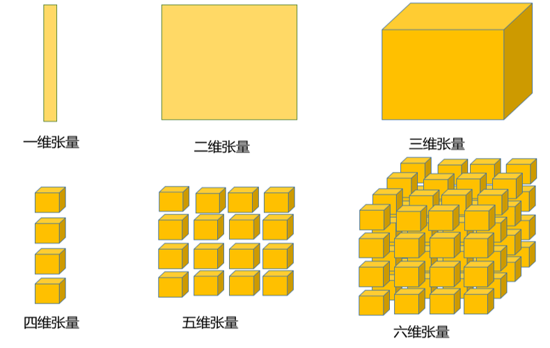

# MindSpore入门

## 1. 架构介绍

<div align=center></div>

MindSpore是一个开源全场景AI计算框架，最佳匹配昇腾AI处理器算力。其中:

- MindSpore Extend为基于MindSpore的领域库，即构建出很多领域特定的库。
- MindExpress子系统主要是指Python表达子系统，通过高低两层API支撑用户进行网络构建、子图执行以及单算子执行。MindExpress将用户编写的代码解析为中间表示（Intermediate Representation，IR）。
- MindCompiler子系统提供面向MindIR的图级即时编译能力：
    - Graph High Level Optimization (GHLO)面向应用，进行偏前端的优化和处理，如类型推倒、自动微分(Auto Difference)、二阶优化、自动并行等。
    - Graph Low Level Optimization (GLLO)面向硬件，进行偏底层的优化，如算子融合、layout优化、冗余消除、内存优化等。
- MindRT子系统是统一的运行时（RunTime）系统，支持端、云多种设备形态要求，支持多种硬件设置的调度管理，如Ascend、GPU、CPU。
    - 将全图下沉到Ascend芯片上（循环、变量、计算等），图执行本身异步化，减少host-device交互开销。同时输入/输出数据异步并行拷贝，device通过队列等待和触发，从而隐藏数据读取、预处理的开销。
    - 通过静态内存规划、内存池化管理，提升内存复用率，减少运行时内存创建和销毁的开销。
- MindData负责高效完成训练数据处理pipeline，与计算形成流水。一个典型的训练数据处理pipeline包括：数据集的加载、shuffle、map（map主要指数据处理，如CV类的数据增强、NLP类的分词处理等）、batch、repeat（指将数据集重新加载）；
- MindInsight是MindSpore的调试调优子系统，提供训练过程可视化、模型溯源、debugger和性能profiling功能。
    - 在训练过程中，用户可以方便的收集训练过程信息，包括计算图、标量数据(loss/accuracy…）、直方图数据(梯度/权重…)、性能数据等，并通过Web UI界面进行展示。
    - 通过收集训练的超参，数据集、数据增强信息，记录每个训练版本的信息，实现模型溯源，并可在多次训练间进行对比
- MindArmour针对可信AI的各个领域提供全面、有效、易用的评测工具和增强方法。
    - Fuzzing测试：根据模型覆盖率和配置策略启发式地产生可信测试数据，生成评估报告；
    - 可信增强：使用预置的方法增强AI模型可信程度。

## 2. 张量（Tensor）

<div align=center></div>

不同维度的张量（Tensor）分别表示不同的数据，0维张量表示标量，1维张量表示向量，2维张量表示矩阵，3维张量可以表示彩色图像的RGB三通道等等。

张量是MindSpore网络运算中的基本数据结构。张量中的数据类型可参考[dtype](https://www.mindspore.cn/doc/programming_guide/zh-CN/master/dtype.html)。

- 张量是Parameter（权重和偏置）的载体，Feature Map的载体；
- 张量可与numpy.ndarray无缝转换。
  
### 2.1 张量构造

`mindspore.Tensor(input_data, dtype=None)`

- `input_data`：构造张量时，支持传入`Tensor`、`float`、`int`、`bool`、`tuple`、`list`和`numpy.ndarray`类型。
- `dtype`：指定数据类型。如果没有指定dtype，`int`、`float`、`bool`分别对应`int32`、`float32`、`bool_`，`tuple`和`list`生成的1维`Tensor`数据类型与`tuple`和`list`里存放数据的类型相对应。

代码样例如下：

```python
import numpy as np
import mindspore as ms
from mindspore import Tensor

x = Tensor(np.array([[1, 2], [3, 4]]), ms.int32)
y = Tensor(1.0, ms.int32)
z = Tensor(2, ms.int32)
m = Tensor(True, ms.bool_)
n = Tensor((1, 2, 3), ms.int16)
p = Tensor([4.0, 5.0, 6.0], ms.float64)

print(x, "\n\n", y, "\n\n", z, "\n\n", m, "\n\n", n, "\n\n", p)
```

    [[1 2]
     [3 4]] 
    
     1 
    
     2 
    
     True 
    
     [1 2 3] 
    
     [4. 5. 6.]


### 2.2 张量的属性和方法

张量的属性包括形状（shape）和数据类型（dtype），常用的方法如`asnumpy()`。
- `shape`：`Tensor`的形状，是一个tuple。
- `dtype`：`Tensor`的数据类型，是MindSpore的一种数据类型。
- `dim`：`Tensor`的维度，和`x.shape`的维度一致。
- `size`：`Tensor`的大小，即`x.shape`各维度的乘积。
- `set_dtype(dtype)`：修改`Tensor`的数据类型。
- `asnumpy()`：将`Tensor`转换为NumPy的array。

代码样例如下：

```python
import mindspore as ms
from mindspore import Tensor

x = Tensor([[1, 2], [3, 4]], ms.int32)

print(x.shape, x.dtype, x.dim(), x.size())
print(x.asnumpy())
x.set_dtype(ms.float32)
print(x)
```

    (2, 2) Int32 2 4
    [[1 2]
     [3 4]]
    [[1. 2.]
     [3. 4.]]

### 2.3 张量的操作 

可以将Tensor转化为numpy.ndarray后进行常用的张量操作。MindSpore也提供了几种张量操作的算子。

#### 张量Reshape

`mindspore.ops.operations.Reshape()`/`mindspore.ops.functional.reshape(input_x, input_shape)`

- `input_x`：需要做reshape的张量。
- `input_shape`：目标形状，各维度乘积大小需要于原形状各维度乘积大小一致。

```python
from mindspore import Tensor
from mindspore.ops import functional as F
from mindspore.common.api import ms_function

x = Tensor([[1, 2], [3, 4]])

@ms_function
def reshape():
    return F.reshape(x, (1, 4))

print(reshape())
```

    [[1 2 3 4]]

#### 张量转置

`mindspore.ops.Transpose`

- `input_x`；待转置的原始张量；
- `input_perm`：原始张量各维度转置的排列方式，必须为常量。

```python
import mindspore as ms
from mindspore import Tensor
from mindspore.ops import operations as P
from mindspore.common.api import ms_function

input_tensor = Tensor([[1, 2, 3], [4, 5, 6]], ms.float32)
perm = (1, 0)
transpose = P.Transpose()

@ms_function
def trans():
    return transpose(input_tensor, perm)

print(trans())
```

    [[1. 4.]
     [2. 5.]
     [3. 6.]]

#### 张量的切片和索引

Tensor提供了类似Numpy的索引接口，语法和限制同Numpy类似，具体参见如下例子。

```python
import pprint
import mindspore as ms
from mindspore import Tensor
from mindspore.common.api import ms_function

x = Tensor([[0, 1, 2],
            [10, 11, 12],
            [20, 21, 22],
            [30, 31, 32],
            [40, 41, 42]], ms.float16)

@ms_function
def index():
    # 简单写法
    ele = x[2, 1]
    row = x[2]
    col = x[:, 1]
    # 级联写法
    cascade = x[2][1]
    # tuple写法
    tuple_ = x[(2, 1)]
    # 省略写法，...代表任意维度
    ellipsis = x[..., 1]
    return ele, row, col, cascade, tuple_, ellipsis

pprint.pprint(x.shape)
pprint.pprint(index())
```

    (5, 3)
    (Tensor(shape=[], dtype=Float16, value= 21),
     Tensor(shape=[3], dtype=Float16, value= [ 2.0000e+01,  2.1000e+01,  2.2000e+01]),
     Tensor(shape=[5], dtype=Float16, value= [ 1.0000e+00,  1.1000e+01,  2.1000e+01,  3.1000e+01,  4.1000e+01]),
     Tensor(shape=[], dtype=Float16, value= 21),
     Tensor(shape=[], dtype=Float16, value= 21),
     Tensor(shape=[5], dtype=Float16, value= [ 1.0000e+00,  1.1000e+01,  2.1000e+01,  3.1000e+01,  4.1000e+01]))

Tensor也提供了类似Numpy的切片接口，语法和限制同Numpy类似。有如下注意事项：

- 切片不支持级联的写法，既不支持多个切片级联，也不支持与索引级联。多个`[]`连用相当于连续多次调用`[]`。
- 索引与切片混合使用，索引作用的维度/坐标轴会被剥离（索引的固有效果）。

```python
import pprint
import mindspore as ms
from mindspore import Tensor
from mindspore.common.api import ms_function

x = Tensor([[0, 1, 2],
            [10, 11, 12],
            [20, 21, 22],
            [30, 31, 32],
            [40, 41, 42]], ms.float16)
idx = Tensor([0, 2, 4], ms.int32)

@ms_function
def slice():
    # 简单切片，[start:end]
    simple_0 = x[0:2, 0:2]
    simple_1 = x[0:2, :]
    simple_2 = x[:, 0:2]
    
    # step切片，[start:stop:step]
    step_0 = x[0:5:2, 0:3:2]
    step_1 = x[0:5:2]
    step_2 = x[::, 0:3:2]
    
    # tensor切片，Tensor([row1, row3])，仅支持沿第一维操作
    tensor = x[idx]
    
    # 切片+索引混合，注意返回的Tensor维度变化
    mix_0 = x[1, 0:2] # 维度降1
    mix_1 = x[1, 0:3:2] # 维度降1
    mix_2 = x[..., 0:3:2]
    
    # 简单切片+step切片混合
    mix_3 = x[0:2, 0:3:2]
    
    # 不支持级联，相当于连续调用[]
    cascade = x[0:5:2][0:3:2]
    
    return simple_0, simple_1, simple_2, step_0, step_1, step_2, tensor, mix_0, mix_1, mix_2, mix_3, cascade
pprint.pprint(slice())
```

    (Tensor(shape=[2, 2], dtype=Float16, value=
    [[ 0.0000e+00,  1.0000e+00],
     [ 1.0000e+01,  1.1000e+01]]),
     Tensor(shape=[2, 3], dtype=Float16, value=
    [[ 0.0000e+00,  1.0000e+00,  2.0000e+00],
     [ 1.0000e+01,  1.1000e+01,  1.2000e+01]]),
     Tensor(shape=[5, 2], dtype=Float16, value=
    [[ 0.0000e+00,  1.0000e+00],
     [ 1.0000e+01,  1.1000e+01],
     [ 2.0000e+01,  2.1000e+01]
     [ 3.0000e+01,  3.1000e+01],
     [ 4.0000e+01,  4.1000e+01]]),
     Tensor(shape=[3, 2], dtype=Float16, value=
    [[ 0.0000e+00,  2.0000e+00],
     [ 2.0000e+01,  2.2000e+01],
     [ 4.0000e+01,  4.2000e+01]]),
     Tensor(shape=[3, 3], dtype=Float16, value=
    [[ 0.0000e+00,  1.0000e+00,  2.0000e+00],
     [ 2.0000e+01,  2.1000e+01,  2.2000e+01],
     [ 4.0000e+01,  4.1000e+01,  4.2000e+01]]),
     Tensor(shape=[5, 2], dtype=Float16, value=
    [[ 0.0000e+00,  2.0000e+00],
     [ 1.0000e+01,  1.2000e+01],
     [ 2.0000e+01,  2.2000e+01]
     [ 3.0000e+01,  3.2000e+01],
     [ 4.0000e+01,  4.2000e+01]]),
     Tensor(shape=[3, 3], dtype=Float16, value=
    [[ 0.0000e+00,  1.0000e+00,  2.0000e+00],
     [ 2.0000e+01,  2.1000e+01,  2.2000e+01],
     [ 4.0000e+01,  4.1000e+01,  4.2000e+01]]),
     Tensor(shape=[2], dtype=Float16, value= [ 1.0000e+01,  1.1000e+01]),
     Tensor(shape=[2], dtype=Float16, value= [ 1.0000e+01,  1.2000e+01]),
     Tensor(shape=[5, 2], dtype=Float16, value=
    [[ 0.0000e+00,  2.0000e+00],
     [ 1.0000e+01,  1.2000e+01],
     [ 2.0000e+01,  2.2000e+01]
     [ 3.0000e+01,  3.2000e+01],
     [ 4.0000e+01,  4.2000e+01]]),
     Tensor(shape=[2, 2], dtype=Float16, value=
    [[ 0.0000e+00,  2.0000e+00],
     [ 1.0000e+01,  1.2000e+01]]),
     Tensor(shape=[2, 3], dtype=Float16, value=
    [[ 0.0000e+00,  1.0000e+00,  2.0000e+00],
     [ 4.0000e+01,  4.1000e+01,  4.2000e+01]]))

**提示：** 在Ascend环境上可以基于切片修改Tensor中部分元素的值，基于索引修改值后续会支持，CPU/GPU平台上也会陆续支持。

#### 张量的拼接

`mindspore.ops.Concat()`

参数：
- `axis`：拼接作用在张量的哪个坐标轴上。

输入：
- `input_x `：待拼接的张量元组或列表。

```python
import mindspore as ms
from mindspore import Tensor
from mindspore.ops import operations as P
from mindspore.common.api import ms_function

x1 = Tensor([[0, 1], [10, 11]], ms.float32)
x2 = Tensor([[20, 21], [30, 31]], ms.float32)

@ms_function
def concat():
    return P.Concat()((x1, x2))

print(concat())
```

    [[ 0.  1.]
     [10. 11.]
     [20. 21.]
     [30. 31.]]

#### 张量的分割

`mindspore.ops.Split(axis=0, output_num=1)`（r1.0 cpu版本暂不支持）

参数：
- `axis`：分割作用在原始张量的哪个坐标轴上。
- `output_num`：将原始张量分为几个子张量。

输入：
- `input_x `：待分割的原始张量。

```python
import mindspore as ms
from mindspore import Tensor
from mindspore.ops import operations as P

x = Tensor([[0, 1, 2, 3], [10, 11, 12, 13]], ms.int32)
axis = 1
output_num = 2
y1, y2 = P.Split(axis, output_num)(x)
print(y1)
print(y2)
```
    [[ 0,  1]
     [10, 11]]
    [[ 2,  3]
     [12, 13]]

#### 张量的排序

`mindspore.ops.TopK`

- `input_x`：待排序的原始张量。
- `k`：沿原始张量最后一维取的最大元素的数量，必须是常量。

```python
import mindspore as ms
from mindspore.ops import operations as P

x = Tensor([1, 2, 3, 4, 5], ms.float32)
k = 3
values, indices = P.TopK(sorted=True)(x, k)
print(values)
print(indices)
```

    [5. 4. 3.]
    [4, 3, 2]

### 2.4 张量的运算

张量支持常见的element-wise数学运算，如加、减、乘、除，以及比较运算：

```python
import pprint
import mindspore as ms
from mindspore import Tensor
from mindspore.common.api import ms_function

x1 = Tensor([[0, 1, 2], [10, 11, 12]], ms.int32)
x2 = Tensor([[1, 1, 1], [2, 2, 2]], ms.int32)

@ms_function
def element_wise():
    # P.TensorAdd()/F.tensor_add()
    add = x1 + x2
    # P.Sub()/F.tensor_sub()
    sub = x1 - x2
    # P.Mul()/F.tensor_mul()
    mul = x1 * x2
    # P.RealDiv()/F.tensor_div()
    div = x1 / x2
    # P.Greater()/F.tensor_gt()
    gt = x1 > x2
    return add, sub, mul, div, gt

pprint.pprint(element_wise())
```

    (Tensor(shape=[2, 3], dtype=Int32, value=
    [[ 1,  2,  3],
     [12, 13, 14]]),
     Tensor(shape=[2, 3], dtype=Int32, value=
    [[-1,  0,  1],
     [ 8,  9, 10]]),
     Tensor(shape=[2, 3], dtype=Int32, value=
    [[ 0,  1,  2],
     [20, 22, 24]]),
     Tensor(shape=[2, 3], dtype=Int32, value=
    [[0, 1, 2],
     [5, 5, 6]]),
     Tensor(shape=[2, 3], dtype=Bool, value=
    [[False, False,  True],
     [ True,  True,  True]]))

张量支持常见的broadcast数学运算，如加、减、乘、除、求幂、取负、比较运算：

```python
import pprint
import mindspore as ms
from mindspore import Tensor
from mindspore.common.api import ms_function

x1 = Tensor([[0, 1, 2], [10, 11, 12]], ms.int32)
x2 = Tensor([[1, 1, 1], [2, 2, 2]], ms.int32)
@ms_function
def broadcast():
    add = x1 + 1
    mul = x1 * 2
    # P.Pow()/F.tensor_pow()
    power = x1 ** 2
    # P.Neg()/F.tensor_neg()
    neg = -x1
    # P.GreaterEqual()/F.tensor_ge()
    ge = x1 >= 2
    return add, mul, power, neg, ge

pprint.pprint(broadcast())
```

    (Tensor(shape=[2, 3], dtype=Int32, value=
    [[ 1,  2,  3],
     [11, 12, 13]]),
     Tensor(shape=[2, 3], dtype=Int32, value=
    [[ 0,  2,  4],
     [20, 22, 24]]),
     Tensor(shape=[2, 3], dtype=Int32, value=
    [[  0,   1,   4],
     [100, 121, 144]]),
     Tensor(shape=[2, 3], dtype=Int32, value=
    [[  0,  -1,  -2],
     [-10, -11, -12]]),
     Tensor(shape=[2, 3], dtype=Bool, value=
    [[False, False,  True],
     [ True,  True,  True]]))

张量支持常见的矩阵运算，如矩阵乘运算。

`nn.MatMul(transpose_x1=False, transpose_x2=False)`/`P.MatMul(transpose_a=False, transpose_b=False)`

参数：
- `transpose_x1`：是否对第一个输入张量进行转置。
- `transpose_x2`：是否对第二个输入张量进行转置。

输入：
- `input_x1`：第一个输入张量。
- `input_x2`：第二个输入张量。

```python
import mindspore as ms
from mindspore import context, nn, Tensor

x1 = Tensor([[0, 1, 2], [10, 11, 12]], ms.float32)
x2 = Tensor([[1, 1, 1], [2, 2, 2]], ms.float32)
context.set_context(mode=context.GRAPH_MODE)
matmul = nn.MatMul(transpose_x2=True)(x1, x2)
print(matmul)
```

    [[ 3.  6.]
     [33. 66.]]

## 3. 参数（Parameter）

`Parameter`是可以改变的张量，即参数。如卷积层的Kernel、Bias，全连接层的Weights、Bias。在模型训练过程种，需要不断更新Parameter。

### 3.1 初始化

`mindspore.Parameter(default_input, name, requires_grad=True, layerwise_parallel=False)`

- `default_input`：初始化一个`Parameter`对象，传入的数据支持`Tensor`、`Initializer`、`int`和`float`四种类型。
- `name`：参数名。
- `requires_grad`：是否需要计算梯度，即是否需要训练。
- `layerwise_parallel`：一种并行模式，为True时，广播和梯度通信将不会应用到该参数上。

`Initializer`是初始化器，保存了shape和dtype信息，提供`to_tensor`方法生成存有数据的`Tensor`，可调用`initializer`接口生成`Initializer`对象。

下例通过三种不同的数据类型构造了`Parameter`：

```python
import mindspore as ms
from mindspore import Tensor, Parameter
from mindspore.common.initializer import initializer

x = Parameter(default_input=Tensor([[1, 2], [3, 4]]), name="x")
y = Parameter(default_input=initializer('ones', [2, 3], ms.int32), name='y')
z = Parameter(default_input=2.0, name='z', requires_grad=False)

print(x)
print(y)
print(z)
```

    Parameter (name=x, value=[[1 2]
     [3 4]])
    Parameter (name=y, value=[[1 1 1]
     [1 1 1]])
    Parameter (name=z, value=2.0)

### 3.2 属性

- `inited_param`：返回保存了实际数据的`Parameter`，如果`Parameter`原本保存的是`MetaTensor`，会将其转换为`Tensor`。
- `name`：实例化`Parameter`时，为其指定的名字。
- `sliced`：用在自动并行场景下，表示`Parameter`里保存的数据是否是分片数据。如果是，就不再对其进行切分，如果不是，需要根据网络并行策略确认是否对其进行切分。
- `layerwise_parallel`：一种并行模式，如果为True，参数就不会进行广播和梯度聚合，反之则需要。
- `requires_grad`：是否需要计算参数梯度。如果参数需要被训练，则需要计算参数梯度，否则不需要。
- `data`： `Parameter`本身，属性和方法同`Tensor`。

下例通过`Tensor`初始化一个`Parameter`，获取了`Parameter`的相关属性：

```python
import numpy as np
from mindspore import Tensor, Parameter

x = Parameter(default_input=Tensor(np.arange(2*3).reshape((2, 3))), name="x")

print("name: ", x.name,
      "\nsliced: ", x.sliced,
      "\nrequires_grad: ", x.requires_grad,
      "\nlayerwise_parallel: ", x.layerwise_parallel,
      "\ndata: ", x.data)
```

    name:  x 
    sliced:  False 
    requires_grad:  True 
    layerwise_parallel:  False 
    data:  Parameter (name=x, value=[[0 1 2]
     [3 4 5]])
    [[0 1 2]
     [3 4 5]] (2, 3) Int64

### 3.3 方法
- `init_data`：在网络采用半自动或者全自动并行策略的场景下，当初始化`Parameter`传入的数据是`Initializer`时，可调用该接口将`Parameter`保存的数据转换为`Tensor`。
- `set_data`：设置`Parameter`保存的数据，支持传入`Tensor`、`Initializer`、`int`和`float`进行设置。将方法的入参`slice_shape`设置为True时，可改变`Parameter`的shape，反之，设置的数据shape必须与`Parameter`原来的shape保持一致。
- `set_param_ps`：控制训练参数是否通过[Parameter Server](https://www.mindspore.cn/tutorial/training/zh-CN/master/advanced_use/apply_parameter_server_training.html)进行训练。
- `clone`：克隆`Parameter`，需要指定克隆之后的参数名称。

下例通过`Initializer`来初始化`Tensor`，调用了`Parameter`的相关方法。如下：

```python
import mindspore as ms
from mindspore import Parameter
from mindspore.common.initializer import initializer

x = Parameter(default_input=initializer('ones', [2, 3], ms.int32), name='x')

print(x)
print(x.clone(prefix="c"))
```

    Parameter (name=x, value=[[1 1 1]
     [1 1 1]])
    Parameter (name=c.x, value=[[1 1 1]
     [1 1 1]])

## 4. 算子（Operation）

MindSpore的算子组件，可从算子使用方式和算子功能两种维度进行划分。

### 4.1 算子使用方式

算子相关接口主要包括operations、functional和composite，可通过ops直接获取到这三类算子。
- operations提供单个的Primtive算子。一个算子对应一个原语，是最小的执行对象，需要实例化之后使用。
- composite提供一些预定义的组合算子，以及复杂的涉及图变换的算子，如`GradOperation`。
- functional提供operations和composite实例化后的对象，简化算子的调用流程。

#### 4.1.1 `mindspore.ops.operations`

operations提供了所有的Primitive算子接口，是开放给用户的最低阶算子接口。算子支持情况可查询[算子支持列表](https://www.mindspore.cn/doc/note/zh-CN/master/operator_list.html)。

Primitive算子也称为算子原语，它直接封装了底层的Ascend、GPU、AICPU、CPU等多种算子的具体实现，为用户提供基础算子能力。

Primitive算子接口是构建高阶接口、自动微分、网络模型等能力的基础。

代码样例如下（当前版本仅支持Ascend/GPU）：

```python
import mindspore as ms
import mindspore.ops.operations as P

input_x = ms.Tensor([1.0, 2.0, 4.0], ms.float32)
square = P.Square() # 先实例化
output = square(input_x) # 后使用
print("output =", output)
```

    output = [ 1.  4. 16.]

MindSpore中单算子代码是通过PyNative模式执行的，由于CPU环境下，MindSpore不支持PyNative模式，所以无法运行。我们使用MindSpore提供的ms_function，该功能将Python函数或者Python类的方法编译成计算图，以图模式运行。

```python
import mindspore as ms
import mindspore.ops.operations as P
from mindspore.common.api import ms_function

input_x = ms.Tensor([1.0, 2.0, 4.0], ms.float32)

@ms_function
def square(x):
    square = P.Square() # 先实例化
    return square(x) # 后使用
print(square(input_x))
```

    [ 1.  4. 16.]

#### 4.1.2 `mindspore.ops.functional`

为了简化没有属性的算子的调用流程，MindSpore提供了一些算子的functional版本。入参要求参考原算子的输入输出要求。算子支持情况可以查询[算子支持列表](https://www.mindspore.cn/doc/note/zh-CN/master/operator_list_ms.html#mindspore-ops-functional)。

例如`P.Pow`算子，我们提供了functional版本的`F.tensor_pow`算子。

使用functional的代码样例如下（当前版本仅支持Ascend/GPU）：

```python
import mindspore as ms
from mindspore.ops import functional as F
from mindspore.common.api import ms_function

x = ms.Tensor([0, -1, 2], ms.float32)
y = 3

@ms_function
def power():
    return F.pow(x, y)

print(power())
```

    [ 0. -1.  8.]

#### 4.1.3 `mindspore.ops.composite`

composite提供了一些组合算子，包括clip_by_value和random相关的一些算子，以及涉及图变换的函数（`GradOperation`、`HyperMap`和`Map`等）。

组合可以直接像一般函数一样使用，例如使用`normal`生成一个随机分布（当前版本仅支持Ascend/GPU）：

```python
import mindspore as ms
from mindspore import Tensor
from mindspore.ops import composite as C

mean = Tensor(1.0, ms.float32)
stddev = Tensor(1.0, ms.float32)
output = C.normal((2, 3), mean, stddev, seed=5)
print("ouput =", output)
```

    output = [[2.4911082  0.7941146  1.3117087]
              [0.30582333  1.772938  1.525996]]

### 4.2 算子功能

算子按功能可分为Array算子、数学算子、网络算子、图像算子、编码算子、调试算子和量化算子等。所有的算子在Ascend AI处理器、GPU和CPU的支持情况，参见[算子支持列表](https://www.mindspore.cn/doc/note/zh-CN/master/operator_list.html)。

#### 4.2.1 Array算子

Array算子包括针对张量的结构操作和类型转换算子。：

- 张量结构操作：切片、索引、形状变换、转置、合并和分割等。
- 张量类型转化：uint8, int32, float16, float32等类型的相互转换。

参考“张量的操作”章节，了解张量的形状变换、转置、合并和分割等操作。另外，MindSpore还提供了`Slice`，`Gather`，`Gather_Nd`等张量操作算子。

`mindspore.ops.Slice()`

- `x`：需要切片的张量。
- `begin`：切片起始位置，仅支持常量。
- `size`：切片大小，仅支持常量。

```python
import mindspore as ms
from mindspore import Tensor
from mindspore import ops as P
from mindspore.common.api import ms_function

x = Tensor([[[1, 1, 1], [2, 2, 2]],
            [[3, 3, 3], [4, 4, 4]],
            [[5, 5, 5], [6, 6, 6]]], ms.float32)

@ms_function
def slice():
    return P.Slice()(x, (1, 0, 0), (1, 1, 3))

print(slice())
```

    [[[3. 3. 3.]]]

`mindspore.ops.GatherV2()`/`mindspore.ops.functional.gather(input_params, input_indices, axis)`

- `input_params`：需要索引的原始张量。
- `input_indices`：原始张量的特定坐标轴上的索引，每个元素的取值范围为`[0, input_param.shape[axis]]`。
- `axis`：原始张量的特定坐标轴。

```python
import mindspore as ms
from mindspore import Tensor
from mindspore.ops import functional as F
from mindspore.common.api import ms_function

x = Tensor([[ 0,  1,  2,  3],
            [10, 11, 12, 13],
            [20, 21, 22, 23]], ms.float32)
indices = Tensor([1, 3], ms.int32)
axis = 1

@ms_function
def gather():
    return F.gather(x, indices, axis)

print(gather())
```

    [[ 1.  3.]
     [11. 13.]
     [21. 23.]]

`mindspore.ops.GatherNd()`/`mindspore.ops.functional.gather_nd(input_params, input_indices, axis)`

- `input_x`：需要索引的原始张量。
- `indices`：原始张量上的索引。

```python
import mindspore as ms
from mindspore import Tensor
from mindspore.ops import functional as F

x = Tensor([[0, 1, 2, 3], [10, 11, 12, 13], [20, 21, 22, 23]], ms.float32)
indices_1 = Tensor([[0, 0]])
indices_2 = Tensor([[0, 0], [1, 1]])
# r1.0版本仅GPU/Ascend环境支持
print(F.gather_nd(x, indices_1))
print(F.gather_nd(x, indices_2))
```

    [0.]
    [0., 11]

参考“张量的属性和方法”章节，了解张量的`dytpe`属性和`set_dtype(dtype)`方法。另外，MindSpore还提供了Slice，Gather，Gather_Nd等张量操作算子。

```python
import mindspore as ms
from mindspore import Tensor, ops
from mindspore.common.api import ms_function

x = Tensor([[0, 1], [11, 12]], ms.int32)
type_a = P.DType()(x)
print(type_a)

@ms_function
def cast():
 return ops.Cast()(x, ms.float32)
print(cast().dtype)
```

    Int32
    Float32

#### 4.2.2 数学算子

加、减、乘、除，以及三角函数、指数、对数、逻辑比较运算符等都支持对张量实施逐元素（element-wise）运算，并且支持类似NumPy的广播特性。MindSpore对常用的数学运算符进行了重载，请参考“张量的运算”章节。这里使用几个例子展示原始数学算子的使用方法。

```python
import pprint
import mindspore as ms
from mindspore.common.api import ms_function

x = ms.Tensor([0, -1, 2], ms.float32)
y = 3

@ms_function
def scalar():
    # 张量+标量
    add = ms.ops.tensor_add(x, y)
    # 取绝对值
    abs_ = ms.ops.Abs()(x)
    # 幂运算
    power = ms.ops.pow(x, y)
    return add, abs_, power

pprint.pprint(scalar())
```

    (Tensor(shape=[3], dtype=Float32, value= [ 3.00000000e+00,  2.00000000e+00,  5.00000000e+00]),
     Tensor(shape=[3], dtype=Float32, value= [ 0.00000000e+00,  1.00000000e+00,  2.00000000e+00]),
     Tensor(shape=[3], dtype=Float32, value= [ 0.00000000e+00, -1.00000000e+00,  8.00000000e+00]))

MindSpore还支持常见的矩阵运算，如矩阵乘运算。

`P.MatMul(transpose_a=False, transpose_b=False)`/`nn.MatMul(transpose_x1=False, transpose_x2=False)`

参数：
- `transpose_a`：是否对第一个输入张量进行转置。
- `transpose_b`：是否对第二个输入张量进行转置。

输入：
- `input_x1`：第一个输入张量。
- `input_x2`：第二个输入张量。

```python
import mindspore as ms
from mindspore.common.api import ms_function

x1 = ms.Tensor([[0, 1, 2], [10, 11, 12]], ms.float32)
x2 = ms.Tensor([[1], [2], [3]], ms.float32)

@ms_function
def matmul():
    return ms.ops.MatMul()(x1, x2)

print(matmul())
```

    [[ 8.]
     [68.]]

#### 4.2.3 网络算子

神经网络算子包括卷积、全连接、激活函数、LossFunction、优化算法等。

`mindspore.ops.Conv2D()`

参数：
- `out_channel (int)`：输出特征图通道数。
- `kernel_size (Union[int, tuple[int]])`：卷积核大小。
- `mode (int)`：0 Math convolutiuon, 1 cross-correlation convolution , 2 deconvolution, 3 depthwise convolution。 默认为1。
- `pad_mode (str)`：valid或same，默认为“valid”。
- `pad (Union(int, tuple[int]))`：pad的填充值，默认为0。为tuple时，上下左右填充值分别对应pad[0], pad[1], pad[2], pad[3]。
- `stride (Union(int, tuple[int]))`：步长，如1、2、(1, 1)、(2, 2)。默认值为1。
- `dilation (Union(int, tuple[int]))`：膨胀系数，每个采样点会跳过dilation-1个像素。默认为1，即不膨胀。
- `group (int)`：group卷积对应的分组数，默认为1，即不分组。

输入：
- `input (Tensor)` ：待卷积原始张量，形状为(N, Cin, Hin, Win)。
- `weight (Tensor)`：卷积核张量，形状为(Cout, Cin, K1, K2)。

```python
import numpy as np
import mindspore as ms
from mindspore.common.api import ms_function

N, C, H, W = 1, 1, 8, 8
Cout, Cin, Hk, Wk = 2, 1, 3, 3

x = ms.Tensor(np.ones([N, C, H, W]), ms.float32)
weight = ms.Tensor(np.ones([Cout, Cin, Hk, Wk]), ms.float32)
conv2d = ms.ops.Conv2D(out_channel=Cout, kernel_size=Hk, pad_mode='valid', stride=1)

@ms_function
def conv():
    return conv2d(x, weight)

print(conv())
```

    [[[[9. 9. 9. 9. 9. 9.]
       [9. 9. 9. 9. 9. 9.]
       [9. 9. 9. 9. 9. 9.]
       [9. 9. 9. 9. 9. 9.]
       [9. 9. 9. 9. 9. 9.]
       [9. 9. 9. 9. 9. 9.]]
    
      [[9. 9. 9. 9. 9. 9.]
       [9. 9. 9. 9. 9. 9.]
       [9. 9. 9. 9. 9. 9.]
       [9. 9. 9. 9. 9. 9.]
       [9. 9. 9. 9. 9. 9.]
       [9. 9. 9. 9. 9. 9.]]]]

`mindspore.nn`也提供了与网络算子同名/类似的Cell类的接口，主要作用是对网络算子进行进一步封装，为用户提供更友好的API。`nn`中接口传参和`ops`算子接口基本一致，对算子Parameter做了进一步封装。这里以`mindspore.nn.Conv2D()`为例进行说明。

`mindspore.nn.Conv2D()`

参数：
- `in_channels (int)`：输入特征图通道数。
- `out_channels (int)`：输出特征图通道数。
- `kernel_size (Union[int, tuple[int]])`：卷积核大小。
- `pad_mode (str)`：valid或same，默认为“valid”。
- `padding (Union(int, tuple[int]))`：pad的填充值，默认为0。为tuple时，上下左右填充值分别对应pad[0], pad[1], pad[2], pad[3]。
- `stride (Union(int, tuple[int]))`：步长，如1、2、(1, 1)、(2, 2)。默认值为1。
- `dilation (Union(int, tuple[int]))`：膨胀系数，默认为1，即不膨胀。
- `group (int)`：group卷积对应的分组数，默认为1，即不分组。
- `has_bias (bool)`：是否加入偏置，默认为False。
- `weight_init (Union[Tensor, str, Initializer, numbers.Number])`：卷积核初始化方法，可以为Tensor, string, Initializer, number。字符串表示初始化采用的分布，支持‘TruncatedNormal’, ‘Normal’, ‘Uniform’, ‘HeUniform’, ‘XavierUniform’以及 ‘One’ and ‘Zero’。默认为‘normal’。
- `bias_init (Union[Tensor, str, Initializer, numbers.Number])`：偏置初始化方法，可选值同`weight_init`。默认为‘zeros’。

输入：
- `input (Tensor)` ：待卷积原始张量，形状为(N, Cin, Hin, Win)。

```python
import numpy as np
import mindspore as ms
from mindspore.common.api import ms_function
ms.context.set_context(mode=ms.context.GRAPH_MODE)

N, C, H, W = 1, 1, 8, 8
Cout, Cin, Hk, Wk = 2, 1, 3, 3

x = ms.Tensor(np.ones([N, C, H, W]), ms.float32)
conv2d = ms.nn.Conv2d(in_channels=Cin, out_channels=Cout, kernel_size=Hk, pad_mode='valid', stride=1, weight_init='ones')

print(conv2d(x))
```

    [[[[9. 9. 9. 9. 9. 9.]
       [9. 9. 9. 9. 9. 9.]
       [9. 9. 9. 9. 9. 9.]
       [9. 9. 9. 9. 9. 9.]
       [9. 9. 9. 9. 9. 9.]
       [9. 9. 9. 9. 9. 9.]]
    
      [[9. 9. 9. 9. 9. 9.]
       [9. 9. 9. 9. 9. 9.]
       [9. 9. 9. 9. 9. 9.]
       [9. 9. 9. 9. 9. 9.]
       [9. 9. 9. 9. 9. 9.]
       [9. 9. 9. 9. 9. 9.]]]]

以下代码展示了常用的ReLU激活函数`mindspore.ops.ReLU`/`mindspore.nn.ReLU`。

```python
import mindspore as ms
from mindspore.common.api import ms_function

x = ms.Tensor([[-1, 0, 1], [0, 1, 2]], ms.float32)

@ms_function
def relu():
    return ms.ops.ReLU()(x)

print(relu())
```

    [[0. 0. 1.]
     [0. 1. 2.]]

以下代码展示了常用的带Softmax的交叉熵损失函数`mindspore.ops.SoftmaxCrossEntropyWithLogits`。

输入：
- `logits (Tensor)`：logits，形状为(N, C)。数据类型必须为float16/float32。
- `labels (Tensor)`：真实标签，形状为(N, C)。数据类型同上。

```python
import mindspore as ms
from mindspore.common.api import ms_function

logits = ms.Tensor([[2, 4, 1, 4, 5], [2, 1, 2, 4, 3]], ms.float32)
labels = ms.Tensor([[0, 0, 0, 0, 1], [0, 0, 0, 1, 0]], ms.float32)
softmax_cross = P.SoftmaxCrossEntropyWithLogits()
@ms_function
def loss():
    loss, backprop = softmax_cross(logits, labels)
    return loss, backprop

print(loss())
```

    (Tensor(shape=[2], dtype=Float32, value= [ 5.89929760e-01,  5.23744047e-01]), Tensor(shape=[2, 5], dtype=Float32, value=
    [[ 2.76002679e-02,  2.03939959e-01,  1.01535711e-02,  2.03939959e-01, -4.45633769e-01],
     [ 8.01589265e-02,  2.94888206e-02,  8.01589265e-02, -4.07701194e-01,  2.17894584e-01]]))

对应的Cell类接口为`mindspore.nn.SoftmaxCrossEntropyWithLogits(sparse=False, reduction='none')`

参数：
- `sparse (bool)`：– label是否由算子自行转为one_hot形式，默认为False。
- `reduction (str)`：reduction的方式，支持“mean”, “sum”, “none”。默认为 “none”，即不做reduction。

输入：
- `logits (Tensor)`：logits，形状为(N, C)。数据类型必须为float16/float32。
- `labels (Tensor)`：若`sparse=True`，形状为(N,)，类型为`mindspore.int32`，否则形状和类型与logits一致。

```python
import mindspore as ms
from mindspore.common.api import ms_function
ms.context.set_context(mode=ms.context.GRAPH_MODE)

logits = ms.Tensor([[2, 4, 1, 4, 5], [2, 1, 2, 4, 3]], ms.float32)
labels = ms.Tensor([4, 3], ms.int32)
softmax_cross = ms.nn.SoftmaxCrossEntropyWithLogits(sparse=True, reduction='mean')
print(softmax_cross(logits, labels))
```

    0.5568369

常用的优化器如`mindspore.ops.ApplyMomentum()`

参数：
- `use_locking (bool)`：开启锁，保护参数和累积变量等免于被修改。 默认为False。
- `use_nesterov (bool)`：开启Nesterov momentum，默认为False。
- `gradient_scale (float)`：缩放系数，大于0.0，默认为1.0。

输入：
- `variable (Parameter)`：待更新的参数。
- `accumulation (Parameter)`：累积的速度，即momentum加权的累加梯度。
- `learning_rate (Union[Number, Tensor])`：学习率，Float类型。
- `gradient (Tensor)`：梯度，形状和数量同`params`。
- `momentum (Union[Number, Tensor])`：累加梯度的参数，大于或等于0.0。

对应的Cell类接口为`mindspore.nn.Momentum(params, learning_rate, momentum, weight_decay=0.0, loss_scale=1.0, use_nesterov=False)`

参数：
- `params (Union[list[Parameter], list[dict]])`：待更新的参数。
- `learning_rate (Union[float, Tensor, Iterable, LearningRateSchedule])`：学习率。当学习率为`Iterable`类型的`Tensor`或者`list`时，表示动态学习率，第i个元素为第i步的学习率。当学习率为`LearningRateSchedule`类型时，第i步的学习率根据LearningRateSchedule的公式计算。
- `momentum (float)`：累加梯度的参数，大于或等于0.0，默认为0.9。
- `weight_decay (int, float)`：L2惩罚系数，大于或等于0.0，默认为0.0。
- `loss_scale (int, float)`：Loss缩放系数，大于0.0，默认为1.0。
- `use_nesterov (bool)`：开启Nesterov momentum，默认为False。

输入：
- `gradients (tuple[Tensor])`：梯度，形状和数量同`params`。

```python
net = Net()
#1) All parameters use the same learning rate and weight decay
opt = nn.Momentum(params=net.trainable_params(), learning_rate=0.1, momentum=0.9)

#2) Use parameter groups and set different values
# The conv_params will use a learning rate of default value 0.1 and a weight decay of 0.01.
# The no_conv_params will use a learning rate of 0.01 and a weight decay of default value 0.0.
# The order_params means the order of all the parameters.
conv_params = list(filter(lambda x: 'conv' in x.name, net.trainable_params()))
no_conv_params = list(filter(lambda x: 'conv' not in x.name, net.trainable_params()))
group_params = [{'params': conv_params, 'weight_decay': 0.01},
                {'params': no_conv_params, 'lr': 0.01},
                {'order_params': net.trainable_params()}]
opt = nn.Momentum(group_params, learning_rate=0.1, momentum=0.9, weight_decay=0.0)

loss = nn.SoftmaxCrossEntropyWithLogits()
model = Model(net, loss_fn=loss, optimizer=optim, metrics=None)
```

## 5. 模块（Cell）

`mindspore.nn.Cell`是构建所有网络的基类，也是网络的基本模块。当用户需要自定义网络时，需要继承`Cell`类，并重写`__init__`方法和`contruct`方法。`Cell`对象有以下成员方法：
- `__init__`，初始化参数（Parameter），子模块（Cell），算子（Primitive）等组件，校验参数；
- `construct`，定义执行的过程，有一些语法限制。图模式时，会被编译成图来执行；
- `bprop`（可选），自定义模块的反向。未定义时，框架会自动生成反向图，计算construct的反向。
- `__call__`，`Cell`类重写了Python的`__call__`方法，在`Cell`类的实例被调用时，会执行`contruct`方法。
- `parameters_dict`，网络结构中所有的参数，返回一个以key为参数名，value为参数值的`OrderedDict`。  
    `Cell`类中返回参数的方法还有许多，例如`get_parameters`、`trainable_params`等，具体使用方法可以参见[API文档](https://www.mindspore.cn/doc/api_python/zh-CN/r1.0/mindspore/mindspore.nn.html#mindspore.nn.Cell)。

### 5.1 自定义Cell

用户可以继承`Cell`类，自定义Block、网络、损失函数、优化器等。

```python
import pprint
from mindspore import nn, Parameter
from mindspore.ops import operations as P
from mindspore.common.initializer import initializer

class MyNet(nn.Cell):
    def __init__(self):
        super(MyNet, self).__init__()
        self.matmul = P.MatMul(transpose_b=True)
        self.bias_add = P.BiasAdd()
        self.relu = P.ReLU()
        self.weight = Parameter(initializer('normal', shape=[2, 3]), name="weight")
        self.bias = Parameter(initializer('zero', shape=[3]), name="bias")
    def construct(self, x):
        x = self.matmul(x, self.weight)
        x = self.bias_add(x, self.bias)
        x = self.relu(x)
        return x

pprint.pprint(MyNet().trainable_params())
```

    [Parameter (name=weight, value=Tensor(shape=[2, 3], dtype=Float32, value=
    [[-3.79058602e-03, -7.49116531e-03,  6.54395670e-03],
     [ 2.95572029e-03,  2.35575647e-03, -1.18450755e-02]])),
     Parameter (name=bias, value=Tensor(shape=[3], dtype=Float32, value= [ 0.00000000e+00,  0.00000000e+00,  0.00000000e+00]))]

### 5.2 预置的Cell

MindSpore的`nn`模块是用Python实现的模型组件，是对低阶API的封装，主要包括各种模型层、损失函数、优化器等。`nn`也提供了部分与`Primitive`算子同名的接口，主要作用是对`Primitive`算子进行进一步封装，为用户提供更友好的API。
- `nn.layer`：网络算子，如`ReLU`、`Dense`、`Conv2d`、`BatchNorm2d`、`AvgPool2d`、`LSTMCell`、`Embedding`、`Dropout`、`Conv2dBnFoldQuant`等。
- `nn.loss`：损失函数，如`L1Loss`、`MSELoss`、`SmoothL1Loss`、`SoftmaxCrossEntropyWithLogits`和`CosineEmbeddingLoss`等。
- `nn.optim`：优化器，如`SGD`、`Momentum`、`RMSProp`、`Adam`、`AdamWeightDecay`、`LARS`、`FTRL`、`ProximalAdagrad`等。
- `nn.metrics`：评价标准，如`Accuracy`、`Loss`、`Precision`、`Recall`、`F1`、`MSE`等。
- `nn.probability`：概率编程算子，如`bnn_layers.ConvReparam`、`bnn_layers.NormalPrior`、`distribution.Bernoulli`、`dpn.VAE`等。
- `nn.wrap`：Wrapper，如`TrainOneStepCell`、`WithLossCell`、`WithEvalCell`、`WithGradCell`等。

对比上文介绍的示例，以下示例使用了`nn.Dense`和`nn.ReLU`。`nn.Dense`内部会调用`P.MatMul`，增加输入参数校验功能并判断是否`bias`等，是一个高级封装的模型层。`nn.ReLU`内部会调用`P.ReLu`，增加输入参数校验功能。

```python
import pprint
from mindspore import nn

class MyNet(nn.Cell):
    def __init__(self):
        super(MyNet, self).__init__()
        self.fc = nn.Dense(2, 3, weight_init='normal',  bias_init='zero', has_bias=True)
        self.relu = nn.ReLU()
    def construct(self, x):
        x = self.fc(x)
        x = self.relu(x)
        return x

pprint.pprint(MyNet().trainable_params())
```

    [Parameter (name=fc.weight, value=Tensor(shape=[3, 2], dtype=Float32, value=
    [[-3.79058602e-03, -7.49116531e-03],
     [ 6.54395670e-03,  2.95572029e-03],
     [ 2.35575647e-03, -1.18450755e-02]])),
     Parameter (name=fc.bias, value=Tensor(shape=[3], dtype=Float32, value= [ 0.00000000e+00,  0.00000000e+00,  0.00000000e+00]))]

以下代码示例展示了如何通过网络算子、损失函数、优化器，以及`mindspore.train.Model`API来构建模型并启动训练。

```python
from mindspore import nn

class MyNet(nn.Cell):
    def __init__(self):
        super(MyNet, self).__init__()
        self.fc = nn.Dense(2, 3, weight_init='normal',  bias_init='zero', has_bias=True)
        self.relu = nn.ReLU()
    def construct(self, x):
        x = self.fc(x)
        x = self.relu(x)
        return x

net = MyNet()
loss = nn.SoftmaxCrossEntropyWithLogits(sparse=True, reduction='mean')
opt = nn.Momentum(net.trainable_params(), learning_rate=0.1, momentum=0.9, weight_decay=0.0)

model = ms.train.Model(net, loss, opt)
# 然后通过model.train(num_epochs, dataset)的方式启动训练
```

`WithLossCell`本质上是一个包含损失函数的`Cell`，构造`WithLossCell`需要事先定义好网络和损失函数。

```python
with_loss = nn.WithLossCell(net, loss)
```

`TrainOneStepCell`功能是执行网络的单步训练，返回每次训练结果后的loss结果，构造`TrainOneStepCell`需要事先定义好网络和损失函数，以及优化器。

```python
train_step = nn.TrainOneStepCell(with_loss, opt)
```

以下代码示例展示了使用Wrapper以及for循环代替`mindspore.train.Model`API。这种更底层的接口方便用户控制训练过程，自定义训练方式。

```python
from mindspore import nn

class MyNet(nn.Cell):
    def __init__(self):
        super(MyNet, self).__init__()
        self.fc = nn.Dense(2, 3, weight_init='normal',  bias_init='zero', has_bias=True)
        self.relu = nn.ReLU()
    def construct(self, x):
        x = self.fc(x)
        x = self.relu(x)
        return x

net = MyNet()
loss = nn.SoftmaxCrossEntropyWithLogits(sparse=True, reduction='mean')
opt = nn.Momentum(net.trainable_params(), learning_rate=0.1, momentum=0.9, weight_decay=0.0)

with_loss = nn.WithLossCell(net, loss)
train_step = nn.TrainOneStepCell(with_loss, opt)
# 然后通过for循环方式启动训练
# for data in dataset.create_dict_iterator():
#     loss = train_step(data['image'], data['label']).asnumpy()
```

MindSpore的损失函数、优化器、Wrapper全部是`Cell`的子类实现，所以也支持用户自定义。以下示例基于`SoftmaxCrossEntropyWithLogits`自定义了一个带有Lable Smooth的损失函数：

```python
import numpy as np
import mindspore as ms
from mindspore import nn, Tensor, context
context.set_context(mode=context.GRAPH_MODE)

class SoftmaxCrossEntropyWithLabelSmooth(nn.SoftmaxCrossEntropyWithLogits):
    """CrossEntropy"""
    def __init__(self, sparse=True, reduction='mean', smooth_factor=0., num_classes=10):
        super(SoftmaxCrossEntropyWithLabelSmooth, self).__init__(sparse, reduction)
        self.on_value = Tensor(1.0 - smooth_factor, ms.float32)
        self.off_value = Tensor(1.0 * smooth_factor / (num_classes - 1), ms.float32)

loss = SoftmaxCrossEntropyWithLabelSmooth(smooth_factor=0.)

logits = Tensor(np.random.randint(0, 9, size=[1, 10]), ms.float32)
labels = Tensor(np.ones([1,]).astype(np.int32))
loss(logits, labels)
```

    Tensor(shape=[], dtype=Float32, value= 6.51365)
