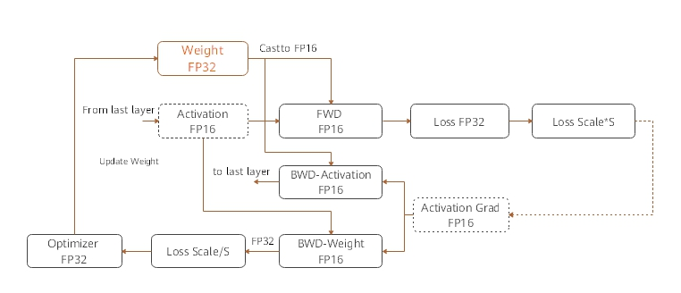
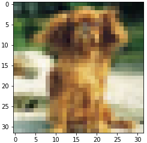
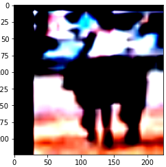

# 性能优化—混合精度

## 实验介绍

神经网络训练的时候，数据和权重等各种参数一般使用单精度浮点数（float32）进行计算和存储。在采用复杂神经网络进行训练时，由于计算量的增加，机器的内存开销变得非常大。有没有什么比较好的方法，在不提升硬件资源的基础上加快训练呢？这次我们介绍其中一种方法--混合精度训练，其本质就是就是将参数取其一半长度进行计算，即使用半精度浮点数（float16）计算，这样就能节省一半内存开销。当然，为了保证模型的精度，不能把所有的计算参数都换成半精度。为了兼顾模型精度和训练效率，MindSpore在框架中设置了一个自动混合精度训练的功能，混合精度训练方法是通过混合使用单精度和半精度数据格式来加速深度神经网络训练的过程，同时保持了单精度训练所能达到的网络精度。混合精度训练能够加速计算过程，同时减少内存使用和存取，并使得在特定的硬件上可以训练更大的模型或`batch size`。本实验我们将使用ResNet-50网络进行训练，体验MindSpore混合精度训练和单精度训练的不同之处。

MindSpore混合精度典型的计算流程如下图所示：



1. 参数以FP32存储；
2. 正向计算过程中，遇到FP16算子，需要把算子输入和参数从FP32 cast成FP16进行计算；
3. 将Loss层设置为FP32进行计算；
4. 反向计算过程中，首先乘以Loss Scale值，避免反向梯度过小而产生下溢；
5. FP16参数参与梯度计算，其结果将被cast回FP32；
6. 除以Loss scale值，还原被放大的梯度；
7. 判断梯度是否存在溢出，如果溢出则跳过更新，否则优化器以FP32对原始参数进行更新。

从上可以理解(float16为半精度浮点数，float32为单精度浮点数)，MindSpore是将网络中的前向计算部分`cast`成半精度浮点数进行计算，以节省内存空间，提升性能，同时将`loss`值保持单精度浮点数进行计算和存储，`weight`使用半精度浮点数进行计算，单精度浮点数进行保存，通过这样操作即提升了训练效率，又保证了一定的模型精度，达到提升训练性能的目的。

本文通过自动混合精度和手动混合精度的样例来讲解计算流程。

## 实验目的

- 掌握如何使用MindSpore进行图算融合开发。
- 了解MindSpore构建ResNet-50网络模型进行训练和评估。
- 了解MindSpore混合精度训练和单精度训练的不同之处

## 预备知识

- 熟练使用Python，了解Shell及Linux操作系统基本知识。
- 具备一定的深度学习理论知识，如卷积神经网络、损失函数、优化器，训练策略等。
- 了解华为云的基本使用方法，包括[OBS（对象存储）](https://www.huaweicloud.com/product/obs.html)、[ModelArts（AI开发平台）](https://www.huaweicloud.com/product/modelarts.html)、[Notebook（开发工具）](https://support.huaweicloud.com/engineers-modelarts/modelarts_23_0032.html)、[训练作业](https://support.huaweicloud.com/engineers-modelarts/modelarts_23_0238.html)等服务。华为云官网：https://www.huaweicloud.com
- 了解并熟悉MindSpore AI计算框架，MindSpore官网：https://www.mindspore.cn

## 实验环境

- MindSpore 0.5.0（MindSpore版本会定期更新，本指导也会定期刷新，与版本配套）；
- 华为云ModelArts：ModelArts是华为云提供的面向开发者的一站式AI开发平台，集成了昇腾AI处理器资源池，用户可以在该平台下体验MindSpore。ModelArts官网：https://www.huaweicloud.com/product/modelarts.html

## 实验准备

### 数据集准备

本实验采用CIFAR-10数据集，CIFAR-10是一个图片分类数据集，包含60000张32x32的彩色物体图片，训练集50000张，测试集10000张，共10类，每类6000张。

数据集下载地址：https://www.cd.toronto.edu/~kriz/cifar-10-python.tar.gz。

数据集下载后，解压至工作路径+/datasets/cifar10，由于测试数据集和训练数据集在一个文件夹中，需要你分开两个文件夹存放，存放形式如下。

```
cifar10
├── test
│   └── test_batch.bin
└── train
    ├── data_batch_1.bin
    ├── data_batch_2.bin
    ├── data_batch_3.bin
    ├── data_batch_4.bin
    └── data_batch_5.bin
```

### 脚本准备

从[MindSpore docs](https://gitee.com/mindspore/docs/blob/r0.5/tutorials/tutorial_code/resnet/resnet.py)中下载ResNet代码；从[课程gitee仓库](https://gitee.com/mindspore/course)上下载本实验相关脚本。将脚本和数据集组织为如下形式：

```
mixed_precision
├── datasets
│   └──cifar10
│── README.md
└── mixed_precision.ipynb
```

### 创建OBS桶

本实验需要使用华为云OBS存储脚本和数据集，可以参考[快速通过OBS控制台上传下载文件](https://support.huaweicloud.com/qs-obs/obs_qs_0001.html)了解使用OBS创建桶、上传文件、下载文件的使用方法。

> **提示：** 华为云新用户使用OBS时通常需要创建和配置“访问密钥”，可以在使用OBS时根据提示完成创建和配置。也可以参考[获取访问密钥并完成ModelArts全局配置](https://support.huaweicloud.com/prepare-modelarts/modelarts_08_0002.html)获取并配置访问密钥。

打开[OBS控制台](https://storage.huaweicloud.com/obs/?region=cn-north-4&locale=zh-cn#/obs/manager/buckets)，点击右上角的“创建桶”按钮进入桶配置页面，创建OBS桶的参考配置如下：

- 区域：华北-北京四
- 数据冗余存储策略：单AZ存储
- 桶名称：全局唯一的字符串
- 存储类别：标准存储
- 桶策略：公共读
- 归档数据直读：关闭
- 企业项目、标签等配置：免

### 上传文件

点击新建的OBS桶名，再打开“对象”标签页，通过“上传对象”、“新建文件夹”等功能，将脚本和数据集上传到OBS桶中。

### 创建Notebook

ModelArts Notebook资源池较小，且每个运行中的Notebook会一直占用Device资源不释放，不适合大规模并发使用（不使用时需停止实例，以释放资源）。可以参考[创建并打开Notebook](https://support.huaweicloud.com/engineers-modelarts/modelarts_23_0034.html)来创建并打开本实验的Notebook脚本。

打开[ModelArts控制台-开发环境-Notebook](https://console.huaweicloud.com/modelarts/?region=cn-north-4#/notebook)，点击“创建”按钮进入Notebook配置页面，创建Notebook的参考配置：

- 计费模式：按需计费
- 名称：mixed_precision
- 工作环境：Python3
- 资源池：公共资源
- 类型：Ascend
- 规格：单卡1*Ascend 910
- 存储位置：对象存储服务（OBS）->选择上述新建的OBS桶中的mixed_precision文件夹
- 自动停止：打开->选择1小时后（后续可在Notebook中随时调整）

> **注意：**
> - 在Jupyter Notebook/JupyterLab文件列表里，展示的是关联的OBS桶里的文件，并不在当前Notebook工作环境（容器）中，Notebook中的代码无法直接访问这些文件。
> - 打开Notebook前，选中文件列表里的所有文件/文件夹（实验脚本和数据集），并点击列表上方的“Sync OBS”按钮，使OBS桶中的所有文件同时同步到Notebook执行容器中，这样Notebook中的代码才能访问数据集。
>   - 使用Notebook时，可参考[与OBS同步文件](https://support.huaweicloud.com/engineers-modelarts/modelarts_23_0038.html)；
>   - 使用JupyterLab时，可参考[与OBS同步文件](https://support.huaweicloud.com/engineers-modelarts/modelarts_23_0336.html)。
>   - 同步文件的大小和数量超过限制时，请参考[MoXing常用操作示例](https://support.huaweicloud.com/moxing-devg-modelarts/modelarts_11_0005.html#section5)中的拷贝操作，将大文件（如数据集）拷贝到Notebook容器中。
> - Notebook/JupyterLab文件列表页面的“Upload/上传”功能，会将文件上传至OBS桶中，而不是Notebook执行容器中，仍需额外同步/拷贝。
> - 在Notebook里通过代码/命令（如`wget, git`、python`urllib, requests`等）获取的文件，存在于Notebook执行容器中，但不会显示在文件列表里。
> - 每个Notebook实例仅被分配了1个Device，如果在一个实例中打开多个Notebook页面（即多个进程），运行其中一个页面上的MindSpore代码时，请关闭其他页面的kernel，否则会出现Device被占用的错误。
> - Notebook运行中一直处于计费状态，不使用时，在Notebook控制台页面点击实例右侧的“停止”，以停止计费。停止后，Notebook里的内容不会丢失（已同步至OBS）。下次需要使用时，点击实例右侧的“启动”即可。可参考[启动或停止Notebook实例](https://support.huaweicloud.com/engineers-modelarts/modelarts_23_0041.html)。

打开Notebook后，选择MindSpore环境作为Kernel。

> **提示：** 
> - 上述数据集和脚本的准备工作也可以在Notebook环境中完成，在Jupyter Notebook文件列表页面，点击右上角的"New"->"Terminal"，进入Notebook环境所在终端，进入`work`目录，可以使用常用的linux shell命令，如`wget, gzip, tar, mkdir, mv`等，完成数据集和脚本的下载和准备。
> - 可将如下每段代码拷贝到Notebook代码框/Cell中，从上至下阅读提示并执行代码框进行体验。代码框执行过程中左侧呈现[\*]，代码框执行完毕后左侧呈现如[1]，[2]等。请等上一个代码框执行完毕后再执行下一个代码框。

## 实验步骤

作业基于上述打开的Notebook进行，进行作业前请确保完成了上述准备工作。如果Notebook资源不足，请参考[lenet5实验](../lenet5)将本Notebook转为训练作业，再行实验。

先将CIFAR-10的原始数据集可视化：

```python
import mindspore.dataset.engine as de
import matplotlib.pyplot as plt
import numpy as np

train_path = "./datasets/cifar10/train"
ds = de.Cifar10Dataset(train_path, num_parallel_workers=8, shuffle=True)
print("the cifar dataset size is :", ds.get_dataset_size())
dict1 = ds.create_dict_iterator()
datas = dict1.get_next()
image = datas["image"]
print("the tensor of image is:", image.shape)
plt.imshow(np.array(image))
plt.show()
```

the cifar dataset size is : 50000
the tensor of image is: (32, 32, 3)



可以看到CIFAR-10总共包含了50000张32×32的彩色图片。

#### 数据增强

```python
import os
import mindspore.common.dtype as mstype
import mindspore.dataset.engine as de
import mindspore.dataset.transforms.vision.c_transforms as C
import mindspore.dataset.transforms.c_transforms as C2

def create_dataset(dataset_path, do_train, repeat_num=10, batch_size=32, target="Ascend"):
    
    ds = de.Cifar10Dataset(dataset_path, num_parallel_workers=8, shuffle=True)
    
    # define map operations
    trans = []
    if do_train:
        trans += [
            C.RandomCrop((32, 32), (4, 4, 4, 4)),
            C.RandomHorizontalFlip(prob=0.5)
        ]

    trans += [
        C.Resize((224, 224)),
        C.Rescale(1.0 / 255.0, 0.0),
        C.Normalize([0.4914, 0.4822, 0.4465], [0.2023, 0.1994, 0.2010]),
        C.HWC2CHW()
    ]

    type_cast_op = C2.TypeCast(mstype.int32)

    ds = ds.map(input_columns="label", num_parallel_workers=8, operations=type_cast_op)
    ds = ds.map(input_columns="image", num_parallel_workers=8, operations=trans)

    # apply batch operations
    ds = ds.batch(batch_size, drop_remainder=True)
    # apply dataset repeat operation
    ds = ds.repeat(repeat_num)

    return ds
```

定义完成数据集增强函数后，我们来看一下，数据集增强后的效果是如何的：

```python
ds = create_dataset(train_path, do_train=True, repeat_num=10, batch_size=32, target="Ascend")
print("the cifar dataset size is:", ds.get_dataset_size())
dict1 = ds.create_dict_iterator()
datas = dict1.get_next()
image = datas["image"]
single_pic = np.transpose(image[0], (1,2,0))
print("the tensor of image is:", image.shape)
plt.imshow(np.array(single_pic))
plt.show()
```

the cifar dataset size is: 1562
the tensor of image is: (32, 3, 224, 224)



cifar10通过数据增强后的，变成了一共有1562个batch，张量为(32,3,224,224)的数据集。

### 定义动态学习率

定义动态学习率用于ResNet-50网络训练。

```python
import math
import numpy as np

def get_lr(lr_init, lr_end, lr_max, warmup_epochs, total_epochs, steps_per_epoch, lr_decay_mode):
    lr_each_step = []
    total_steps = steps_per_epoch * total_epochs
    warmup_steps = steps_per_epoch * warmup_epochs
    if lr_decay_mode == 'steps':
        decay_epoch_index = [0.3 * total_steps, 0.6 * total_steps, 0.8 * total_steps]
        for i in range(total_steps):
            if i < decay_epoch_index[0]:
                lr = lr_max
            elif i < decay_epoch_index[1]:
                lr = lr_max * 0.1
            elif i < decay_epoch_index[2]:
                lr = lr_max * 0.01
            else:
                lr = lr_max * 0.001
            lr_each_step.append(lr)
            
    elif lr_decay_mode == 'poly':
        if warmup_steps != 0:
            inc_each_step = (float(lr_max) - float(lr_init)) / float(warmup_steps)
        else:
            inc_each_step = 0
        for i in range(total_steps):
            if i < warmup_steps:
                lr = float(lr_init) + inc_each_step * float(i)
            else:
                base = (1.0 - (float(i) - float(warmup_steps)) / (float(total_steps) - float(warmup_steps)))
                lr = float(lr_max) * base * base
                if lr < 0.0:
                    lr = 0.0
            lr_each_step.append(lr)
    else:
        for i in range(total_steps):
            if i < warmup_steps:
                lr = lr_init + (lr_max - lr_init) * i / warmup_steps
            else:
                lr = lr_max - (lr_max - lr_end) * (i - warmup_steps) / (total_steps - warmup_steps)
            lr_each_step.append(lr)

    lr_each_step = np.array(lr_each_step).astype(np.float32)

    return lr_each_step

def linear_warmup_lr(current_step, warmup_steps, base_lr, init_lr):
    lr_inc = (float(base_lr) - float(init_lr)) / float(warmup_steps)
    lr = float(init_lr) + lr_inc * current_step
    return lr

def warmup_cosine_annealing_lr(lr, steps_per_epoch, warmup_epochs, max_epoch=120, global_step=0):
    base_lr = lr
    warmup_init_lr = 0
    total_steps = int(max_epoch * steps_per_epoch)
    warmup_steps = int(warmup_epochs * steps_per_epoch)
    decay_steps = total_steps - warmup_steps

    lr_each_step = []
    for i in range(total_steps):
        if i < warmup_steps:
            lr = linear_warmup_lr(i + 1, warmup_steps, base_lr, warmup_init_lr)
        else:
            linear_decay = (total_steps - i) / decay_steps
            cosine_decay = 0.5 * (1 + math.cos(math.pi * 2 * 0.47 * i / decay_steps))
            decayed = linear_decay * cosine_decay + 0.00001
            lr = base_lr * decayed
        lr_each_step.append(lr)

    lr_each_step = np.array(lr_each_step).astype(np.float32)
    learning_rate = lr_each_step[global_step:]
    return learning_rate
```

### 定义损失函数

```python
from mindspore.nn.loss.loss import _Loss
from mindspore.ops import operations as P
from mindspore.ops import functional as F
from mindspore import Tensor
import mindspore.nn as nn

class CrossEntropy(_Loss):
    def __init__(self, smooth_factor=0., num_classes=1001):
        super(CrossEntropy, self).__init__()
        self.onehot = P.OneHot()
        self.on_value = Tensor(1.0 - smooth_factor, mstype.float32)
        self.off_value = Tensor(1.0 * smooth_factor / (num_classes - 1), mstype.float32)
        self.ce = nn.SoftmaxCrossEntropyWithLogits()
        self.mean = P.ReduceMean(False)

    def construct(self, logit, label):
        one_hot_label = self.onehot(label, F.shape(logit)[1], self.on_value, self.off_value)
        loss = self.ce(logit, one_hot_label)
        loss = self.mean(loss, 0)
        return loss
```

### 定义网络

本实验使用MindSpore中的ResNet-50网络模型的源代码。

```python
from mindspore.common.tensor import Tensor
import mindspore.common.initializer as weight_init

def _weight_variable(shape, factor=0.01):
    init_value = np.random.randn(*shape).astype(np.float32) * factor
    return Tensor(init_value)

def _conv3x3(in_channel, out_channel, stride=1):
    weight_shape = (out_channel, in_channel, 3, 3)
    weight = _weight_variable(weight_shape)
    return nn.Conv2d(in_channel, out_channel,
                     kernel_size=3, stride=stride, padding=0, pad_mode='same', weight_init=weight)

def _conv1x1(in_channel, out_channel, stride=1):
    weight_shape = (out_channel, in_channel, 1, 1)
    weight = _weight_variable(weight_shape)
    return nn.Conv2d(in_channel, out_channel,
                     kernel_size=1, stride=stride, padding=0, pad_mode='same', weight_init=weight)

def _conv7x7(in_channel, out_channel, stride=1):
    weight_shape = (out_channel, in_channel, 7, 7)
    weight = _weight_variable(weight_shape)
    return nn.Conv2d(in_channel, out_channel,
                     kernel_size=7, stride=stride, padding=0, pad_mode='same', weight_init=weight)

def _bn(channel):
    return nn.BatchNorm2d(channel, eps=1e-4, momentum=0.9,
                          gamma_init=1, beta_init=0, moving_mean_init=0, moving_var_init=1)

def _bn_last(channel):
    return nn.BatchNorm2d(channel, eps=1e-4, momentum=0.9,
                          gamma_init=0, beta_init=0, moving_mean_init=0, moving_var_init=1)

def _fc(in_channel, out_channel):
    weight_shape = (out_channel, in_channel)
    weight = _weight_variable(weight_shape)
    return nn.Dense(in_channel, out_channel, has_bias=True, weight_init=weight, bias_init=0)

class ResidualBlock(nn.Cell):
    expansion = 4

    def __init__(self,
                 in_channel,
                 out_channel,
                 stride=1):
        super(ResidualBlock, self).__init__()

        channel = out_channel // self.expansion
        self.conv1 = _conv1x1(in_channel, channel, stride=1)
        self.bn1 = _bn(channel)

        self.conv2 = _conv3x3(channel, channel, stride=stride)
        self.bn2 = _bn(channel)

        self.conv3 = _conv1x1(channel, out_channel, stride=1)
        self.bn3 = _bn_last(out_channel)

        self.relu = nn.ReLU()

        self.down_sample = False

        if stride != 1 or in_channel != out_channel:
            self.down_sample = True
        self.down_sample_layer = None

        if self.down_sample:
            self.down_sample_layer = nn.SequentialCell([_conv1x1(in_channel, out_channel, stride),
                                                        _bn(out_channel)])
        self.add = P.TensorAdd()

    def construct(self, x):
        identity = x

        out = self.conv1(x)
        out = self.bn1(out)
        out = self.relu(out)

        out = self.conv2(out)
        out = self.bn2(out)
        out = self.relu(out)

        out = self.conv3(out)
        out = self.bn3(out)

        if self.down_sample:
            identity = self.down_sample_layer(identity)

        out = self.add(out, identity)
        out = self.relu(out)

        return out

class ResNet(nn.Cell):

    def __init__(self,
                 block,
                 layer_nums,
                 in_channels,
                 out_channels,
                 strides,
                 num_classes):
        super(ResNet, self).__init__()

        if not len(layer_nums) == len(in_channels) == len(out_channels) == 4:
            raise ValueError("the length of layer_num, in_channels, out_channels list must be 4!")

        self.conv1 = _conv7x7(3, 64, stride=2)
        self.bn1 = _bn(64)
        self.relu = P.ReLU()
        self.maxpool = nn.MaxPool2d(kernel_size=3, stride=2, pad_mode="same")

        self.layer1 = self._make_layer(block,
                                       layer_nums[0],
                                       in_channel=in_channels[0],
                                       out_channel=out_channels[0],
                                       stride=strides[0])
        self.layer2 = self._make_layer(block,
                                       layer_nums[1],
                                       in_channel=in_channels[1],
                                       out_channel=out_channels[1],
                                       stride=strides[1])
        self.layer3 = self._make_layer(block,
                                       layer_nums[2],
                                       in_channel=in_channels[2],
                                       out_channel=out_channels[2],
                                       stride=strides[2])
        self.layer4 = self._make_layer(block,
                                       layer_nums[3],
                                       in_channel=in_channels[3],
                                       out_channel=out_channels[3],
                                       stride=strides[3])

        self.mean = P.ReduceMean(keep_dims=True)
        self.flatten = nn.Flatten()
        self.end_point = _fc(out_channels[3], num_classes)

    def _make_layer(self, block, layer_num, in_channel, out_channel, stride):
        layers = []

        resnet_block = block(in_channel, out_channel, stride=stride)
        layers.append(resnet_block)

        for _ in range(1, layer_num):
            resnet_block = block(out_channel, out_channel, stride=1)
            layers.append(resnet_block)

        return nn.SequentialCell(layers)

    def construct(self, x):
        x = self.conv1(x)
        x = self.bn1(x)
        x = self.relu(x)
        c1 = self.maxpool(x)

        c2 = self.layer1(c1)
        c3 = self.layer2(c2)
        c4 = self.layer3(c3)
        c5 = self.layer4(c4)

        out = self.mean(c5, (2, 3))
        out = self.flatten(out)
        out = self.end_point(out)

        return out

def resnet50(class_num=10):

    return ResNet(ResidualBlock,
                  [3, 4, 6, 3],
                  [64, 256, 512, 1024],
                  [256, 512, 1024, 2048],
                  [1, 2, 2, 2],
                  class_num)

def resnet101(class_num=1001):
    return ResNet(ResidualBlock,
                  [3, 4, 23, 3],
                  [64, 256, 512, 1024],
                  [256, 512, 1024, 2048],
                  [1, 2, 2, 2],
                  class_num)
```

### 定义回调函数

定义回调函数Time_per_Step来计算单步训练耗时

`Time_per_Step`用于计算每步训练的时间消耗情况，方便对比混合精度训练和单精度训练的性能区别。

```python
from mindspore.train.callback import Callback
import time

class Time_per_Step(Callback):
    def step_begin(self, run_context):
        cb_params = run_context.original_args()
        cb_params.init_time = time.time()
        
    def step_end(selfself, run_context):
        cb_params = run_context.original_args()
        one_step_time = (time.time() - cb_params.init_time) * 1000
        print(one_step_time, "ms")
```

### 运行训练

**设置混合精度训练并执行训练**

由于MindSpore已经添加了自动混合精度训练功能，操作起来非常方便，只需要在Model中添加参数`amp_level=O3`就完成了设置Ascend模式下的混合精度训练设置。运行时，将会自动混合精度训练模型。

`amp_level`的参数详情：

`O0`：表示不做任何变化，即单精度训练，系统默认`O0`。

`O2`：表示将网络中的参数计算变为float16。适用于GPU环境。

`O3`：表示将网络中的参数计算变为float16，同时需要在Model中添加参数`keep_batchnorm_fp32=False`。适用于Ascend环境。

在`Model`中设置`amp_level=O3`后即可执行混合精度训练：

```python
"""train ResNet-50"""
import os
import random
import argparse
from mindspore import context
from mindspore.nn.optim.momentum import Momentum
from mindspore.train.model import Model
from mindspore.train.callback import ModelCheckpoint, CheckpointConfig, LossMonitor, TimeMonitor
from mindspore.nn.loss import SoftmaxCrossEntropyWithLogits
from mindspore.train.loss_scale_manager import FixedLossScaleManager
from mindspore.train.serialization import load_checkpoint, load_param_into_net


parser = argparse.ArgumentParser(description='Image classification')
parser.add_argument('--net', type=str, default="resnet50", help='Resnet Model, either resnet50 or resnet101')
parser.add_argument('--dataset', type=str, default="cifar10", help='Dataset, either cifar10 or imagenet2012')
parser.add_argument('--run_distribute', type=bool, default=False, help='Run distribute')
parser.add_argument('--device_target', type=str, default='Ascend', help='Device target')
parser.add_argument('--pre_trained', type=str, default=None, help='Pretrained checkpoint path')
args_opt = parser.parse_known_args()[0]

random.seed(1)
np.random.seed(1)
de.config.set_seed(1)
AMP_LEVEL = "O3"

context.set_context(mode=context.GRAPH_MODE,enable_auto_mixed_precision=False, device_target="Ascend")
ckpt_save_dir= "./resnet_ckpt"
batch_size = 32
epoch_size = 10
dataset_path = "./datasets/cifar10/train"
test_path = "./datasets/cifar10/test"
    
# create dataset
dataset = create_dataset(dataset_path=dataset_path, do_train=True, repeat_num=10,
                                 batch_size=batch_size, target="Ascend")
step_size = dataset.get_dataset_size()
# define net
net = resnet50(class_num=10)
    
# init weight
if args_opt.pre_trained:
    param_dict = load_checkpoint(args_opt.pre_trained)
    load_param_into_net(net, param_dict)
else:
    for _, cell in net.cells_and_names():
        if isinstance(cell, nn.Conv2d):
            cell.weight.default_input = weight_init.initializer(weight_init.XavierUniform(),
                                                                cell.weight.default_input.shape,
                                                                cell.weight.default_input.dtype).to_tensor()
        if isinstance(cell, nn.Dense):
            cell.weight.default_input = weight_init.initializer(weight_init.TruncatedNormal(),
                                                                cell.weight.default_input.shape,
                                                                cell.weight.default_input.dtype).to_tensor()
# init lr
warmup_epochs = 5
lr_init = 0.01
lr_end = 0.00001
lr_max = 0.1
lr = get_lr(lr_init=lr_init, lr_end=lr_end, lr_max=lr_max,warmup_epochs=warmup_epochs, 
            total_epochs=epoch_size, steps_per_epoch=step_size, lr_decay_mode='poly')
lr = Tensor(lr)

# define opt
loss_scale = 1024
momentum = 0.9
weight_decay = 1e-4
    
# define loss, model
loss = SoftmaxCrossEntropyWithLogits(sparse=True, is_grad=False, reduction='mean')
opt = Momentum(filter(lambda x: x.requires_grad, net.get_parameters()), lr, momentum)

eval_net = nn.WithEvalCell(net, loss, AMP_LEVEL in ["O2", "O3"])
model = Model(net, loss_fn=loss, optimizer=opt, metrics={'acc'}, amp_level=AMP_LEVEL, eval_network=eval_net, 
              eval_indexes=[0, 1, 2], keep_batchnorm_fp32=False)
    
# define callbacks
steptime_cb = Time_per_Step()
time_cb = TimeMonitor(data_size=step_size)
loss_cb = LossMonitor()

cb = [time_cb, loss_cb,steptime_cb]
save_checkpoint = 5
if save_checkpoint:
    save_checkpoint_epochs = 5
    keep_checkpoint_max = 10
    config_ck = CheckpointConfig(save_checkpoint_steps=save_checkpoint_epochs * step_size,
                                     keep_checkpoint_max=keep_checkpoint_max)
    ckpt_cb = ModelCheckpoint(prefix="resnet", directory=ckpt_save_dir, config=config_ck)
    cb += [ckpt_cb]

# train model
print("============== Starting Training ==============")
model.train(epoch_size, dataset, callbacks=cb, dataset_sink_mode=True)
```

```python
============== Starting Training ==============
epoch: 1 step 1562, loss is 1.2800476551055908
64953.40394973755 ms
Epoch time: 65047.685, per step time: 41.644
Epoch time: 65048.395, per step time: 41.644, avg loss: 1.280
************************************************************
epoch: 2 step 1562, loss is 1.4610073566436768
26713.122367858887 ms
Epoch time: 26713.336, per step time: 17.102
Epoch time: 26713.981, per step time: 17.102, avg loss: 1.461
************************************************************
epoch: 3 step 1562, loss is 0.9364482164382935
26747.148990631104 ms
Epoch time: 26747.987, per step time: 17.124
Epoch time: 26748.411, per step time: 17.124, avg loss: 0.936
************************************************************
epoch: 4 step 1562, loss is 0.9902463555335999
26747.275590896606 ms
Epoch time: 26747.413, per step time: 17.124
Epoch time: 26747.982, per step time: 17.124, avg loss: 0.990
************************************************************
epoch: 5 step 1562, loss is 0.5242041349411011
26747.90596961975 ms
Epoch time: 27690.477, per step time: 17.728
Epoch time: 27691.277, per step time: 17.728, avg loss: 0.524
************************************************************
epoch: 6 step 1562, loss is 0.532647967338562
26747.889041900635 ms
Epoch time: 26748.031, per step time: 17.124
Epoch time: 26748.601, per step time: 17.125, avg loss: 0.533
************************************************************
epoch: 7 step 1562, loss is 0.35971659421920776
26748.33106994629 ms
Epoch time: 26748.457, per step time: 17.124
Epoch time: 26748.937, per step time: 17.125, avg loss: 0.360
************************************************************
epoch: 8 step 1562, loss is 0.5928510427474976
26749.454259872437 ms
Epoch time: 26749.592, per step time: 17.125
Epoch time: 26750.138, per step time: 17.126, avg loss: 0.593
************************************************************
epoch: 9 step 1562, loss is 0.17644163966178894
26747.663259506226 ms
Epoch time: 26747.792, per step time: 17.124
Epoch time: 26748.336, per step time: 17.124, avg loss: 0.176
************************************************************
epoch: 10 step 1562, loss is 0.3067123293876648
26748.154878616333 ms
Epoch time: 27696.565, per step time: 17.731
Epoch time: 27697.372, per step time: 17.732, avg loss: 0.307
************************************************************
```

### 模型验证

使用模型进行精度验证可以得出以下代码。

```python
# Eval model
eval_dataset_path = "./datasets/cifar10/test"
eval_data = create_dataset(eval_dataset_path,do_train=False)
acc = model.eval(eval_data,dataset_sink_mode=True)
print("Accuracy:",acc)
```

Accuracy: {'acc': 0.8791073717948718}

### 实验结果

**对比不同网络下的混合精度训练和单精度训练的差别**

由于篇幅原因，我们这里只展示了ResNet-50网络的混合精度训练情况。可以在主程序入口的Model中设置参数`amp_level = O0`进行单精度训练，训练完毕后，将结果进行对比，看看两者的情况，下面将我测试的情况做成表格如下。（训练时，笔者使用的GPU为Nvidia Tesla P40，不同的硬件对训练的效率影响较大，下述表格中的数据仅供参考）

| 网络      | 是否混合训练 | 单步训练时间 | epoch | Accuracy |
| --------- | ------------ | ------------ | ----- | -------- |
| ResNet-50 | 否           | 232ms        | 10    | 0.880809 |
| ResNet-50 | 是           | 192ms        | 10    | 0.879107 |

经过多次测试，使用ResNet-50网络,CIFAR-10数据集，进行混合精度训练对整体的训练效率提升了16%，而且对最终模型的精度影响不大，对整体性能调优来说是一个不容忽视的性能提升。

当然，如果你想参考单步训练或者手动设置混合精度训练，可以参考官网教程https://www.mindspore.cn/tutorial/zh-CN/r0.7/advanced_use/mixed_precision.html