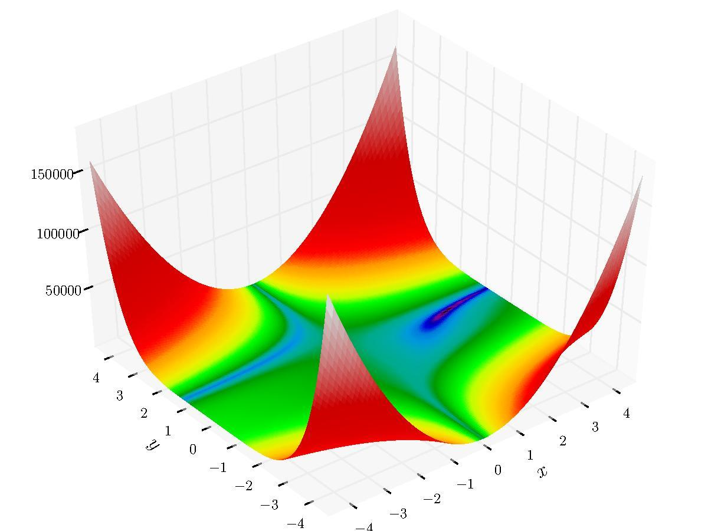
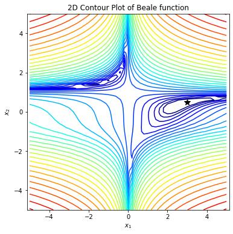
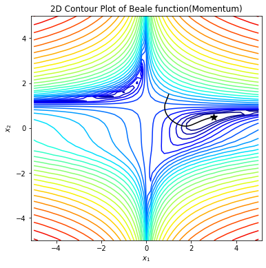
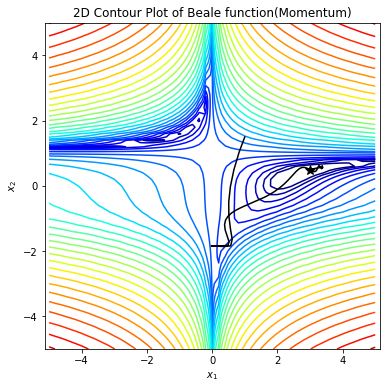
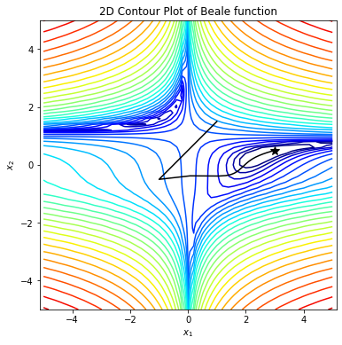
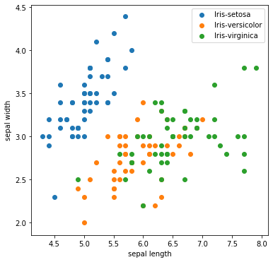

# 优化器实验

## 实验介绍

本实验主要介绍如何使用MindSpore进行优化实验。共包含两个实验分别为：

- 实验一：利用不同优化器求解函数极值点实验
- 实验二：鸢尾花数据在不同优化器下的分类实验

通过分析无优化器、SGD优化器、Momentum优化器、Adam优化器模型在求极值点和分类任务下的结果 ，得到不同优化器的作用。

## 实验目的

- 掌握MindSpore中优化器的使用及其作用。
- 了解如何使用MindSpore进行SGD、Momentum、Adam优化器实验。
- 了解不同优化器原理。

## 预备知识

- 熟练使用Python。
- 具备一定的深度学习理论知识，如感知机、损失函数、优化器，训练策略等。
- 了解华为云的基本使用方法，包括[OBS（对象存储）](https://www.huaweicloud.com/product/obs.html)、[ModelArts（AI开发平台）](https://www.huaweicloud.com/product/modelarts.html)、[训练作业](https://support.huaweicloud.com/engineers-modelarts/modelarts_23_0238.html)等功能。华为云官网：https://www.huaweicloud.com
- 了解并熟悉MindSpore AI计算框架，MindSpore官网：https://www.mindspore.cn/

## 实验环境

- MindSpore 1.0.0（MindSpore版本会定期更新，本指导也会定期刷新，与版本配套）；
- 华为云ModelArts（控制台左上角选择“华北-北京四”）：ModelArts是华为云提供的面向开发者的一站式AI开发平台，集成了昇腾AI处理器资源池，用户可以在该平台下体验MindSpore。

## 实验准备

### 数据集准备

#### 求函数极值点

为了评价优化器的特性，我们模拟了一个目标函数求极值过程。定义不同优化器求其极值，与目标结果比较。

目标函数Beale 公式:

$$
f(x_1,x_2)=(1.5−x_1+x_1x_2)^2+(2.25−x_1+x_1x_2^2)^2+(2.625−x_1+x_1x_2^3)^2
$$

表面如下图：
<div align=center>
    
</div>

方程极值点$ (x_1,  x_2) = (3,  0.5) $

我们需要通过各种不同的优化器来优化目标函数。优化器的主要目的是通过迭代找到目标函数的极小值或者极大值。常用的优化器有：SGD、Momentum、NAG、Adagrad、Adam等。

定义目标函数beale、目标函数的偏导函数dbeale_dx，并画出目标函数和极值点

```python
import numpy as np
import matplotlib.pyplot as plt
import matplotlib.colors as plt_cl

# ------------------定义目标函数beale、目标函数的偏导函数dbeale_dx，并画出目标函数---------------------
# 定义函数beale
def beale(x1, x2):
    return (1.5 - x1 + x1 * x2) ** 2 + (2.25 - x1 + x1 * x2 ** 2) ** 2 + (2.625 - x1 + x1 * x2 ** 3) ** 2

# 定义函数beale的偏导
def dbeale_dx(x1, x2):
    dfdx1 = 2 * (1.5 - x1 + x1 * x2) * (x2 - 1) + 2 * (2.25 - x1 + x1 * x2 ** 2) * (x2 ** 2 - 1) + 2 * (
            2.625 - x1 + x1 * x2 ** 3) * (x2 ** 3 - 1)
    dfdx2 = 2 * (1.5 - x1 + x1 * x2) * x1 + 2 * (2.25 - x1 + x1 * x2 ** 2) * (2 * x1 * x2) + 2 * (
            2.625 - x1 + x1 * x2 ** 3) * (3 * x1 * x2 ** 2)
    return dfdx1, dfdx2
step_x1, step_x2 = 0.2, 0.2
X1, X2 = np.meshgrid(np.arange(-5, 5 + step_x1, step_x1),
                     np.arange(-5, 5 + step_x2, step_x2))
Y = beale(X1, X2)
print("目标结果 (x_1, x_2) = (3, 0.5)")

# 定义画图函数
def gd_plot(x_traj):
    plt.rcParams['figure.figsize'] = [6, 6]
    plt.contour(X1, X2, Y, levels=np.logspace(0, 6, 30),
                norm=plt_cl.LogNorm(), cmap=plt.cm.jet)
    plt.title('2D Contour Plot of Beale function(Momentum)')
    plt.xlabel('$x_1$')
    plt.ylabel('$x_2$')
    plt.axis('equal')
    plt.plot(3, 0.5, 'k*', markersize=10)
    if x_traj is not None:
        x_traj = np.array(x_traj)
        plt.plot(x_traj[:, 0], x_traj[:, 1], 'k-')
    plt.show()
    
gd_plot(None)
```

    目标结果 (x_1, x_2) = (3, 0.5)



#### 鸢尾花分类数据集

鸢尾花数据集(Iris Dataset)是模式识别最著名的数据集之一。共收集了三类鸢尾花，即Setosa鸢尾花、Versicolour鸢尾花和Virginica鸢尾花，每一类鸢尾花收集了50条样本记录，共计150条。 Iris数据集的官网：[Iris Data Set](http://archive.ics.uci.edu/ml/datasets/Iris)。

数据集包括4个属性，分别为花萼的长、花萼的宽、花瓣的长和花瓣的宽。对花瓣我们可能比较熟悉，花萼是什么呢？花萼是花冠外面的绿色被叶，在花尚未开放时，保护着花蕾。四个属性的单位都是cm，属于数值变量，1个标签，表示鸢尾花的分类。

- 方式一，从Iris数据集官网下载[iris.data文件](http://archive.ics.uci.edu/ml/machine-learning-databases/iris/iris.data)。
- 方式二，从华为云OBS中下载[iris.data文件](https://share-course.obs.cn-north-4.myhuaweicloud.com/dataset/iris.data)。

### 脚本准备

从[课程gitee仓库](https://gitee.com/mindspore/course)中下载本实验相关脚本。将脚本和数据集组织为如下形式：

```
optimizer
├── main1.py # 求函数极值点
├── main2.py # 鸢尾花分类
└── iris  
    └── iris.data
```

### 创建OBS桶

本实验需要使用华为云OBS存储脚本和数据集，可以参考[快速通过OBS控制台上传下载文件](https://support.huaweicloud.com/qs-obs/obs_qs_0001.html)了解使用OBS创建桶、上传文件、下载文件的使用方法（下文给出了操作步骤）。

> **提示：** 华为云新用户使用OBS时通常需要创建和配置“访问密钥”，可以在使用OBS时根据提示完成创建和配置。也可以参考[获取访问密钥并完成ModelArts全局配置](https://support.huaweicloud.com/prepare-modelarts/modelarts_08_0002.html)获取并配置访问密钥。

打开[OBS控制台](https://storage.huaweicloud.com/obs/?region=cn-north-4&locale=zh-cn#/obs/manager/buckets)，点击右上角的“创建桶”按钮进入桶配置页面，创建OBS桶的参考配置如下：

- 区域：华北-北京四
- 数据冗余存储策略：单AZ存储
- 桶名称：全局唯一的字符串
- 存储类别：标准存储
- 桶策略：公共读
- 归档数据直读：关闭
- 企业项目、标签等配置：免

### 上传文件

点击新建的OBS桶名，再打开“对象”标签页，通过“上传对象”、“新建文件夹”等功能，将脚本和数据集上传到OBS桶中。上传文件后，查看页面底部的“任务管理”状态栏（正在运行、已完成、失败），确保文件均上传完成。若失败请：

- 参考[上传对象大小限制/切换上传方式](https://support.huaweicloud.com/qs-obs/obs_qs_0008.html)，
- 参考[上传对象失败常见原因](https://support.huaweicloud.com/obs_faq/obs_faq_0134.html)。
- 若无法解决请[新建工单](https://console.huaweicloud.com/ticket/?region=cn-north-4&locale=zh-cn#/ticketindex/createIndex)，产品类为“对象存储服务”，问题类型为“桶和对象相关”，会有技术人员协助解决。

## 实验步骤

推荐使用ModelArts训练作业进行实验，适合大规模并发使用。若使用ModelArts Notebook，请参考[LeNet5](../lenet5)及[Checkpoint](../checkpoint)实验案例，了解Notebook的使用方法和注意事项。

### 实验一：求函数极值点实验

#### 无优化器模型训练、测试、预测

原理：无优化器训练不更新参数，不管训练多少次，模型的参数没有发生变化。模型效果与模型初始化参数关系较大。

下面是不使用优化器求解Beale 公式极值点实现。

```python
# ------------------------------------------------------------无优化器-------------------------------------------
def gd_no(df_dx, x0, conf_para=None):
    if conf_para is None:
        conf_para = {}
    conf_para.setdefault('n_iter', 1000)  # 迭代次数
    conf_para.setdefault('learning_rate', 0.001)  # 设置学习率
    x_traj = []
    x_traj.append(x0)
    v = np.zeros_like(x0)
    for iter in range(1, conf_para['n_iter'] + 1):
        x_traj.append(x_traj[-1])
    return x_traj

x0 = np.array([1.0, 1.5])
conf_para_no = {'n_iter': 2000, 'learning_rate': 0.005}
x_traj_no = gd_no(dbeale_dx, x0, conf_para_no)
print("无优化器求得极值点 (x_1, x_2) = (%s, %s)" % (x_traj_no[-1][0], x_traj_no[-1][1]))
gd_plot(x_traj_no)
```

```
无优化器求得极值点 (x_1, x_2) = (1.0, 1.5)
```

#### SGD优化器模型训练、测试、预测

梯度下降法：梯度下降（gradient descent）在机器学习中应用十分的广泛，是求解无约束优化问题最简单和最古老的方法之一。通过迭代，参数向梯度的反方向更新，直到收敛。

$$
W_{new} = W - \eta\frac{\partial J(W)}{\partial W}
$$

其中$ \frac{\partial  J(W)}{\partial W}  $ 表示损失函数 J 关于参数W的梯度；$ \eta $表示学习率；

**缺点：**

- 有可能会陷入局部最小值；
- 不会收敛，最终会一直在最小值附近波动，并不会达到最小值并停留在此；
- 下降速度慢；
- 选择合适的学习率比较困难；
- 在所有方向上统一的缩放梯度，不适用于稀疏数据；

下面是使用SGD优化器求解Beale 公式极值点实现。

```python
# ------------------------------------------------------------SGD-------------------------------------------
def gd_sgd(df_dx, x0, conf_para=None):
    if conf_para is None:
        conf_para = {}
    conf_para.setdefault('n_iter', 1000)  # 迭代次数
    conf_para.setdefault('learning_rate', 0.001)  # 设置学习率
    x_traj = []
    x_traj.append(x0)
    v = np.zeros_like(x0)
    for iter in range(1, conf_para['n_iter'] + 1):
        dfdx = np.array(df_dx(x_traj[-1][0], x_traj[-1][1]))
        v = - conf_para['learning_rate'] * dfdx
        x_traj.append(x_traj[-1] + v)
    return x_traj

x0 = np.array([1.0, 1.5])
conf_para_sgd = {'n_iter': 2000, 'learning_rate': 0.005}
x_traj_sgd = gd_sgd(dbeale_dx, x0, conf_para_sgd)
print("SGD求得极值点 (x_1, x_2) = (%s, %s)" % (x_traj_sgd[-1][0], x_traj_sgd[-1][1]))
gd_plot(x_traj_sgd)
```

```
SGD求得极值点 (x_1, x_2) = (2.981957257903412, 0.4954609564102124)
```



#### Momentum优化器模型训练、测试、预测

Momentum：是动量优化法中的一种（Momentum、NAG），即使用动量(Momentum)的随机梯度下降法(SGD)，主要思想是引入一个积攒历史梯度信息的动量来加速SGD。其参数优化公式如下所示：

$$
v_{new} = \gamma v - \eta\frac{\partial J(W)}{\partial W} \\
W_{new} = W + v_{new}
$$

其中$ \frac{\partial  J(W)}{\partial W}  $ 表示损失函数 J 关于参数W的梯度；$ \eta $表示学习率；$ \gamma $表示动量的大小，一般取值为0.9。

这个算法和之前的梯度下降法(SGD)相比，唯一不同的就是多了一个$ \gamma v$。这一改动使Momentum会观察历史梯度，若当前梯度的方向与历史梯度一致（表明当前样本不太可能为异常点），则会增强这个方向的梯度；若当前梯度与历史梯方向不一致，则梯度会衰减。一种形象的解释是：我们把一个球推下山，球在下坡时积聚动量，在途中变得越来越快，γ可视为空气阻力，若球的方向发生变化，则动量会衰减。

**优点：**

- 参考了历史梯度，增加了稳定性；
- 由于引入加速动量，加快收敛速度。下降初期时，使用上一次参数更新，下降方向一致，乘上较大的$ \gamma $能够进行很好的加速；
- 还有一定摆脱局部最优的能力。下降中后期时，在局部最小值来回震荡的时候，梯度趋近于0，$ \gamma $使得更新幅度增大，跳出陷阱（局部最优）；

下面是使用Momentum优化器求解Beale 公式极值点实现。

```python
# -------------------------------------------------------Momentum---------------------------------
def gd_momentum(df_dx, x0, conf_para=None):
    if conf_para is None:
        conf_para = {}
    conf_para.setdefault('n_iter', 1000)  # 迭代次数
    conf_para.setdefault('learning_rate', 0.001)  # 设置学习率
    conf_para.setdefault('momentum', 0.9)  # 设置动量参数
    x_traj = []
    x_traj.append(x0)
    v = np.zeros_like(x0)
    for iter in range(1, conf_para['n_iter'] + 1):
        dfdx = np.array(df_dx(x_traj[-1][0], x_traj[-1][1]))
        v = conf_para['momentum'] * v - conf_para['learning_rate'] * dfdx
        x_traj.append(x_traj[-1] + v)
    return x_traj

x0 = np.array([1.0, 1.5])
conf_para_momentum = {'n_iter': 500, 'learning_rate': 0.005}
x_traj_momentum = gd_momentum(dbeale_dx, x0, conf_para_momentum)
print("Momentum求得极值点 (x_1, x_2) = (%s, %s)" % (x_traj_momentum[-1][0], x_traj_momentum[-1][1]))
gd_plot(x_traj_momentum)
```

```
Momentum求得极值点 (x_1, x_2) = (3.0004236971560485, 0.5001057348328146)
```



#### 自适应优化器模型训练、测试、预测

自适应学习率优化算法主要有：AdaGrad算法，RMSProp算法，Adam算法以及AdaDelta算法。

**AdaGrad**

AdaGrad的基本思想是对每个变量用不同的学习率。这个学习率在一开始比较大，用于快速梯度下降。随着优化过程的进行，对于已经下降很多的变量，则减缓学习率，对于还没怎么下降的变量，则保持一个较大的学习率。其参数优化公式如下所示：

$$
G_{new} = G + (\frac{\partial J(W)}{\partial W})^2 \\
W_{new} = W - \frac{\eta}{(\sqrt{G_{new}} + \varepsilon)}\cdot\frac{\partial J(W)}{\partial W}
$$

其中$ \frac{\partial J(W)}{\partial W}  $ 表示损失函数 J 关于参数W的梯度；$ \eta $表示学习率，一般取值0.01；$ \varepsilon $是一个很小的数，防止分母为0；$G_{new}$表示了前t 步参数$W$梯度的平方累加。把沿路的Gradient的平方根，作为Regularizer。分母作为Regularizer项的工作机制如下：

1. 训练前期，梯度较小，使得Regularizer项很大，放大梯度。[激励阶段]
2. 训练后期，梯度较大，使得Regularizer项很小，缩小梯度。[惩罚阶段]

**优点：**

- 在数据分布稀疏的场景，能更好利用稀疏梯度的信息，比标准的SGD算法更有效地收敛；
- 对每个变量用不同的学习率，对输入参数学习率的依赖小，容易调节参数；

**缺点：**

- 主要缺陷来自分母项的对梯度平方不断累积，随之时间步地增加，分母项越来越大，最终导致学习率收缩到太小无法进行有效更新；

**RMSProp**

为了解决 Adagrad 学习率急剧下降问题，RMSProp保留过去梯度的微分平方数项，旨在消除梯度下降中的摆动。与Momentum的效果一样，某一维度的导数比较大，则指数加权平均就大，某一维度的导数比较小，则其指数加权平均就小，这样就保证了各维度导数都在一个量级，进而减少了摆动。允许使用一个更大的学习率η。其参数优化公式如下所示：

$$
v_{new} = \gamma\cdot v + (1 - \gamma)\cdot{(\frac{\partial J(W)}{\partial W})}^2 \\
W_{new} = W - \frac{\eta}{(\sqrt{v_{new}} + \varepsilon)}(\frac{\partial J(W)}{\partial W})
$$

其中$ \frac{\partial  J (W)}{\partial W}  $ 表示损失函数 J 关于参数W的梯度；$ \eta $表示学习率，一般取值0.001；$ \varepsilon $是一个很小的数，防止分母为0；$ \gamma $表示动量的大小,一般取值为0.9。

**Adam**

Adam算法是另一种计算每个参数的自适应学习率的方法。相当于 RMSprop + Momentum。除了像RMSprop存储了过去梯度的平方 $ v_t $ 的指数衰减平均值 ，也像 momentum 一样保持了过去梯度$ m_t $ 的指数衰减平均值。其参数优化公式如下所示：

$$
m_{new} = \beta _1 m + (1 - \beta _1)(\frac{\partial J(W)}{\partial W})
$$

$$
v_{new} = \beta _2 v + (1 - \beta _2)(\frac{\partial J(W)}{\partial W})^2
$$

由于$\frac{m_0}{v_0}$初始化为0，会导致$\frac{m_{new}}{v_{new}}$偏向于0，尤其在训练初期阶段，所以，此处需要对梯度均值$\frac{m_{new}}{v_{new}}$进行偏差纠正，降低偏差对训练初期的影响。

$$
\hat{m_{new}} = m_{new} / (1 - \beta _1) 
$$

$$
\hat{v_{new}} = v_{new} / (1 - \beta _2)
$$

$$
W_{new} = W - \eta\frac{1}{\sqrt{\hat{v_{new}}} + \varepsilon}\hat{m_{new}}
$$

其中$ \frac{\partial  J (W)}{\partial W}  $ 表示损失函数 J 关于参数W的梯度；$ \eta $表示学习率，一般取值0.001；$ \varepsilon $是一个很小的数，一般取值10e−8，防止分母为0；$ \beta _1 $ $ \beta _2 $分别表示一阶和二阶动量的大小，一般取值为$ \beta _1 = 0.9 $ $ \beta _2 = 0.99 $。

**优点**

- 能够克服AdaGrad梯度急剧减小的问题，在很多应用中都展示出优秀的学习率自适应能力；
- 实现简单，计算高效，对内存需求少；
- 参数的更新不受梯度的伸缩变换影响；
- 超参数具有很好的解释性，且通常无需调整或仅需很少的微调；
- 更新的步长能够被限制在大致的范围内（初始学习率）；
- 能自然地实现步长退火过程（自动调整学习率）；
- 很适合应用于大规模的数据及参数的场景；
- 适用于不稳定目标函数；
- 适用于梯度稀疏或梯度存在很大噪声的问题；

下面是使用自适应优化器求解Beale 公式极值点实现。

```python
# ----------------------------------------------------adagrad-----------------------------
def gd_adagrad(df_dx, x0, conf_para=None):
    if conf_para is None:
        conf_para = {}
    conf_para.setdefault('n_iter', 1000)  # 迭代次数
    conf_para.setdefault('learning_rate', 0.001)  # 学习率
    conf_para.setdefault('epsilon', 1e-7)
    x_traj = []
    x_traj.append(x0)
    r = np.zeros_like(x0)
    for iter in range(1, conf_para['n_iter'] + 1):
        dfdx = np.array(df_dx(x_traj[-1][0], x_traj[-1][1]))
        r += dfdx ** 2
        x_traj.append(x_traj[-1] - conf_para['learning_rate'] / (np.sqrt(r) + conf_para['epsilon']) * dfdx)
    return x_traj

x0 = np.array([1.0, 1.5])
conf_para_adag = {'n_iter': 500, 'learning_rate': 2}
x_traj_adag = gd_adagrad(dbeale_dx, x0, conf_para_adag)
print("Adagrad求得极值点 (x_1, x_2) = (%s, %s)" % (x_traj_adag[-1][0], x_traj_adag[-1][1]))
gd_plot(x_traj_adag)
```

    Adagrad求得极值点 (x_1, x_2) = (2.9993173156940776, 0.49982846432011524)



从结果可以看出：无优化器参数不更新，求函数极值点无效。SGD、Momentum、自适应优化器求得的极值点与目标点(3.0,  0.5)较近。SGD、Momentum、自适应优化器求解极值点方法有效。其中SGD优化器实验需要的迭代次数2000多，相比与后边Momentum优化器多迭代1500次，证明了SGD优化器收敛速度慢。从图像可以看出自适应优化器对收敛方向把握比较好。

### 实验二：鸢尾花分类实验

#### 导入MindSpore模块和辅助模块

```python
import csv
import os
import time

import numpy as np
from easydict import EasyDict as edict
from matplotlib import pyplot as plt

import mindspore
from mindspore import nn
from mindspore import context
from mindspore import dataset
from mindspore.train.callback import TimeMonitor, LossMonitor
from mindspore import Tensor
from mindspore.train import Model
from mindspore.train.callback import ModelCheckpoint, CheckpointConfig

context.set_context(mode=context.GRAPH_MODE, device_target="Ascend")
```

#### 变量定义

```python
cfg = edict({
    'data_size': 150,
    'train_size': 120,      #训练集大小
    'test_size': 30 ,       #测试集大小
    'feature_number': 4,       #输入特征数
    'num_class': 3,     #分类类别
    'batch_size': 30,
    'data_dir':    'iris.data',                     
    'save_checkpoint_steps': 5,                 #多少步保存一次模型
    'keep_checkpoint_max': 1,                      #最多保存多少个模型
    'out_dir_no_opt':   './model_iris/no_opt',          #保存模型路径，无优化器模型
    'out_dir_sgd':   './model_iris/sgd',          #保存模型路径,SGD优化器模型
    'out_dir_momentum':   './model_iris/momentum',          #保存模型路径，momentum模型
    'out_dir_adam':   './model_iris/adam',          #保存模型路径，adam优化器模型
    'output_prefix': "checkpoint_fashion_forward"     #保存模型文件名
})
```

#### 读取数据并预处理

读取Iris数据集`iris.data`，并作检查。

```python
with open(cfg.data_dir) as csv_file:
    data = list(csv.reader(csv_file, delimiter=','))
print(data[0:5]); print(data[50:55]); print(data[100:105]) # 打印部分数据
```

    [['5.1', '3.5', '1.4', '0.2', 'Iris-setosa'], ['4.9', '3.0', '1.4', '0.2', 'Iris-setosa'], ['4.7', '3.2', '1.3', '0.2', 'Iris-setosa'], ['4.6', '3.1', '1.5', '0.2', 'Iris-setosa'], ['5.0', '3.6', '1.4', '0.2', 'Iris-setosa']]
    [['7.0', '3.2', '4.7', '1.4', 'Iris-versicolor'], ['6.4', '3.2', '4.5', '1.5', 'Iris-versicolor'], ['6.9', '3.1', '4.9', '1.5', 'Iris-versicolor'], ['5.5', '2.3', '4.0', '1.3', 'Iris-versicolor'], ['6.5', '2.8', '4.6', '1.5', 'Iris-versicolor']]
    [['6.3', '3.3', '6.0', '2.5', 'Iris-virginica'], ['5.8', '2.7', '5.1', '1.9', 'Iris-virginica'], ['7.1', '3.0', '5.9', '2.1', 'Iris-virginica'], ['6.3', '2.9', '5.6', '1.8', 'Iris-virginica'], ['6.5', '3.0', '5.8', '2.2', 'Iris-virginica']]

共150条数据，将数据集的4个属性作为自变量X。将数据集的3个类别映射为{0, 1，2}，作为因变量Y。

```python
label_map = {'Iris-setosa': 0,'Iris-versicolor': 1,'Iris-virginica':2 }
X = np.array([[float(x) for x in s[:-1]] for s in data[:cfg.data_size]], np.float32)
Y = np.array([label_map[s[-1]] for s in data[:cfg.data_size]], np.int32)
```

取样本的前两个属性进行2维可视化。发现Iris-setosa类和其他两类是线性可分的。Iris-versicolor类和Iris-virginica类是线性不可分的。

```python
plt.scatter(X[:50, 0], X[:50, 1], label='Iris-setosa')
plt.scatter(X[50:100, 0], X[50:100, 1], label='Iris-versicolor')
plt.scatter(X[100:, 0], X[100:, 1], label='Iris-virginica')
plt.xlabel('sepal length')
plt.ylabel('sepal width')
plt.legend()
```



将数据集分为训练集120条，测试集30条。

```python
# 将数据集分为训练集120条，测试集30条。
train_idx = np.random.choice(cfg.data_size, cfg.train_size, replace=False)
test_idx = np.array(list(set(range(cfg.data_size)) - set(train_idx)))
X_train, Y_train = X[train_idx], Y[train_idx]
X_test, Y_test = X[test_idx], Y[test_idx]
print('训练数据x尺寸：', X_train.shape)
print('训练数据y尺寸：', Y_train.shape)
print('测试数据x尺寸：', X_test.shape)
print('测试数据y尺寸：', Y_test.shape)
```

    训练数据x尺寸： (120, 4)
    训练数据y尺寸： (120,)
    测试数据x尺寸： (30, 4)
    测试数据y尺寸： (30,)

使用MindSpore GeneratorDataset接口将numpy.ndarray类型的数据转换为Dataset。

```python
def gen_data(X_train, Y_train, epoch_size):
    XY_train = list(zip(X_train, Y_train))
    ds_train = dataset.GeneratorDataset(XY_train, ['x', 'y'])
    ds_train = ds_train.shuffle(buffer_size=cfg.train_size).batch(cfg.batch_size, drop_remainder=True)
    XY_test = list(zip(X_test, Y_test))
    ds_test = dataset.GeneratorDataset(XY_test, ['x', 'y'])
    ds_test = ds_test.shuffle(buffer_size=cfg.test_size).batch(cfg.test_size, drop_remainder=True)
    return ds_train, ds_test
```

#### 定义训练、测试、预测过程

```python
# 训练
def train(network, net_opt, ds_train, prefix, directory, print_times):
    net_loss = nn.SoftmaxCrossEntropyWithLogits(is_grad=False, sparse=True, reduction="mean")
    model = Model(network, loss_fn=net_loss, optimizer=net_opt, metrics={"acc"})
    loss_cb = LossMonitor(per_print_times=print_times)
    config_ck = CheckpointConfig(save_checkpoint_steps=cfg.save_checkpoint_steps,
                                 keep_checkpoint_max=cfg.keep_checkpoint_max)
    ckpoint_cb = ModelCheckpoint(prefix=prefix, directory=directory, config=config_ck)
    print("============== Starting Training ==============")
    model.train(epoch_size, ds_train, callbacks=[ckpoint_cb, loss_cb], dataset_sink_mode=False)
    return model
```

```python
# 评估预测
def eval_predict(model, ds_test):
    # 使用测试集评估模型，打印总体准确率
    metric = model.eval(ds_test, dataset_sink_mode=False)
    print(metric)
    # 预测
    test_ = ds_test.create_dict_iterator().get_next()
    test = Tensor(test_['x'], mindspore.float32)
    predictions = model.predict(test)
    predictions = predictions.asnumpy()
    for i in range(10):
        p_np = predictions[i, :]
        p_list = p_np.tolist()
        print('第' + str(i) + '个sample预测结果：', p_list.index(max(p_list)), '   真实结果：', test_['y'][i])
```

#### 无优化器训练、测试、预测

```python
# --------------------------------------------------无优化器-----------------------------------
epoch_size = 20
print('------------------无优化器--------------------------')
# 数据
ds_train, ds_test = gen_data(X_train, Y_train, epoch_size)
# 定义网络并训练
network = nn.Dense(cfg.feature_number, cfg.num_class)
model = train(network, None, ds_train, "checkpoint_no_opt", cfg.out_dir_no_opt, 4)
# 评估预测
eval_predict(model, ds_test)
```

    ------------------无优化器--------------------------
    ============== Starting Training ==============
    epoch: 1 step: 4, loss is 1.099119
    epoch: 2 step: 4, loss is 1.0986137
    epoch: 3 step: 4, loss is 1.0915024
    epoch: 4 step: 4, loss is 1.0733328
    epoch: 5 step: 4, loss is 1.0819128
    epoch: 6 step: 4, loss is 1.1016335
    epoch: 7 step: 4, loss is 1.101129
    epoch: 8 step: 4, loss is 1.0737724
    epoch: 9 step: 4, loss is 1.0933018
    epoch: 10 step: 4, loss is 1.0933993
    epoch: 11 step: 4, loss is 1.063694
    epoch: 12 step: 4, loss is 1.0799284
    epoch: 13 step: 4, loss is 1.0820868
    epoch: 14 step: 4, loss is 1.0834141
    epoch: 15 step: 4, loss is 1.0789055
    epoch: 16 step: 4, loss is 1.081816
    epoch: 17 step: 4, loss is 1.0840713
    epoch: 18 step: 4, loss is 1.0937498
    epoch: 19 step: 4, loss is 1.0935693
    epoch: 20 step: 4, loss is 1.0883517
    {'acc': 0.36666666666666664}
    第0个sample预测结果： 2    真实结果： 0
    第1个sample预测结果： 2    真实结果： 0
    第2个sample预测结果： 2    真实结果： 0
    第3个sample预测结果： 2    真实结果： 1
    第4个sample预测结果： 2    真实结果： 0
    第5个sample预测结果： 2    真实结果： 0
    第6个sample预测结果： 2    真实结果： 0
    第7个sample预测结果： 2    真实结果： 0
    第8个sample预测结果： 2    真实结果： 2
    第9个sample预测结果： 2    真实结果： 0

#### SGD优化器模型训练、测试、预测

```python
# ---------------------------------------------------SGD-------------------------------------
epoch_size = 200
lr = 0.01
print('-------------------SGD优化器-----------------------')
# 数据
ds_train, ds_test = gen_data(X_train, Y_train, epoch_size)
# 定义网络并训练、测试、预测
network = nn.Dense(cfg.feature_number, cfg.num_class)
net_opt = nn.SGD(network.trainable_params(), lr)
model = train(network, net_opt, ds_train, "checkpoint_sgd", cfg.out_dir_sgd, 40)
# 评估预测
eval_predict(model, ds_test)
```

```
-------------------SGD优化器-----------------------
============== Starting Training ==============
epoch: 10 step: 4, loss is 0.89510494
epoch: 20 step: 4, loss is 0.75632095
epoch: 30 step: 4, loss is 0.6508981
epoch: 40 step: 4, loss is 0.66695356
epoch: 50 step: 4, loss is 0.568665
epoch: 60 step: 4, loss is 0.5630969
epoch: 70 step: 4, loss is 0.52990615
epoch: 80 step: 4, loss is 0.5494175
epoch: 90 step: 4, loss is 0.5097493
epoch: 100 step: 4, loss is 0.45089388
epoch: 110 step: 4, loss is 0.4442442
epoch: 120 step: 4, loss is 0.47102338
epoch: 130 step: 4, loss is 0.4603176
epoch: 140 step: 4, loss is 0.4400403
epoch: 150 step: 4, loss is 0.42114452
epoch: 160 step: 4, loss is 0.45897973
epoch: 170 step: 4, loss is 0.37725255
epoch: 180 step: 4, loss is 0.3870777
epoch: 190 step: 4, loss is 0.40343386
epoch: 200 step: 4, loss is 0.36648393
{'acc': 0.9333333333333333}
第0个sample预测结果： 2    真实结果： 0
第1个sample预测结果： 2    真实结果： 2
第2个sample预测结果： 0    真实结果： 0
第3个sample预测结果： 2    真实结果： 2
第4个sample预测结果： 1    真实结果： 2
第5个sample预测结果： 2    真实结果： 1
第6个sample预测结果： 0    真实结果： 0
第7个sample预测结果： 1    真实结果： 0
第8个sample预测结果： 2    真实结果： 1
第9个sample预测结果： 1    真实结果： 1
```

#### Momentum优化器模型训练、测试、预测

```python
# ----------------------------------------------------Momentum-------------------------------
epoch_size = 20
lr = 0.01
print('-------------------Momentum优化器-----------------------')
# 数据
ds_train, ds_test = gen_data(X_train, Y_train, epoch_size)
# 定义网络并训练
network = nn.Dense(cfg.feature_number, cfg.num_class)
net_opt = nn.Momentum(network.trainable_params(), lr, 0.9)
model = train(network, net_opt, ds_train, "checkpoint_momentum", cfg.out_dir_momentum, 4)
# 评估预测
eval_predict(model, ds_test)
```

    -------------------Momentum优化器-----------------------
    ============== Starting Training ==============
    epoch: 1 step: 4, loss is 1.0604309
    epoch: 2 step: 4, loss is 0.99521977
    epoch: 3 step: 4, loss is 0.8313699
    epoch: 4 step: 4, loss is 0.7094096
    epoch: 5 step: 4, loss is 0.65089923
    epoch: 6 step: 4, loss is 0.6310853
    epoch: 7 step: 4, loss is 0.53370225
    epoch: 8 step: 4, loss is 0.49405128
    epoch: 9 step: 4, loss is 0.4837509
    epoch: 10 step: 4, loss is 0.56862116
    epoch: 11 step: 4, loss is 0.45315826
    epoch: 12 step: 4, loss is 0.4296512
    epoch: 13 step: 4, loss is 0.35478917
    epoch: 14 step: 4, loss is 0.3776942
    epoch: 15 step: 4, loss is 0.3904683
    epoch: 16 step: 4, loss is 0.405444
    epoch: 17 step: 4, loss is 0.35382038
    epoch: 18 step: 4, loss is 0.4173923
    epoch: 19 step: 4, loss is 0.3982181
    epoch: 20 step: 4, loss is 0.36724958
    {'acc': 0.9333333333333333}
    第0个sample预测结果： 2    真实结果： 2
    第1个sample预测结果： 2    真实结果： 2
    第2个sample预测结果： 0    真实结果： 0
    第3个sample预测结果： 2    真实结果： 2
    第4个sample预测结果： 2    真实结果： 1
    第5个sample预测结果： 0    真实结果： 0
    第6个sample预测结果： 1    真实结果： 1
    第7个sample预测结果： 0    真实结果： 0
    第8个sample预测结果： 0    真实结果： 0
    第9个sample预测结果： 1    真实结果： 1

#### Adam优化器模型训练、测试、预测

```python
# ----------------------------------------------------Adam-----------------------------------
epoch_size = 15
lr = 0.1
print('------------------Adam优化器--------------------------')
# 数据
ds_train, ds_test = gen_data(X_train, Y_train, epoch_size)
# 定义网络并训练
network = nn.Dense(cfg.feature_number, cfg.num_class)
net_opt = nn.Adam(network.trainable_params(), learning_rate=lr)
model = train(network, net_opt, ds_train, "checkpoint_adam", cfg.out_dir_adam, 4)
# 评估预测
eval_predict(model, ds_test)
```

```
------------------Adam优化器--------------------------
============== Starting Training ==============
epoch: 1 step: 4, loss is 0.84714115
epoch: 2 step: 4, loss is 0.57764554
epoch: 3 step: 4, loss is 0.48923612
epoch: 4 step: 4, loss is 0.5017803
epoch: 5 step: 4, loss is 0.43567714
epoch: 6 step: 4, loss is 0.47073197
epoch: 7 step: 4, loss is 0.3545829
epoch: 8 step: 4, loss is 0.30443013
epoch: 9 step: 4, loss is 0.32454818
epoch: 10 step: 4, loss is 0.4717226
epoch: 11 step: 4, loss is 0.3707342
epoch: 12 step: 4, loss is 0.27762926
epoch: 13 step: 4, loss is 0.27208093
epoch: 14 step: 4, loss is 0.21773852
epoch: 15 step: 4, loss is 0.22632197
{'acc': 1.0}
第0个sample预测结果： 1    真实结果： 1
第1个sample预测结果： 2    真实结果： 1
第2个sample预测结果： 2    真实结果： 2
第3个sample预测结果： 2    真实结果： 2
第4个sample预测结果： 0    真实结果： 0
第5个sample预测结果： 1    真实结果： 1
第6个sample预测结果： 1    真实结果： 1
第7个sample预测结果： 1    真实结果： 1
第8个sample预测结果： 0    真实结果： 0
第9个sample预测结果： 2    真实结果： 0
```

**结果分析：** 从无优化器、SGD、momentum、adam优化器的loss上看：

1. 无优化器训练loss基本没有发生变化，测试结果效果差。多运行几次发现结果偏差太大，学员可以自己尝试。
2. SGD优化器loss下降速度很慢，而且在接近收敛处loss下降非常缓慢。增大学习率，减少迭代次数，会出现收敛到局部最优解的情况，学员可以自己尝试。
3. Momentum优化器loss下降速度较快，充分说明Momentum优化器改进了SGD收敛速度慢的问题。改变参数，比较不同学习率和迭代次数的结果，会发现该优化器稳定性很强，学习率容易选择。相比于SGD优化器容易调参。
4. adam优化器loss下降速度最快快，只需要15 epoch就可以达到收敛。改变模型学习率多跑几次，会发现，adam优化器可以适应不用的学习率，容易调节参数。

### 适配训练作业

创建训练作业时，运行参数会通过脚本传参的方式输入给脚本代码，脚本必须解析传参才能在代码中使用相应参数。如data_url和train_url，分别对应数据存储路径(OBS路径)和训练输出路径(OBS路径)。脚本对传参进行解析后赋值到args变量里，在后续代码里可以使用。

```python
import argparse
parser = argparse.ArgumentParser()
parser.add_argument('--data_url', required=True, default=None, help='Location of data.')   
parser.add_argument('--train_url', required=True, default=None, help='Location of training outputs.')
args, unknown = parser.parse_known_args()
```

MindSpore暂时没有提供直接访问OBS数据的接口，需要通过ModelArts自带的moxing框架与OBS交互。将OBS桶中的数据拷贝至执行容器中，供MindSpore使用：

```python
import moxing as mox
# src_url形如's3://OBS/PATH'，为OBS桶中数据集的路径，dst_url为执行容器中的路径
mox.file.copy_parallel(src_url=os.path.join(args.data_url, 'iris.data'), dst_url='iris.data')
```

如需将训练输出（如模型Checkpoint）从执行容器拷贝至OBS，请参考：

```python
import moxing as mox
# src_url为执行容器中的路径，dst_url形如's3://OBS/PATH'，目录若不存在则会新建
mox.file.copy_parallel(src_url='model_iris', dst_url=args.train_url)   
```

### 创建训练作业

可以参考[使用常用框架训练模型](https://support.huaweicloud.com/engineers-modelarts/modelarts_23_0238.html)来创建并启动训练作业。

打开[ModelArts控制台-训练管理-训练作业](https://console.huaweicloud.com/modelarts/?region=cn-north-4#/trainingJobs)，点击“创建”按钮进入训练作业配置页面，创建训练作业的参考配置：

- 算法来源：常用框架->Ascend-Powered-Engine->MindSpore；
- 代码目录：选择上述新建的OBS桶中的optimizer目录；
- 启动文件：选择上述新建的OBS桶中的optimizer目录下的`main1.py/main2.py`；
- 数据来源：数据存储位置->选择上述新建的OBS桶中的optimizer目录下的iris目录；
- 训练输出位置：选择上述新建的OBS桶中的optimizer目录并在其中创建model_iris目录；
- 作业日志路径：同训练输出位置；
- 规格：Ascend:1*Ascend 910；
- 其他均为默认；

**启动并查看训练过程：**

1. 点击提交以开始训练；
2. 在训练作业列表里可以看到刚创建的训练作业，在训练作业页面可以看到版本管理；
3. 点击运行中的训练作业，在展开的窗口中可以查看作业配置信息，以及训练过程中的日志，日志会不断刷新，等训练作业完成后也可以下载日志到本地进行查看；
4. 参考上述代码梳理，在日志中找到对应的打印信息，检查实验是否成功；

## 实验小结

本实验目的是使用MindSpore对比不同优化器算法，通过比较不同优化器实验结果，得到如下结论：

- 无优化器条件训练，不更新参数，训练loss基本不变。模型与初始化参数关系大，随机性较强，效果差，不适合应用；
- 有优化器条件下训练，更新模型参数。训练loss改变；
- SGD优化器收敛速度慢，参数不容易调节；
- Momentum优化器是SGD加入历史梯度动量，增加了稳定性，收敛速度有明显提高，参数较SGD容易调节；
- Adam优化器是 RMSprop + Momentum。可以适应不同学习率，可以自动为不同参数调节学习率。稳定性高，参数容易调节；