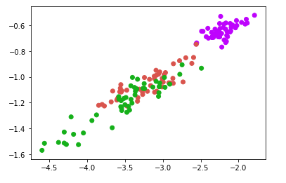

# PCA

## 实验介绍

降维是一种对高维度特征数据预处理方法。降维是将高维度的数据保留下最重要的一些特征，去除噪声和不重要的特征，从而实现提升数据处理速度的目的。在实际的生产和应用中，降维在一定的信息损失范围内，可以为我们节省大量的时间和成本。降维也成为应用非常广泛的数据预处理方法。本实验主要介绍使用MindSpore在多维度数据集上进行PCA降维实验。

降维具有如下一些优点：

- 使得数据集更易使用。
- 降低算法的计算开销。
- 去除噪声。
- 使得结果容易理解。

降维的算法有很多，比如奇异值分解(SVD)、主成分分析(PCA)、因子分析(FA)、独立成分分析(ICA)。本实验使用PCA实现降维。PCA（Principal Component Analysis）是一种使用最广泛的数据降维算法，常用于高维数据的降维，可用于提取数据的主要特征分量。其主要思想是将n维特征映射到k维上，这k维是全新的正交特征也被称为主成分，是在原有n维特征的基础上重新构造出来的k维特征。

PCA的算法步骤：

设有 m 条 n 维数据。

1. 将原始数据按列组成 n 行 m 列矩阵 X；
2. 将 X 的每一行进行零均值化，即减去这一行的均值；
3. 求出协方差矩阵 ![[公式]](https://www.zhihu.com/equation?tex=C%3D%5Cfrac%7B1%7D%7Bm%7DXX%5E%5Cmathsf%7BT%7D) ；
4. 求出协方差矩阵的特征值及对应的特征向量；
5. 将特征向量按对应特征值大小从上到下按行排列成矩阵，取前 k 行组成矩阵 P；
6. ![[公式]](https://www.zhihu.com/equation?tex=Y%3DPX) 即为降维到 k 维后的数据。

## 实验目的

- 了解降维算法和PCA的基本概念；
- 了解如何使用MindSpore进行降维实验。

## 预备知识

- 熟练使用Python。
- 具备一定的机器学习理论知识，如PCA、监督学习、无监督学习，训练策略等。
- 了解华为云的基本使用方法，包括[OBS（对象存储）](https://www.huaweicloud.com/product/obs.html)、[ModelArts（AI开发平台）](https://www.huaweicloud.com/product/modelarts.html)、[训练作业](https://support.huaweicloud.com/engineers-modelarts/modelarts_23_0238.html)等功能。华为云官网：<https://www.huaweicloud.com>
- 了解并熟悉MindSpore AI计算框架，MindSpore官网：<https://www.mindspore.cn/>

## 实验环境

- MindSpore 1.0.0（MindSpore版本会定期更新，本指导也会定期刷新，与版本配套）；
- 华为云ModelArts（控制台左上角选择“华北-北京四”）：ModelArts是华为云提供的面向开发者的一站式AI开发平台，集成了昇腾AI处理器资源池，用户可以在该平台下体验MindSpore。

## 实验准备

### 数据准备

Iris数据集是模式识别最著名的数据集之一。数据集包含3类，每类50个实例，其中每个类都涉及一种鸢尾植物。 本实验使用iris数据集，做一个降维数据集。Iris数据集的官网：[Iris Data Set](http://archive.ics.uci.edu/ml/datasets/Iris)。

- 方式一，从Iris数据集官网下载[iris.data文件](http://archive.ics.uci.edu/ml/machine-learning-databases/iris/iris.data)。
- 方式二，从华为云OBS中下载[iris.data文件](https://share-course.obs.cn-north-4.myhuaweicloud.com/dataset/iris.data)。

每个样本含有4个数值属性和一个类别属性：

1. sepal length in cm
2. sepal width in cm
3. petal length in cm
4. petal width in cm
5. class:
    - Iris Setosa
    - Iris Versicolour
    - Iris Virginica

概括统计:
| Attribute  |Min |Max |Mean|SD |Class Correlation
|:---- |:----  |:----  |:---- |:---- |:----
|sepal length: |4.3  |7.9   |5.84  |0.83    |0.7826
|sepal width: |2.0  |4.4   |3.05  |0.43   |-0.4194
|petal length: |1.0  |6.9   |3.76  |1.76    |0.9490  (high!)
|petal width: |0.1  |2.5   |1.20  |0.76    |0.9565  (high!)

### 脚本准备

从[课程gitee仓库](https://gitee.com/mindspore/course)中下载本实验相关脚本。将脚本和数据集组织为如下形式：

```python
pca
├── main.py
└── iris.data
```

### 创建OBS桶

本实验需要使用华为云OBS存储脚本和数据集，可以参考[快速通过OBS控制台上传下载文件](https://support.huaweicloud.com/qs-obs/obs_qs_0001.html)了解使用OBS创建桶、上传文件、下载文件的使用方法（下文给出了操作步骤）。

> **提示：** 华为云新用户使用OBS时通常需要创建和配置“访问密钥”，可以在使用OBS时根据提示完成创建和配置。也可以参考[获取访问密钥并完成ModelArts全局配置](https://support.huaweicloud.com/prepare-modelarts/modelarts_08_0002.html)获取并配置访问密钥。

打开[OBS控制台](https://storage.huaweicloud.com/obs/?region=cn-north-4&locale=zh-cn#/obs/manager/buckets)，点击右上角的“创建桶”按钮进入桶配置页面，创建OBS桶的参考配置如下：

- 区域：华北-北京四
- 数据冗余存储策略：单AZ存储
- 桶名称：全局唯一的字符串
- 存储类别：标准存储
- 桶策略：公共读
- 归档数据直读：关闭
- 企业项目、标签等配置：免

### 上传文件

点击新建的OBS桶名，再打开“对象”标签页，通过“上传对象”、“新建文件夹”等功能，将脚本和数据集上传到OBS桶中。上传文件后，查看页面底部的“任务管理”状态栏（正在运行、已完成、失败），确保文件均上传完成。若失败请：

- 参考[上传对象大小限制/切换上传方式](https://support.huaweicloud.com/qs-obs/obs_qs_0008.html)，
- 参考[上传对象失败常见原因](https://support.huaweicloud.com/obs_faq/obs_faq_0134.html)。
- 若无法解决请[新建工单](https://console.huaweicloud.com/ticket/?region=cn-north-4&locale=zh-cn#/ticketindex/createIndex)，产品类为“对象存储服务”，问题类型为“桶和对象相关”，会有技术人员协助解决。

## 实验步骤

推荐使用ModelArts训练作业进行实验，适合大规模并发使用。若使用ModelArts Notebook，请参考[LeNet5](../lenet5)及[Checkpoint](../checkpoint)实验案例，了解Notebook的使用方法和注意事项。

### 代码梳理

导入MindSpore模块和辅助模块，设置MindSpore上下文，如执行模式、设备等。

```python
import os
import csv
import numpy as np
import seaborn as sns
import mindspore as ms
import matplotlib.pyplot as plt

from mindspore import nn, context
from mindspore.ops import operations as ops
context.set_context(mode=context.PYNATIVE_MODE, device_target="Ascend")
```

读取Iris数据集`iris.data`；并检查部分数据。

```python
with open('iris.data') as csv_file:
    data = list(csv.reader(csv_file, delimiter=','))
print(data[0:5],data[50:55],data[100:105]); # print some samples
```

```python
[['5.1', '3.5', '1.4', '0.2', 'Iris-setosa'],
 ['4.9', '3.0', '1.4', '0.2', 'Iris-setosa'],
 ['4.7', '3.2', '1.3', '0.2', 'Iris-setosa'],
 ['4.6', '3.1', '1.5', '0.2', 'Iris-setosa'],
 ['5.0', '3.6', '1.4', '0.2', 'Iris-setosa']]
[['7.0', '3.2', '4.7', '1.4', 'Iris-versicolor'],
 ['6.4', '3.2', '4.5', '1.5', 'Iris-versicolor'],
 ['6.9', '3.1', '4.9', '1.5', 'Iris-versicolor'],
 ['5.5', '2.3', '4.0', '1.3', 'Iris-versicolor'],
 ['6.5', '2.8', '4.6', '1.5', 'Iris-versicolor']]
[['6.3', '3.3', '6.0', '2.5', 'Iris-virginica'],
 ['5.8', '2.7', '5.1', '1.9', 'Iris-virginica'],
 ['7.1', '3.0', '5.9', '2.1', 'Iris-virginica'],
 ['6.3', '2.9', '5.6', '1.8', 'Iris-virginica'],
 ['6.5', '3.0', '5.8', '2.2', 'Iris-virginica']]
```

数据集有3类样本共150条，将样本的4个属性作为自变量$X$，将样本的3个类别映射为{0, 1, 2}，作为因变量$Y$。

```python
label_map = {
    'Iris-setosa': 0,
    'Iris-versicolor': 1,
    'Iris-virginica': 2
}
X = np.array([[float(x) for x in s[:-1]] for s in data[:150]], np.float32)
Y = np.array([label_map[s[-1]] for s in data[:150]], np.int32)
```

利用MindSpore提供的ReduceMean，Reshape，MatMul，TopK，GatherV2等算子，通过矩阵运算的方式对输入样本数据进行操作，计算出降维到k维后的数据。

```python
class PcaNet(nn.Cell):

    def __init__(self):
        super(PcaNet, self).__init__()
        self.reduce_mean = ops.ReduceMean(keep_dims=True)
        self.reshape = ops.Reshape()
        self.matmul_a = ops.MatMul(transpose_a=True)
        self.matmul_b = ops.MatMul(transpose_b=True)
        self.top_k = ops.TopK(sorted=True)
        self.gather = ops.GatherV2()

    def construct(self, x, dim=2):
        '''
        x:输入矩阵
        dim:降维之后的维度数
        '''
        m = X.shape[0]
        # 计算张量的各个维度上的元素的平均值
        mean = self.reduce_mean(x, axis=1)
        # 去中心化
        x_new = x - self.reshape(mean, (-1, 1))
        # 无偏差的协方差矩阵
        cov = self.matmul_a(x_new, x_new) / (m - 1)
        # 计算特征分解
        cov = cov.asnumpy()
        e, v = np.linalg.eigh(cov)
        # 将特征值从大到小排序，选出前dim个的index
        e_index_sort = self.top_k(ms.Tensor(e), dim)[1]
        # 提取前排序后dim个特征向量
        v_new = self.gather(ms.Tensor(v), e_index_sort, 0)
        # 降维操作
        pca = self.matmul_b(x_new, v_new)
        return pca
```

将样本数据转换为Tensor格式后进行PCA降维操作；将4维的iris数据通过PCA转化为2维数据，再通过`matplotlib`模块进行可视化展示出来。

```python
net = PcaNet()
pca_data = ms.Tensor(np.reshape(X,(X.shape[0],-1)),ms.float32)
pca_data = net(pca_data,dim=2)

# 可视化数据降维后效果图
color_mapping = {0: sns.xkcd_rgb['bright purple'],1: sns.xkcd_rgb['pale red'], 2: sns.xkcd_rgb['green']}
colors = list(map(lambda x: color_mapping[x], Y))
plt.scatter(pca_data[:, 0].asnumpy(), pca_data[:, 1].asnumpy(), c=colors)
plt.show()
```



### 适配训练作业

创建训练作业时，运行参数会通过脚本传参的方式输入给脚本代码，脚本必须解析传参才能在代码中使用相应参数。如data_url对应数据存储路径(OBS路径)，脚本对传参进行解析后赋值到`args`变量里，在后续代码里可以使用。

```python
import argparse
parser = argparse.ArgumentParser()
parser.add_argument('--data_url', required=True, default=None, help='Location of data.')
args, unknown = parser.parse_known_args()
```

MindSpore暂时没有提供直接访问OBS数据的接口，需要通过ModelArts自带的moxing框架与OBS交互。将OBS桶中的数据拷贝至执行容器中，供MindSpore使用：

```python
import moxing
# src_url形如's3://OBS/PATH'，为OBS桶中数据集的路径，dst_url为执行容器中的路径，两者皆为目录/皆为文件
moxing.file.copy_parallel(src_url=os.path.join(args.data_url, 'iris.data'), dst_url='iris.data')
```

### 创建训练作业

可以参考[使用常用框架训练模型](https://support.huaweicloud.com/engineers-modelarts/modelarts_23_0238.html)来创建并启动训练作业（下文给出了操作步骤）。[当模型引用了依赖包时创建训练作业](https://support.huaweicloud.com/modelarts_faq/modelarts_05_0063.html)同时需要在代码目录下放置相应的文件或安装包。

在代码目录中创建一个命名为“pip-requirements.txt”的文件，并且在文件中写明依赖包的包名及其版本号（可选），格式为包名==版本号。例如，代码目录对应的OBS路径下，包含启动文件，同时还存在“pip-requirements.txt”文件。代码目录的结构如下所示：

```
├── 模型启动文件所在OBS文件夹
	├── main.py               #启动文件。
	├── pip-requirements.txt  #定义的配置文件，用于指定依赖包的包名及版本号。
```

“pip-requirements.txt”文件内容如下所示：

```
seaborn
```

打开[ModelArts控制台-训练管理-训练作业](https://console.huaweicloud.com/modelarts/?region=cn-north-4#/trainingJobs)，点击“创建”按钮进入训练作业配置页面，创建训练作业的参考配置：

- 算法来源：常用框架->Ascend-Powered-Engine->MindSpore
- 代码目录：选择上述新建的OBS桶中的pca目录
- 启动文件：选择上述新建的OBS桶中的pca目录下的`main.py`
- 数据来源：数据存储位置->选择上述新建的OBS桶中的pca目录，本实验使用其中的iris.data
- 训练输出位置：选择上述新建的OBS桶中的pca目录并在其中创建output目录
- 作业日志路径：同训练输出位置
- 规格：Ascend:1*Ascend 910
- 其他均为默认

启动并查看训练过程：

1. 点击提交以开始训练；
2. 在训练作业列表里可以看到刚创建的训练作业，在训练作业页面可以看到版本管理；
3. 点击运行中的训练作业，在展开的窗口中可以查看作业配置信息，以及训练过程中的日志，日志会不断刷新，等训练作业完成后也可以下载日志到本地进行查看；
4. 参考上述代码梳理，在日志中找到对应的打印信息，检查实验是否成功。

## 实验结论

本实验利用降维的思想，通过MindSpore实现了PCA降维。在Iris数据集上进行降维后，把多属性的数据转化为少数几个综合属性。PCA作为一个非监督学习的降维方法，它只需要特征值分解，就可以对数据进行压缩和去噪。
