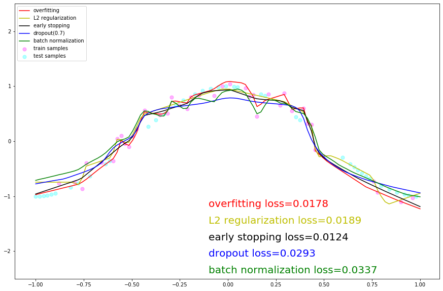

# 正则化实验

## 实验介绍

一般而言，正则化是为了防止过拟合或者帮助优化。本实验会给出几种神经网络中最受欢迎的正则化方法，以及用MindSpore实现：提前停止，L2正则化，dropout。此外该实验也增加了Batch Normalization（批标准化）方法进行对比实验。

通过构建加入噪音的cosine模型，加入各种正则化技术形成对比：

- 提前停止：当验证集的性能开始下降时停止训练。
- L2正则化是简单地将L2正则项"λ"$||\theta||_2^2$加在成本函数中。
- Dropout 是非常有用和成功的一种技术，会随机删除一些神经元，以在不同批量上训练不同的神经网络架构。
- Batch normalization就是通过一定的标准化手段，调整每层神经网络任意神经元的均值和方差，来避免由于不同神经元均值和方差相差过大导致训练网络时出现协变量偏移的问题。

## 实验目的

- 了解几种常用的正则化方法及其原理。
- 了解如何使用MindSpore进行正则化训练，并对比几种正则化方法的效果。

## 预备知识

- 熟练使用Python，了解Shell及Linux操作系统基本知识。
- 具备一定的深度学习理论知识，如卷积神经网络、损失函数、优化器，训练策略等。
- 了解华为云的基本使用方法，包括[OBS（对象存储）](https://www.huaweicloud.com/product/obs.html)、[ModelArts（AI开发平台）](https://www.huaweicloud.com/product/modelarts.html)、[Notebook（开发工具）](https://support.huaweicloud.com/engineers-modelarts/modelarts_23_0032.html)等服务。华为云官网：https://www.huaweicloud.com
- 了解并熟悉MindSpore AI计算框架，MindSpore官网：https://www.mindspore.cn

## 实验环境

- MindSpore 1.0.0（MindSpore版本会定期更新，本指导也会定期刷新，与版本配套）；
- 华为云ModelArts（控制台左上角选择“华北-北京四”）：ModelArts是华为云提供的面向开发者的一站式AI开发平台，集成了昇腾AI处理器资源池，用户可以在该平台下体验MindSpore；
- Windows/Ubuntu x64笔记本，NVIDIA GPU服务器，或Atlas Ascend服务器等。

## 实验准备

### 创建OBS桶

本实验需要使用华为云OBS存储脚本，可以参考[快速通过OBS控制台上传下载文件](https://support.huaweicloud.com/qs-obs/obs_qs_0001.html)了解使用OBS创建桶、上传文件、下载文件的使用方法（下文给出了操作步骤）。

> **提示：** 华为云新用户使用OBS时通常需要创建和配置“访问密钥”，可以在使用OBS时根据提示完成创建和配置。也可以参考[获取访问密钥并完成ModelArts全局配置](https://support.huaweicloud.com/prepare-modelarts/modelarts_08_0002.html)获取并配置访问密钥。

打开[OBS控制台](https://storage.huaweicloud.com/obs/?region=cn-north-4&locale=zh-cn#/obs/manager/buckets)，点击右上角的“创建桶”按钮进入桶配置页面，创建OBS桶的参考配置如下：

- 区域：华北-北京四
- 数据冗余存储策略：单AZ存储
- 桶名称：全局唯一的字符串
- 存储类别：标准存储
- 桶策略：公共读
- 归档数据直读：关闭
- 企业项目、标签等配置：免

### 创建Notebook

ModelArts Notebook资源池较小，且每个运行中的Notebook会一直占用Device资源不释放，不适合大规模并发使用（不使用时需停止实例，以释放资源）。可以参考[创建并打开Notebook](https://support.huaweicloud.com/engineers-modelarts/modelarts_23_0034.html)来创建并打开Notebook（下文给出了操作步骤）。

打开[ModelArts控制台-开发环境-Notebook](https://console.huaweicloud.com/modelarts/?region=cn-north-4#/notebook)，点击“创建”按钮进入Notebook配置页面，创建Notebook的参考配置：

- 计费模式：按需计费
- 名称：regularization
- 工作环境：公共镜像->Ascend-Powered-Engine
- 资源池：公共资源
- 类型：Ascend
- 规格：单卡1*Ascend 910
- 存储位置：对象存储服务（OBS）->选择上述新建的OBS桶中的regularization文件夹
- 自动停止：打开->选择1小时后（后续可在Notebook中随时调整）

> **注意：**
> - 在Jupyter Notebook/JupyterLab文件列表里，展示的是关联的OBS桶里的文件，并不在当前Notebook工作环境（容器）中，Notebook中的代码无法直接访问这些文件。
> - 打开Notebook前，选中文件列表里的所有文件/文件夹（实验脚本和数据集），并点击列表上方的“Sync OBS”按钮，使OBS桶中的所有文件同时同步到Notebook执行容器中，这样Notebook中的代码才能访问数据集。
>   - 使用Notebook时，可参考[与OBS同步文件](https://support.huaweicloud.com/engineers-modelarts/modelarts_23_0038.html)；
>   - 使用JupyterLab时，可参考[与OBS同步文件](https://support.huaweicloud.com/engineers-modelarts/modelarts_23_0336.html)。
>   - 同步文件的大小和数量超过限制时，请参考[MoXing常用操作示例](https://support.huaweicloud.com/moxing-devg-modelarts/modelarts_11_0005.html#section5)中的拷贝操作，将大文件（如数据集）拷贝到Notebook容器中。
> - Notebook/JupyterLab文件列表页面的“Upload/上传”功能，会将文件上传至OBS桶中，而不是Notebook执行容器中，仍需额外同步/拷贝。
> - 在Notebook里通过代码/命令（如`wget, git`、python`urllib, requests`等）获取的文件，存在于Notebook执行容器中，但不会显示在文件列表里。
> - 每个Notebook实例仅被分配了1个Device，如果在一个实例中打开多个Notebook页面（即多个进程），运行其中一个页面上的MindSpore代码时，请关闭其他页面的kernel，否则会出现Device被占用的错误。
> - Notebook运行中一直处于计费状态，不使用时，在Notebook控制台页面点击实例右侧的“停止”，以停止计费。停止后，Notebook里的内容不会丢失（已同步至OBS）。下次需要使用时，点击实例右侧的“启动”即可。可参考[启动或停止Notebook实例](https://support.huaweicloud.com/engineers-modelarts/modelarts_23_0041.html)。

打开Notebook后，选择MindSpore环境作为Kernel。

> **提示：** 
> - 上述数据集和脚本的准备工作也可以在Notebook环境中完成，在Jupyter Notebook文件列表页面，点击右上角的"New"->"Terminal"，进入Notebook环境所在终端，进入`work`目录，可以使用常用的linux shell命令，如`wget, gzip, tar, mkdir, mv`等，完成数据集和脚本的下载和准备。
> - 可将如下每段代码拷贝到Notebook代码框/Cell中，从上至下阅读提示并执行代码框进行体验。代码框执行过程中左侧呈现[\*]，代码框执行完毕后左侧呈现如[1]，[2]等。请等上一个代码框执行完毕后再执行下一个代码框。

## 实验步骤

作业基于上述打开的Notebook进行，进行作业前请确保完成了上述准备工作。如果Notebook资源不足，请参考[lenet5实验](../lenet5)将本Notebook转为训练作业，再行实验。

导入MindSpore模块和辅助模块：

```python
import random
import numpy as np
import matplotlib.pyplot as plt
import mindspore as ms

from mindspore import nn
from mindspore import context
from mindspore.common.initializer import Normal
from IPython.display import clear_output
%matplotlib inline

# set execution mode and device platform.
context.set_context(mode=context.GRAPH_MODE, device_target='Ascend')
```

设置超参和全局变量：

```python
N_SAMPLES = 40 # number of samples
BATCH_SIZE = 40
NOISE_RATE = 0.2
INPUT_DIM = 1
HIDDEN_DIM = 100 # number of units in one hidden layer
OUTPUT_DIM = 1
N_LAYERS = 6 # number of hidden layers
ITERATION = 1500
LEARNING_RATE = 0.003
DROPOUT_RATE = 0.7
WEIGHT_DECAY = 1e-4  # coefficient of L2 penalty
MAX_COUNT = 20  # max count that loss does not decrease. Used for early stop.
ACTIVATION = nn.LeakyReLU # activation function

#固定结果
def fix_seed(seed=1):
    # reproducible
    random.seed(seed)
    np.random.seed(seed)

# 小批量样本索引
def sample_idx(m, n):
    A = np.random.permutation(m)
    idx = A[:n]
    return idx
```

生成模拟cosine曲线的数据集，并对训练集施加噪声：

```python
fix_seed(5)
data_x = np.linspace(-1, 1, num=int(N_SAMPLES*2.5))[:, np.newaxis]
data_y = np.cos(np.pi*data_x)
p = np.random.permutation(len(data_x))

train_x, train_y = data_x[p[0:N_SAMPLES]], data_y[p[0:N_SAMPLES]]
test_x, test_y = data_x[p[N_SAMPLES:N_SAMPLES*2]], data_y[p[N_SAMPLES:N_SAMPLES*2]]
validate_x, validate_y = data_x[p[N_SAMPLES*2:]], data_y[p[N_SAMPLES*2:]]

noise = np.random.normal(0, NOISE_RATE, train_y.shape)
train_y += noise
```

定义模型，用于模拟cosine曲线：

```python
class CosineNet(nn.Cell):
    def __init__(self, batchnorm, dropout):
        super(CosineNet, self).__init__()
        layers = []
        if batchnorm:
            layers.append(nn.BatchNorm2d(INPUT_DIM))
        
        # initialize hidden layers
        for l_n in range(N_LAYERS):
            in_channels = HIDDEN_DIM if l_n > 0 else INPUT_DIM
            # Use 1x1Conv instead of Dense, which coordinate better with BatchNorm2d opetator;
            conv = nn.Conv2d(in_channels, HIDDEN_DIM, kernel_size=1, pad_mode='valid', has_bias=True, weight_init=Normal(0.01))
            layers.append(conv)
            if batchnorm:
                layers.append(nn.BatchNorm2d(HIDDEN_DIM))
            if dropout:
                layers.append(nn.Dropout(DROPOUT_RATE))
            layers.append(ACTIVATION())
        self.layers = nn.SequentialCell(layers)
        
        # initialize output layers
        self.flatten = nn.Flatten() # convert 4-dim tensor (N,C,H,W) to 2-dim tensor(N,C*H*W)
        self.fc = nn.Dense(HIDDEN_DIM, OUTPUT_DIM, weight_init=Normal(0.1), bias_init='zeros')
        
    def construct(x):
        # construct hidden layers
        x = self.layers(x)
        # construct output layers
        x = self.flatten(x)
        x = self.fc(x)
        return x
```

针对几种正则化方法，创建不同的训练任务：

```python
def build_fn(batchnorm, dropout, l2):
    # initilize the net, Loss, optimizer
    net = CosineNet(batchnorm=batchnorm, dropout=dropout)
    loss = nn.loss.MSELoss()
    opt = nn.optim.Adam(net.trainable_params(), learning_rate=LEARNING_RATE, weight_decay=WEIGHT_DECAY if l2 else 0.0)
    # Build a net with loss and optimizer.
    with_loss = nn.WithLossCell(net, loss)
    train_step = nn.TrainOneStepCell(with_loss, opt).set_train()
    return train_step, with_loss, net

# Build 5 different training jobs.
fc_train, fc_loss, fc_predict = build_fn(batchnorm=False, dropout=False, l2=False) # 默认任务
dropout_train, dropout_loss, dropout_predict = build_fn(batchnorm=False, dropout=True, l2=False) # 实验dropout功能
bn_train, bn_loss, bn_predict = build_fn(batchnorm=True, dropout=False, l2=False) # 实验batchnorm功能
l2_train, l2_loss, l2_predict = build_fn(batchnorm=False, dropout=False, l2=True) # 实验l2 regularization功能
early_stop_train, early_stop_loss, early_stop_predict = build_fn(batchnorm=False, dropout=False, l2=False) # 实验Early Stop功能

# Used for batchnorm, dropout and other operators to determine whether the net is in the train state or not.
nets_train = [fc_train, dropout_train, bn_train, l2_train, early_stop_train]
nets_loss = [fc_loss, dropout_loss, bn_loss, l2_loss, early_stop_loss]
nets_predict = [fc_predict, dropout_predict, bn_predict, l2_predict, early_stop_predict]

def set_train(nets, mode=True):
    for net in nets:
        net.set_train(mode=mode)
```

将数据转为4维，并转为MindSpore Tensor类型：

```python
# Convert the tensor shape from (N, C) to (N, C, H, W).
data_xt, data_yt = ms.Tensor(data_x.reshape(data_x.shape + (1, 1)), ms.float32), ms.Tensor(data_y, ms.float32)
test_xt, test_yt = ms.Tensor(test_x.reshape(test_x.shape + (1, 1)), ms.float32), ms.Tensor(test_y, ms.float32)
validate_xt, validate_yt = ms.Tensor(validate_x.reshape(validate_x.shape + (1, 1)), ms.float32), ms.Tensor(validate_y, ms.float32)
```

启动5个训练任务，并通过plot观察各模型拟合效果。因为同时启动5个任务，每个任务又有训练、计算loss、预测几个子任务，刚开始模型编译的时间较久。

```python
# Define parameters of Early Stop.
# If it is True, stop the training process.
early_stop = False
# Used to record min validation loss during training. Should be initialized with Big enough value.
min_val_loss = 1
# In the training iteration process, how many consecutive times are the validation loss greater than min_val_loss.
count = 0

for it in range(ITERATION):
    # In each iteration randomly selects a batch sample from the training set.
    mb_idx = sample_idx(N_SAMPLES, BATCH_SIZE)
    x_batch, y_batch = train_x[mb_idx, :], train_y[mb_idx, :]
    x_batch, y_batch = ms.Tensor(x_batch.reshape(x_batch.shape + (1, 1)), ms.float32), ms.Tensor(y_batch, ms.float32)
    
    # Set the nets to training state.
    set_train(nets_train, True)
    fc_train(x_batch, y_batch)
    dropout_train(x_batch, y_batch)
    bn_train(x_batch, y_batch)
    l2_train(x_batch, y_batch)
    # Skip the training for Early Stop model when early_step==True.
    if not early_stop:
        early_stop_train(x_batch, y_batch)
    
    if it % 20 == 0:
        # Set the nets to none training state.
        set_train(nets_loss+nets_predict, False)
        # Compute the test loss of all models.
        loss_fc = fc_loss(test_xt, test_yt)
        loss_dropout = dropout_loss(test_xt, test_yt)
        loss_bn = bn_loss(test_xt, test_yt)
        loss_l2 = l2_loss(test_xt, test_yt)
        loss_early_stop = early_stop_loss(test_xt, test_yt)
        
        # Compute the predict values on all samples. 
        all_fc = fc_predict(data_xt)
        all_dropout = dropout_predict(data_xt)
        all_bn = bn_predict(data_xt)
        all_l2 = l2_predict(data_xt)
        all_early_stop = early_stop_predict(data_xt)
        
        # For the Early Stop model, when the validation loss is greater than min_val_loss MAX_COUNT consecutive times,
        # stop the training process.
        if not early_stop:
            val_loss = early_stop_loss(validate_xt, validate_yt)
            if val_loss > min_val_loss:
                count += 1
            else:
                min_val_loss = val_loss
                count = 0
            
            if count == MAX_COUNT:
                early_stop = True
                print('='*10, 'early stopped', '='*10)
        
        # Draw the figure.
        plt.figure(1, figsize=(15,10))
        plt.cla()
        plt.scatter(train_x, train_y, c='magenta', s=50, alpha=0.3, label='train samples')
        plt.scatter(test_x, test_y, c='cyan', s=50, alpha=0.3, label='test samples')
        plt.plot(data_x, all_fc.asnumpy(), 'r', label='overfitting')
        plt.plot(data_x, all_l2.asnumpy(), 'y', label='L2 regularization')
        plt.plot(data_x, all_early_stop.asnumpy(), 'k', label='early stopping')
        plt.plot(data_x, all_dropout.asnumpy(), 'b', label='dropout({})'.format(DROPOUT_RATE))
        plt.plot(data_x, all_bn.asnumpy(), 'g', label='batch normalization')
        plt.text(-0.1, -1.2, 'overfitting loss=%.4f' % loss_fc.asnumpy(), fontdict={'size': 20, 'color': 'red'})
        plt.text(-0.1, -1.5, 'L2 regularization loss=%.4f' % loss_l2.asnumpy(), fontdict={'size': 20, 'color': 'y'})
        plt.text(-0.1, -1.8, 'early stopping loss=%.4f' % loss_early_stop.asnumpy(), fontdict={'size': 20, 'color': 'black'})
        plt.text(-0.1, -2.1, 'dropout loss=%.4f' % loss_dropout.asnumpy(), fontdict={'size': 20, 'color': 'blue'})
        plt.text(-0.1, -2.4, 'batch normalization loss=%.4f' % loss_bn.asnumpy(), fontdict={'size': 20, 'color': 'green'})

        plt.legend(loc='upper left');
        plt.ylim((-2.5, 2.5));
        clear_output(wait=True)
        plt.show()
```



## 实验结论

本实验构建了简单的模型用于模拟cosine曲线，引入了不同的正则化方法，通过对比不同方法的训练动态图，可以看到：

1. 带有dropout和l2正则化的两个模型在全量数据集上拟合的曲线更平滑，更接近真实的cosine曲线。
2. 不带任何正则化的模型以及带有batchnorm的两个模型对训练数据的拟合程度太高，曲线多曲折，属于过拟合现象。
3. 带有Early Stop的模型处于折中的状态。
