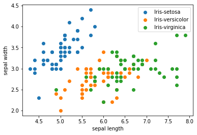

# Softmax回归

## 实验介绍

Softmax函数是Logistic函数的在多分类问题上的推广，本质上是将一个多维向量$Z$映射成另一个多维向量$\sigma(Z)$（维度不变），后者中每个元素的值在[0, 1]范围内，和为1。

$$ \sigma(Z_i) = \frac{\exp(Z_i)}{\sum_j \exp(Z_j)} $$

Logistic函数针对的是二分类问题，而Softmax解决的是多分类问题。Softmax多分类任务要求类与类之间互斥，即一个样本只能归于一个类。而基于Logistic实现的多分类任务（如One vs All）类别之间可以相交。Softmax函数也经常作为神经网络的输出层，进行多分类。本实验主要介绍使用MindSpore在多分类数据集上进行Softmax + CrossEntropy（交叉熵损失）实验。

## 实验目的

- 了解Softmax和交叉熵损失的基本概念；
- 了解如何使用MindSpore进行多分类实验。

## 预备知识

- 熟练使用Python。
- 具备一定的机器学习理论知识，如Softmax、交叉熵损失函数、优化器，训练策略等。
- 了解华为云的基本使用方法，包括[OBS（对象存储）](https://www.huaweicloud.com/product/obs.html)、[ModelArts（AI开发平台）](https://www.huaweicloud.com/product/modelarts.html)、[训练作业](https://support.huaweicloud.com/engineers-modelarts/modelarts_23_0046.html)等功能。华为云官网：https://www.huaweicloud.com
- 了解并熟悉MindSpore AI计算框架，MindSpore官网：https://www.mindspore.cn/

## 实验环境

- MindSpore 0.5.0（MindSpore版本会定期更新，本指导也会定期刷新，与版本配套）；
- 华为云ModelArts：ModelArts是华为云提供的面向开发者的一站式AI开发平台，集成了昇腾AI处理器资源池，用户可以在该平台下体验MindSpore。

## 实验准备

### 创建OBS桶

本实验需要使用华为云OBS存储脚本和数据集，可以参考[快速通过OBS控制台上传下载文件](https://support.huaweicloud.com/qs-obs/obs_qs_0001.html)了解使用OBS创建桶、上传文件、下载文件的使用方法。

> **提示：** 华为云新用户使用OBS时通常需要创建和配置“访问密钥”，可以在使用OBS时根据提示完成创建和配置。也可以参考[获取访问密钥并完成ModelArts全局配置](https://support.huaweicloud.com/prepare-modelarts/modelarts_08_0002.html)获取并配置访问密钥。

打开[OBS控制台](https://storage.huaweicloud.com/obs/?region=cn-north-4&locale=zh-cn#/obs/manager/buckets)，点击右上角的“创建桶”按钮进入桶配置页面，创建OBS桶的参考配置如下：

- 区域：华北-北京四
- 数据冗余存储策略：单AZ存储
- 桶名称：全局唯一的字符串
- 存储类别：标准存储
- 桶策略：公共读
- 归档数据直读：关闭
- 企业项目、标签等配置：免

### 数据准备

Iris数据集是模式识别最著名的数据集之一。数据集包含3类，每类50个实例，其中每个类都涉及一种鸢尾植物。 第一类与后两类可线性分离，后两类之间不能线性分离，所以本实验取前两类数据，做一个2分类数据集。Iris数据集的官网：[Iris Data Set](http://archive.ics.uci.edu/ml/datasets/Iris)。

- 方式一，从Iris数据集官网下载[iris.data文件](http://archive.ics.uci.edu/ml/machine-learning-databases/iris/iris.data)。
- 方式二，从华为云OBS中下载[iris.data文件](https://share-course.obs.cn-north-4.myhuaweicloud.com/dataset/iris.data)。

每个样本含有4个数值属性和一个类别属性：
1. sepal length in cm
2. sepal width in cm
3. petal length in cm
4. petal width in cm
5. class: 
    - Iris Setosa
    - Iris Versicolour
    - Iris Virginica

概括统计:

```
                 Min  Max   Mean    SD   Class Correlation
   sepal length: 4.3  7.9   5.84  0.83    0.7826   
    sepal width: 2.0  4.4   3.05  0.43   -0.4194
   petal length: 1.0  6.9   3.76  1.76    0.9490  (high!)
    petal width: 0.1  2.5   1.20  0.76    0.9565  (high!)
```

### 脚本准备

从[课程gitee仓库](https://gitee.com/mindspore/course)中下载本实验相关脚本。

### 上传文件

点击新建的OBS桶名，再打开“对象”标签页，通过“上传对象”、“新建文件夹”等功能，将脚本和数据集上传到OBS桶中，组织为如下形式：

```
softmax_regression
├── main.py
└── iris.data
```

## 实验步骤

### 代码梳理

导入MindSpore模块和辅助模块：

```python
import os
# os.environ['DEVICE_ID'] = '7'
import csv
import numpy as np

import mindspore as ms
from mindspore import nn
from mindspore import context
from mindspore import dataset
from mindspore.train.callback import LossMonitor

context.set_context(mode=context.GRAPH_MODE, device_target="Ascend")
```

读取Iris数据集`iris.data`，并作检查。

```python
with open('iris.data') as csv_file:
    data = list(csv.reader(csv_file, delimiter=','))
print(data[0:5]); print(data[50:55]); print(data[100:105]) # 打印部分数据
```

    [['5.1', '3.5', '1.4', '0.2', 'Iris-setosa'], ['4.9', '3.0', '1.4', '0.2', 'Iris-setosa'], ['4.7', '3.2', '1.3', '0.2', 'Iris-setosa'], ['4.6', '3.1', '1.5', '0.2', 'Iris-setosa'], ['5.0', '3.6', '1.4', '0.2', 'Iris-setosa']] 
    [['7.0', '3.2', '4.7', '1.4', 'Iris-versicolor'], ['6.4', '3.2', '4.5', '1.5', 'Iris-versicolor'], ['6.9', '3.1', '4.9', '1.5', 'Iris-versicolor'], ['5.5', '2.3', '4.0', '1.3', 'Iris-versicolor'], ['6.5', '2.8', '4.6', '1.5', 'Iris-versicolor']] 
    [['6.3', '3.3', '6.0', '2.5', 'Iris-virginica'], ['5.8', '2.7', '5.1', '1.9', 'Iris-virginica'], ['7.1', '3.0', '5.9', '2.1', 'Iris-virginica'], ['6.3', '2.9', '5.6', '1.8', 'Iris-virginica'], ['6.5', '3.0', '5.8', '2.2', 'Iris-virginica']]

数据集的3类样本共150条，将样本的4个属性作为自变量$X$，将样本的3个类别映射为{0, 1, 2}，作为因变量$Y$。

```python
label_map = {
    'Iris-setosa': 0,
    'Iris-versicolor': 1,
    'Iris-virginica': 2
}
X = np.array([[float(x) for x in s[:-1]] for s in data[:150]], np.float32)
Y = np.array([label_map[s[-1]] for s in data[:150]], np.int32)
```

取样本的前两个属性进行2维可视化，可以看到在前两个属性上其中一类和余下两类是线性可分的，而余下两类之间线性不可分。

```python
from matplotlib import pyplot as plt
plt.scatter(X[:50, 0], X[:50, 1], label='Iris-setosa')
plt.scatter(X[50:100, 0], X[50:100, 1], label='Iris-versicolor')
plt.scatter(X[100:, 0], X[100:, 1], label='Iris-virginica')
plt.xlabel('sepal length')
plt.ylabel('sepal width')
plt.legend()
```



将数据集按8:2划分为训练集和验证集：

```python
train_idx = np.random.choice(150, 120, replace=False)
test_idx = np.array(list(set(range(150)) - set(train_idx)))
X_train, Y_train = X[train_idx], Y[train_idx]
X_test, Y_test = X[test_idx], Y[test_idx]
```

使用MindSpore`GeneratorDataset`接口将numpy.ndarray类型的数据转换为Dataset：

```python
XY_train = list(zip(X_train, Y_train))
ds_train = dataset.GeneratorDataset(XY_train, ['x', 'y'])
ds_train.set_dataset_size(120)
ds_train = ds_train.shuffle(buffer_size=120).batch(32, drop_remainder=True)

XY_test = list(zip(X_test, Y_test))
ds_test = dataset.GeneratorDataset(XY_test, ['x', 'y'])
ds_test.set_dataset_size(30)
ds_test = ds_test.batch(30)
```

使用MindSpore提供的[`nn.Dense(1, 1)`算子](https://www.mindspore.cn/api/zh-CN/0.2.0-alpha/api/python/mindspore/mindspore.nn.html#mindspore.nn.Dense)作为线性部分，其中`(4, 3)`表示每个样本的输入是含4个元素的向量，输出是含3个元素的向量，即$W$是3x4的矩阵。算子会随机初始化权重$W$和偏置$b$。使用[`nn.loss.SoftMaxCrossEntropyWithLogits`算子](https://www.mindspore.cn/api/zh-CN/0.3.0-alpha/api/python/mindspore/mindspore.nn.html#mindspore.nn.SoftmaxCrossEntropyWithLogits)作为非线性部分：

对于每个样本$N_i$，模型的计算方式如下：

$$
Z_i = W \cdot X_i + b \\
P_i = \frac{\exp(Z_i)}{\sum_j \exp(Z_{ij})} \\
l(Z_i, Y_i) = -log\left(P_{iY_i}\right) = -log\left(\frac{\exp(Z_{iY_i})}{\sum_j \exp(Z_{ij})}\right) = -Z_{iY_i} + \log\left(\sum_j \exp(Z_ij)\right)
$$

其中，$X_i$是1D Tensor（含4个元素），$Z_i$是1D Tensor（含3个元素），$Y_i$是真实类别（3个类别{1, 2, 3}中的一个）,$P_i$是1D Tensor（含3个元素，每个元素表示属于相应类别的概率，值域为[0, 1]），$l(Z_i, Y_i)$是损失标量。

```python
net = nn.Dense(4, 3)
loss = nn.loss.SoftmaxCrossEntropyWithLogits(is_grad=False, sparse=True, reduction='mean')
opt = nn.optim.Momentum(net.trainable_params(), learning_rate=0.05, momentum=0.9)
```

使用训练集对模型进行若干代（Epoch）训练，然后计算模型在验证集上精度，验证集上的精度达到了0.96左右，即模型基本学会了区分3类鸢尾花。

```python
model = ms.train.Model(net, loss, opt, metrics={'acc', 'loss'})
model.train(25, ds_train, callbacks=[LossMonitor(per_print_times=ds_train.get_dataset_size())], dataset_sink_mode=False)
metrics = model.eval(ds_test)
print(metrics)
```

    epoch: 1 step 3, loss is 0.9914441108703613
    Epoch time: 15227.800, per step time: 5075.933, avg loss: 1.053
    ************************************************************
    epoch: 2 step 3, loss is 0.7714572548866272
    Epoch time: 8.709, per step time: 2.903, avg loss: 0.872
    ************************************************************
    epoch: 3 step 3, loss is 0.6451367735862732
    Epoch time: 6.033, per step time: 2.011, avg loss: 0.761
    ************************************************************
    epoch: 4 step 3, loss is 0.626476526260376
    Epoch time: 5.793, per step time: 1.931, avg loss: 0.578
    ************************************************************
    epoch: 5 step 3, loss is 0.530356764793396
    Epoch time: 5.858, per step time: 1.953, avg loss: 0.475
    ************************************************************
    
    ......
    
    epoch: 20 step 3, loss is 0.17989404499530792
    Epoch time: 5.808, per step time: 1.936, avg loss: 0.267
    ************************************************************
    epoch: 21 step 3, loss is 0.126459002494812
    Epoch time: 5.734, per step time: 1.911, avg loss: 0.229
    ************************************************************
    epoch: 22 step 3, loss is 0.15500077605247498
    Epoch time: 5.763, per step time: 1.921, avg loss: 0.194
    ************************************************************
    epoch: 23 step 3, loss is 0.1676429957151413
    Epoch time: 5.737, per step time: 1.912, avg loss: 0.178
    ************************************************************
    epoch: 24 step 3, loss is 0.23107928037643433
    Epoch time: 5.881, per step time: 1.960, avg loss: 0.165
    ************************************************************
    epoch: 25 step 3, loss is 0.19285285472869873
    Epoch time: 5.709, per step time: 1.903, avg loss: 0.156
    ************************************************************

    {'acc': 0.9333333333333333, 'loss': 0.23569035530090332}

### 适配训练作业

创建训练作业时，运行参数会通过脚本传参的方式输入给脚本代码，脚本必须解析传参才能在代码中使用相应参数。如data_url对应数据存储路径(OBS路径)，脚本对传参进行解析后赋值到`args`变量里，在后续代码里可以使用。

```python
import argparse
parser = argparse.ArgumentParser()
parser.add_argument('--data_url', required=True, default=None, help='Location of data.')
args, unknown = parser.parse_known_args()
```

MindSpore暂时没有提供直接访问OBS数据的接口，需要通过MoXing提供的API与OBS交互。将OBS中存储的数据拷贝至执行容器：

```python
import moxing
moxing.file.copy_parallel(src_url=os.path.join(args.data_url, 'iris.data'), dst_url='iris.data')
```

### 创建训练作业

可以参考[使用常用框架训练模型](https://support.huaweicloud.com/engineers-modelarts/modelarts_23_0238.html)来创建并启动训练作业。

打开[ModelArts控制台-训练管理-训练作业](https://console.huaweicloud.com/modelarts/?region=cn-north-4#/trainingJobs)，点击“创建”按钮进入训练作业配置页面，创建训练作业的参考配置：

- 算法来源：常用框架->Ascend-Powered-Engine->MindSpore
- 代码目录：选择上述新建的OBS桶中的softmax_regression目录
- 启动文件：选择上述新建的OBS桶中的softmax_regression目录下的`main.py`
- 数据来源：数据存储位置->选择上述新建的OBS桶中的softmax_regression目录，本实验使用其中的iris.data
- 训练输出位置：选择上述新建的OBS桶中的softmax_regression目录并在其中创建output目录
- 作业日志路径：同训练输出位置
- 规格：Ascend:1*Ascend 910
- 其他均为默认

启动并查看训练过程：

1. 点击提交以开始训练；
2. 在训练作业列表里可以看到刚创建的训练作业，在训练作业页面可以看到版本管理；
3. 点击运行中的训练作业，在展开的窗口中可以查看作业配置信息，以及训练过程中的日志，日志会不断刷新，等训练作业完成后也可以下载日志到本地进行查看；
4. 参考上述代码梳理，在日志中找到对应的打印信息，检查实验是否成功。

## 实验结论

本实验使用MindSpore实现了Softmax + CrossEntropy的多分类模型，用来解决3分类问题。在Iris数据集上进行训练后，所得的模型可以很好地对三类鸢尾花植物进行分类。
