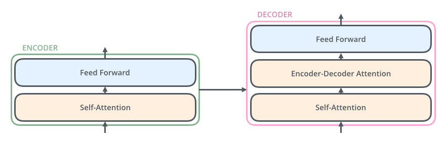
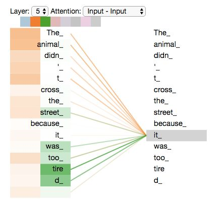
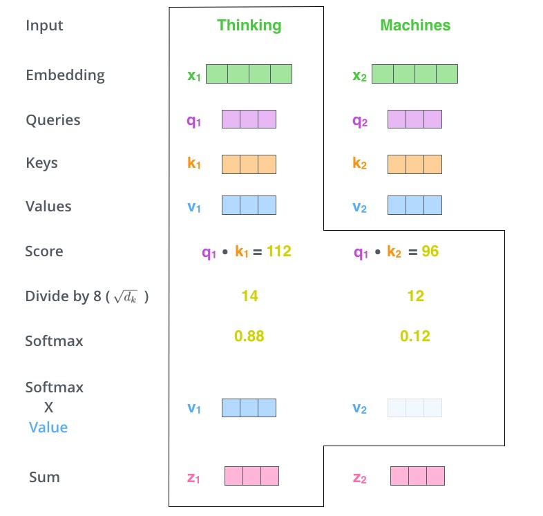
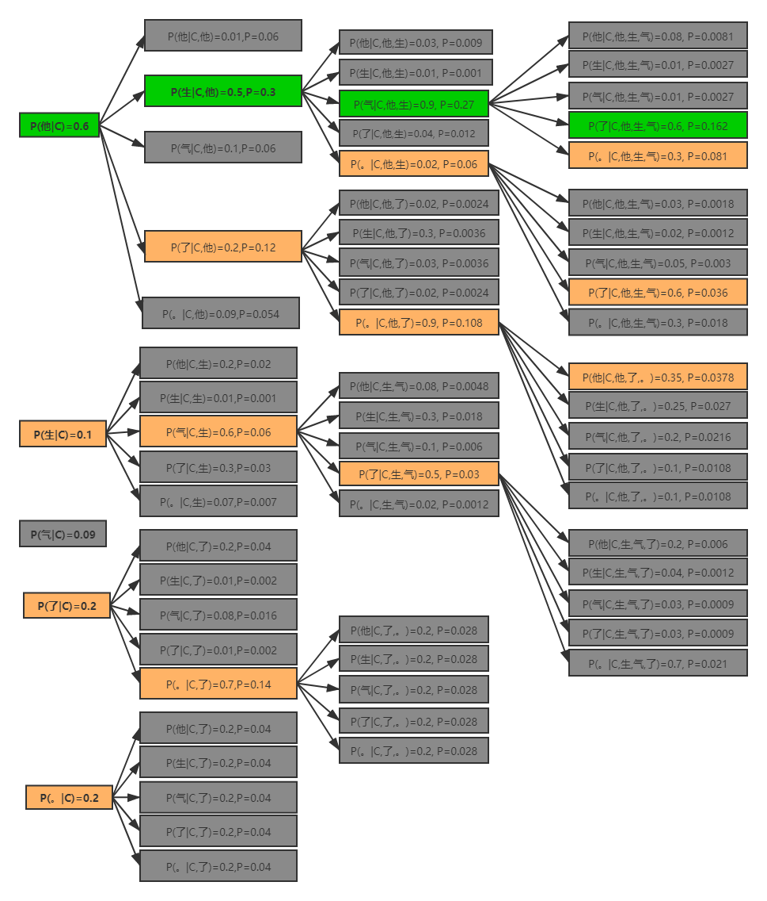
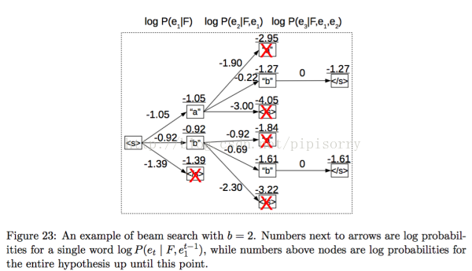

# Transformer网络实现英中翻译

## 实验介绍

本实验主要介绍使用MindSpore开发和训练Transformer模型。本实验实现了英中翻译任务。

## 实验目的

- 掌握Transformer模型的基本结构和编程方法。
- 掌握使用Transformer模型进行英中翻译。
- 了解MindSpore的model_zoo模块，以及如何使用model_zoo中的模型。

## 预备知识

- 熟练使用Python，了解Shell及Linux操作系统基本知识。
- 具备一定的深度学习和机器学习理论知识，如Embedding、Encoder、Decoder、损失函数、优化器，训练策略、Checkpoint等。
- 了解华为云的基本使用方法，包括[OBS（对象存储）](https://www.huaweicloud.com/product/obs.html)、[ModelArts（AI开发平台）](https://www.huaweicloud.com/product/modelarts.html)、[训练作业](https://support.huaweicloud.com/engineers-modelarts/modelarts_23_0238.html)等功能。华为云官网：https://www.huaweicloud.com
- 了解并熟悉MindSpore AI计算框架，MindSpore官网：https://www.mindspore.cn/

## 实验环境

- MindSpore 1.0.0（MindSpore版本会定期更新，本指导也会定期刷新，与版本配套）；
- 华为云ModelArts（控制台左上角选择“华北-北京四”）：ModelArts是华为云提供的面向开发者的一站式AI开发平台，集成了昇腾AI处理器资源池，用户可以在该平台下体验MindSpore。

## 实验准备

### 数据集准备

从华为云OBS中下载[中英翻译数据集](https://share-course.obs.cn-north-4.myhuaweicloud.com/dataset/cmn.zip)并解压。文件说明如下所示：

- ch_en_all.txt:  英中翻译原始预料，共23607条，每条都是一句英文对应一句中文。
- ch_en_vocab.txt：翻译词表，包括中文词和英文词，以及句子分割词。

### 脚本准备

从[课程gitee仓库](https://gitee.com/mindspore/course)上下载本实验相关脚本。

将脚本和数据集组织为如下形式：

```
transformer
└── data
│   ├── ch_en_all.txt
│   ├── ch_en_vocab.txt
└── code
       ├── bleu.ipynb
       ├── create_data.py
       ├── eval.py
       ├── train.py
       └── src
    	   └── 脚本等文件
```

### 创建OBS桶

使用ModelArts训练作业/Notebook时，需要使用华为云OBS存储实验脚本和数据集，可以参考[快速通过OBS控制台上传下载文件](https://support.huaweicloud.com/qs-obs/obs_qs_0001.html)了解使用OBS创建桶、上传文件、下载文件的使用方法（下文给出了操作步骤）。

> **提示：** 华为云新用户使用OBS时通常需要创建和配置“访问密钥”，可以在使用OBS时根据提示完成创建和配置。也可以参考[获取访问密钥并完成ModelArts全局配置](https://support.huaweicloud.com/prepare-modelarts/modelarts_08_0002.html)获取并配置访问密钥。

打开[OBS控制台](https://storage.huaweicloud.com/obs/?region=cn-north-4&locale=zh-cn#/obs/manager/buckets)，点击右上角的“创建桶”按钮进入桶配置页面，创建OBS桶的参考配置如下：

- 区域：华北-北京四
- 数据冗余存储策略：单AZ存储
- 桶名称：全局唯一的字符串
- 存储类别：标准存储
- 桶策略：公共读
- 归档数据直读：关闭
- 企业项目、标签等配置：免

### 上传文件

点击新建的OBS桶名，再打开“对象”标签页，通过“上传对象”、“新建文件夹”等功能，将脚本和数据集上传到OBS桶中。上传文件后，查看页面底部的“任务管理”状态栏（正在运行、已完成、失败），确保文件均上传完成。若失败请：

- 参考[上传对象大小限制/切换上传方式](https://support.huaweicloud.com/qs-obs/obs_qs_0008.html)，
- 参考[上传对象失败常见原因](https://support.huaweicloud.com/obs_faq/obs_faq_0134.html)。
- 若无法解决请[新建工单](https://console.huaweicloud.com/ticket/?region=cn-north-4&locale=zh-cn#/ticketindex/createIndex)，产品类为“对象存储服务”，问题类型为“桶和对象相关”，会有技术人员协助解决。

## 实验步骤

推荐使用ModelArts训练作业进行实验，适合大规模并发使用。若使用ModelArts Notebook，请参考[LeNet5](../lenet5)及[Checkpoint](../checkpoint)实验案例，了解Notebook的使用方法和注意事项。

实验步骤如下所示：

1. 运行create_data.py文件，生成训练测试需要的预处理文件。
2. 修改train_config.py配置文件，运行train.py，生成模型。
3. 修改eval_config.py配置文件，运行eval.py,生成预测结果。
4. 将预测结果文件传递给bleu.ipynb并运行，得到评测结果。

### 数据预处理(create_data.py)

create_data.py代码是对原始数据进行处理。主要处理有两个方面：

1. 按照8：2的比例分割为训练数据和测试数据。
2. 对照词表ch_en_vocab.txt将句子转换为token（词转换为数字id）。并保存为mindrecord格式。（词的行号对应token的id）

处理生成文件如下所示：

- source_train.txt: 训练数据集txt格式。包括中英对照。共18886条。
- source_test.txt:测试数据集txt格式。包括中英对照。共4721条。
- train.mindrecord：训练数据集mindrecord格式，本实验直接使用mindrecord格式数据进行训练。
- test.mindrecord：测试数据集mindrecord格式，本实验直接使用mindrecord格式数据进行测试。

mindrecord数据字段如下所示，以`Peace talks will begin next week.—和 平 会 谈 将 在 下 周 开 始 。`句子对为例。

- `source_sos_ids`: 添加句子开头标记后英文句子编码。例子：`<s> Peace talks will begin next week .`

`[1,7802,2301,131,1303,421,649,3,0,0,0,0,0,0,0,0,0,0,0,0,0,0,0,0,0,0,0,0,0,0,0,0,0,0,0,0,0,0,0,0]`

- `source_sos_mask`：添加句子开头标记后英文句子mask编码。例子：`<s> Peace talks will begin next week .`

`[1,1,1,1,1,1,1,1,0,0,0,0,0,0,0,0,0,0,0,0,0,0,0,0,0,0,0,0,0,0,0,0,0,0,0,0,0,0,0,0]`

- `source_eos_ids`：添加句子结束标记后英文句子编码。例子：`Peace talks will begin next week . </s>`

` [7802,2301,131,1303,421,649,3,2,0,0,0,0,0,0,0,0,0,0,0,0,0,0,0,0,0,0,0,0,0,0,0,0,0,0,0,0,0,0,0,0]`

- `source_eos_mask`：添加句子结束标记后英文句子mask编码。例子：`Peace talks will begin next week . </s>`

`[1,1,1,1,1,1,1,1,0,0,0,0,0,0,0,0,0,0,0,0,0,0,0,0,0,0,0,0,0,0,0,0,0,0,0,0,0,0,0,0]`

- `target_sos_ids`：添加句子开头标记后中文句子编码。例子：`<s> 和 平 会 谈 将 在 下 周 开 始 。`

`[1,126,916,42,558,395,20,84,323,102,362,4,0,0,0,0,0,0,0,0,0,0,0,0,0,0,0,0,0,0,0,0,0,0,0,0,0,0,0,0]`

- `target_sos_mask`：添加句子开头标记后中文句子mask编码。例子：`<s> 和 平 会 谈 将 在 下 周 开 始 。`

`[1,1,1,1,1,1,1,1,1,1,1,1,0,0,0,0,0,0,0,0,0,0,0,0,0,0,0,0,0,0,0,0,0,0,0,0,0,0,0,0]`

- `target_eos_ids`：添加句子结束标记后中文句子编码。例子：`<s> 和 平 会 谈 将 在 下 周 开 始 。`

`[126,916,42,558,395,20,84,323,102,362,4,2,0,0,0,0,0,0,0,0,0,0,0,0,0,0,0,0,0,0,0,0,0,0,0,0,0,0,0,0]`

- `target_eos_mask`：添加句子结束标记后中文句子mask编码。例子：`和 平 会 谈 将 在 下 周 开 始 。 </s>`

` [1,1,1,1,1,1,1,1,1,1,1,1,0,0,0,0,0,0,0,0,0,0,0,0,0,0,0,0,0,0,0,0,0,0,0,0,0,0,0,0]`

### 模型代码梳理

代码文件说明：

- train.py：训练代码入口文件；
- eval.py：测试代码入口文件；
- train_config.py：训练配置文件；
- eval_config.py：测试配置文件；
- transformer_model.py：transformer模型文件；
- transformer_for_train.py: 训练loss文件。
- beam_search.py: transformer模型解码文件
- lr_schedule.py：学习率文件
- weight_init.py：模型权重初始化文件

### 训练网络 (`transformer_model.py`)

训练网络代码梳理概况如下所示：

```
Class TransformerModel
- Class EmbeddingLookup                      # Embedding词向量编码
- Class EmbeddingPostprocessor               # Embedding位置向量编码
- Class CreateAttentionMaskFromInputMask      # 创建注意力机制mask
- Class TransformerEncoder                   # Transformer编码
    - Class EncoderCell（共循环6次EncoderCell（transformer_net_cfg.num_hidden_layers））
        - Class SelfAttention                 # 注意力机制
            - Class LayerPreprocess
                - nn.LayerNorm
            - Class MultiheadAttention        # 多头注意力机制（头数参考transformer_net_cfg.num_attention_heads）
            - Class LayerPostprocess           # 后处理（残差连接）
                - P.TensorAdd()
        - Class FeedForward                   # 前馈模块
            - Class LayerPreprocess           # 前处理（归一化）
            - nn.Dense
            - nn.Dense
            - Class LayerPostprocess           # 后处理（残差连接）
    - Class LayerPreprocess                    # 前处理（归一化）

- Class EmbeddingLookup(target_ids)           # Embedding词向量编码
- Class EmbeddingPostprocessor               # Embedding位置向量编码
- Class CreateAttentionMaskFromInputMask      # 创建注意力机制mask
- Class TransformerDecoder  
    - Class DecoderCell（共循环6次DecoderCell（transformer_net_cfg.num_hidden_layers））
        - Class SelfAttention(is_encdec_att=False)
            - Class LayerPreprocess       # 前处理
            - Class MultiheadAttention    # 多头注意力机制
            - Class LayerPostprocess      #后处理
        - Class SelfAttention(is_encdec_att=True)         # cross-attention
            - 略
        - Class FeedForward
            - 略
    - Class LayerPreprocess
    
- Class PredLogProbs                        # 获取log概率
```

transformer网络如下图所示，其中左边为编码网路，右边 为解码网络。（本实验图中N=6）


[1] 图片来源https://proceedings.neurips.cc/paper/2017/file/3f5ee243547dee91fbd053c1c4a845aa-Paper.pdf

Transformer训练网络重要变量维度介绍（只有部分变量）如下表所示，可参考后边的原理理解。

变量|维度|说明                             
:--:|:--:|:--:
TransformerModel输入source_ids |（32，40）|同数据预处理source_sos_ids
TransformerModel输入source_mask|（32，40）|同数据预处理source_sos_mask
TransformerModel输入target_ids|（32，40）|同数据预处理target_sos_ids
TransformerModel输入target_mask|（32，40）|同数据预处理target_sos_mask
TransformerTrainingLoss输入label_ids|（32，40）|同数据预处理target_eos_ids
TransformerTrainingLoss输入label_weights|（32，40）|同数据预处理target_eos_mask
EmbeddingLookup输出src_word_embeddings| (32,40,512) |单词embedding输出
EmbeddingLookup输出embedding_tables| (10067,512) |embedding表
EmbeddingPostprocessor输出src_embedding_output| (32,40,512) |位置embedding输出
CreateAttentionMaskFromInputMask输出enc_attention_mask|(32,40,40)|mask
TransformerEncoder输出encoder_output|(32,40,512）|编码网络输出
TransformerDecoder输出decoder_output             | (32,40,512） |解码网络输出（与测试不同）
PredLogProbs 输出decoder_output|(32*40,10067）| transormer网络输出

**解析：** 

- 表中32代表batch_size，40代表序列长度，512代表hidden_size，10067代表词表长度。
- 网络输出PredLogProbs为batch_size个样例的输出预测，预测长度为40，onehot形式。每个预测值都有10067个概率与之对应，代表输出为词表中每个词的概率。概率最大的为其输出。
- decoder_output与label_ids和label_weights比较得到loss值，从而更新梯度。

Transformer测试网络重要变量维度介绍（只有部分变量）如下表所示，可参考后边的原理理解。

变量|维度|说明                             
:--:|:--:|:--:
TransformerModel输入source_ids             |（32，40）|同数据预处理source_sos_ids
TransformerModel输入source_mask|（32，40）|同数据预处理source_sos_mask
TransformerModel输入target_ids|（32，40）|同数据预处理target_sos_ids
TransformerModel输入target_mask|（32，40）|同数据预处理target_sos_mask
TileBeam输出beam_encoder_output|（32*4，40，512）|解码输入
TileBeam输出beam_enc_attention_mask|（32*4，40，40）|解码输入
BeamSearchDecoder输出predicted_ids|(32，40）|解码输出

每一个编码器在结构上都是一样的，但它们的权重参数是不同的。每一个编码器里面，可以分为 2 层（Self-Attention 层、前馈神经网络）。输入编码器的文本数据，首先会经过一个 Self Attention 层，这个层处理一个词的时候，不仅会使用这个词本身的信息，也会使用句子中其他词的信息（可以类比为：当我们翻译一个词的时候，不仅会只关注当前的词，也会关注这个词的上下文的其他词的信息）。接下来，Self Attention 层的输出会经过前馈神经网络。同理，解码器也具有这两层，但是这两层中间还插入了一个 Encoder-Decoder Attention 层，这个层能帮助解码器聚焦于输入句子的相关部分（类似于 seq2seq 模型 中的 Attention）。



[2]图片来源https://blog.csdn.net/pipisorry/article/details/84946653

#### Embedding(EmbeddingLookup、EmbeddingPostprocessor)

Transformer的输入部分是个线性序列，每个词有两个embedding，如下所示。把单词对应的两个embedding叠加，就形成了Transformer的输入。

- 单词embedding（token）；
- 位置信息embedding，这是因为NLP中单词顺序是很重要的特征，需要在这里对位置信息进行编码；

Transformer模型并没有捕捉顺序序列的能力，也就是说无论句子的结构怎么打乱，Transformer都会得到类似的结果。换句话说，Transformer只是一个功能更强大的词袋模型而已。为了解决这个问题，论文中在编码词向量时引入了位置编码（Position Embedding）的特征。具体地说，位置编码会在词向量中加入了单词的位置信息，这样Transformer就能区分不同位置的单词了。

Transformer网络作者设计了位置编码（Position Embedding, PE）规则，编码规则如下所示：

$$ PE(pos, 2i) = sin(\frac{pos}{10000^{\frac{2i}{depth}}}) $$
$$ PE(pos, 2i + 1) = cos(\frac{pos}{10000^{\frac{2i}{depth}}}) $$

在上式中，pos表示单词的位置；depth为每个单词位置编码的维度，同单词embedding_size，本实验中是512；i为位置编码中元素的索引，因为奇数和偶数位置的值分别由sin和cos计算。
sin和cos的函数特性使得该位置编码方法可以适应无限长度的句子。关于位置编码的实现可在`transformer_model.py`中的position_encoding函数找到对应的代码。

该位置编码方式有以下优点：

1. 包含了词位置信息；
2. 在一定范围内的编码差异不依赖于文本的长度，具有一定的不变性；
3. 有值域的范围限制。

#### Self-Attention（Class MultiheadAttention）

self-attention，思想和attention类似，但是self-attention是作用在自身句子上的。使当前节点不仅仅只关注当前的词，同事关注上下文的单词，从而能获取到上下文的语义。我们看个例子：
The animal didn't cross the street because it was too tired
这里的it到底代表的是animal还是street呢，对于我们来说能很简单的判断出来，但是对于机器来说，是很难判断的，self-attention就能够让机器把it和animal联系起来。



[3]图片来源https://blog.csdn.net/longxinchen_ml/article/details/86533005

当我们编码“it”一词时，一个注意力头集中在“animal”上，而另一个则集中在“tired”上，从某种意义上说，模型对“it”一词的表达在某种程度上是“animal”和“tired”的代表。

self-attention详细的处理过程如下所示：（详细代码参考`transformer_model.py`中的`MultiheadAttention`类。）

1. 首先，self-attention会计算出三个新的向量：Query、Key、Value，这三个向量是用embedding向量与一个矩阵P相乘得到的结果，这个矩阵P是随机初始化的，其值在BP的过程中会一直进行更新。（矩阵P的维度=隐含层数/attention头数=512/8=64）
2. 计算self-attention的分数值，该分数值决定了当我们在某个位置encode一个词时，对输入句子的其他部分的关注程度。这个分数值的计算方法是Query与Key做点乘，以下图为例，首先我们需要针对Thinking这个词，计算出其他词对于该词的一个分数值，首先是针对于自己本身即q1·k1，然后是针对于第二个词即q1·k2。
3. 接下来，把点成的结果除以一个常数，本实验除以8，这个值一般是采用上文提到的矩阵P的第一个维度的开方即64的开方8，当然也可以选择其他的值，然后把得到的结果做一个softmax的计算。得到的结果即是每个词对于当前位置的词的相关性大小，当然，当前位置的词与自身的相关性会很大。
4. 下一步就是把Value和softmax得到的值进行相乘，并相加，得到的结果即是self-attetion在当前节点的值。

**注意：** 上面所有的计算过程都是分成多头来计算的。本例中的self-attention输入输出如下表所示。

名称|维度
:--:|:--:
输入矩阵:embedding向量|[batch_size,seq_length,hidden_size] (32,40,512)
矩阵P(单头)|[batch_size,seq_length,hidden_size/num_attention_heads] (32,512,64)(64=512/8)
Query（单头）|[batch_size,seq_length,hidden_size/num_attention_heads] (32,40,64)
Key（单头）|[batch_size,seq_length,hidden_size/num_attention_heads] (32,40,64)
Value（单头）|[batch_size,seq_length,hidden_size/num_attention_heads] (32,40,64)
Source（单头）|[batch_size,seq_length,hidden_size/num_attention_heads] (32,40,64)
输出矩阵(单头)|[batch_size,seq_length,hidden_size/num_attention_heads] (32,40,64）
输出矩阵(多头合并)|[batch_size,seq_length,hidden_size]  (32,40,512）

计算公式如下所示：

$$ Query = INPUT_{embedding} \cdot P_1 $$
$$ Key = INPUT_{embedding} \cdot P_2 $$
$$ Value = INPUT_{embedding} \cdot P_3 $$
$$ OUT = softmax(\frac{Query \cdot Key^T}{\sqrt{\frac{hiddenSize}{NumAttentionHeads}}}) * Value $$



[4] 图片来源https://zhuanlan.zhihu.com/p/47282410

### 测试网络梳理：(`transformer_model.py`和`beam_search.py`)

```
Class TransformerModel
- Class EmbeddingLookup(source_ids)           # Embedding词向量编码
- Class EmbeddingPostprocessor               # Embedding位置向量编码
- Class CreateAttentionMaskFromInputMask      # 创建注意力机制mask
- Class TransformerEncoder                   # Transformer编码
    - Class EncoderCell（共循环6次EncoderCell（transformer_net_cfg.num_hidden_layers））      
        - Class SelfAttention                 # 注意力机制
            - Class LayerPreprocess
            - nn.LayerNorm
            - Class MultiheadAttention        # 多头注意力机制（头数参考transformer_net_cfg.num_attention_heads）
            - Class LayerPostprocess           # 后处理（残差连接）
            - P.TensorAdd()
        - Class FeedForward                   # 前馈模块
            - Class LayerPreprocess           # 前处理（归一化）
            - nn.Dense
            - nn.Dense
            - Class LayerPostprocess           # 后处理（残差连接）
    - Class LayerPreprocess                    # 前处理（归一化）
    
- Class TileBeamen(ecoder_output)
- Class TileBeamen(enc_attention_mask)
- Class BeamSearchDecoder(beam_encoder_output, beam_enc_attention_mask)
```

#### beam search（`beam_search.py`）

Beam Search 是一种受限的宽度优先搜索方法，经常用在各种 NLP 生成类任务中，在机器翻译中，beam search算法在测试的时候用的，因为在训练过程中，每一个decoder的输出是有与之对应的正确答案做参照，也就不需要beam search去加大输出的准确率。

Transformer解码部分使用Beam Search。每个时刻它会保存b（beam size）个概率最大的选择作为当前的最佳选择，然后解码下一时刻时，继续选择和之前保存的b个选择组合起来后的概率最大的b个选择，依次循环迭代下去，直到编码结束。

如下从英文到中文的翻译：
英文：`He got angry .`
中文：`他 生 气 了 。`

- 英语的词汇表是a={He, got, angry, .}（全部转化为小写），长度为6。
- 中文的词汇表是b={他, 生, 气, 了, 。}，长度为5。

那么首先使用Transformer中的编码器对英文序列（记这个英文序列为X）进行编码，得到语义向量C。

得到语义向量C后，进入解码阶段，依次翻译成目标语言。在正式解码之前，有一个参数需要设置，那就是beam search中的beam size，这个参数就相当于top-k中的k，选择前k个最有可能的结果。在本例中，我们选择beam size=4。

1. 在给定语义向量C的情况下，求解码器的第一个输出$y_1$，首先选择中文词汇表中最有可能k个单词，也就是依次选择条件概率$P(b_i∣C) $前4(beam size)大对应的单词，比如这里概率最大的前四个单词依次是：[他，了，。，生]。

2. 接着生成第二个输出$y_2$，我们已经得到编码阶段的语义向量C，还有第一个输出$y_1$。此时有个问题，$y_1$有四个，怎么作为这一时刻的输入呢（解码阶段需要将前一时刻的输出作为当前时刻的输入），答案就是都试下，具体做法是：
   
    假设`他`为第一时刻的输出，将其作为第二时刻的输入，得到在已知(C,我) 的条件下，各个单词作为该时刻输出的条件概率 $P(b_i∣C, 他)$，前两个词翻译为{我，b_i}的概率为$P(我|C) P(y_2|C,我) $。同理可以假设`了`、`。`、`生`作为第一时刻的输出，得到前两个词翻译为{了，b_i}、{。，b_i}、{生，b_i}的概率。从这些概率中选择概率值top4的那四种组合。
    
3. 接下来要做的就是重复这个过程，逐步生成单词，直到遇到结束标识符停止。最后得到概率最大的那个生成序列。其概率为：

$$P(Y|C)=P(y_1|C)P(y_2|C,y_1),...,P(y_6|C,y_1,y_2,y_3,...,y_{max\\_position\\_embeddings})$$

其中`max_position_embeddings`参考train_config.py或eval_config.py中`transformer_net_cfg.max_position_embeddings`

以上就是Beam search算法的思想，当beam size=1时，就变成了贪心算法。Beam search算法例子过程如下图所示。其中橙色和绿色代表top-4路径。灰色代表淘汰路径，绿色代表最优路径。（以下例子max_position_embeddings为4）。



#### BeamSearchDecoder 

BeamSearchDecoder 定义了单步解码的操作，Beam Search Decoder是解码神经网络输出常用的一种方法，常应用在OCR、文本翻译、语音识别等算法应用中。 其目的是从神经网络生成的一个二维矩阵中计算概率最大的路径，此路径上的内容（字符）即网络要生成的目标。Beam Search搜索是为了解决贪心算法结果不准确的问题。其不止搜索一条概率最大路径，而是保存搜索的多条路径，最后再合并路径，去除占位符(blank)，以达到最优解。

在Transformer模型中，beam search的方法只用在测试的情况，因为在训练过程中，每一个decoder的输出是有正确答案的，也就不需要beam search去加大输出的准确率。
test的时候，假设词表大小为3，内容为a，b，c。beam size为2，decoder解码的时候：

1. 生成第1个词的时候，选择概率最大的2个词，假设为a,c,那么当前序列就是a,c

2. 生成第2个词的时候，我们将当前序列a和c，分别与词表中的所有词进行组合，得到新的6个序列aa ab ac ca cb cc,然后从其中选择2个得分最高的，作为当前序列，假如为aa cb

3. 后面会不断重复这个过程，直到遇到结束符为止。最终输出2个得分最高的序列。



注意：这里面的具体做法是每次将beam size个结果再分别输入到decoder中得到不同路径。这是beam search基础算法在decoder中应用时的具体做法。

### 参数设定

预处理数据配置：create_data.py / cfg

```python
cfg = edict({
        'input_file': './data/ch_en_all.txt',
        'vocab_file': './data/ch_en_vocab.txt',
        'train_file_mindrecord': './path_cmn/train.mindrecord',
        'eval_file_mindrecord': './path_cmn/test.mindrecord',
        'train_file_source': './path_cmn/source_train.txt',
        'eval_file_source': './path_cmn/source_test.txt',
        'num_splits':1,
        'clip_to_max_len': False,
        'max_seq_length': 40
})
```

训练配置：train_config.py / cfg

```python
cfg = edict({
    #--------------------------------------network config---------------
    'transformer_network': 'base',
    'init_loss_scale_value': 1024,
    'scale_factor': 2,
    'scale_window': 2000,

    'lr_schedule': edict({
        'learning_rate': 1.0,
        'warmup_steps': 8000,
        'start_decay_step': 16000,
        'min_lr': 0.0,
    }),
    #-----------------------------------save model config-------------
    'enable_save_ckpt': True ,        #Enable save checkpoint, default is true.
    'save_checkpoint_steps':590,   #Save checkpoint steps, default is 590.
    'save_checkpoint_num':2,     #Save checkpoint numbers, default is 2.
    'save_checkpoint_path': './checkpoint',    #Save checkpoint file path,default is ./checkpoint/
    'save_checkpoint_name':'transformer-32_40',
    'checkpoint_path':'',     #Checkpoint file path
    
    #-------------------------------device config----------------------
    'enable_data_sink':False,   #Enable data sink, default is False.
    'device_id':0,
    'device_num':1,
    'distribute':False,
    
    # -----------------same as the dataset-----------------------
    'seq_length':40,
    'vocab_size':10067,
    
    #-------------------------------------------------------------------
    'data_path':"./data/train.mindrecord",   #Data path
    'epoch_size':15,
    'batch_size':32,
    'max_position_embeddings':40,
    'enable_lossscale': False,  #Use lossscale or not, default is False.
    'do_shuffle':True     #Enable shuffle for dataset, default is True.
})
```

测试文件配置：eval_config.py / cfg

```python
cfg = edict({
    'transformer_network': 'base',
    
    'data_file': './data/test.mindrecord',
    'test_source_file':'./data/source_test.txt',
    'model_file': './ckpt/transformer-32_40-15_590.ckpt' ,
    'vocab_file':'./data1/ch_en_vocab.txt',
    'token_file': './token-32-40.txt',
    'pred_file':'./pred-32-40.txt',
    
    # ----------------same as the train config and the datsset---
    'seq_length':40,
    'vocab_size':10067,

    #-------------------------------------eval config-------------------
    'batch_size':32,
    'max_position_embeddings':40       # same as the train config
})

```
>**说明：** 
>
>1. 测试配置参数`seq_length`、`max_position_embeddings`、`vocab_size`必须与训练配置相同
>2. 参数`vocab_size`、`seq_length`与数据集统一。本实验给定的数据集`seq_length=40`（与source_train.txt、source_test.txt文件英/中最长长度相同）、`vocab_size=10067`(与vocab文件行数相同)
>3. 参数`max_position_embeddings`的值大于或等于`seq_length`

`schema_file` 控制输入样本个数的。为`.json`格式，如下所示。其中input_ids、segment_ids、input_mask、label_ids代表四个输入字段。type、rank、shape代表各个字段的类型、开始rank、数据维度。

### 测试

循环测试数据进行预测，生成过程对每个测试的数据都会把待翻译语言句子和`batch_size`个预测的句子打印输出比对；核心代码如下。

```python
tfm_model = TransformerModel(config=transformer_net_cfg, is_training=False, use_one_hot_embeddings=False)
    print(cfg.model_file)
    parameter_dict = load_weights(cfg.model_file)
    load_param_into_net(tfm_model, parameter_dict)
    tfm_infer = TransformerInferCell(tfm_model)
    model = Model(tfm_infer)
    
    tokenizer = tokenization.WhiteSpaceTokenizer(vocab_file=cfg.vocab_file)
    dataset = load_test_data(batch_size=cfg.batch_size, data_file=cfg.data_file)
    predictions = []
    source_sents = []
    target_sents = []
    f = open(cfg.token_file, 'w', encoding='utf-8')
    f1 = open(cfg.pred_file, 'w', encoding='utf-8')
    f2 = open(cfg.test_source_file, 'r', encoding='utf-8')
    for batch in dataset.create_dict_iterator():
        source_sents.append(batch["source_eos_ids"])
        target_sents.append(batch["target_eos_ids"])
        source_ids = Tensor(batch["source_eos_ids"], mstype.int32)
        source_mask = Tensor(batch["source_eos_mask"], mstype.int32)
        predicted_ids = model.predict(source_ids, source_mask)
        #predictions.append(predicted_ids.asnumpy())
        # ----------------------------------------decode and write to file(token file)---------------------
        batch_out = predicted_ids.asnumpy()
        for i in range(transformer_net_cfg.batch_size):
            if batch_out.ndim == 3:
                batch_out = batch_out[:, 0]
            token_ids = [str(x) for x in batch_out[i].tolist()]
            print(" ".join(token_ids))
            token=" ".join(token_ids)
            f.write(token + "\n")
            #-------------------------------token_ids to real output file-------------------------------
            token_ids = [int(x) for x in token.strip().split()]
            tokens = tokenizer.convert_ids_to_tokens(token_ids)
            sent = " ".join(tokens)
            sent = sent.split("<s>")[-1]
            sent = sent.split("</s>")[0]
            print(sent.strip())
            f1.write(f2.readline().strip()+'\t')
            f1.write(sent.strip()+'\n')
    f.close()
    f1.close()
    f2.close()
```

### 适配训练作业

创建训练作业时，运行参数会通过脚本传参的方式输入给脚本代码，脚本必须解析传参才能在代码中使用相应参数。如data_url和train_url，分别对应数据存储路径(OBS路径)和训练输出路径(OBS路径)。脚本对传参进行解析后赋值到args变量里，在后续代码里可以使用。（以测试为例）

```python
parser = argparse.ArgumentParser(description='Transformer testing')
    parser.add_argument('--data_url', required=True, default=None, help='Location of pre data.')   
    parser.add_argument('--train_url', required=True, default=None, help='Location of training outputs.')
    parser.add_argument('--ckpt_url', required=True, default=None, help='Location of model.') 
    parser.add_argument('--data_source', required=True, default=None, help='Location of source data.') 
args_opt = parser.parse_args()
```

MindSpore暂时没有提供直接访问OBS数据的接口，需要通过ModelArts自带的moxing框架与OBS交互。将OBS桶中的数据拷贝至执行容器中，供MindSpore使用：

```python
import moxing as mox
# src_url形如's3://OBS/PATH'，为OBS桶中数据集的路径，dst_url为执行容器中的路径
mox.file.copy_parallel(src_url=args_opt.data_url, dst_url='./data/')
mox.file.copy_parallel(src_url=args_opt.ckpt_url, dst_url='./ckpt/')
mox.file.copy_parallel(src_url=args_opt.data_source, dst_url='./data1/')
```

如需将训练输出（如模型Checkpoint）从执行容器拷贝至OBS，请参考：

```python
# src_url形如's3://OBS/PATH'，为OBS桶中数据集的路径，dst_url为执行容器中的路径
import moxing as mox
# src_url为执行容器中的路径，dst_url形如's3://OBS/PATH'，目录若不存在则会新建
mox.file.copy_parallel(src_url=cfg.token_file, dst_url=os.path.join(out_url,cfg.token_file))
mox.file.copy_parallel(src_url=cfg.pred_file, dst_url=os.path.join(out_url,cfg.pred_file))
```

### 创建训练作业

可以参考[使用常用框架训练模型](https://support.huaweicloud.com/engineers-modelarts/modelarts_23_0238.html)来创建并启动训练作业。

打开[ModelArts控制台-训练管理-训练作业](https://console.huaweicloud.com/modelarts/?region=cn-north-4#/trainingJobs)，点击“创建”按钮进入训练作业配置页面，创建训练作业的参考配置：

- 算法来源：常用框架->Ascend-Powered-Engine->MindSpore；
- 代码目录：选择上述新建的OBS桶中的transformer/code目录；
- 启动文件：选择上述新建的OBS桶中的transformer/code目录下的`create_data.py`(预处理数据)，`train.py`（训练），`eval.py`（测试）；
- 数据来源：数据存储位置->选择上述新建的OBS桶中的transformer目录下的data目录（预处理数据），data_pre目录(训练)，data_pre目录（测试）；
- 训练输出位置：选择上述新建的OBS桶中的bert目录并在其中创建data_pre(预处理数据)，model目录（训练），eval_out目录（测试）；
- 测试需要添加运行参数ckpt_url，设值为`s3://{user-obs}/transformer/model`。运行参数data_source，设值为`s3://{user-obs}/transformer/data`
- 作业日志路径：同训练输出位置；
- 规格：Ascend:1*Ascend 910；
- 其他均为默认；

启动并查看训练过程：

1. 点击提交以开始训练；
2. 在训练作业列表里可以看到刚创建的训练作业，在训练作业页面可以看到版本管理；
3. 点击运行中的训练作业，在展开的窗口中可以查看作业配置信息，以及训练过程中的日志，日志会不断刷新，等训练作业完成后也可以下载日志到本地进行查看；
4. 参考上述代码梳理，在日志中找到对应的打印信息，检查实验是否成功；
5. 在日志中无错误且训练作业显示运行成功，即运行成功；

### 评测

本是按采用BLEU指标评测翻译结果。BLEU算法的思想就是机器翻译的译文越接近人工翻译的结果，它的翻译质量就越高。所以评测算法就是如何定义机器翻译译文与参考译文之间的相似度。

本实验采用自然语言工具包nltk中的sentence_bleu进行翻译结果评测（BLEU值计算）。评测代码见bleu.ipynb文件。

打开bleu.ipynb文件。如下所示

```python
! pip install nltk   #安装nltk工具包

# --------------评测------------------
import moxing
moxing.file.copy_parallel(src_url='s3://{user-obs}/transformer/eval_out/', dst_url='./eval')
moxing.file.copy_parallel(src_url='s3://{user-obs}/transformer/data_pre/', dst_url='./train')

from nltk.translate.bleu_score import sentence_bleu

f = open('./eval/pred-32-40.txt', 'r', encoding='utf-8')
dic_rel={}
dic_pre={}
for line in f:
    line = line.strip().split('\t')
    if line[0] not in dic_rel:
        dic_rel[line[0]]=[line[1].split()]
    else:
        dic_rel[line[0]].append(line[1].split())
    if line[0] not in dic_pre:
        dic_pre[line[0]]=[line[2].split()]
    else:
        dic_pre[line[0]].append(line[2].split())
f.close()

f1 = open('./train/source_train.txt')
for l in f1:
    line = l.strip().split('\t')
    if line[0] in dic_rel:
        dic_rel[line[0]].append(line[1].split())
f1.close()

score=0
index=0
for en in dic_rel:  
    reference = dic_rel[en]
    print(reference)
    for candidate in dic_pre[en]:
        index += 1
        print(candidate)
        score_singe = sentence_bleu(reference, candidate)
        print(score_singe)
        score += score_singe
score_mean = score/index
print('BLUE_mean:',score_mean)
```
**说明：** 

1. `pred-32-40.txt`文件为测试输出预测结果。
2. `source_train.txt`文件为原始训练集文件。

## 实验结果

实验结果如下所示，只展示测试和评测结果。

测试翻译结果如下所示（pred.txt），其中第一列为英文输入，第二列为标准翻译答案，第三列为模型预测输出。（测试输出保存了测试输出的token值和测试结果，这里不展示token值文件）

```
Hi .	你 好 。	嗨 ！
Run .	你 用 跑 的 。	拼 命 地 拼 命 地 址 。
I won !	我 赢 了 。	我 赢 得 了 ！
No way !	不 可 能 ！	没 有 路 ！
Try it .	试 试 吧 。	再 试 一 次 。
Why me ?	为 什 么 是 我 ？	为 什 么 我 ？
Be kind .	友 善 点 。	一 切 点 。
Get Tom .	找 到 汤 姆 。	汤 姆 走 了 。
Go home .	回 家 吧 。	回 家 。
Help me .	帮 我 一 下 。	随 时 帮 我 吃 吧 。
Hold on .	坚 持 。	停 下 来 。
Hug Tom .	抱 抱 汤 姆 ！	请 抱 歉 。
Shut up !	闭 嘴 ！	起 床 ！
...
...
She hit him .	她 打 了 他 。	她 被 他 撞 了 。
That ' s mine .	那 是 我 的 。	那 是 我 的 。
This is ice .	这 是 冰 块 。	这 太 冰 了 。
Tom got fat .	汤 姆 变 胖 了 。	汤 姆 胖 得 很 胖 。
Tom ' ll wait .	汤 姆 会 等 。	汤 姆 会 等 。
Tom ' s happy .	汤 姆 高 兴 。	汤 姆 很 快 乐 。
Wait for me .	等 等 我 。	等 我 。
We know him .	我 们 认 识 他 。	我 们 知 道 他 。
We want Tom .	我 们 想 要 汤 姆 。	我 们 想 要 汤 姆 。
What a pity !	太 可 惜 了 ！	多 遗 憾 啊 ！
What a pity !	多 遗 憾 啊 ！	多 遗 憾 啊 ！
Where ' s Tom ?	汤 姆 在 哪 儿 ？	汤 姆 在 哪 里 ？
You ' re mine .	你 是 我 的 。	你 是 我 的 。
You ' re sick !	你 有 病 ！	你 病 了 。
...
...
It ' s hard to believe that Tom wasn ' t aware that Mary was in love with him .	真 难 相 信 汤 姆 不 知 道 玛 丽 爱 他 。	很 难 相 信 汤 姆 是 不 知 道 玛 丽 爱 他 。
I don ' t mind lending you the money provided you pay it back within a month .	假 如 能 一 个 月 之 内 还 上 的 话 ， 我 可 以 把 钱 借 给 你 。	我 不 介 意 你 在 一 个 月 把 钱 接 受 一 下 来 的 钱 包 院 。
```

评测结果如下所示：

```
BLUE_mean:0.2540798544123031
```

## 实验结论

本实验主要介绍使用MindSpore实现Transformer网络，实现英中翻译任务。分析原理和结果可得：

- Transformer网络对翻译任务有效。
- Transformer网络测试采用循环测试（一个一个词测试），所以测试编译需要时间较长。
- 从结果分析，对于一词多义翻译较难。