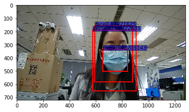

# Yolov3网络实现目标检测

## 实验介绍

本实验主要介绍使用MindSpore开发和训练Yolov3模型。本实验实现了目标检测（人、脸、口罩）。

## 实验目的

- 掌握Yolov3模型的基本结构和编程方法。
- 掌握使用Yolov3模型进行目标检测。
- 了解MindSpore的model_zoo模块，以及如何使用model_zoo中的模型。

## 预备知识

- 熟练使用Python，了解Shell及Linux操作系统基本知识。
- 具备一定的深度学习和机器学习理论知识，如NMT、resnet网络、损失函数、优化器，训练策略、Checkpoint等。
- 了解华为云的基本使用方法，包括[OBS（对象存储）](https://www.huaweicloud.com/product/obs.html)、[ModelArts（AI开发平台）](https://www.huaweicloud.com/product/modelarts.html)、[训练作业](https://support.huaweicloud.com/engineers-modelarts/modelarts_23_0238.html)等功能。华为云官网：https://www.huaweicloud.com
- 了解并熟悉MindSpore AI计算框架，MindSpore官网：https://www.mindspore.cn/

## 实验环境

- MindSpore 1.0.0（MindSpore版本会定期更新，本指导也会定期刷新，与版本配套）；
- 华为云ModelArts（控制台左上角选择“华北-北京四”）：ModelArts是华为云提供的面向开发者的一站式AI开发平台，集成了昇腾AI处理器资源池，用户可以在该平台下体验MindSpore。

## 实验准备

### 创建OBS桶

本实验需要使用华为云OBS存储脚本和数据集，可以参考[快速通过OBS控制台上传下载文件](https://support.huaweicloud.com/qs-obs/obs_qs_0001.html)了解使用OBS创建桶、上传文件、下载文件的使用方法。

> **提示：** 华为云新用户使用OBS时通常需要创建和配置“访问密钥”，可以在使用OBS时根据提示完成创建和配置。也可以参考[获取访问密钥并完成ModelArts全局配置](https://support.huaweicloud.com/prepare-modelarts/modelarts_08_0002.html)获取并配置访问密钥。

打开[OBS控制台](https://storage.huaweicloud.com/obs/?region=cn-north-4&locale=zh-cn#/obs/manager/buckets)，点击右上角的“创建桶”按钮进入桶配置页面，创建OBS桶的参考配置如下：

- 区域：华北-北京四
- 数据冗余存储策略：单AZ存储
- 桶名称：如ms-course
- 存储类别：标准存储
- 桶策略：公共读
- 归档数据直读：关闭
- 企业项目、标签等配置：免

### 数据集准备

从[这里](https://modelarts-labs.obs.cn-north-1.myhuaweicloud.com/codelab/mask_detection/mask_detection_500.tar.gz)下载目标检测所需要的数据集。文件说明如下所示：

- train: 训练数据集.
  - *.jpg: 训练集图片
  - *.xml：训练集标签
- test: 测试数据集.
  - *.jpg: 测试集图片
  - *.xml：测试集标签

数据集包含三类，分别为：人（person），脸（face）、口罩（mask）

### 脚本准备

从[课程gitee仓库](https://gitee.com/mindspore/course)上下载本实验相关脚本。

### 上传文件

点击新建的OBS桶名，再打开“对象”标签页，通过“上传对象”、“新建文件夹”等功能，将脚本和数据集上传到OBS桶中，组织为如下形式：

```
yolov3
└── data
│   ├── train
│   └── test
└── code
    └── 脚本等文件
```

## 实验步骤

### 代码梳理

代码文件说明：

- main.ipynb：训练和测试入口文件；
- config.py：配置文件；
- yolov3.py : yolov3网络定义文件；
- dataset.py:  数据预处理文件；
- utils.py: 工具类文件；

实验流程：

1. 修改main.ipynb 训练cell参数并运行，得到模型文件。
2. 修改main.ipynb 测试cell参数并运行，得到可视化结果。

### 数据预处理（dataset.py）

数据预处理过程如下所示：

1. 图片和框裁剪和resize到网络设定输入图片尺寸([352,640])得到images
2. 求框和锚点之间的iou值，将框和锚点对应。
3. 将框、可信度、类别对应在网格中，得到bbox_1、gt_box2、bbox_3。
4. 将网格中框单独拿出来，得到gt_box1、gt_box2、gt_box3

数据预处理结果可以直接用于训练和测试。预处理结果解析如下所示。

训练输入数据解析：

名称|维度|描述
:--:|:--:|:--:
images|(32, 3, 352, 640)|图片[batch_size,channel,weight,height]
bbox_1|(11, 20, 3, 8)|大框在大网格（32*32）映射 [grid_big,grid_big,num_big,label]
bbox_2|(22, 40, 3, 8)|中框在中网格（16*16）映射 [grid_middle,grid_big,num_middle,label]
bbox_3|(44, 80, 3, 8)|小框在小网格（16*16）映射 [grid_small,grid_small,num_small,label]
gt_box1|(50, 4)|大框
gt_box2|(50, 4)|中框
gt_box3|(50, 4)|小框

测试数据解析：

名称|维度
:--:|:--:
images|(1, 3, 352, 640)
shape|图片尺寸，例如：[ 720 1280]
anno|真实框[xmin,ymin,xmax,ymax]

### 参数设定

网络参数设定（src/config.py）：

```python
class ConfigYOLOV3ResNet18:
    """
    Config parameters for YOLOv3.

    Examples:
        ConfigYoloV3ResNet18.
    """
    img_shape = [352, 640]
    feature_shape = [32, 3, 352, 640]
    num_classes = 3
    nms_max_num = 50

    backbone_input_shape = [64, 64, 128, 256]
    backbone_shape = [64, 128, 256, 512]
    backbone_layers = [2, 2, 2, 2]
    backbone_stride = [1, 2, 2, 2]

    ignore_threshold = 0.5
    obj_threshold = 0.3
    nms_threshold = 0.4

    anchor_scales = [(5,3),(10, 13), (16, 30),(33, 23),(30, 61),(62, 45),(59, 119),(116, 90),(156, 198)]
    out_channel = int(len(anchor_scales) / 3 * (num_classes + 5))
```

train.py / cfg

```python
cfg = edict({
    "distribute": False,
    "device_id": 0,
    "device_num": 1,
    "dataset_sink_mode": True,

    "lr": 0.001,
    "epoch_size": 90,
    "batch_size": 32,
    "loss_scale" : 1024,

    "pre_trained": None,
    "pre_trained_epoch_size":0,

    "ckpt_dir": "./ckpt",
    "save_checkpoint_epochs" :1,
    'keep_checkpoint_max': 1,

    "data_url": 's3://yyq-2/DATA/code/yolov3/mask_detection_500',
    "train_url": 's3://yyq-2/DATA/code/yolov3/yolov3_out/',
}) 
```

## 实验结果

### 训练日志

```
Start create dataset!
Create Mindrecord.
Create Mindrecord Done, at ./data/mindrecord/train
The epoch size:  15
Create dataset done!
Start train YOLOv3, the first epoch will be slower because of the graph compilation.
epoch: 10 step: 15, loss is 215.95618
epoch: 20 step: 15, loss is 147.80356
epoch: 30 step: 15, loss is 106.00204
epoch: 40 step: 15, loss is 101.95938
epoch: 50 step: 15, loss is 70.30449
epoch: 60 step: 15, loss is 63.806183
```

### 测试结果

测试日志如下所示：

```
Create Mindrecord.
Create Mindrecord Done, at ./data/mindrecord/test
Start Eval!
Load Checkpoint!
========================================
total images num:  8
Processing, please wait a moment.
```

取其中一张图片结果如下所示：



## 结论

本实验主要介绍使用MindSpore实现Yolov3网络，实现目标检测。分析原理和结果可得：

- Yolov3网络对目标检测任务有效。
- Yolov3网络对大目标检测比小目标检测结果好。
- Yolov3网络对于不同目标需要选取合适的anchor_scales值。