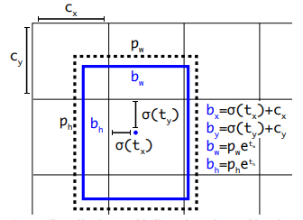

# Yolov3网络实现目标检测

## 实验介绍

本实验主要介绍使用MindSpore开发和训练Yolov3模型。本实验实现了目标检测（人、脸、口罩）。

## 实验目的

- 掌握Yolov3模型的基本结构和编程方法。
- 掌握使用Yolov3模型进行目标检测。
- 了解MindSpore的model_zoo模块，以及如何使用model_zoo中的模型。

## 预备知识

- 熟练使用Python，了解Shell及Linux操作系统基本知识。
- 具备一定的深度学习和机器学习理论知识，如NMT、resnet网络、损失函数、优化器，训练策略、Checkpoint等。
- 了解华为云的基本使用方法，包括[OBS（对象存储）](https://www.huaweicloud.com/product/obs.html)、[ModelArts（AI开发平台）](https://www.huaweicloud.com/product/modelarts.html)、[训练作业](https://support.huaweicloud.com/engineers-modelarts/modelarts_23_0238.html)等功能。华为云官网：https://www.huaweicloud.com
- 了解并熟悉MindSpore AI计算框架，MindSpore官网：https://www.mindspore.cn/

## 实验环境

- MindSpore 1.0.0（MindSpore版本会定期更新，本指导也会定期刷新，与版本配套）；
- 华为云ModelArts（控制台左上角选择“华北-北京四”）：ModelArts是华为云提供的面向开发者的一站式AI开发平台，集成了昇腾AI处理器资源池，用户可以在该平台下体验MindSpore。

## 实验准备

### 创建OBS桶

本实验需要使用华为云OBS存储脚本和数据集，可以参考[快速通过OBS控制台上传下载文件](https://support.huaweicloud.com/qs-obs/obs_qs_0001.html)了解使用OBS创建桶、上传文件、下载文件的使用方法。

> **提示：** 华为云新用户使用OBS时通常需要创建和配置“访问密钥”，可以在使用OBS时根据提示完成创建和配置。也可以参考[获取访问密钥并完成ModelArts全局配置](https://support.huaweicloud.com/prepare-modelarts/modelarts_08_0002.html)获取并配置访问密钥。

打开[OBS控制台](https://storage.huaweicloud.com/obs/?region=cn-north-4&locale=zh-cn#/obs/manager/buckets)，点击右上角的“创建桶”按钮进入桶配置页面，创建OBS桶的参考配置如下：

- 区域：华北-北京四
- 数据冗余存储策略：单AZ存储
- 桶名称：如ms-course
- 存储类别：标准存储
- 桶策略：公共读
- 归档数据直读：关闭
- 企业项目、标签等配置：免

### 数据集准备

从[这里](https://modelarts-labs.obs.cn-north-1.myhuaweicloud.com/codelab/mask_detection/mask_detection_500.tar.gz)下载目标检测所需要的数据集。文件说明如下所示：

- train: 训练数据集.
  - *.jpg: 训练集图片
  - *.xml：训练集标签
- test: 测试数据集.
  - *.jpg: 测试集图片
  - *.xml：测试集标签

数据集包含三类，分别为：人（person），脸（face）、口罩（mask）

### 脚本准备

从[课程gitee仓库](https://gitee.com/mindspore/course)上下载本实验相关脚本。

### 上传文件

点击新建的OBS桶名，再打开“对象”标签页，通过“上传对象”、“新建文件夹”等功能，将脚本和数据集上传到OBS桶中，组织为如下形式：

```
yolov3
└── data
│   ├── train
│   └── test
└── code
    └── 脚本等文件
```

## 实验步骤

### 代码梳理

代码文件说明：

- main.ipynb：训练和测试入口文件；
- config.py：配置文件；
- yolov3.py : yolov3网络定义文件；
- dataset.py:  数据预处理文件；
- utils.py: 工具类文件；

实验流程：

1. 修改main.ipynb 训练cell参数并运行，得到模型文件。
2. 修改main.ipynb 测试cell参数并运行，得到可视化结果。

### 数据预处理（dataset.py）

数据预处理包括：

- 原始数据格式整理，将原始图片和xml标签处理为mindrecord格式
- mindrecord格式数据处理，将mindrecord格式的原始数据处理为网络需要的数据特征。

#### 原始数据格式处理（dataset.py / data_to_mindrecord_byte_image）

前面已经介绍原始数据*.jpg为图像数据，图像尺寸不固定。*.xml：训练集标签为标签数据，里面包含了框和框的类别。

*.xml标签数据解析如下所示：

图片描述：包括图片路径（folder）、名字（filename）

```xml
<?xml version="1.0"?>
-<annotation>
    <folder>02-03_video01_frames</folder>
    <filename>02-02_video12-frame-00249.jpg</filename>
    <path>D:\EI Projects\1 项目交流\园区 未戴口罩识别\戴口罩监控视频\02-03\02-03_video01_frames\02-02_video12-frame-00249.jpg</path>
    -<source>
        <database>Unknown</database>
    </source>
```

图片尺寸：包括图片宽度（width）、高度（height）、通道数（depth）

```xml
-<size>
<width>1920</width>
<height>1080</height>
<depth>3</depth>
</size>
```

物体框：包括名字（name）、姿势（pose）、是否被截断(truncated)、是否为难样本（difficult）、框（bndbox）

- 其中框字段中包含左下角x坐标（xmin)、左下角y坐标（ymin）、左上角x坐标（xmax)、左上角y坐标（ymax）
- 其中名字（name）可选项为：人（person）、脸（face）、带口罩（mask）

```xml
<segmented>0</segmented>
-<object>
    <name>person</name>
    <pose>Unspecified</pose>
    <truncated>0</truncated>
    <difficult>0</difficult>
    -<bndbox>
        <xmin>335</xmin>
        <ymin>402</ymin>
        <xmax>587</xmax>
        <ymax>615</ymax>
    </bndbox>
</object>
```

dataset.py中data_to_mindrecord_byte_image函数将原始数据处理为mindrecord格式。字段解析如下所示：

- `image`: 原始图片
- `annotation`: 标签，numpy格式，维度：N*5，其中N代表哦框数。5分别表示： [xmin,ymin,xmax,ymax,class] 
- `file`: 图像文件名，为后期可视化存储原始图。

其中标签annotation获取方式如下所示：

```python
for i in all_files:
    if (i[-3:]=='jpg' or i[-4:]=='jpeg') and i not in image_dict:
        image_files.append(i)
        label=[]
        xml_path = os.path.join(image_dir,i[:-3]+'xml')
        if not os.path.exists(xml_path):
            label=[[0,0,0,0,0]]
            image_dict[i]=label
            continue
        DOMTree = xml.dom.minidom.parse(xml_path)
        collection = DOMTree.documentElement
        # 在集合中获取所有框
        object_ = collection.getElementsByTagName("object")
        for m in object_:
            temp=[]
            name = m.getElementsByTagName('name')[0]
            class_num = label_id[name.childNodes[0].data]
            bndbox = m.getElementsByTagName('bndbox')[0]
            xmin = xy_local(bndbox,'xmin')
            ymin = xy_local(bndbox,'ymin')
            xmax = xy_local(bndbox,'xmax')
            ymax = xy_local(bndbox,'ymax')
            temp.append(int(xmin))
            temp.append(int(ymin))
            temp.append(int(xmax))
            temp.append(int(ymax))
            temp.append(class_num)
            label.append(temp)
        image_dict[i]=label
```

#### mindrecord数据处理（dataset.py / create_yolo_dataset）

mindrecord数据预处理过程如下所示，参考dataset.py / preprocess_fn

1. 图片和框裁剪和resize到网络设定输入图片尺寸([352,640])得到images
2. 求框和锚点之间的iou值，将框和锚点对应。
3. 将框、可信度、类别对应在网格中，得到bbox_1、gt_box2、bbox_3。
4. 将网格中框单独拿出来，得到gt_box1、gt_box2、gt_box3。

**注意：** 

- 本实验一张图片最多框数量设定为50，故最多可以保存50个框。
- 本实验网格采用大（ $ 32 * 32 $ ）、中（ $ 16 * 16 $ ）、小（ $ 8 * 8 $ ）网格。选取9组锚点，其中包括3个大框、3个中框、3个小框。3个大框锚点采用大网格映射，3个中框采用中网格映射，3个小框采用小网格映射。
- 训练图片进行了增强。增强方式包括：随机裁剪噪声、翻转、扭曲。

#### 图片和框resize

本实验将图片都统一为[352,640]进行训练和测试。

测试图片改变尺寸使用传统的先裁剪后resize方式，在保证图片不失真的情况下改变图片尺寸。具体做法如下所示，参考dataset.py / _infer_data。

```python
w, h = img_data.size
input_h, input_w = input_shape
scale = min(float(input_w) / float(w), float(input_h) / float(h))
nw = int(w * scale)
nh = int(h * scale)
img_data = img_data.resize((nw, nh), Image.BICUBIC)

new_image = np.zeros((input_h, input_w, 3), np.float32)
new_image.fill(128)
img_data = np.array(img_data)
if len(img_data.shape) == 2:
    img_data = np.expand_dims(img_data, axis=-1)
    img_data = np.concatenate([img_data, img_data, img_data], axis=-1)
dh = int((input_h - nh) / 2)
dw = int((input_w - nw) / 2)
new_image[dh:(nh + dh), dw:(nw + dw), :] = img_data
new_image /= 255.
new_image = np.transpose(new_image, (2, 0, 1))
new_image = np.expand_dims(new_image, 0)
```

**解析：**

- 变量scale为真实边和设定边（[352,640]）的最小比例。为了保证图片不失真，长宽采取相同的放缩比例。
- 将图片resize为(nw, nh)后，预设定图片尺寸（[352,640]）不同，需要进行填充。填充采用两边填充。即将resize后的(nw, nh)大小图片放在（[352,640]）中间，两边填充像素值128。
- 测试框不需要做任何处理。

训练图片改变尺寸在传统的先裁剪后resize方式的基础上添加了随机噪声。使图片在失真范围内带有更多的原始图片信息。具体做法如下所示，参考dataset.py / _data_aug。

```python
iw, ih = image.size
h, w = image_size
while True:
    # Prevent the situation that all boxes are eliminated
    new_ar = float(w) / float(h) * _rand(1 - jitter, 1 + jitter) / \
    _rand(1 - jitter, 1 + jitter)
    scale = _rand(0.25, 2)

    if new_ar < 1:
        nh = int(scale * h)
        nw = int(nh * new_ar)
    else:
    nw = int(scale * w)
    nh = int(nw / new_ar)

    dx = int(_rand(0, w - nw))
    dy = int(_rand(0, h - nh))
    
    if len(box) >= 1:
        t_box = box.copy()
        np.random.shuffle(t_box)
        t_box[:, [0, 2]] = t_box[:, [0, 2]] * float(nw) / float(iw) + dx
        t_box[:, [1, 3]] = t_box[:, [1, 3]] * float(nh) / float(ih) + dy
        if flip:
            t_box[:, [0, 2]] = w - t_box[:, [2, 0]]
        t_box[:, 0:2][t_box[:, 0:2] < 0] = 0
        t_box[:, 2][t_box[:, 2] > w] = w
        t_box[:, 3][t_box[:, 3] > h] = h
        box_w = t_box[:, 2] - t_box[:, 0]
        box_h = t_box[:, 3] - t_box[:, 1]
        t_box = t_box[np.logical_and(box_w > 1, box_h > 1)]  # discard invalid box

    if len(t_box) >= 1:
        box = t_box
        break

box_data[:len(box)] = box
# resize image
image = image.resize((nw, nh), Image.BICUBIC)
# place image
new_image = Image.new('RGB', (w, h), (128, 128, 128))
new_image.paste(image, (dx, dy))
image = new_image
```

**解析：**

- 变量h,w为设定图片大小（[352,640]），变量iw, ih为原始图片大小。
- 变量scale为尺度的意思，在（0.25，2）比例尺度范围内获取多尺度特征。得到新的图片大小nh或者nw，nh和nw想不与h，w带有不同尺度特征。
- 变量jitter控制随机噪声大小。变量new_ar定义如下所示，在宽高比$\frac{float(w)}{float(h)}$的基础上乘以一个1左右的随机数。随机数为$\frac{\_rand(1 - jitter, 1 + jitter)}{\_rand(1 - jitter, 1 + jitter)}$。通过改变new_ar从而改变resize后的图片大小(nw, nh)。带有噪声的图片(nw, nh)在一定范围内失真，失真比例由jitter控制

$$
new\_ar = \frac{float(w)}{float(h)} *  \frac{\_rand(1 - jitter, 1 + jitter)}{\_rand(1 - jitter, 1 + jitter)}
$$

- 变量dx和dy代表噪声大小。
- 对图片和框进行相同的裁剪和resize操作，操作方式将大小为(nw, nh)的图片填充到（w,h）的dx,dy位置。其他位置用128填充。
- box_data维度为[50,5]，其中50代表每张图片最多框数设定。5代表[xmin,ymin,xmax,ymax,class] 。通过修改config.py文件的nms_max_num大小，可以修改最大框数量。但是最大框数量必须比所有真实数据图片的最大框数大，否则制作数据集过程会引文box数量过多报错。
- 得到的变量images为预处理结果，可以直接输入网络训练。得到的变量box_data需要进一步传入函数_preprocess_true_boxes中进行锚点和网格银色，集体参考下一步框预处理。

#### 训练框预处理（框、锚点、网格映射，bbox计算）


```python
num_layers = anchors.shape[0] // 3
anchor_mask = [[6, 7, 8], [3, 4, 5], [0, 1, 2]]
true_boxes = np.array(true_boxes, dtype='float32')
input_shape = np.array(in_shape, dtype='int32')
boxes_xy = (true_boxes[..., 0:2] + true_boxes[..., 2:4]) // 2.
boxes_wh = true_boxes[..., 2:4] - true_boxes[..., 0:2]
true_boxes[..., 0:2] = boxes_xy / input_shape[::-1]
true_boxes[..., 2:4] = boxes_wh / input_shape[::-1]

grid_shapes = [input_shape // 32, input_shape // 16, input_shape // 8]
y_true = [np.zeros((grid_shapes[l][0], grid_shapes[l][1], len(anchor_mask[l]),
5 + num_classes), dtype='float32') for l in range(num_layers)]
anchors = np.expand_dims(anchors, 0)
anchors_max = anchors / 2.
anchors_min = -anchors_max

valid_mask = boxes_wh[..., 0] >= 1

wh = boxes_wh[valid_mask]

if len(wh) >= 1:
    wh = np.expand_dims(wh, -2)
    boxes_max = wh / 2.
    boxes_min = -boxes_max
    
    intersect_min = np.maximum(boxes_min, anchors_min)
    intersect_max = np.minimum(boxes_max, anchors_max)
    intersect_wh = np.maximum(intersect_max - intersect_min, 0.)
    intersect_area = intersect_wh[..., 0] * intersect_wh[..., 1]
    box_area = wh[..., 0] * wh[..., 1]
    anchor_area = anchors[..., 0] * anchors[..., 1]
    iou = intersect_area / (box_area + anchor_area - intersect_area)

    best_anchor = np.argmax(iou, axis=-1)

    for t, n in enumerate(best_anchor):
        for l in range(num_layers):
            if n in anchor_mask[l]:
                i = np.floor(true_boxes[t, 0] * grid_shapes[l][1]).astype('int32')
                j = np.floor(true_boxes[t, 1] * grid_shapes[l][0]).astype('int32')
                k = anchor_mask[l].index(n)
                c = true_boxes[t, 4].astype('int32')
                y_true[l][j, i, k, 0:4] = true_boxes[t, 0:4]
                y_true[l][j, i, k, 4] = 1.
                y_true[l][j, i, k, 5 + c] = 1.
```

**解析： ** 

- true_boxes为上一步结果box_data，具体请参照上一个解析。
- num_layers为锚点层数，本实验，将锚点分为三个层次。分别为大框，中框，小框。
- anchor_mask为锚点编号。config.py中的anchor_scales为锚点。根据标签框的大小来设定。
- boxes_xy代表框的中心点坐标，boxes_wh代表框的宽高。
- grid_shapes为网格，其中包含大网格（大框使用），中网格（中框使用），小网格（小框使用）。大框尺寸为 $ 32 * 32 $ ，中框尺寸为 $16 * 16$ ，小框尺寸为 $8 * 8$ 。网格维度分别为大框[11,20] ，中框[22,40] ，小框[44,80]（注：  $ 11 = \frac{352}{32}  $     $ 20 = \frac{640}{32}  $  $  22 = \frac{640}{16}  $   $  40 = \frac{640}{16}  $   $  44 =  \frac{352}{8}  $   $  80 = \frac{640}{8}  $  ）
- y_true为已经映射到锚点、网格的框。y_true[0]为大框映射，维度为[11, 20, 3, 8]  ，y_true[1]为中框映射，维度为[22, 40, 3, 8]  ，  y_true[2]为小框映射，维度为[44, 80, 3, 8] 。 第2个维度3代表每个层次有几个框。本实验大框、中框、小框层都是有三个框对应。第3个维度8代表标签值，分别代表[boxes_xy,boxes_wh, Confidence(置信度)，class(one-hot值，person、face、mask)]
- 映射方式如下所示。

框映射到锚点和网格流程如下：

1. 将输入boxes_xy和boxes_wh的值放缩到0-1范围内。

```python
true_boxes[..., 0:2] = boxes_xy / input_shape[::-1]
true_boxes[..., 2:4] = boxes_wh / input_shape[::-1]
```

2. 将锚点中心点放缩到（0，0）点，并扩展维度。最后得到anchors_max和anchors_min维度为[1,9,2]，其中 anchors_min 代表框中心点放缩到（0，0）点以后的左下角坐标。anchors_max 代表框中心点放缩到（0，0）点以后的右上角坐标。

```python
anchors = np.expand_dims(anchors, 0)
anchors_max = anchors / 2.
anchors_min = -anchors_max
```

3. 将boxes_wh中心点放缩到（0，0点），并扩展维度。最后得到boxes_max和boxes_min维度为[num_box,1,2]。其中 boxes_min 代表框中心点放缩到（0，0）点以后的左下角坐标。boxes_max 代表框中心点放缩到0-1以后的右上角坐标。

```python
valid_mask = boxes_wh[..., 0] >= 1
wh = boxes_wh[valid_mask]
wh = np.expand_dims(wh, -2)
boxes_max = wh / 2.
boxes_min = -boxes_max
```

4. 分别求每个框和9个锚点的交集宽和高。具体求法为：
    - 计算 anchors_min 和anchors_min的最大值 intersect_min，intersect_min为交集左下角坐标
    - 计算 anchors_max 和 boxes_max 的最小值 intersect_max， intersect_max为交集右上角坐标
    - 计算交集宽高为：intersect_wh = intersect_max - intersect_min

```
intersect_min = np.maximum(boxes_min, anchors_min)
intersect_max = np.minimum(boxes_max, anchors_max)
intersect_wh = np.maximum(intersect_max - intersect_min, 0.)
```

5、分别求每个框和9个锚点的iou值。iou为交并比。其中交集面积为intersect_area，并集面积为(box_area + anchor_area - intersect_area)。iou维度为[num_box, 9]，其中9代表9个锚点

```python
intersect_area = intersect_wh[..., 0] * intersect_wh[..., 1]
box_area = wh[..., 0] * wh[..., 1]
anchor_area = anchors[..., 0] * anchors[..., 1]
iou = intersect_area / (box_area + anchor_area - intersect_area)
```

6、对于每个框，选出最大iou值对应的锚点编号。

```python
best_anchor = np.argmax(iou, axis=-1)
```

7、将true_boxes映射到锚点编号、网格中。其中y_true的解析参考前面解析。y_true即数据预处理结果bbox_1、bbox_2、bbox_3。矩阵数据范围为0-1（参考步骤1放缩）。

**解析：** 将锚点和真实框放缩到（0，1）的目标是保证其中心点统一。锚点是没有中心点的。所有网格点都有锚点。这种放缩可以快速定位目标框属于哪个锚点（网格化以后的锚点，以小尺度为例子有 $ 11 * 20 * 3 $ 个锚点）。

```python
 for t, n in enumerate(best_anchor):
     for l in range(num_layers):
         if n in anchor_mask[l]:
             i = np.floor(true_boxes[t, 0] * grid_shapes[l][1]).astype('int32')
             j = np.floor(true_boxes[t, 1] * grid_shapes[l][0]).astype('int32')
             k = anchor_mask[l].index(n)
             c = true_boxes[t, 4].astype('int32')
             y_true[l][j, i, k, 0:4] = true_boxes[t, 0:4]
             y_true[l][j, i, k, 4] = 1.
             y_true[l][j, i, k, 5 + c] = 1.
```


#### 框预处理（框、锚点、网格映射，gt_box 计算）

gt_box 维度为[50,4]，存放了所有的y_true中的框，忽略网格和锚点信息。gt_box 即数据预处理结果gt_box1、gt_box2、gt_box3。矩阵数据范围为0-1。

```python
mask0 = np.reshape(y_true[0][..., 4:5], [-1])
gt_box0 = np.reshape(y_true[0][..., 0:4], [-1, 4])
gt_box0 = gt_box0[mask0 == 1]
pad_gt_box0[:gt_box0.shape[0]] = gt_box0

mask1 = np.reshape(y_true[1][..., 4:5], [-1])
gt_box1 = np.reshape(y_true[1][..., 0:4], [-1, 4])
gt_box1 = gt_box1[mask1 == 1]
pad_gt_box1[:gt_box1.shape[0]] = gt_box1

mask2 = np.reshape(y_true[2][..., 4:5], [-1])
gt_box2 = np.reshape(y_true[2][..., 0:4], [-1, 4])
gt_box2 = gt_box2[mask2 == 1]
pad_gt_box2[:gt_box2.shape[0]] = gt_box2
```

#### 预处理结果展示

数据预处理结果可以直接用于训练和测试。预处理结果解析如下所示。

网络训练输入数据（训练预处理结果）解析：

名称|维度|描述
:--:|:--:|:--:
images|(32, 3, 352, 640)|图片[batch_size,channel,weight,height]
bbox_1|(11, 20, 3, 8)|大框在大尺度（32*32）映射 [grid_big,grid_big,num_big,label]
bbox_2|(22, 40, 3, 8)|中框在中尺度（16*16）映射 [grid_middle,grid_big,num_middle,label]
bbox_3|(44, 80, 3, 8)|小框在小尺度（8*8）映射 [grid_small,grid_small,num_small,label]
gt_box1|(50, 4)|大框
gt_box2|(50, 4)|中框
gt_box3|(50, 4)|小框

网络测试输入数据（测试预处理结果）解析：

名称|维度及说明
:--:|:--:
images|图片：(1, 3, 352, 640)
shape|图片尺寸，例如：（ 720 1280）
anno|真实框[xmin,ymin,xmax,ymax]

### yolov3训练网络结构

yolov3网络结构如下所示：

```
- class YoloWithLossCell(x, y_true_0, y_true_1, y_true_2, gt_0, gt_1, gt_2)
    #----------------------------yolov3网络------------------------------------
    - class yolov3_resnet18(x)
        #------------------------特征映射---------------------------------
        - class YOLOv3                        
            - class ResNet -> feature_map1, feature_map2, feature_map3
            - class YoloBlock(feature_map3) -> con1, big_object_output
            
            - def _conv_bn_relu(con1) ->con1
            - P.ResizeNearestNeighbor(con1) ->ups1      # upsample1
            - P.Concat((ups1, feature_map2)) -> con1
            - class YoloBlock(con1) -> con2, medium_object_output
            
            - def _conv_bn_relu(con2) ->con2
            - P.ResizeNearestNeighbor(con2) ->ups2      # upsample2
            - P.Concat((ups2, feature_map1)) -> con3
            - class YoloBlock(con3) -> _, small_object_output
            
            - return big_object_output,medium_object_output,small_object_output
        #--------------------检测--------------------------------
        - class DetectionBlock('l', self.config)(big_object_output)
            - 略，详见后续检测部分。
            - if self.training:
                  return grid, prediction, box_xy, box_wh
              return box_xy, box_wh, box_confidence, box_probs
        - class DetectionBlock('m', self.config)(medium_object_output)
            - 略
        - class DetectionBlock('s', self.config)(small_object_output)
            - 略
    #----------------------loss计算-----------------------------------
    - class YoloLossBlock('l', self.config)
        - 详见loss计算
    - class YoloLossBlock('m', self.config)
        - 略
    - class YoloLossBlock('s', self.config)
        - 略
```

#### 特征提取（class YOLOv3）

特征提取是yolov3网络的第一步，本实验使用resnet网络提取特征，分别提取到特征feature_map1、feature_map2、feature_map3。然后使用卷积网络和上采样将特征和锚点对应。得到big_object_output、medium_object_output、small_object_output。参考yolov3.py文件中的class YOLOv3等。

输入输出变量分析：

名称|维度|描述
:--:|:--:|:--:
输入：x|(32, 3, 352, 640)|网络输入图片[batch_size,channel,weight,height]
resnet输出：feature_map1|(32, 128, 44, 80)|大尺度特征[batch_size, backbone_shape[2], h/8, w/8]
resnet输出：feature_map2|(32, 256, 22, 40)|中尺度特征 [batch_size, backbone_shape[3], h/16, w/16] 
resnet输出：feature_map3|(32, 512, 11, 20)|小尺度特征[batch_size, backbone_shape[4], h/32, w/32]
输出：big_object_output|(32, 24, 11, 20)|输出小尺度特征[batch_size, out_channel, h/32, w/32]
输出：medium_object_output|(32, 24, 22, 40)|输出中尺度特征 [batch_size, out_channel, h/16, w/16] 
输出：small_object_output|(32, 24, 44, 80)|输出大尺度特征[batch_size, out_channel, h/8, w/8]

**解析：** 本实验 out_channel=24，计算方式为： $ out\_channel = \frac{len(anchor\_scales) }{3}  *  (num\_classes  +  5)  $ 。这里的num_classes代表8个标签，分别为4个位置信息：框的中心点坐标和框的长宽；一个置信度：框的概率；类别信息：共三类。这里的 $ out\_channel = \frac{len(anchor\_scales) }{3}  $ 代表每种尺度锚点个数，本实验每种尺度包含3个锚点。

####  检测（class DetectionBlock）

检测网络的目标是从上面的特征中提取有用的框。参考class DetectionBlock。

训练网络返回值为： grid,  prediction,  box_xy,  box_wh。

- 变量grid为网格；
- 变量prediction为预测值，但是并非绝对预测值。而是相对值。此预测中心点坐标为相对于其所在网格左上角的偏移坐标；此预测网格宽高值为相对于其对应的锚点的偏移坐标。即：prediction与网格和锚点对应。
- 变量box_xy为预测中心点坐标，为prediction转换后的绝对坐标
- 变量box_wh为预测宽高。为prediction转换后的绝对坐标。

测试网络返回值为：box_xy,  box_wh, box_confidence, box_probs

- 变量box_xy为预测中心点坐标，为绝对坐标；
- 变量box_wh为预测宽高。为绝对坐标；
- 变量box_confidence为预测框置信度；
- 变量box_probs为预测框类别；

上面为检测网络输出介绍。检测网络的输入为特征提取网络的输出，前面已经介绍。下表为检测网络输出维度说明。（以小尺度为例）

名称|维度|描述
:--:|:--:|:--:
grid|(1, 1,11, 20, 1, 1)|网格，这里网格进行了转置[w/32, h/32]
prediction|(32, 11,20, 3, 8)|预测相对结果。[batch_size, h/32, w/32, num_anchors_per_scale, num_attrib]
box_xy|(32, 11,20, 3, 2)|预测中心点绝对坐标。[batch_size, h/32, w/32, num_anchors_per_scale, num_attrib]
box_wh|(32, 11,20, 3, 2)|预测宽高绝对宽高。[batch_size, h/32, w/32, num_anchors_per_scale, num_attrib]
box_confidence|(32, 11,20, 3, 1)|预测绝对置信度。[batch_size, h/32, w/32, num_anchors_per_scale, num_attrib]
box_probs|(32, 11,20, 3, 3)|预测绝对类别。[batch_size, h/32, w/32, num_anchors_per_scale, num_attrib]

我们假设偏移量prediction各分量为：$t_x$ 、$t_y$ 、$t_w$ 、$t_h $ 、$ t_{confidence} $、$ t_{probs}$。分别为：中心点相对于所在网格左上角偏移量$t_x$ 、$t_y$ ， 宽高相对于锚点偏移量$t_w$ 、$t_h$，置信度和类别为$ t_{confidence} $、$ t_{probs}$；假设预测框绝对值为：$b_x$ 、$b_y$ 、$b_w$ 、$b_h$、$ b_{confidence} $、$ b_{probs}$，分别为：中心点坐标$b_x$ 、$b_y$ ， 宽高$b_w$ 、$b_h$，置信度和类别为$ b_{confidence} $、$ b_{probs}$；假设网格点：$c_x$ 、$c_y$; 假设锚点宽高为$p_w$ 、$p_h$。相对量（或偏移量）和绝对量之间的转换公式如下公式所示，参考图片如下图所示。

$$
b_x = \sigma( t_x ) + c_x \\
b_y = \sigma( t_y ) + c_y \\
b_w = p_w * e^{t_w} \\
b_h  = p_h * e^{t_h} \\
b_{confidence} = \sigma( t_{confidence} )  \\
b_{probs} = \sigma( t_{probs} ) 
$$

**解析：** 

- 其中$\sigma$为sigmoid函数，确保偏移量在（0，1）范围内。添加这样的转换主要是因为在训练时如果没有将和压缩到(0,1)区间内的话，模型在训练前期很难收敛。
- **我们设定的锚点只有宽高，没有中心点，算法默认所有网格都有这些锚点，且中心点为网格左上角坐标。以小尺度为例，共有锚点  $ 11 * 20 * 3 $ 个。**
- 计算得到的相对坐标（prediction）每个网格中都有3个（小尺度），中心点为每个网格的左上角坐标。
- （$c_x$、$c_y$）为所有网格的左上角坐标。并非（0，0）点。



[1] 图片来源 https://pjreddie.com/media/files/papers/YOLOv3.pdf

具体实现代表如下所示：

```python
box_xy = prediction[:, :, :, :, :2]
box_wh = prediction[:, :, :, :, 2:4]
box_confidence = prediction[:, :, :, :, 4:5]
box_probs = prediction[:, :, :, :, 5:]

box_xy = (self.sigmoid(box_xy) + grid) / P.Cast()(F.tuple_to_array((grid_size[1], grid_size[0])), ms.float32)
box_wh = P.Exp()(box_wh) * self.anchors / self.input_shape
box_confidence = self.sigmoid(box_confidence)
box_probs = self.sigmoid(box_probs)
```

#### loss计算（class YoloLossBlock）

yolov3实验loss计算，主要使用偏移量prediction计算。旨在让网络预测值的与目标值的偏移最小。输入为预测值和真实值，输出为loss值。输入：grid, prediction, pred_xy（上表中box_xy）, pred_wh(上表中box_wh),  y_true,  gt_box。(详细介绍请查找上面的表格)，输出为loss。

yolob3的loss由多部分相加组成。loss包含：

- 中心点loss—— xy_loss（交叉熵）; 
- 宽高loss—— wh_loss（l2损失）；
- 置信度loss—— confidence_loss（真阳性+真阴性）；
- 分类loss—— class_loss（交叉熵）；

我们假设偏移量prediction各分量为：t_xy、t_wh  、 t_confidence 、 t_probs。假设真实值bbox（前面`预处理结果展示`标题下的表格）各分量为：true_xy、true_wh 、true_confidence、 true_probs。计算方式如下所示。

$$
xy_loss =  true_confidence *(2 - true_w * true_h )* cross_entropy(t_xy, true_xy* grid_shape - grid) \\

wh_loss = true_confidence *(2 - true_w * true_h )* \frac{1}{2} |t_wh - (true_wh* grid_shape - grid) | ^2  \\

cross_con = cross_entropy(t_confidence, true_confidence) \\

confidence_loss = true_confidence * cross_con  + (1 - true_confidence) * cross_con  * ignore_mask  \\

class_loss = object_mask * cross_entropy( t_probs, true_probs)
$$

**解析： **  

- 公式xy_loss、wh_loss 中的 $(2 - true\_w * true\_h )$ 是为了弱化边界框尺寸对损失值的影响，该值为1-2。
- ignore_mask为求得的   的忽略框mask。阈值见config.py文件中的ignore_threshold。计算方式如下所示：
    1. 计算pred_boxes（预测值，非偏移。看代码）和gt_box的iou值。
    2. 比较这些iou值与ignore_threshold值大小。结果为ignore_mask
    3. ignore_mask mask的框为不好的，去除框。梯度不进行更新。

loss计算核心代码如下所示，请参照代码阅读前面的文字，这样可以加深理解。

```python
object_mask = y_true[:, :, :, :, 4:5]
class_probs = y_true[:, :, :, :, 5:]

grid_shape = P.Shape()(prediction)[1:3]
grid_shape = P.Cast()(F.tuple_to_array(grid_shape[::-1]), ms.float32)

pred_boxes = self.concat((pred_xy, pred_wh))
true_xy = y_true[:, :, :, :, :2] * grid_shape - grid
true_wh = y_true[:, :, :, :, 2:4]
true_wh = P.Select()(P.Equal()(true_wh, 0.0),
P.Fill()(P.DType()(true_wh), P.Shape()(true_wh), 1.0),
true_wh)
true_wh = P.Log()(true_wh / self.anchors * self.input_shape)
box_loss_scale = 2 - y_true[:, :, :, :, 2:3] * y_true[:, :, :, :, 3:4]

gt_shape = P.Shape()(gt_box)
gt_box = P.Reshape()(gt_box, (gt_shape[0], 1, 1, 1, gt_shape[1], gt_shape[2]))

iou = self.iou(P.ExpandDims()(pred_boxes, -2), gt_box) # [batch, grid[0], grid[1], num_anchor, num_gt]
best_iou = self.reduce_max(iou, -1) # [batch, grid[0], grid[1], num_anchor]
ignore_mask = best_iou < self.ignore_threshold
ignore_mask = P.Cast()(ignore_mask, ms.float32)
ignore_mask = P.ExpandDims()(ignore_mask, -1)
ignore_mask = F.stop_gradient(ignore_mask)

xy_loss = object_mask * box_loss_scale * self.cross_entropy(prediction[:, :, :, :, :2], true_xy)
wh_loss = object_mask * box_loss_scale * 0.5 * P.Square()(true_wh - prediction[:, :, :, :, 2:4])
confidence_loss = self.cross_entropy(prediction[:, :, :, :, 4:5], object_mask)
confidence_loss = object_mask * confidence_loss + (1 - object_mask) * confidence_loss * ignore_mask
class_loss = object_mask * self.cross_entropy(prediction[:, :, :, :, 5:], class_probs)
```

### yolov3验证网络结构

```
- class YoloWithEval
    - class yolov3_resnet18           #特征提取（略，同训练）
        - 见训练（略）
    - class YoloBoxScores            # 框反映射和分数计算
```

前面已经提到测试网络的yolov3_resnet18返回值为：box_xy,  box_wh, box_confidence, box_probs。这里不再介绍，请参考前面小标题检测部分。

#### 框反映射和分数计算（class YoloBoxScores）

在数据预处理部分，为了统一尺度我们将image和box都映射到尺度为[352,640]的空间中。为了得到原始图片中框的大小，需要对yolov3_resnet18求得的框进行反映射。得到结果同原始数据格式处理中annotation。class YoloBoxScores的输出结果为：box和boxes_scores。

box、boxes_scores介绍如下所示（以小尺度为例）：

名称|维度|描述
:--:|:--:|:--:
box|(32,  $ 11 * 20 * 3 $ ，4)|预测框，共  $ 11 * 20 * 3 $  个,每个框由四个标签，[xmin,ymin,xmax,ymax]
boxes_scores|(32,  $ 11 * 20 * 3 $ ，3)|预测框分数（3个类别），共 $ 11 * 20 * 3 $ 个框，每个框由3个分数。

**解析：**

- 上表中的32代表batch_size 。
- 此Yolov3网络共可以得到13860个框。是三个尺度框数的总和：

$$
13860 = 11 * 20 * 3 + 22 * 40 * 3 + 44 * 80 * 3
$$

- 分数为框的分数和类别分数的成绩，即：boxes_scores = box_confidence * box_probs 。

### yolov3评估

yolov3评估需要从前面得到的13860个框中得到我们需要的有用框。具体做法如下所示，见（main.py中tobox函数）。其中从众多框中选择有效框算法为nms算法，见utils.py文件中的apply_nm函数。

```python
def tobox(boxes, box_scores):
    """Calculate precision and recall of predicted bboxes."""
    config = ConfigYOLOV3ResNet18()
    num_classes = config.num_classes
    mask = box_scores >= config.obj_threshold
    boxes_ = []
    scores_ = []
    classes_ = []
    max_boxes = config.nms_max_num
    for c in range(num_classes):
        class_boxes = np.reshape(boxes, [-1, 4])[np.reshape(mask[:, c], [-1])]
        class_box_scores = np.reshape(box_scores[:, c], [-1])[np.reshape(mask[:, c], [-1])]
        nms_index = apply_nms(class_boxes, class_box_scores, config.nms_threshold, max_boxes)
        #nms_index = apply_nms(class_boxes, class_box_scores, 0.5, max_boxes)
        class_boxes = class_boxes[nms_index]
        class_box_scores = class_box_scores[nms_index]
        classes = np.ones_like(class_box_scores, 'int32') * c
        boxes_.append(class_boxes)
        scores_.append(class_box_scores)
        classes_.append(classes)

    boxes = np.concatenate(boxes_, axis=0)
    classes = np.concatenate(classes_, axis=0)
    scores = np.concatenate(scores_, axis=0)

    return boxes, classes, scores
```

#### 非极大值抑制NMS算法

由于滑动窗口，同一个class可能有好几个框(每一个框都带有一个分类器得分)，我们的目的就是要去除冗余的检测框,保留最好的一个。于是我们就要用到非极大值抑制，来抑制那些冗余的框： 抑制的过程是一个迭代-遍历-消除的过程。

- 将person类别所有框的得分排序，选中最高分及其对应的框A：
- 遍历其余的框，如果和当前最高分框A的重叠面积(IOU)大于一定阈值，我们就将框删除。
- 从剩下的person类别框中继续选一个得分最高的（非A，A已经确定），重复上述过程，指导找到所有满足与之的person类别框。
- 重复上述过程，找到所有满足条件的facce类别框和mask类别框。


[2] 图片来源: https://www.cnblogs.com/makefile/p/nms.html

### 参数设定

网络参数设定（src/config.py）：

```python
class ConfigYOLOV3ResNet18:
    """
    Config parameters for YOLOv3.

    Examples:
        ConfigYoloV3ResNet18.
    """
    img_shape = [352, 640]
    feature_shape = [32, 3, 352, 640]
    num_classes = 3
    nms_max_num = 50
    _NUM_BOXES = 50
    
    backbone_input_shape = [64, 64, 128, 256]
    backbone_shape = [64, 128, 256, 512]
    backbone_layers = [2, 2, 2, 2]
    backbone_stride = [1, 2, 2, 2]
    
    ignore_threshold = 0.5
    obj_threshold = 0.3
    nms_threshold = 0.4
    
    anchor_scales = [(5,3),(10, 13), (16, 30),(33, 23),(30, 61),(62, 45),(59, 119),(116, 90),(156, 198)]
    out_channel = int(len(anchor_scales) / 3 * (num_classes + 5))
```

train.py / cfg

```python
cfg = edict({
    "distribute": False,
    "device_id": 0,
    "device_num": 1,
    "dataset_sink_mode": True,

    "lr": 0.001,
    "epoch_size": 60,
    "batch_size": 32,
    "loss_scale" : 1024,

    "pre_trained": None,
    "pre_trained_epoch_size":0,

    "ckpt_dir": "./ckpt",
    "save_checkpoint_epochs" :1,
    'keep_checkpoint_max': 1,

    "data_url": 's3://yyq-2/DATA/code/yolov3/mask_detection_500',
    "train_url": 's3://yyq-2/DATA/code/yolov3/yolov3_out/',
}) 
```

## 实验结果

### 训练日志

```
Start create dataset!
Create Mindrecord.
Create Mindrecord Done, at ./data/mindrecord/train
The epoch size:  15
Create dataset done!
Start train YOLOv3, the first epoch will be slower because of the graph compilation.
epoch: 10 step: 15, loss is 215.95618
epoch: 20 step: 15, loss is 147.80356
epoch: 30 step: 15, loss is 106.00204
epoch: 40 step: 15, loss is 101.95938
epoch: 50 step: 15, loss is 70.30449
epoch: 60 step: 15, loss is 63.806183
```

### 测试结果

测试日志如下所示：

```
Create Mindrecord.
Create Mindrecord Done, at ./data/mindrecord/test
Start Eval!
Load Checkpoint!
========================================
total images num:  8
Processing, please wait a moment.
```

取其中一张图片结果如下所示：


## 结论

本实验主要介绍使用MindSpore实现Yolov3网络，实现目标检测。分析原理和结果可得：

- Yolov3网络对目标检测任务有效。
- Yolov3网络对大目标检测比小目标检测结果好。
- Yolov3网络对于不同目标需要选取合适的anchor_scales值。
- Yolov3使用极大值抑制算法nms进行特征框选取。
- Yolov3网络使用灵活，不需要指定框个数，不同的图片可以预测得到不同个数的框。